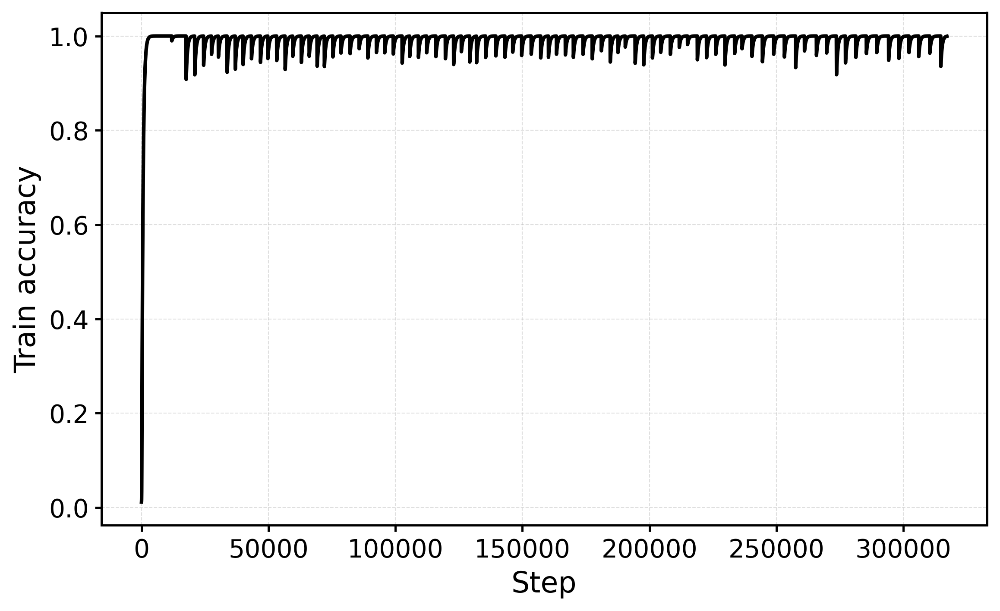
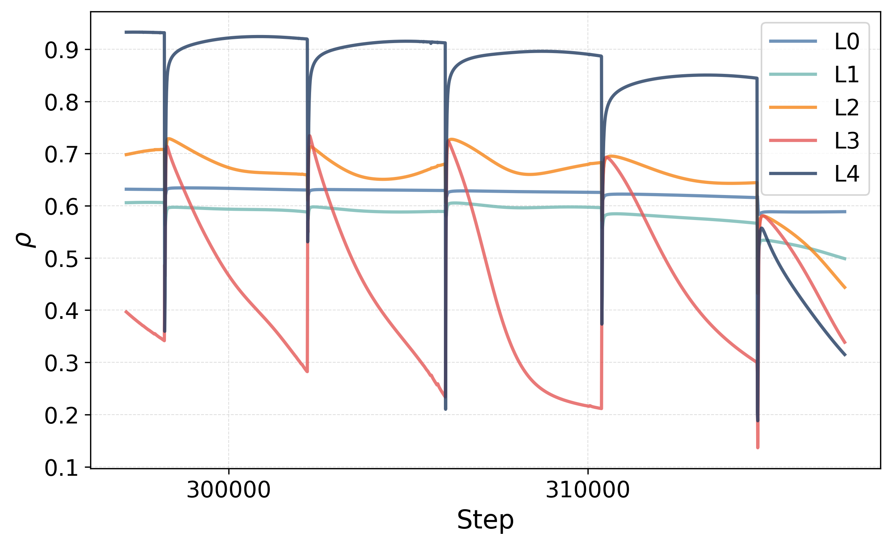
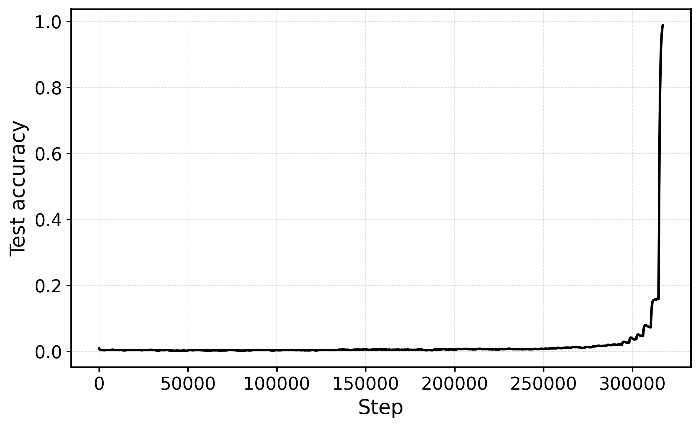
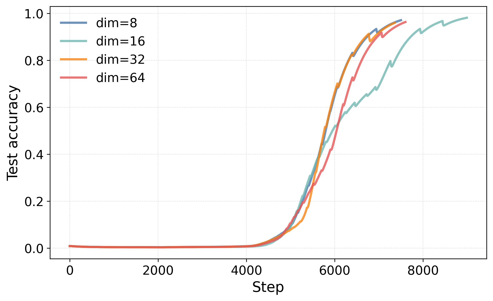
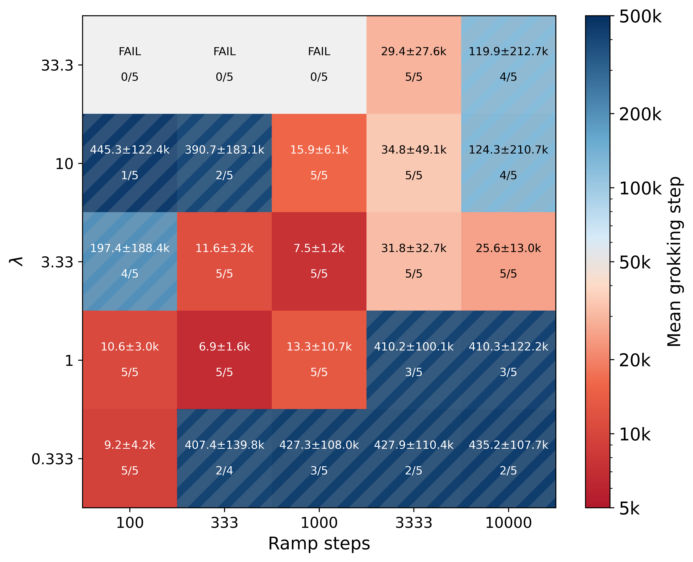
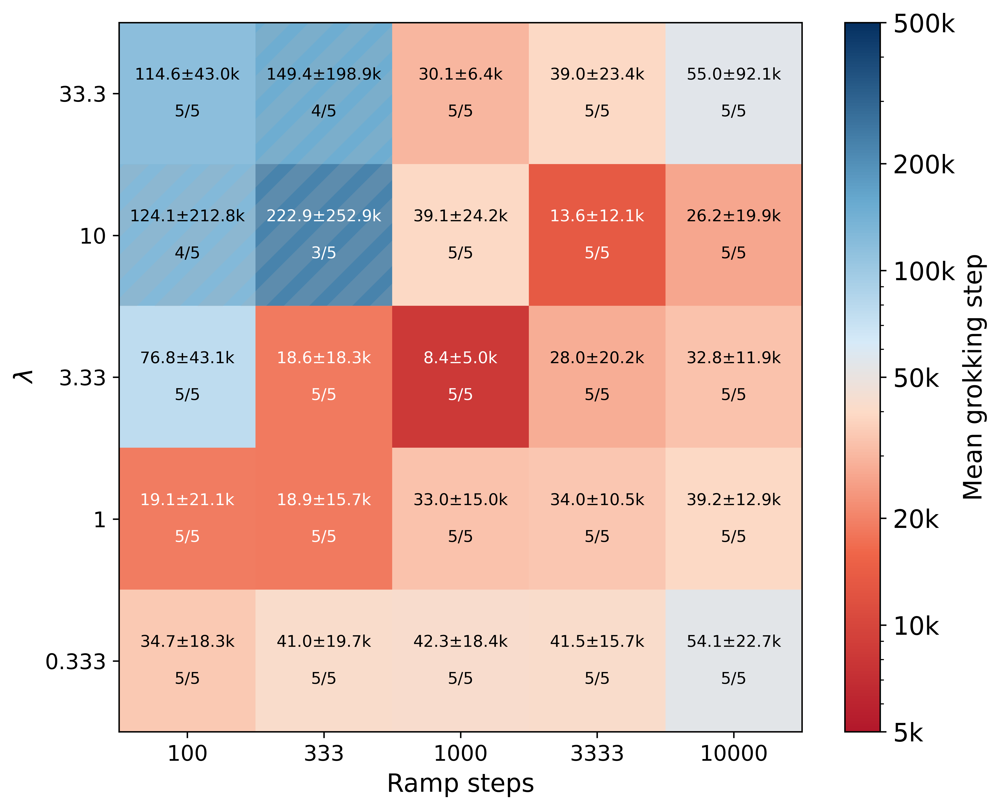
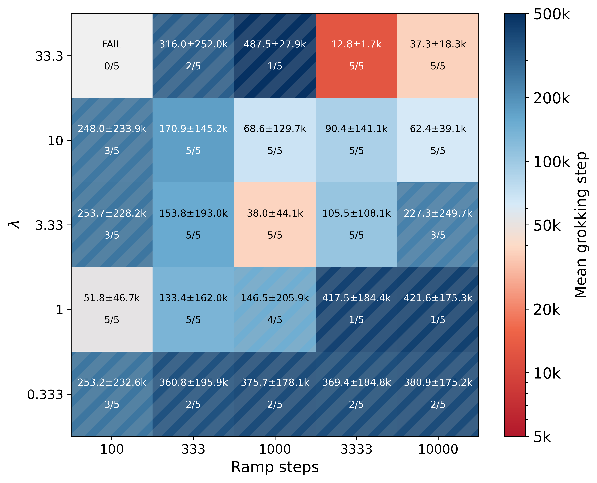
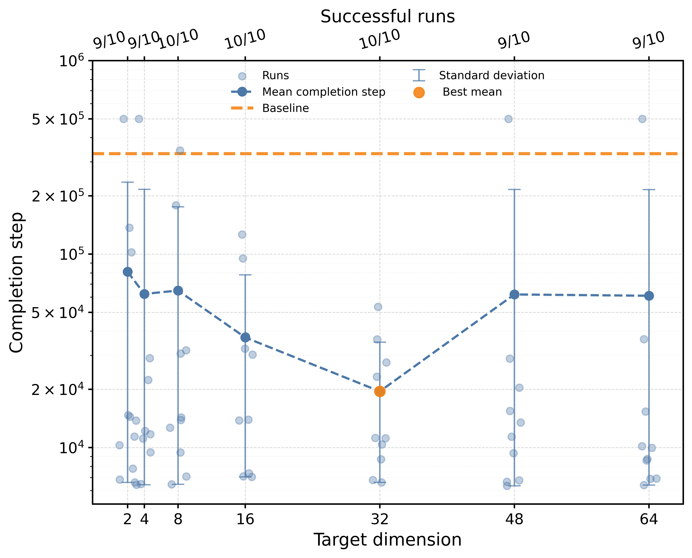
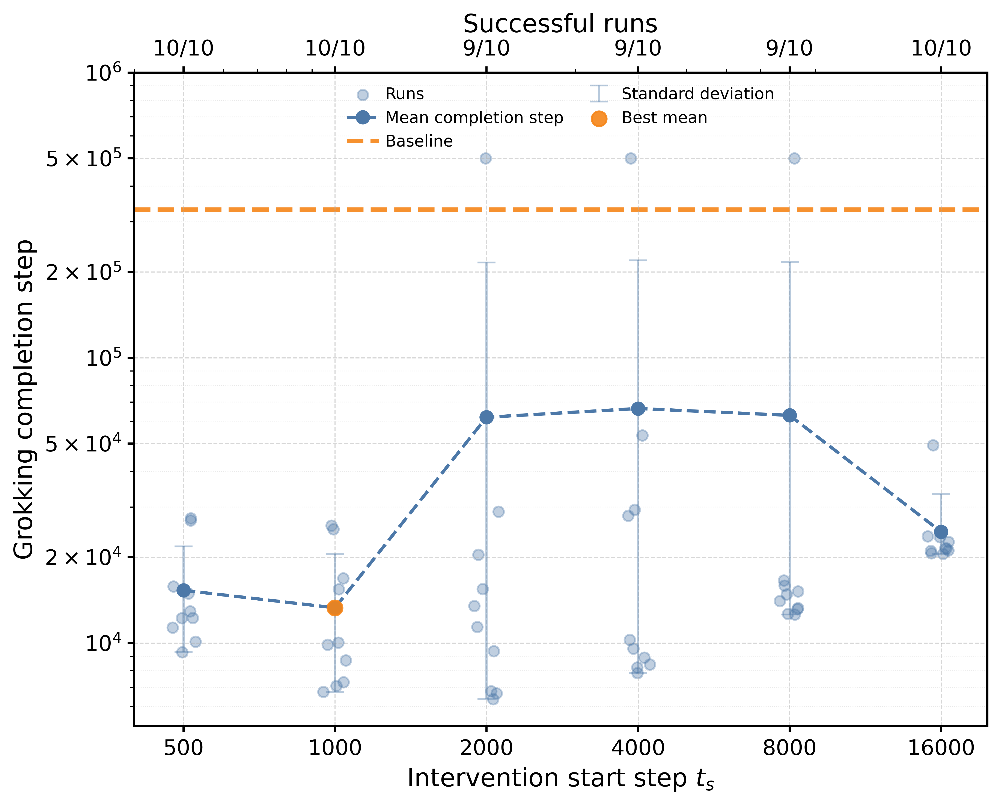

# Kazanskii 2026 — How to Tame Grokking: Representation Geometry as a Control Signal

См. также: [глобальный индекс понятий](../../concepts/index.md).

**Maksim A. Kazanskii** (независимый исследователь; mkazanskii@gmail.com).

arXiv [2607.11666](https://arxiv.org/abs/2607.11666), июль 2026 (v1), 22 страницы, 7 составных рисунков (22 файла), 7 таблиц. Всего цитирований по Semantic Scholar — 0, в картотеке — 0. Одноавторская работа: геометрия представлений заявлена не побочным следствием гроккинга, а управляющим сигналом. Наблюдение — обвал действенной размерности предшествует гроккингу во всех обстановках; вмешательство — GeomDR, спектральный регуляризатор, штрафующий сумму собственных чисел ковариации скрытых представлений за пределами ведущих $d^{*}$ направлений, включаемый после начальной фазы с косинусным разгоном. На сложении и делении mod 97 и композиции перестановок $S_{5}$: MLP ускоряется в 23.5–52.5 раза (362.1K → 6.9K шагов на сложении), трансформер — в 1.48–2.01; задержка «обвал — гроккинг» сжимается с 264K до 2–3K шагов; U-образная зависимость от срока включения; спектр можно оценивать по 5–25% представлений; сочетание с Grokfast срывает гроккинг вовсе.

Оригинал и производные файлы этой папки:

- [`original/2607.11666.how-to-tame-grokking-representation-geometry-as-a-control-signal.md`](original/2607.11666.how-to-tame-grokking-representation-geometry-as-a-control-signal.md) — конверсия оригинала (arXiv-HTML v1, сверена с PDF) в Markdown без правок содержания.
- [`2607.11666.how-to-tame-grokking-representation-geometry-as-a-control-signal.claims.txt`](2607.11666.how-to-tame-grokking-representation-geometry-as-a-control-signal.claims.txt) — пронумерованные утверждения статьи с пометками разбора.
- [`images/`](images/) — 22 файла рисунков.

Схема якорей и правила ссылок на карточку — в [README папки статей](../README.md).

## Затрагиваемые понятия

**[Гроккинг](../../concepts/grokking.md)** — управление сроком отложенной генерализации прямым вмешательством в геометрию: спектральный штраф на хвост ковариации скрытых представлений, включённый после начальной свободной фазы, ускоряет достижение признака гроккинга до 52.5 раз на MLP (362.1K → 6.9K шагов) при 100% доле успеха, с U-образной зависимостью от срока включения ($t_{s}=2000$–$4000$ лучшие; слишком рано — разрушает формирование представлений, слишком поздно — не успевает повлиять) ([`p6-4`](#p6-4)). Разбор: отдельной проверочной выборки нет (вслед за Power et al.), так что лучшие настройки отобраны по тому же тестовому набору, на котором докладывается ускорение, без равного бюджета подбора для базы; «до 52 раз» посчитано от базы, куда включён неудавшийся прогон с приписанным бюджетом 500K — по успешно грокнувшим семенам база 283.4K, то есть ~41×; внутренние несогласия множественны (12.8K лучших перестановок в табл. 1 против ≥149.3K во всех строках табл. 2; $d^{*}=64$ лучший в тексте против «$d^{*}\in\{16,32\}$ быстрее и устойчивее» в приложении; базовый MLP 333.0K в табл. 4 против 362.1K в табл. 1 при тех же семенах).

**[Сжатие представлений](../../concepts/manifold-representation-compression.md)** — обвал размерности как предвестник и рычаг: действенная размерность (отношение участия) глубоких слоёв резко обваливается перед гроккингом (у базы обвал на ~15–25K шагов, гроккинг на ~250–500K — разрыв 264.3K шагов), несглаженные кривые показывают несколько резких одновременных перестроек $D_{\mathrm{eff}}$ и локальной соседской дистанции $\rho$, а GeomDR сжимает задержку «обвал — гроккинг» до 2.2–3.0K шагов, притягивая систему к диагонали $t_{\mathrm{collapse}}=t_{\mathrm{grok}}$ ([`p5-4`](#p5-4)). Разбор: «обвал предшествует гроккингу во всех обстановках» измерено количественно только для сложения и MLP, порог «половина начальной размерности» произволен и не проверен на чувствительность; причинность не показана — GeomDR меняет саму цель обучения, и ускорение может идти от добавленного регуляризующего давления, а не от размерности как таковой (контроля со штрафом той же силы на несвязанную величину нет; автор признаёт наполовину); близкие работы корпуса о размерности и геометрии (2211.13239, 2605.06352, 2606.08985, 2606.32000) не задеты вовсе.

**[Варианты регуляризации](../../concepts/regularization-variants.md)** — GeomDR как новый класс: штраф $L_{\mathrm{GeomDR}}=\sum_{j>d^{*}}\mu_{j}$ на хвост спектра ковариации активаций (не весов), с тремя доказанными свойствами цели (контроль действенного ранга, граница низкорангового приближения через Эккарта–Янга, сжатие объёма ковариационного эллипсоида — прямо оговорено, что это свойства определения, а не доказательство ускорения); в сопоставлении лучший weight decay даёт 27.2K, GrokFast — 372.1K, GeomDR — 7.0K, а сочетание GrokFast+GeomDR не гроккает ни разу (0/5) ([`p21-3`](#p21-3)). Разбор: «GrokFast улучшает относительно базы» — при 372.1K против базовых 362.1K улучшена только доля успеха (5/5 против 4/5); табл. 7 сводит строки с разным числом прогонов (GeomDR 10/10, остальные по 5); срыв сочетания двух ускорителей — второй такой случай в корпусе (после 2607.04333, где Grokfast поверх SupCon срывал все семена) и заслуживает отдельной проверки.

**[Спектральный анализ](../../concepts/spectral-analysis-svd-esd-fve.md)** — спектр ковариации активаций как рабочая ось: мера — отношение участия $D_{\mathrm{eff}}=(\sum\mu_{i})^{2}/\sum\mu_{i}^{2}$, порог обвала — 50% начального значения; практическая масштабируемость — спектр оценивается по случайным 5–25% представлений почти без потери ускорения (счётный выигрыш 2.4–2.7×), откуда догадка о совместимости с мини-батчами (прямо не проверена); ширинная абляция показывает предел — у MLP GeomDR помогает на всех ширинах 32–256 (включая случаи, где база не гроккает вовсе), у трансформера при ширинах 64 и 128 ухудшает (2/5 и 1/5 против 5/5 базы) ([`p18-4`](#p18-4)). Разбор: при выборке 1% (28 примеров при размерности 128) выборочная ковариация заведомо вырождена — строка в таблице есть, разбора нет; сложность $O(Nd^{2}+d^{3})$ на слой честно оговорена; текст не вычитан (пропущенное «If» перед формулой, «he Transformer», «$2$times», дословно повторённое предложение).

## Что показано, а что предположено

Замечания редактора карточки по итогам разбора утверждений (`…claims.txt`, 45 пунктов).

**Ценное — вмешательство вместо наблюдения и предел переносимости, признанный прямо.** Геометрия представлений сделана объектом прямого вмешательства (в отличие от Omnigrok/Tickets/Grokfast/GrokTransfer, крутящих норму, разрежённость, градиенты и вложения); управление подтверждено прямо — кривые расходятся по целевой размерности при «широко схожей» точности; величина эффекта на MLP крупная и воспроизводимая по сеткам настроек (связные области успеха, а не изолированные точки); ширинная абляция честно показывает, где приём ломается (трансформер 64/128); субвыборка 5–25% делает приём практичным; код открыт, использование LLM для правки текста раскрыто.

**Отбор по тесту, счёт базы, шесть внутренних несогласий.** Проверочной выборки нет, и настройки отобраны по тестовому набору; «52×» держится на приписанном бюджете неудавшегося прогона; шесть задокументированных конфликтов между таблицами и текстом (12.8K против ≥149.3K; $d^{*}=64$ против $\{16,32\}$; 2.3K против 3.7–3.9K обвала; 333.0K против 362.1K базы; «4/6» при пяти семенах; «GrokFast улучшает» при худшем среднем); причинность размерности не установлена — теоретическое приложение описывает свойства цели, верные для любых данных.

**Как работу будут цитировать** («доказано, что размерность представлений причинно управляет гроккингом») — точнее: спектральный штраф на скрытые представления ускоряет достижение признака гроккинга в 1.5–52 раза на трёх игрушечных задачах; величина сильно зависит от архитектуры и способа счёта базы, а близкие работы корпуса о размерности и геометрии представлений в списке из 26 позиций не задеты вовсе.

---

# Текст статьи

## Как приручить гроккинг: геометрия представлений как управляющий сигнал

Maksim A. Kazanskii

Независимый исследователь

mkazanskii@gmail.com

## Аннотация

Гроккинг — явление, при котором нейронные сети сначала запоминают обучающие данные и лишь позже, после продолжительной оптимизации, являют сильную генерализацию. Несмотря на обширное недавнее изучение, факторы, влияющие на возникновение и сроки гроккинга, остаются понятыми неполно. Мы исследуем связь между геометрией представлений и отложенной генерализацией. Мы находим, что обвал размерности последовательно предшествует началу гроккинга во всех оценённых обстановках. Мотивированные этими наблюдениями, мы вводим Геометрическую регуляризацию размерности (GeomDR) — простой спектральный регуляризатор, модифицирующий действенную размерность скрытых представлений во время обучения. На задачах модульного сложения, модульного деления и композиции перестановок GeomDR последовательно меняет динамику гроккинга и может существенно ускорять начало генерализации в зависимости от расписания вмешательства и целевой размерности. В нескольких обстановках гроккинг ускоряется до $52$ раз относительно стандартного обучения AdamW. Сходные качественные эффекты наблюдаются и в многослойных перцептронах, и в трансформерах. Вместе эти результаты подсказывают, что геометрия представлений может служить действенным управляющим сигналом для гроккинга, и дают свидетельство, что геометрические вмешательства предлагают практический подход к изучению отложенной генерализации в нейронных сетях и влиянию на неё.

## Введение

Гроккинг — явление отложенной генерализации, при котором нейронные сети сначала запоминают обучающие данные и лишь много позже достигают сильного тестового качества после продолжительной оптимизации [19]. Это поведение отличается от обычной обучающей динамики, где обучающее и тестовое качество обычно улучшаются вместе, и стало полезной постановкой для изучения генерализации в переизбыточно параметризованных нейронных сетях [19, 13, 17, 24].

Прежняя работа связывала гроккинг с weight decay, сжатием признаков, образованием цепей и динамикой обучения представлений [19, 17, 13]. Общая тема этих объяснений — что выученные представления часто прогрессивно сжимаются в маломерные структуры. Шире, было показано, что геометрия и размерность представлений играют важные роли в оптимизации и генерализации [2, 12].

Недавняя работа показала, что гроккинг можно ускорять или менять через оптимизационную динамику, управление нормой весов, разрежённые подсети или перенос вложений [14, 16, 11, 26]. Однако сравнительно меньше внимания уделялось управлению гроккингом через прямые вмешательства в геометрию скрытых представлений. Если отложенная генерализация тесно связана с геометрией представлений, то явная модификация этой геометрии может влиять на начало и скорость гроккинга.

Мы исследуем эту гипотезу, вводя Геометрическую регуляризацию размерности (GeomDR) — спектральный регуляризатор уровня представлений, подавляющий дисперсию вне целевого подпространства и тем самым управляющий действенной размерностью скрытых представлений во время обучения. GeomDR напрямую модифицирует ковариационный спектр скрытых активаций.

Мы проводим систематическое исследование по задачам гроккинга, архитектурам, расписаниям вмешательства, целевым размерностям и случайным семенам. Наши результаты показывают, что геометрические вмешательства могут существенно менять динамику отложенной генерализации, ускоряя гроккинг до $52$ раз в некоторых обстановках и, при более сильных вмешательствах, задерживая или подавляя генерализацию. Мы далее находим, что изменения действенной размерности последовательно предшествуют переходу от запоминания к генерализации, подсказывая, что размерность представлений — не просто диагностическая статистика, а управляемая переменная, связанная с динамикой гроккинга.

Наши вклады тройственны:

- Мы показываем, что прямые геометрические вмешательства могут существенно менять отложенную генерализацию, позволяя ускорение и, в некоторых обстановках, задержку или подавление.
- Мы вводим GeomDR — спектральный регуляризатор уровня представлений для прямого управления действенной размерностью скрытых представлений.
- Мы даём систематическое эмпирическое исследование того, как сила вмешательства, сроки, целевая размерность, структура задачи и архитектура влияют на динамику гроккинга.

## Связанные работы

Ранняя работа о гроккинге определила отложенную генерализацию на алгоритмических задачах и высветила важность регуляризации, особенно weight decay, в переходе от запоминания к генерализации [19]. **[p. 2]** Последующие исследования связали гроккинг со сжатием признаков, образованием цепей и динамикой обучения представлений [13, 17, 24]. Эти работы в основном трактуют геометрию представлений как возникающее свойство обучения, тогда как наша цель — исследовать, можно ли геометрией напрямую манипулировать для управления динамикой гроккинга.

Несколько подходов искали ускорения или модификации гроккинга через изменения обучающего процесса. Omnigrok изучает роль норм весов и обычной регуляризации [14], Grokking Tickets связывает отложенную генерализацию с разрежёнными подсетями и прунингом [16], Grokfast ускоряет гроккинг фильтрацией градиентов [11], а GrokTransfer исследует перенос вложений из более слабых моделей [26]. В контрасте, GeomDR действует прямо на скрытые представления, модифицируя их ковариационный спектр, а не меняя оптимизационную динамику, разрежённость или переносимые вложения.

Геометрия представлений даёт полезную рамку для понимания обучающей динамики. Прежняя работа показала, что независимо обученные сети часто сходятся к сходным представленческим структурам [9], а геометрические анализы использовались для изучения организации признаков и обучения по архитектурам [20]. Нейронные представления часто являют низкую внутреннюю размерность [2, 12, 1] и могут проходить фазы сжатия и расширения во время обучения [21]. Родственные свидетельства из Neural Collapse, анализов информационного бутылочного горлышка и самонадзорного обучения далее подсказывают, что ковариационная структура и размерность представлений тесно связаны с обучением и генерализацией [18, 6, 10, 23, 22, 3, 7].

Существующие исследования гроккинга либо анализируют геометрию представлений как коррелят отложенной генерализации, либо влияют на гроккинг косвенно через регуляризацию, оптимизацию, разрежённость или механизмы переноса [19, 13, 17, 11, 26]. GeomDR вместо этого трактует геометрию представлений как сам объект вмешательства, позволяя контролируемые эксперименты о том, как действенная размерность влияет на начало и скорость гроккинга.

## Методы

Мы вводим рамку геометрической регуляризации, напрямую модифицирующую действенную размерность скрытых представлений во время обучения.

Мы рассматриваем надзорные алгоритмические задачи с входами $x$ и метками $y$. Нейронная сеть $f_{\theta}$ обучается предсказывать

$$
\hat{y}=f_{\theta}(x). \tag{1}
$$

Для каждого скрытого слоя $\ell$ сеть производит матрицу представлений

$$
Z^{(\ell)}\in\mathbb{R}^{N\times d}, \tag{2}
$$

где $N$ — число примеров, а $d$ — размерность представления.

### Геометрическая характеризация представлений

Для каждой матрицы представлений $Z$ мы сначала центрируем представления:

$$
\widetilde{Z}=Z-\bar{Z}, \tag{3}
$$

где $\bar{Z}$ обозначает попризнаковое среднее $Z$.

Затем мы вычисляем эмпирическую ковариационную матрицу

$$
C=\frac{1}{N-1}\widetilde{Z}^{\top}\widetilde{Z}. \tag{4}
$$

Пусть $\mu_{1},\ldots,\mu_{d}$ обозначают собственные числа $C$. Строя на прежней работе о внутренней размерности и геометрии представлений [2], мы вычисляем **действенную размерность** через отношение участия

$$
D_{\mathrm{eff}}=\frac{\left(\sum_{i}\mu_{i}\right)^{2}}{\sum_{i}\mu_{i}^{2}}. \tag{5}
$$

Меньшие значения $D_{\mathrm{eff}}$ соответствуют представлениям, чья дисперсия сосредоточена в меньшем числе направлений.

Пусть каждый вектор представления нормирован как

$$
\hat{z}_{i}=\frac{z_{i}}{\|z_{i}\|_{2}}. \tag{6}
$$

Тогда мы определяем **локальную соседскую дистанцию** как среднюю евклидову дистанцию до $k$ ближайших соседей каждого нормированного представления,

$$
\rho=\frac{1}{N}\sum_{i=1}^{N}\frac{1}{k}\sum_{j\in\mathcal{N}_{k}(i)}\|\hat{z}_{i}-\hat{z}_{j}\|_{2}, \tag{7}
$$

где $\mathcal{N}_{k}(i)$ обозначает множество $k$ ближайших соседей представления $i$. Если не оговорено иное, мы используем $k=10$ во всех экспериментах.

### Геометрическая регуляризация размерности

Мы гипотезируем, что снижение размерности представлений — не просто следствие гроккинга, а движущий фактор перехода от запоминания к генерализации. Если размерность представлений механистически связана с гроккингом, то прямое управление геометрией скрытых представлений должно менять сроки и динамику перехода запоминание-к-генерализации. Мотивированные этой идеей, мы **вводим Геометрическую регуляризацию размерности (GeomDR)**. Для каждого скрытого слоя $\ell$ мы вычисляем эмпирическую ковариационную матрицу

$$
C^{(\ell)}=\frac{1}{N-1}\left(\widetilde{Z}^{(\ell)}\right)^{\top}\widetilde{Z}^{(\ell)}. \tag{8}
$$

Пусть

$$
\mu_{1}^{(\ell)}\geq\mu_{2}^{(\ell)}\geq\cdots\geq\mu_{d}^{(\ell)} \tag{9}
$$

обозначают собственные числа $C^{(\ell)}$, отсортированные по убыванию.

При целевой размерности $d^{*}$ мы определяем послойную геометрическую регуляризационную потерю как

$$
L_{\mathrm{GeomDR}}^{(\ell)}=\sum_{j=d^{*}+1}^{d}\mu_{j}^{(\ell)}. \tag{10}
$$

**[p. 3]**

Эта цель допускает несколько геометрических истолкований, связанных с контролем действенного ранга, низкоранговым приближением ковариации и сжатием объёма представлений (см. Приложение A).

Если не оговорено иное, GeomDR применяется ко всем скрытым слоям и исключается из входного вложения и выходного слоя. Эта цель штрафует дисперсию, содержащуюся в направлениях за пределами ведущих $d^{*}$ главных компонент, поощряя представления сосредотачиваться в маломерном подпространстве. Цель потому тесно связана с классическим низкоранговым приближением и анализом главных компонент [4, 8].

Полная геометрическая регуляризационная потеря есть

$$
L_{\mathrm{GeomDR}}=\sum_{\ell}L_{\mathrm{GeomDR}}^{(\ell)}, \tag{11}
$$

Полная обучающая цель есть

$$
L=L_{\mathrm{task}}+\lambda(t)L_{\mathrm{GeomDR}}, \tag{12}
$$

где $L_{\mathrm{task}}$ обозначает задаче-специфичную обучающую потерю.

Геометрический регуляризатор активируется после начальной обучающей фазы, позволяя сети подогнать обучающие данные до стеснения геометрии представлений. Этот дизайн мотивирован гроккингом, где генерализация обычно возникает лишь после запоминания [19]. Чтобы избежать резкой перемены оптимизационной цели, сила регуляризации вводится постепенно косинусным разгоном. Плавное расписание оптимизационных гиперпараметров стало распространённой стратегией в глубоком обучении для улучшения устойчивости обучения и оптимизационного поведения [15, 5].

$$
\lambda(t)=\lambda_{\max}\frac{1-\cos(\pi q(t))}{2}, \tag{13}
$$

где

$$
q(t)=\begin{cases}0,&t<t_{s},\\
\dfrac{t-t_{s}}{T_{\mathrm{ramp}}},&t_{s}\leq t<t_{s}+T_{\mathrm{ramp}},\\
1,&t\geq t_{s}+T_{\mathrm{ramp}}.\end{cases} \tag{14}
$$

Здесь $t_{s}$ — шаг активации, $T_{\mathrm{ramp}}$ — длительность разгона, а $\lambda_{\max}$ — финальная сила регуляризации. Для краткости мы обозначаем $\lambda_{\max}$ просто $\lambda$ при сообщении экспериментальных конфигураций.

GeomDR требует оценки ковариации и собственного разложения скрытых представлений, давая послойную сложность $O(Nd^{2}+d^{3})$ (см. Приложение D).

### Экспериментальный протокол

Мы оцениваем предложенную рамку на трёх алгоритмических задачах: модульном сложении, модульном делении и композиции перестановок. Эти задачи обычно используются в литературе гроккинга, потому что являют отложенную генерализацию при подходящих обучающих условиях [19]. Эксперименты проводятся на двух нейронных архитектурах: многослойном перцептроне (MLP) и трансформере [25]. Для всех задач используется фиксированное разбиение обучение–тест $30\%/70\%$. Вслед за прежней работой о гроккинге [19] отдельная проверочная выборка не заводится, и динамика тестового набора сообщается прямо. Если не оговорено иное, все сообщаемые результаты усреднены по пяти независимым случайным семенам. Прогон считается успешно грокнувшим, когда обучающая точность равна $1.0$ и тестовая точность удовлетворяет

$$
\mathrm{Acc}_{\mathrm{test}}\geq 0.999\,\mathrm{Acc}_{\mathrm{train}}
$$

на $10$ последовательных оценках. Оценка выполняется каждые 10 оптимизационных шагов. Потому этот критерий соответствует удержанию целевой точности на 100 последовательных оптимизационных шагах. Шаг гроккинга определяется как первый оптимизационный шаг, на котором это условие выполнено.

Для всех задач и архитектур геометрическая регуляризация не применяется с начала обучения. Вместо этого регуляризатор активируется после начальной нестеснённой оптимизационной фазы. Если не оговорено иное, MLP-эксперименты используют шаг активации вмешательства $t_{s}=2000$. Трансформерные эксперименты используют $t_{s}=1000$. Для каждой пары задача–архитектура базовой опорой служит нерегуляризованная модель. Наша главная экспериментальная процедура состоит из трёх стадий:

1. **Перебор расписаний (MLP).** Для MLP мы перебираем и финальную силу регуляризации $\lambda_{\max}$, и длительность разгона $T_{\mathrm{ramp}}$. Для трансформеров мы перебираем только $\lambda_{\max}$. Каждая конфигурация оценивается по пяти случайным семенам и сравнивается с базой.
2. **Перебор размерностей.** Мы выполняем перебор по целевой размерности $d^{*}$.
3. **Перебор старта вмешательства.** Мы варьируем шаг активации $t_{s}$, на котором вводится геометрическая регуляризация.

Полные архитектурные спецификации, сетки гиперпараметров и детали реализации даны в Приложении B.

## Результаты

*(a) All steps: $D_{\mathrm{eff}}$*

*(b) All steps: $\rho$*

*(c) Train accuracy*

*(d) Final 20k steps: $D_{\mathrm{eff}}$*

*(e) Final 20k steps: $\rho$*

*(f) Test accuracy*

*Рисунок 1: Эволюция точности и геометрии представлений при базовом гроккинге на модульном сложении. Модель обучается без геометрической регуляризации. Панели (a), (b), (c) и (f) показывают EMA-сглаженные траектории действенной размерности, локальной соседской дистанции, обучающей и тестовой точности. Панели (d) и (e) показывают сырые геометрические траектории размерности и локальной соседской дистанции за финальные 20K оптимизационных шагов. Отложенная генерализация совпадает с быстрой геометрической перестройкой, особенно в глубоких слоях. Самый глубокий скрытый слой ($L_{4}$) являет наибольшие изменения и действенной размерности, и локальной соседской дистанции близ гроккингового перехода.* **[p. 4]**

### Наблюдение

*(a) $L_{4}$: $D_{\mathrm{eff}}$*

*(b) $L_{4}$: $\rho$*

*(c) Train accuracy*

*(d) $L_{0}$: $D_{\mathrm{eff}}$*

*(e) $L_{0}$: $\rho$*

*(f) Test accuracy*

*Рисунок 2: Эволюция точности и геометрии представлений под GeomDR для модульного сложения. Модель обучается с разными целевыми размерностями $d^{*}$. Панели (a), (b), (c) и (f) показывают EMA-сглаженные траектории действенной размерности, локальной соседской дистанции, обучающей и тестовой точности. Панели (d) и (e) показывают соответствующие геометрические траектории в самом мелком скрытом слое. Сильнейшие эффекты наблюдаются в самом глубоком скрытом слое ($L_{4}$), где обвал размерности происходит раньше всего и сопровождается быстрыми подъёмами тестовой точности.* **[p. 5]**

Сначала мы разглядываем эволюцию геометрии представлений при базовом гроккинге на модульном сложении. Эта базовая постановка даёт опору для последующих интервенционных экспериментов. Для характеризации геометрии представлений мы отслеживаем действенную размерность $D_{\mathrm{eff}}$ и локальную соседскую дистанцию $\rho$, меряющую среднюю дистанцию между соседними представлениями. Для визуализации траектории сглаживаются экспоненциальным скользящим средним (EMA) с окном 100 шагов, а финальные 20 000 оптимизационных шагов дополнительно показаны без сглаживания.

Рисунок 1 показывает эволюцию действенной размерности и локальной соседской дистанции по всем слоям. Мелкие слои остаются относительно стабильными на всём обучении, тогда как глубокие слои являют выраженную геометрическую перестройку. Действенная размерность остаётся высокой большую часть обучения, прежде чем претерпеть резкий обвал близ гроккингового перехода, с сильнейшим эффектом в самом глубоком скрытом слое. Локальная соседская дистанция показывает похожую картину, оставаясь стабильной продолжительные периоды перед быстрой перестройкой близ начала генерализации. Эти согласованные изменения происходят в узком обучающем интервале по **[p. 4]** нескольким слоям, подсказывая, что гроккинг сопровождается быстрой перестройкой геометрии представлений.

По всем разобранным прогонам и задачам этого исследования обвал размерности последовательно предшествовал гроккингу. В моделях под GeomDR обвал происходил существенно раньше, достигая 50% начальной действенной размерности примерно через $2.3$K оптимизационных шагов, и вскоре за ним следовал гроккинг (примерно $6.8$K шагов). Эти результаты указывают, что вмешательства, ускоряющие гроккинг, ускоряют и обвал размерности, поддерживая гипотезу, что геометрическое сжатие тесно связано с возникновением генерализации.

Несглаженные траектории выявляют, что переход не непрерывен. Вместо этого гроккинг связан с малым числом резких геометрических перестроек. Эти события происходят одновременно и в действенной размерности, и в локальной соседской дистанции $\rho$, подсказывая, что отложенная генерализация сопровождается крупномасштабной перестройкой внутренних представлений, а не одной постепенной оптимизацией. Это наблюдение мотивирует гипотезу, что геометрия представлений может играть механистическую роль в динамике гроккинга. Если так, то прямое управление геометрией представлений может менять сроки перехода запоминание-к-генерализации, мотивируя интервенционные исследования следующих разделов.

### Вмешательство

Чтобы исследовать роль размерности представлений, мы вводим регуляризатор, навязывающий целевую размерность $d^{*}$. Вмешательство активируется на обучающем шаге $t_{s}=2000$ и косинусно разгоняется до $\lambda=1$ за 333 оптимизационных шага. Мы оцениваем четыре целевые размерности, $d^{*}\in\{8,16,32,64\}$, держа все прочие гиперпараметры фиксированными. Рисунок 2 показывает эволюцию действенной размерности и локальной соседской дистанции в самом мелком ($L_{0}$) и самом глубоком ($L_{4}$) скрытых слоях, вместе с обучающей и тестовой точностью. Активация регуляризатора производит немедленный геометрический переход по всем меряемым величинам.

###### p4-4

Сильнейший эффект наблюдается в локальной соседской дистанции $\rho$. До вмешательства все прогоны следуют почти тождественными траекториями. Едва регуляризация активирована, $\rho$ быстро падает и в мелких, и в глубоких слоях, указывая на существенную перестройку пространства представлений. Траектории затем расходятся согласно целевой размерности, демонстрируя прямое управление получающимся геометрическим состоянием.

Действенная размерность являет похожий отклик. Сразу после вмешательства $D_{\mathrm{eff}}$ резко падает, согласно с подавлением дисперсии вне целевого подпространства. За этим следует фаза восстановления, после которой большие целевые размерности удерживают более высокую действенную размерность. Эффект наиболее выражен в самом глубоком слое, где разделение между настройками остаётся видимым на всём обучении.

**[p. 5]**

Несмотря на эти существенные геометрические изменения, обучающая и тестовая точность остаются широко схожими между настройками. Вместе эти результаты демонстрируют, что регуляризация размерности даёт прямой механизм управления геометрией представлений во время обучения.

### Управление: расписание регуляризации и целевая размерность

Чтобы определить действенное расписание вмешательства, мы зафиксировали целевую размерность $d^{*}=16$ и выполнили сеточный поиск по финальной силе регуляризации $\lambda_{\max}$ и длительности разгона $T_{\mathrm{ramp}}$. Рисунок 3 сводит результаты. Относительно базы ($362.1\pm 111.0$K шагов) GeomDR существенно ускоряет гроккинг по широкому диапазону расписаний, с лучшей конфигурацией, достигающей успешной генерализации примерно после 7K шагов. Промежуточные силы регуляризации и длительности разгона работают лучше всего, тогда как очень слабые вмешательства дают мало эффекта, а чрезмерно сильные могут дестабилизировать обучение или предотвратить гроккинг. На основе этих результатов мы выбираем $\lambda_{\max}=1$ и $T_{\mathrm{ramp}}=333$ для последующих экспериментов.

Используя это расписание, мы варьируем целевую размерность по $d^{*}\in\{2,4,8,16,32,48,64\}$ и оцениваем каждую конфигурацию по десяти случайным семенам. Как показано на Рисунке 4, агрессивное сжатие ($d^{*}\leq 8$) производит более медленный и более изменчивый гроккинг, тогда как размерности в диапазоне $16\leq d^{*}\leq 64$ последовательно дают сильное ускорение. Лучшее среднее качество получено при $d^{*}=64$, достигая критерия гроккинга примерно после 7K шагов. Сходные тенденции наблюдаются для модульного деления и композиции перестановок (Приложение C).

*Рисунок 3: Перебор расписаний для модульного сложения ($d^{*}=16$). Ячейки сообщают средний шаг гроккинга (K) $\pm$ одно стандартное отклонение; дроби указывают успешные прогоны. Серые ячейки обозначают провальные конфигурации (хотя бы один провальный прогон). Промежуточные $\lambda_{\max}$ и $T_{\mathrm{ramp}}$ производят самый быстрый гроккинг, с $\lambda_{\max}=1$ и $T_{\mathrm{ramp}}=333$ как лучшими.* **[p. 6]**

*Рисунок 4: Действие целевой размерности $d^{*}$ на гроккинг. Точки показывают отдельные прогоны, штриховая кривая — среднее, планки ошибок — одно стандартное отклонение. Оранжевая штриховая линия обозначает базу. Умеренные и большие целевые размерности ($16\leq d^{*}\leq 64$) существенно ускоряют гроккинг, тогда как агрессивное сжатие ($d^{*}\leq 8$) замедляет и дестабилизирует обучение.* **[p. 6]**

### Абляционные исследования: сроки вмешательства

###### p5-4

Чтобы исследовать связь между обвалом размерности и гроккингом, мы измерили время обвала самого глубокого скрытого представления как первый обучающий шаг, на котором его действенная размерность упала ниже 50% начального значения. Затем мы сравнили эту величину со временем гроккинга, определённым как первый шаг, на котором выполнен критерий гроккинга выше. Рисунок 5 показывает, что обвал размерности последовательно предшествует гроккингу и в базовых, и в GeomDR-моделях. В базовой постановке обвал происходит относительно рано в обучении (примерно 15–25K шагов), тогда как гроккинг возникает много позже (примерно 250–500K шагов), производя большой временно́й разрыв между геометрическим сжатием и успешной генерализацией. GeomDR сдвигает оба события на существенно более ранние стадии обучения, с обвалом уже после 3–5K шагов и гроккингом, следующим вскоре после, примерно на 5–10K шагах. Следовательно, вмешательство не только ускоряет обвал размерности, но и заметно сокращает запаздывание между обвалом и генерализацией. По всем целевым размерностям и случайным семенам GeomDR двигает систему ближе к диагонали $t_{\mathrm{collapse}}=t_{\mathrm{grok}}$, указывая на существенно более тесную сцепку геометрической перестройки с началом генерализации.

*Рисунок 5: Связь между временем обвала представлений и временем гроккинга. Каждая точка соответствует одному прогону. Штриховая диагональ обозначает $t_{\mathrm{collapse}}=t_{\mathrm{grok}}$.* **[p. 7]**

*Рисунок 6: Перебор старта вмешательства для модульного сложения. Точки показывают отдельные прогоны; штриховая кривая и закрашенная область обозначают среднее и одно стандартное отклонение. Промежуточные времена активации дают самый быстрый гроккинг.* **[p. 7]**

Действенность геометрической регуляризации сильно зависит от сроков вмешательства. Рисунок 6 показывает связь **[p. 6]** между шагом старта вмешательства $t_{s}$ и получающимся шагом гроккинга. Наблюдается ясная U-образная тенденция. Очень ранние вмешательства ($t_{s}=500$ и $t_{s}=1000$) являют существенно более медленное и более изменчивое схождение по случайным семенам. Самое быстрое и стабильное гроккинговое поведение происходит при промежуточных временах активации ($t_{s}=2000$–$4000$), где средний шаг гроккинга минимизирован. Оттягивание вмешательства за эту область прогрессивно увеличивает число оптимизационных шагов, требуемых для успешной генерализации.

###### p6-1

Эти результаты подсказывают существование критического временно́го окна, в котором геометрическая регуляризация наиболее действенна. Слишком раннее применение вмешательства, по-видимому, разрушает формирование полезных задачных представлений, тогда как слишком позднее снижает его способность влиять на переход запоминание-к-генерализации. В целом результаты поддерживают гипотезу, что геометрические вмешательства наиболее полезны после начальной нестеснённой обучающей фазы, но до того, как запоминающие решения прочно установятся.

Дополнительные переборы старта вмешательства и детали реализации даны в Приложении C. Сроки вмешательства существенно влияют на качество, хотя оптимальный шаг активации разнится по задачам и архитектурам.

*Таблица 1: Сводка лучшей конфигурации GeomDR для каждой задачи и архитектуры. Значения обозначают средний шаг гроккинга $\pm$ стандартное отклонение (K оптимизационных шагов). S/T указывает прогоны, удовлетворившие критерию гроккинга. Неуспешным прогонам при вычислении статистик приписывался максимальный обучающий бюджет (500K для MLP, 200K для трансформеров).* **[p. 7]**

|  | Addition |  |  | Division |  |  | Permutation |  |  |
|---|---|---|---|---|---|---|---|---|---|
| Architecture | Step | S/T | Imp. | Step | S/T | Imp. | Step | S/T | Imp. |
| MLP | 362.1 $\pm$ 111.0 | 4/5 | – | 330.9 $\pm$ 100.9 | 5/5 | – | 300.2 $\pm$ 207.0 | 3/5 | – |
| MLP + GeomDR | **6.9 $\pm$ 1.6** | 5/5 | **52.5$\times$** | **8.4 $\pm$ 5.0** | 5/5 | **39.4$\times$** | **12.8 $\pm$ 1.7** | 5/5 | **23.5$\times$** |
| Transformer | 66.4 $\pm$ 12.0 | 5/5 | – | 89.4 $\pm$ 27.3 | 5/5 | – | 72.6 $\pm$ 33.0 | 5/5 | – |
| Transformer + GeomDR | **33.0 $\pm$ 2.5** | 5/5 | **2.01$\times$** | **48.7 $\pm$ 8.8** | 5/5 | **1.84$\times$** | **48.9 $\pm$ 9.1** | 5/5 | **1.48$\times$** |

### Генерализация по задачам и архитектурам

Мы сообщаем времена гроккинга, доли успеха и относительные улучшения для всех оценённых обстановок. Связь между геометрией представлений и гроккингом остаётся согласованной по всем оценённым обстановкам. Таблица 1 сводит лучшую конфигурацию GeomDR для каждой задачи и архитектуры.

###### p6-4

Для MLP GeomDR производит крупные и согласованные улучшения по всем задачам, снижая среднее время гроккинга с $362.1$K до $6.9$K шагов на модульном сложении ($52.5\times$), с $330.9$K до $8.4$K шагов на модульном делении ($39.4\times$) и с $300.2$K до $12.8$K шагов на обучении перестановкам ($23.5\times$). Во всех случаях GeomDR достигает 100% доли успеха. Для трансформеров эффект остаётся согласованным, но более умеренным. GeomDR снижает время гроккинга с $66.4$K до $33.0$K шагов на модульном сложении ($2.01\times$), с $89.4$K до $48.7$K шагов на модульном делении ($1.84\times$) и с $72.6$K до $48.9$K шагов на обучении перестановкам ($1.48\times$), удерживая 100% долю успеха по всем задачам. Дополнительные абляционные исследования, переборы гиперпараметров и архитектуро-специфичные анализы даны в Приложении C. Вместе эти результаты указывают, что GeomDR ускоряет гроккинг по разнообразным задачам и архитектурам, хотя величина улучшения разнится между классами моделей.

## Обсуждение

Наши результаты подсказывают, что геометрия представлений может служить действенным управляющим сигналом для гроккинга. По диапазону задач, расписаний, размерностей и архитектур GeomDR последовательно влияет на отложенную генерализацию. Во многих MLP-обстановках вмешательство ускоряет гроккинг более чем на порядок, тогда как трансформерные эксперименты показывают меньшие, но качественно сходные улучшения. Меньшие выигрыши, наблюдаемые в трансформерах, могут отражать их существенно более быструю базовую динамику гроккинга, оставляющую меньше простора для ускорения, чем в MLP.

Геометрические анализы выявляют систематические изменения действенной размерности и локальной дистанции близ гроккингового перехода. По всем успешным прогонам обвал размерности **[p. 7]** последовательно предшествовал гроккингу, и вмешательства, ускорявшие гроккинг, ускоряли и начало обвала. Эти наблюдения подсказывают, что отложенная генерализация сопровождается существенной перестройкой внутренних представлений. Прежняя работа о гроккинге в основном трактовала геометрию и сжатие представлений как возникающие следствия обучения [19, 13, 24, 17]. В контрасте, наши результаты показывают, что прямая модификация геометрии представлений достаточна для существенного изменения динамики отложенной генерализации. Хотя это не устанавливает размерность представлений единственным причинным механизмом гроккинга, это демонстрирует, что геометрические вмешательства способны систематически менять то, когда гроккинг происходит. Геометрические вмешательства дают новую экспериментальную методологию изучения обучающей динамики и подсказывают, что геометрия представлений может служить управляемой степенью свободы для изучения оптимизации и генерализации. Вместо пассивного наблюдения представленческих изменений во время обучения исследователи могут напрямую манипулировать геометрическими свойствами и мерить получающиеся эффекты на оптимизацию и генерализацию. Важно, наблюдаемое ускорение не ограничено одной задачей или тонко настроенной гиперпараметрической конфигурацией. Действенные вмешательства получаются по широкому диапазону целевых размерностей и расписаний активации, указывая, что связь между геометрией представлений и гроккингом прочна, а не задаче-специфична. Остаются несколько ограничений. Во-первых, наши эксперименты сосредоточены на малых алгоритмических бенчмарках гроккинга, и остаётся неясным, действенны ли сходные геометрические вмешательства в больших доменах вроде языка или зрения. Во-вторых, хотя GeomDR даёт прямое геометрическое вмешательство, точные механизмы, связывающие геометрию представлений и отложенную генерализацию, остаются открытым теоретическим вопросом. Приложение A даёт геометрическое истолкование регуляризатора в терминах контроля действенного ранга, низкорангового приближения и сжатия объёма представлений.

## Заключение

По всем изученным задачам и архитектурам обвал размерности последовательно предшествовал генерализации. Мотивированные этим наблюдением, мы ввели Геометрическую регуляризацию размерности (GeomDR) — спектральный регуляризатор, напрямую управляющий действенной размерностью скрытых представлений. По разнообразным обстановкам GeomDR существенно меняет динамику гроккинга, ускоряя, задерживая или подавляя генерализацию. Эти результаты подсказывают, что геометрия представлений — не просто коррелят гроккинга, а полезная цель для вмешательства.

## References

- [1] A. Aghajanyan, S. Gupta, and L. **[p. 8]** Zettlemoyer (2021) Intrinsic dimensionality explains the effectiveness of language model fine-tuning. In Proceedings of the 59th Annual Meeting of the Association for Computational Linguistics and the 11th International Joint Conference on Natural Language Processing (Volume 1: Long Papers), pp. 7319–7328. Cited by: Related Work.

- [2] A. Ansuini, A. Laio, J. H. Macke, and D. Zoccolan (2019) Intrinsic dimension of data representations in deep neural networks. In Advances in Neural Information Processing Systems, Vol. 32, pp. 6114–6125. Cited by: Introduction, Related Work, Geometric Characterization of Representations.

- [3] A. Bardes, J. Ponce, and Y. LeCun (2022) VICReg: variance-invariance-covariance regularization for self-supervised learning. In International Conference on Learning Representations, Cited by: Related Work.

- [4] C. Eckart and G. Young (1936) The approximation of one matrix by another of lower rank. Psychometrika 1 (3), pp. 211–218. Cited by: Appendix A, Geometric Dimensionality Regularization.

- [5] P. Goyal, P. Dollár, R. Girshick, P. Noordhuis, L. Wesolowski, A. Kyrola, A. Tulloch, Y. Jia, and K. He (2017) Accurate, large minibatch sgd: training imagenet in 1 hour. arXiv abs/1706.02677. Cited by: Geometric Dimensionality Regularization.

- [6] X. Han, V. Papyan, and D. L. Donoho (2022) Neural collapse under MSE loss: proximity to and dynamics on the central path. In International Conference on Learning Representations, Cited by: Related Work.

- [7] L. Jing, P. Vincent, Y. LeCun, and Y. Tian (2022) Understanding dimensional collapse in contrastive self-supervised learning. In International Conference on Learning Representations, Cited by: Related Work.

- [8] I. T. Jolliffe (2002) Principal component analysis. 2nd edition, Springer. Cited by: Appendix A, Geometric Dimensionality Regularization.

- [9] S. Kornblith, M. Norouzi, H. Lee, and G. Hinton (2019) Similarity of neural network representations revisited. In Proceedings of the 36th International Conference on Machine Learning, pp. 3519–3529. Cited by: Related Work.

- [10] V. Kothapalli (2022) Neural collapse: a review on modelling principles and generalization. arXiv abs/2206.04041. Cited by: Related Work.

- [11] J. Lee, B. G. Kang, K. Kim, and K. M. Lee (2024) GrokFast: accelerated grokking by amplifying slow gradients. arXiv abs/2405.20233. Cited by: Appendix E, Introduction, Related Work, Related Work.

- [12] C. Li, H. Farkhoor, R. Liu, and J. Yosinski (2018) Measuring the intrinsic dimension of objective landscapes. In International Conference on Learning Representations, Cited by: Introduction, Related Work.

- [13] Z. Liu, O. Kitouni, N. Nolte, E. J. Michaud, M. Tegmark, and M. Williams (2022) Towards understanding grokking: an effective theory of representation learning. arXiv abs/2205.10343. Cited by: Appendix B, Introduction, Introduction, Related Work, Related Work, Discussion.

- [14] Z. Liu, E. J. Michaud, and M. Tegmark (2022) OmniGrok: grokking beyond algorithmic data. arXiv abs/2210.01117. Cited by: Introduction, Related Work.

- [15] I. Loshchilov and F. Hutter (2017) SGDR: stochastic gradient descent with warm restarts. In International Conference on Learning Representations, Cited by: Geometric Dimensionality Regularization.

- [16] G. Minegishi, Y. Iwasawa, and Y. Matsuo (2023) Bridging lottery ticket and grokking: understanding grokking from inner structure of networks. arXiv abs/2310.19470. Cited by: Introduction, Related Work.

- [17] N. Nanda, L. Chan, T. Lieberum, J. Smith, and J. Steinhardt (2023) Progress measures for grokking via mechanistic interpretability. arXiv abs/2301.05217. Cited by: Introduction, Introduction, Related Work, Related Work, Discussion.

- [18] V. Papyan, X. Han, and D. L. Donoho (2020) Prevalence of neural collapse during the terminal phase of deep learning training. Proceedings of the National Academy of Sciences 117 (40), pp. 24652–24663. Cited by: Related Work.

- [19] A. Power, Y. Burda, H. Edwards, I. Babuschkin, and V. Misra (2022) Grokking: generalization beyond overfitting on small algorithmic datasets. arXiv abs/2201.02177. Cited by: Appendix B, Introduction, Introduction, Related Work, Related Work, Geometric Dimensionality Regularization, Experimental Protocol, Discussion.

- [20] M. Raghu, T. Unterthiner, S. Kornblith, C. Zhang, and A. Dosovitskiy (2021) Do vision transformers see like convolutional neural networks?. In Advances in Neural Information Processing Systems, Vol. 34, pp. 12116–12128. Cited by: Related Work.

- [21] S. Recanatesi, M. Farrell, M. Advani, T. Moore, G. Lajoie, and E. Shea-Brown (2019) Dimensionality compression and expansion in deep neural networks. arXiv abs/1906.00443. Cited by: Related Work.

- [22] R. Shwartz-Ziv and N. Tishby (2017) Opening the black box of deep neural networks via information. arXiv abs/1703.00810. Cited by: Related Work.

- [23] N. Tishby and N. Zaslavsky (2015) Deep learning and the information bottleneck principle. In 2015 IEEE Information Theory Workshop (ITW), Jerusalem, Israel, pp. 1–5. Cited by: Related Work.

- [24] V. Varma, R. Shah, Z. Kenton, J. Kramár, and R. Kumar (2023) Explaining grokking through circuit efficiency. arXiv abs/2309.02390. Cited by: Introduction, Related Work, Discussion.

- [25] A. Vaswani, N. Shazeer, N. Parmar, J. Uszkoreit, L. Jones, A. N. Gomez, Ł. Kaiser, and I. Polosukhin (2017) Attention is all you need. In Advances in Neural Information Processing Systems, Vol. 30. Cited by: Appendix B, Experimental Protocol.

- [26] Z. Xu, Z. Ni, Y. Wang, and W. Hu (2025) Let me grok for you: accelerating grokking via embedding transfer from a weaker model. arXiv abs/2504.13292. Cited by: Introduction, Related Work, Related Work.

## Приложение

**[p. 10]**

## Приложение A Спектральные свойства GeomDR

###### p10-1

Результаты этого приложения характеризуют оптимизационную цель, наводимую Геометрической регуляризацией размерности (GeomDR), и устанавливают несколько геометрических свойств, прямо поощряемых регуляризатором, включая контроль действенного ранга, низкоранговое приближение ковариации и сжатие объёма представлений. Важно, эти результаты не составляют формального доказательства того, почему гроккинг ускоряется под GeomDR. Скорее они описывают геометрические структуры, которые GeomDR явно продвигает во время оптимизации. Наша рабочая гипотеза — что ускоренный гроккинг возникает потому, что GeomDR сужает пространство многомерных запоминающих решений и смещает оптимизацию к более компактным представлениям, — механизм, согласный с эмпирическими наблюдениями главной части статьи.

Пусть $Z\in\mathbb{R}^{N\times d}$ обозначает матрицу скрытых представлений и пусть

$$
C=\frac{1}{N-1}(Z-\bar{Z})^{\top}(Z-\bar{Z}) \tag{15}
$$

обозначает соответствующую ковариационную матрицу. Пусть

$$
\mu_{1}\geq\mu_{2}\geq\cdots\geq\mu_{d}\geq 0 \tag{16}
$$

— собственные числа $C$.

Цель Геометрической регуляризации размерности (GeomDR) есть

$$
L_{\mathrm{GeomDR}}=\sum_{i=d^{*}+1}^{d}\mu_{i} \tag{17}
$$

где $d^{*}$ — целевая размерность.

Используя

$$
\mathrm{Tr}(C)=\sum_{i=1}^{d}\mu_{i} \tag{18}
$$

цель можно переписать как

$$
L_{\mathrm{GeomDR}}=\mathrm{Tr}(C)-\sum_{i=1}^{d^{*}}\mu_{i} \tag{19}
$$

Эта формулировка допускает несколько полезных истолкований.

#### Предложение 1 (Контроль действенного ранга).

Для $\epsilon\in(0,1)$ определим действенный ранг

$$
r_{\epsilon}(C)=\min\left\{k:\frac{\sum_{i=1}^{k}\mu_{i}}{\sum_{i=1}^{d}\mu_{i}}\geq 1-\epsilon\right\} \tag{20}
$$

Если

$$
L_{\mathrm{GeomDR}}\leq\epsilon\,\mathrm{Tr}(C) \tag{21}
$$

то

$$
r_{\epsilon}(C)\leq d^{*} \tag{22}
$$

#### Доказательство.

Поскольку выполняется (19), допущение (21) влечёт

$$
\sum_{i=1}^{d^{*}}\mu_{i}\geq(1-\epsilon)\,\mathrm{Tr}(C) \tag{23}
$$

Значит, ведущие $d^{*}$ собственных чисел объясняют не меньше доли $1-\epsilon$ полной дисперсии. По определению $r_{\epsilon}(C)$,

$$
r_{\epsilon}(C)\leq d^{*}. \tag{24}
$$

$\square$

Это предложение формализует факт, что GeomDR напрямую ограничивает число статистически значимых ковариационных направлений.

#### Предложение 2 (Граница низкорангового приближения).

Пусть $C_{d^{*}}$ обозначает оптимальное приближение $C$ ранга $d^{*}$, а $\|\cdot\|_{F}$ — норму Фробениуса. Тогда

$$
\|C-C_{d^{*}}\|_{F}\leq L_{\mathrm{GeomDR}} \tag{25}
$$

#### Доказательство.

По теореме Эккарта–Янга [4],

$$
\|C-C_{d^{*}}\|_{F}^{2}=\sum_{i=d^{*}+1}^{d}\mu_{i}^{2} \tag{26}
$$

Поскольку все собственные числа неотрицательны,

$$
\sum_{i=d^{*}+1}^{d}\mu_{i}^{2}\leq\left(\sum_{i=d^{*}+1}^{d}\mu_{i}\right)^{2}=L_{\mathrm{GeomDR}}^{2}. \tag{27}
$$

Извлечение квадратных корней даёт (25).

$\square$

Тем самым минимизация GeomDR минимизирует верхнюю границу ошибки восстановления лучшего приближения ковариации ранга $d^{*}$.

#### Предложение 3 (Сжатие объёма представлений).

Допустим, ненулевой ковариационный спектр матрицы представлений есть

$$
\mu_{1}\geq\mu_{2}\geq\cdots\geq\mu_{r}>0, \tag{28}
$$

где $r=\mathrm{rank}(C)$. Ковариационный эллипсоид, связанный с $C$, имеет объём, пропорциональный квадратному корню определителя $C$ [8],

$$
\mathrm{Vol}(C)\propto\sqrt{\det(C)}=\prod_{i=1}^{r}\sqrt{\mu_{i}}. \tag{29}
$$

$$
L_{\mathrm{GeomDR}}=\sum_{i=d^{*}+1}^{d}\mu_{i}\leq\epsilon, \tag{30}
$$

то каждое хвостовое собственное число удовлетворяет

$$
\mu_{i}\leq\epsilon,\qquad i>d^{*}. \tag{31}
$$

Следовательно,

**[p. 11]**

$$
\mathrm{Vol}(C) =\left(\prod_{i=1}^{d^{*}}\sqrt{\mu_{i}}\right)\left(\prod_{i=d^{*}+1}^{r}\sqrt{\mu_{i}}\right) \\
\leq\left(\prod_{i=1}^{d^{*}}\sqrt{\mu_{i}}\right)\left(\prod_{i=d^{*}+1}^{r}\sqrt{\epsilon}\right) \\
\leq\left(\prod_{i=1}^{d^{*}}\sqrt{\mu_{i}}\right)\epsilon^{(r-d^{*})/2}. \tag{32}
$$

Тем самым, при $L_{\mathrm{GeomDR}}\rightarrow 0$ объём представлений вне ведущего $d^{*}$-мерного подпространства исчезает.

#### Доказательство.

Поскольку

$$
\sum_{i=d^{*}+1}^{d}\mu_{i}\leq\epsilon \tag{33}
$$

и все собственные числа неотрицательны,

$$
\mu_{i}\leq\epsilon,\qquad i>d^{*}. \tag{34}
$$

Поэтому,

$$
\prod_{i=d^{*}+1}^{r}\sqrt{\mu_{i}}\leq\prod_{i=d^{*}+1}^{r}\sqrt{\epsilon}=\epsilon^{(r-d^{*})/2}. \tag{35}
$$

Подстановка в выражение объёма даёт

$$
\mathrm{Vol}(C)\leq\left(\prod_{i=1}^{d^{*}}\sqrt{\mu_{i}}\right)\epsilon^{(r-d^{*})/2}. \tag{36}
$$

$\square$

Эмпирические результаты подсказывают, что GeomDR ускоряет гроккинг снижением геометрической сложности выученных представлений. Нейронные сети часто могут подогнать обучающие данные большим семейством различных решений, многие из которых распределяют информацию по многочисленным слабо информативным направлениям пространства представлений. Такие решения достигают низкой обучающей ошибки, но не обязаны схватывать лежащую в основе алгоритмическую структуру задачи.

В контрасте, успешная генерализация на алгоритмических задачах может требовать открытия более структурированных представлений. Для модульной арифметики и родственных символьных задач эти представления часто выглядят существенно более сосредоточенными, с дисперсией, схваченной относительно малым числом доминирующих латентных направлений. При этом взгляде запоминающие и алгоритмические решения занимают области пространства представлений с разными геометрическими характеристиками: запоминающие решения склонны быть спектрально рассеянными и многомерными, тогда как алгоритмические выглядят более спектрально сосредоточенными.

GeomDR явно подавляет ковариационную массу вне целевого подпространства через цель (17).

Предложения 1–3 показывают, что минимизация этой цели одновременно контролирует действенный ранг ковариации представлений, улучшает её низкоранговое приближение и сжимает геометрический объём, связанный с хвостовыми ковариационными направлениями. В частности, Предложение 3 влечёт, что при убывании $L_{\mathrm{GeomDR}}$ объём, вносимый измерениями вне ведущего $d^{*}$-мерного подпространства, исчезает.

Следовательно, оптимизация больше не свободна распределять информацию по большому числу слабых направлений. Вместо этого представления поощряются сосредотачивать дисперсию в меньшем наборе доминирующих компонент, сжимая геометрический объём, доступный спектрально рассеянным решениям. Это может существенно сузить семейство запоминающих представлений, доступных при обучении, и сместить оптимизацию к более компактным решениям.

При этой гипотезе GeomDR не создаёт алгоритмических представлений напрямую. Скорее он модифицирует геометрию оптимизационного ландшафта, делая многомерные, спектрально рассеянные решения всё более дорогими. По ходу обучения оптимизация тем самым поощряется двигаться к сжатым представлениям, которые могут с большей вероятностью схватывать структуру задачи. Этот сдвиг может сократить время, требуемое для перехода от запоминания к генерализации, ведя к более раннему гроккингу.

Широкие размерностные плато, наблюдаемые в наших экспериментах, согласны с этим истолкованием. Ускорение происходит по широкому диапазону целевых размерностей, а не только при одном тонко настроенном значении, подсказывая, что критический фактор — подавление избыточных представленческих степеней свободы, а не точная размерность сама по себе.

Хотя это объяснение остаётся гипотезой, а не формальным доказательством, оно даёт геометрическое истолкование, согласное с наблюдёнными снижениями действенной размерности, ростом спектральной сосредоточенности, сжатием ковариационного объёма и существенно более ранними гроккинговыми переходами по нескольким задачам и архитектурам.

**[p. 12]**

## Приложение B Задачи и архитектуры

### Модульное сложение

Задача модульного сложения получает пару целых $(a,b)\in\mathbb{Z}_{97}^{2}$ и предсказывает

$$
y=(a+b)\bmod 97.
$$

Набор содержит все возможные упорядоченные пары в $\mathbb{Z}_{97}^{2}$, давая $97^{2}=9409$ примеров.

### Модульное деление

Задача модульного деления получает пару $(a,b)$ с $b\neq 0$ и предсказывает

$$
y=(a\cdot b^{-1})\bmod 97,
$$

где $b^{-1}$ обозначает мультипликативный обратный $b$ в $\mathbb{Z}_{97}$.

Набор содержит все допустимые пары $(a,b)$ с $a\in\mathbb{Z}_{97}$ и $b\in\{1,\ldots,96\}$, давая $97\times 96=9312$ примеров.

### Композиция перестановок

Чтобы оценить, простираются ли наблюдённые эффекты за модульную арифметику, мы дополнительно рассматриваем композицию перестановок. Пусть $S_{5}$ обозначает симметрическую группу на пяти элементах. По двум перестановкам $\sigma,\tau\in S_{5}$ задача — предсказать их композицию

$$
y=\sigma\circ\tau,
$$

определённую как

$$
(\sigma\circ\tau)(i)=\sigma\!\bigl(\tau(i)\bigr).
$$

Поскольку $|S_{5}|=120$, набор содержит $120^{2}=14400$ упорядоченных пар перестановок.

### Архитектура MLP

Каждый входной токен отображается в $8$-мерный вектор вложения. Вложения двух входов конкатенируются,

$$
z_{0}=[e(a);e(b)],
$$

давая $16$-мерное входное представление.

Конкатенированное представление проецируется в скрытое пространство размерности $128$:

$$
h_{0}=\mathrm{LayerNorm}\!\left(\mathrm{GELU}(W_{\mathrm{in}}z_{0}+b_{\mathrm{in}})\right).
$$

Сеть затем применяет три остаточных полносвязных блока

$$
h_{l+1}=\mathrm{LayerNorm}\!\left(h_{l}+\mathrm{GELU}(W_{l}h_{l}+b_{l})\right),
$$

$$
\qquad l\in\{0,1,2\}.
$$

Финальное скрытое представление отображается в выходное пространство линейным классификатором

$$
\hat{y}=W_{\mathrm{out}}h_{3}+b_{\mathrm{out}}.
$$

Параметры архитектуры сведены ниже:

- Размерность вложения: $8$
- Входная размерность: $16$
- Скрытая размерность: $128$
- Остаточные блоки: $3$
- Активация: GELU
- Нормализация: LayerNorm
- Выходная размерность: $97$ (арифметические задачи), $120$ (композиция перестановок)

Геометрическая регуляризация размерности (GeomDR) применяется к скрытым представлениям, производимым MLP. Конкретно, регуляризационный член вычисляется для выходов всех скрытых слоёв $(h_{0},h_{1},h_{2},h_{3})$ и суммируется по слоям. Входное представление вложения $z_{0}$ исключено из регуляризации.

#### MLP для композиции перестановок.

Для задачи композиции перестановок мы используем более крупную MLP-конфигурацию. Задача включает предсказание одного из $|S_{5}|=120$ возможных классов перестановок, против 97 выходных классов в модульно-арифметических задачах. Размерность вложения увеличена до $16$, а скрытая размерность — до $256$ при сохранении той же остаточной структуры MLP.

Архитектура перестановочного MLP использует:

- Размерность вложения: $16$
- Входная размерность: $32$
- Скрытая размерность: $256$
- Остаточные блоки: $3$
- Активация: GELU
- Нормализация: LayerNorm
- Выходная размерность: $120$

Для экспериментов композиции перестановок мы используем $d^{*}=48$, учитывая большую размерность скрытого представления.

Все MLP-модели обучаются одним оптимизационным протоколом. Мы используем полнобатчевую оптимизацию AdamW со скоростью обучения $10^{-3}$ и weight decay $10^{-1}$.

### Архитектура трансформера

Чтобы оценить, обобщается ли предложенное геометрическое вмешательство за пределы многослойных перцептронов, мы дополнительно рассматриваем архитектуру трансформер-энкодера [25].

Каждый входной символ отображается в выучиваемое вложение размерности

$$
d_{\mathrm{model}}=32.
$$

Все задачи этой работы оперируют упорядоченными парами входных символов. Следовательно, каждый пример представлен последовательностью длины два. Выучиваемые позиционные вложения добавляются к токенным вложениям перед обработкой трансформер-энкодером.

Энкодер состоит из двух трансформерных слоёв. Каждый слой применяет многоголовое самовнимание с

$$
n_{\mathrm{heads}}=4
$$

головами внимания и полносвязной сетью размерности

**[p. 13]**

$$
d_{\mathrm{ff}}=64.
$$

Архитектура использует активации GELU, остаточные связи, LayerNorm и пред-нормировочную формулировку трансформера. Dropout отключён во всех экспериментах.

Пусть

$$
H^{(0)}=E(X)+P
$$

обозначает входные токенные вложения вместе с выучиваемыми позиционными вложениями. Трансформер-энкодер вычисляет

$$
H^{(\ell+1)}=\mathrm{TransformerLayer}\!\left(H^{(\ell)}\right),
$$

для

$$
\ell\in\{0,1\},
$$

где $L=2$ обозначает число слоёв энкодера.

После финального слоя энкодера токенные представления агрегируются средним пулингом по последовательности,

$$
h=\frac{1}{2}\sum_{i=1}^{2}H_{i}^{(L)}.
$$

Пулированное представление затем нормируется LayerNorm и отображается в выходное пространство линейным классификатором,

$$
\hat{y}=W_{\mathrm{out}}h+b_{\mathrm{out}}.
$$

Параметры архитектуры сведены ниже:

- Размерность вложения ($d_{\mathrm{model}}$): $32$
- Головы внимания: $4$
- Трансформерные слои: $2$
- Полносвязная размерность: $64$
- Активация: GELU
- Нормализация: LayerNorm (пред-нормировка)
- Пулинг: средний
- Выходная размерность: зависит от задачи

Трансформерные модели для модульного сложения и деления обучаются полнобатчевой оптимизацией AdamW со скоростью обучения $10^{-3}$ и weight decay $10^{-1}$. Для композиции перестановок мы используем скорость обучения $3\times 10^{-4}$ и weight decay $1.0$.

Для задачи композиции перестановок штатной трансформерной конфигурации было недостаточно для надёжного проявления гроккингового поведения в доступном обучающем бюджете, с вмешательствами и без. Чтобы получить стабильный гроккинговый режим, пригодный для оценки геометрических вмешательств, мы увеличили ёмкость модели только для перестановочной задачи. Конкретно, эксперименты композиции перестановок используют

$$
d_{\mathrm{model}}=64,\qquad L=3,\qquad d_{\mathrm{ff}}=128.
$$

Все прочие архитектурные и оптимизационные настройки остаются неизменными. Этот более крупный трансформер используется и для базы, и для GeomDR-экспериментов на композиции перестановок. Более крупная архитектура введена единственно ради воспроизводимого гроккингового режима и не используется для задач сложения и деления, надёжно гроккающих при штатной трансформерной конфигурации.

Геометрическая регуляризация размерности (GeomDR) применяется к скрытым токенным представлениям, производимым каждым трансформерным слоем. Для каждого слоя токенные представления со всех примеров и позиций последовательности собираются в матрицу

$$
\mathbb{R}^{N_{\mathrm{tokens}}\times d_{\mathrm{model}}},
$$

из которой вычисляется ковариационная матрица.

Штраф GeomDR затем вычисляется суммированием собственных чисел за пределами целевой размерности $d^{*}$. Полный регуляризационный член получается суммированием штрафов GeomDR по всем трансформерным слоям.

Для каждой задачи разбиение обучение–тест порождается один раз и держится фиксированным по всем прогонам. Для всех задач 30% примеров идут в обучение и 70% в тест. Разные случайные семена потому затрагивают лишь инициализацию модели и состояние оптимизатора. Сообщаемые результаты усреднены по семенам, изменчивость сообщается как одно стандартное отклонение. Этот протокол следует стандартной экспериментальной постановке, обычно принимаемой в исследованиях гроккинга [19, 13].

*Таблица 2: Абляционные исследования Геометрической регуляризации размерности (GeomDR) на трёх задачах гроккинга с архитектурой MLP. Таблица сообщает переборы размерности (варьируя целевую размерность $d^{*}$) и переборы срока вмешательства (варьируя шаг активации GeomDR $t_{s}$). Значения обозначают средний шаг гроккинга $\pm$ одно стандартное отклонение (в тысячах оптимизационных шагов). Базовые результаты вычислены по 5 случайным семенам, тогда как все переборы GeomDR — по 10 случайным семенам. База соответствует стандартному обучению без Геометрической регуляризации размерности (GeomDR). Столбцы Success/Total сообщают число прогонов, удовлетворивших критерию гроккинга, из всех прогонов. Для прогонов, не удовлетворивших критерию в обучающем бюджете, при вычислении сообщаемых среднего и стандартного отклонения использовался максимальный бюджет 500K оптимизационных шагов.* **[p. 14]**

|  | Addition |  | Division |  | Permutation |  |
|---|---|---|---|---|---|---|
| Setting | Step (K) | Success/Total | Step (K) | Success/Total | Step (K) | Success/Total |
| Baseline | $362.1\pm 111.0$ | $4/5$ | $330.9\pm 100.9$ | $5/5$ | $300.2\pm 207.0$ | $3/5$ |
| **Dimension Sweep** |  |  |  |  |  |  |
| 2 | $17.0\pm 16.3$ | $10/10$ | $81.1\pm 154.3$ | $9/10$ | $209.3\pm 216.1$ | $7/10$ |
| 4 | $17.6\pm 20.5$ | $10/10$ | $62.3\pm 154.0$ | $9/10$ | $183.8\pm 221.2$ | $7/10$ |
| 8 | $15.2\pm 24.3$ | $10/10$ | $64.8\pm 110.8$ | $10/10$ | $176.6\pm 189.6$ | $9/10$ |
| 16 | $7.0\pm 1.5$ | $10/10$ | $37.1\pm 41.0$ | $10/10$ | $\mathbf{176.5\pm 182.2}$ | $\mathbf{9/10}$ |
| 32 | $8.0\pm 2.7$ | $10/10$ | $\mathbf{19.5\pm 15.5}$ | $10/10$ | $217.2\pm 216.4$ | $7/10$ |
| 48 | $14.5\pm 18.1$ | $10/10$ | $61.9\pm 154.1$ | $9/10$ | $176.5\pm 198.4$ | $8/10$ |
| 64 | $\mathbf{7.0\pm 1.3}$ | $10/10$ | $60.9\pm 154.5$ | $9/10$ | $181.3\pm 198.3$ | $9/10$ |
| **Intervention Time Sweep** |  |  |  |  |  |  |
| 500 | $21.9\pm 29.6$ | $10/10$ | $15.3\pm 6.5$ | $10/10$ | $160.3\pm 198.6$ | $9/10$ |
| 1000 | $12.7\pm 16.1$ | $10/10$ | $\mathbf{13.3\pm 7.3}$ | $10/10$ | $149.3\pm 196.5$ | $8/10$ |
| 2000 | $\mathbf{7.0\pm 1.5}$ | $10/10$ | $61.9\pm 154.1$ | $9/10$ | $176.5\pm 198.4$ | $8/10$ |
| 4000 | $8.1\pm 1.8$ | $10/10$ | $66.4\pm 153.1$ | $9/10$ | $163.3\pm 171.6$ | $9/10$ |
| 8000 | $21.4\pm 27.8$ | $10/10$ | $62.8\pm 153.6$ | $9/10$ | $\mathbf{162.1\pm 155.1}$ | $\mathbf{10/10}$ |
| 16000 | $25.5\pm 17.2$ | $10/10$ | $24.5\pm 8.8$ | $10/10$ | $273.6\pm 231.8$ | $7/10$ |

## Приложение C Абляции

### MLP

*(a) Division: schedule sweep*

*(b) Permutation composition: schedule sweep*

*(c) Division: dimensionality sweep*

*(d) Permutation composition: dimensionality sweep*

*(e) Division: intervention timing*

*(f) Permutation composition: intervention timing*

*Рисунок 7: Дополнительные MLP-эксперименты на модульном делении и композиции перестановок. Верхний ряд: переборы расписаний по силе регуляризации $\lambda$ и длительности разгона. Средний ряд: переборы целевой размерности. Нижний ряд: переборы старта вмешательства. Согласно результатам модульного сложения из главной части, Геометрическая регуляризация размерности (GeomDR) существенно ускоряет гроккинг и на модульном делении, и на композиции перестановок. Эффект остаётся прочным по широкому диапазону расписаний, целевых размерностей и сроков вмешательства.* **[p. 15]**

**[p. 14]**

Для архитектуры MLP мы сначала оценили действие расписания регуляризации, варьируя финальную силу регуляризации $\lambda_{\max}$ и длительность разгона $T_{\mathrm{ramp}}$. Затем мы выполнили переборы целевой размерности, используя представительное (не обязательно лучшее) расписание из исследования расписаний для каждой задачи, и впоследствии исследовали действие сроков вмешательства, варьируя шаг активации $t_{s}$.

Таблица 2 сводит действия Геометрической регуляризации размерности (GeomDR) по трём задачам гроккинга с архитектурой MLP. Мы оцениваем два класса вмешательств: переборы целевой размерности и переборы срока вмешательства. Результаты переборов расписаний опущены из таблицы, поскольку сообщаются отдельно тепловыми картами на Рисунке 7. Этот рисунок дополнительно даёт соответствующие визуализации размерности и сроков вмешательства для задач модульного деления и композиции перестановок.

Для модульного сложения эксперименты перебора расписаний фиксировали целевую размерность $d^{*}=16$ и шаг старта вмешательства $t_{s}=2000$, варьируя силу регуляризации $\lambda_{\max}\in\{0.333,1,3.33,10,33.3\}$ и длительность разгона $T_{\mathrm{ramp}}\in\{100,333,1000,3333,10000\}$. Каждая конфигурация оценивалась по пяти случайным семенам $\{0,1,2,112,1122\}$. Эксперименты перебора размерности использовали представительное расписание (**[p. 15]** $\lambda_{\max}=1$, $T_{\mathrm{ramp}}=333$, $t_{s}=2000$) и варьировали целевую размерность по $d^{*}\in\{2,4,8,16,32,48,64\}$. Каждая конфигурация оценивалась по десяти случайным семенам $\{0,1,2,3,4,5,6,7,8,9\}$. Эксперименты сроков вмешательства использовали то же расписание и целевую размерность ($\lambda_{\max}=1$, $T_{\mathrm{ramp}}=333$, $d^{*}=16$), варьируя шаг старта вмешательства по $t_{s}\in\{500,1000,2000,4000,8000,16000\}$, снова с десятью случайными семенами $\{0,1,2,3,4,5,6,7,8,9\}$.

Для модульного деления исследование расписаний следовало тому же протоколу, что и модульное сложение, с $d^{*}=16$ и $t_{s}=2000$ при варьировании $\lambda_{\max}$ и $T_{\mathrm{ramp}}$ по тем же диапазонам. Каждая конфигурация оценивалась по пяти случайным семенам $\{0,1,2,112,1122\}$. Эксперименты перебора размерности использовали представительное расписание ($\lambda_{\max}=3.33$, $T_{\mathrm{ramp}}=1000$, $t_{s}=2000$) и варьировали целевую размерность по $d^{*}\in\{2,4,8,16,32,48,64\}$. Каждая конфигурация оценивалась по десяти случайным семенам $\{0,1,2,3,4,5,6,7,8,9\}$. Эксперименты сроков вмешательства использовали то же расписание и варьировали шаг старта по $t_{s}\in\{500,1000,2000,4000,8000,16000\}$, фиксируя $\lambda_{\max}=3.33$, $T_{\mathrm{ramp}}=1000$ и $d^{*}=48$. Каждая конфигурация оценивалась по десяти случайным семенам $\{0,1,2,3,4,5,6,7,8,9\}$.

Для задачи композиции перестановок исследование расписаний следовало тому же протоколу, что и модульное сложение, кроме того, что целевая размерность была зафиксирована на $d^{*}=48$, отражая большую размерность скрытого представления. Эксперименты перебора размерности использовали представительное расписание ($\lambda_{\max}=1$, $T_{\mathrm{ramp}}=333$, $t_{s}=2000$) и варьировали целевую размерность по $d^{*}\in\{2,4,8,16,32,48,64\}$. Эксперименты сроков вмешательства использовали то же расписание и целевую размерность ($\lambda_{\max}=1$, $T_{\mathrm{ramp}}=333$, $d^{*}=48$), варьируя шаг старта по $t_{s}\in\{500,1000,2000,4000,8000,16000\}$.

*Таблица 3: Абляционные исследования Геометрической регуляризации размерности (GeomDR) на трёх задачах гроккинга с архитектурой трансформера. Таблица сообщает переборы размерности (варьируя целевую размерность $d^{*}$), переборы силы регуляризации (варьируя финальный коэффициент GeomDR $\lambda_{\max}$) и переборы срока вмешательства (варьируя шаг активации GeomDR $t_{s}$). Значения обозначают средний шаг гроккинга $\pm$ одно стандартное отклонение (в тысячах оптимизационных шагов). Результаты вычислены по 5 случайным семенам. База соответствует стандартному трансформерному обучению без Геометрической регуляризации размерности (GeomDR). Столбцы Success/Total сообщают число прогонов, удовлетворивших критерию гроккинга, из всех прогонов. Для прогонов, не удовлетворивших критерию в обучающем бюджете, при вычислении сообщаемых среднего и стандартного отклонения использовался максимальный бюджет 200K оптимизационных шагов.* **[p. 16]**

|  | Addition |  | Division |  | Permutation |  |
|---|---|---|---|---|---|---|
| Setting | Step (K) | Success/Total | Step (K) | Success/Total | Step (K) | Success/Total |
| Baseline | $66.4\pm 12.0$ | $5/5$ | $89.4\pm 27.3$ | $5/5$ | $72.6\pm 33.0$ | $5/5$ |
| **Dimension Sweep** |  |  |  |  |  |  |
| 2 | $41.2\pm 19.2$ | $5/5$ | $59.9\pm 14.1$ | $5/5$ | $85.2\pm 58.0$ | $5/5$ |
| 4 | $\mathbf{36.7\pm 9.1}$ | $5/5$ | $\mathbf{58.8\pm 27.9}$ | $5/5$ | $155.1\pm 174.4$ | $4/5$ |
| 8 | $46.0\pm 9.8$ | $5/5$ | $71.5\pm 39.5$ | $5/5$ | $131.6\pm 184.2$ | $4/5$ |
| 16 | $136.7\pm 181.7$ | $4/5$ | $70.8\pm 30.2$ | $5/5$ | $\mathbf{68.0\pm 29.5}$ | $5/5$ |
| **Lambda Sweep** |  |  |  |  |  |  |
| 33.3 | $74.0\pm 63.0$ | $4/5$ | $\mathbf{49.1\pm 13.4}$ | $5/5$ | $120.6\pm 59.9$ | $4/5$ |
| 10 | $34.6\pm 6.2$ | $5/5$ | $67.8\pm 51.7$ | $5/5$ | $74.8\pm 63.5$ | $4/5$ |
| 3.33 | $\mathbf{34.5\pm 7.4}$ | $5/5$ | $88.4\pm 59.6$ | $4/5$ | $97.3\pm 66.2$ | $4/5$ |
| 1 | $38.2\pm 15.4$ | $5/5$ | $65.5\pm 28.3$ | $5/5$ | $\mathbf{48.9\pm 9.1}$ | $\mathbf{5/5}$ |
| 0.333 | $35.9\pm 1.9$ | $5/5$ | $52.9\pm 9.6$ | $5/5$ | $79.5\pm 61.2$ | $4/5$ |
| **Intervention Time Sweep** |  |  |  |  |  |  |
| 500 | $47.2\pm 13.0$ | $5/5$ | $112.0\pm 66.1$ | $4/5$ | $71.3\pm 65.2$ | $4/6$ |
| 1000 | $\mathbf{33.0\pm 2.5}$ | $5/5$ | $101.1\pm 54.0$ | $4/5$ | $93.6\pm 73.0$ | $4/5$ |
| 2000 | $41.1\pm 11.7$ | $5/5$ | $63.8\pm 23.3$ | $5/5$ | $80.2\pm 26.4$ | $5/5$ |
| 4000 | $35.2\pm 3.3$ | $5/5$ | $77.4\pm 61.4$ | $4/5$ | $77.1\pm 52.8$ | $5/5$ |
| 8000 | $36.4\pm 8.2$ | $5/5$ | $\mathbf{48.7\pm 8.8}$ | $5/5$ | $102.6\pm 54.4$ | $4/5$ |
| 16000 | $78.7\pm 60.9$ | $4/5$ | $59.0\pm 21.0$ | $5/5$ | $\mathbf{65.1\pm 14.2}$ | $5/5$ |

**[p. 16]**

По всем задачам GeomDR существенно ускоряет гроккинг относительно базы. Для модульного сложения базовая модель достигает критерия гроккинга после $362.1\pm 111.0$K оптимизационных шагов (4/5 успешных прогонов), тогда как несколько конфигураций GeomDR снижают время гроккинга до $7.0\pm 1.3$K шагов (5/5 успешных прогонов).

Результаты исследования расписаний являют относительно гладкую зависимость и от силы регуляризации $\lambda_{\max}$, и от длительности разгона $T_{\mathrm{ramp}}$. Вместо высоко нерегулярного поведения качество меняется постепенно между соседними конфигурациями, указывая, что GeomDR не чрезмерно чувствителен к точным гиперпараметрическим выборам. По всем задачам успешные конфигурации образуют связные области гиперпараметрического пространства, подсказывая широкую котловину действенных расписаний.

Согласованная тенденция — что более трудные задачи требуют более сильной регуляризации. Для модульного сложения оптимальное качество достигается при относительно слабой регуляризации ($\lambda_{\max}=1$), тогда как модульное деление выигрывает от промежуточных сил ($\lambda_{\max}=3.33$). Задача композиции перестановок, являющая самую трудную гроккинговую динамику среди рассмотренных MLP-бенчмарков, достигает лучшего качества при существенно более сильной регуляризации ($\lambda_{\max}=33.3$). Эти результаты подсказывают, что количество геометрического сжатия, требуемого для ускорения гроккинга, растёт со сложностью задачи.

Перебор размерности выявляет, что GeomDR действенен по широкому диапазону целевых размерностей. Для модульного сложения самое быстрое и стабильное качество получается при $d^{*}\in\{16,32\}$. Для модульного деления лучшее качество достигается при $d^{*}=32$, хотя существенные улучшения наблюдаются почти по всему диапазону проверенных целевых размерностей. Для композиции перестановок качество сильнее всего при промежуточной целевой размерности $d^{*}=16$, тогда как и чрезмерно сильное, и чрезмерно слабое сжатие ведут к более медленному гроккингу и сниженным долям успеха. Крайне малые целевые размерности могут налагать избыточные представленческие ограничения, тогда как избыточно большие могут давать недостаточное геометрическое давление. Эти результаты указывают, что выгоды GeomDR не ограничены узко настроенной целевой размерностью и что действенная геометрическая регуляризация достижима по широкому диапазону целевых размерностей.

Перебор срока вмешательства демонстрирует, что GeomDR остаётся действенным по широкому диапазону времён активации. Для модульного сложения лучшее качество достигается при **[p. 17]** $t_{s}=2000$, со схоже сильными результатами при $t_{s}=4000$. Для модульного деления лучшее среднее качество получено при $t_{s}=1000$. Для композиции перестановок наименьший средний шаг гроккинга наблюдается при $t_{s}=1000$, тогда как самое надёжное качество получается при $t_{s}=8000$, достигающем доли успеха $10/10$. В целом все сроки вмешательства существенно превосходят базу. По трём задачам ранне-промежуточные вмешательства обычно дают наибольшее ускорение. Одно возможное объяснение — что продолжительное запоминание делает выученные представления всё более специализированными и менее податливыми последующей геометрической перестройке. GeomDR потому может быть наиболее действенен после того, как полезная задачная структура начала возникать, но до того, как геометрия представлений станет сравнительно жёсткой.

### Трансформер

Для архитектуры трансформера мы приняли иную процедуру настройки, чем для MLP. Чтобы сократить размер пространства гиперпараметрического поиска, мы зафиксировали длительность разгона $T_{\mathrm{ramp}}=1000$ во всех трансформерных экспериментах. Мы сначала выполнили переборы целевой размерности для определения лучшей целевой размерности $d^{*}$. Используя эту лучшую конфигурацию, мы затем оптимизировали силу регуляризации $\lambda_{\max}$. Наконец, используя лучшие размерность и силу регуляризации, мы оценили действие сроков вмешательства, варьируя шаг активации $t_{s}$.

Таблица 3 сводит абляционные исследования Геометрической регуляризации размерности (GeomDR) на архитектуре трансформера по задачам модульного сложения, модульного деления и композиции перестановок.

Для трансформерного модульного сложения эксперименты перебора размерности фиксировали шаг старта вмешательства $t_{s}=1000$, длительность разгона $T_{\mathrm{ramp}}=1000$ и силу регуляризации $\lambda_{\max}=1$, варьируя целевую размерность по $d^{*}\in\{2,4,8,16\}$. Используя лучшую размерность ($d^{*}=4$), мы затем выполнили перебор силы регуляризации по $\lambda_{\max}\in\{0.333,1,3.33,10,33.3\}$ при фиксированном $t_{s}=1000$. Наконец, эксперименты сроков вмешательства использовали лучшую конфигурацию ($d^{*}=4$, $\lambda_{\max}=3.33$) и варьировали шаг активации по $t_{s}\in\{500,1000,2000,4000,8000,16000\}$. Каждая конфигурация оценивалась по пяти случайным семенам $\{0,1,2,112,1122\}$.

Для трансформерного модульного деления мы следовали той же экспериментальной процедуре, что и для сложения. Эксперименты перебора размерности варьировали целевую размерность по $d^{*}\in\{2,4,8,16\}$ при фиксированных $t_{s}=1000$ и $\lambda_{\max}=1$. Используя лучшую размерность ($d^{*}=4$), мы затем выполнили перебор силы регуляризации по $\lambda_{\max}\in\{0.333,1,3.33,10,33.3\}$. Наконец, эксперименты сроков вмешательства варьировали шаг активации по $t_{s}\in\{500,1000,2000,4000,8000,16000\}$, используя лучшую конфигурацию предыдущей стадии ($d^{*}=4$, $\lambda_{\max}=33.3$). Каждая конфигурация оценивалась по пяти случайным семенам $\{0,1,2,112,1122\}$.

Для трансформерной композиции перестановок мы следовали той же экспериментальной процедуре, что и для сложения. Эксперименты перебора размерности варьировали целевую размерность по $d^{*}\in\{2,4,8,16\}$ при фиксированных $t_{s}=1000$ и $\lambda_{\max}=1$. Используя лучшую размерность ($d^{*}=16$), мы затем выполнили перебор силы регуляризации по $\lambda_{\max}\in\{0.333,1,3.33,10,33.3\}$. Наконец, эксперименты сроков вмешательства варьировали шаг активации по $t_{s}\in\{500,1000,2000,4000,8000,16000\}$, используя лучшую конфигурацию предыдущей стадии ($d^{*}=16$, $\lambda_{\max}=1$). Каждая конфигурация оценивалась по пяти случайным семенам $\{0,1,2,112,1122\}$.

По всем трём задачам GeomDR последовательно ускоряет гроккинг относительно базового трансформера. Для модульного сложения базовая модель требует $66.4\pm 12.0$K оптимизационных шагов для критерия гроккинга, тогда как лучшая конфигурация GeomDR снижает это значение до $33.0\pm 2.5$K шагов — примерно двукратное ускорение. Схожие улучшения наблюдаются для модульного деления, где шаг гроккинга снижается с $89.4\pm 27.3$K до $48.7\pm 8.8$K шагов. Для композиции перестановок сильнейшие конфигурации GeomDR снижают шаг гроккинга с $72.6\pm 33.0$K до $48.9\pm 9.1$K шагов. Хотя улучшения в целом меньше наблюдаемых для архитектуры MLP, эти результаты демонстрируют, что выгоды геометрической регуляризации простираются за модульную арифметику и остаются действенными на структурированных комбинаторных задачах.

Перебор размерности выявляет, что умеренные целевые размерности дают сильнейшие улучшения для арифметических задач. И для сложения, и для деления целевые размерности $d^{*}\in\{2,4\}$ дают самые быстрые средние времена гроккинга, тогда как большие остаются полезными, но обычно производят более слабое ускорение. В контрасте, композиция перестановок достигает лучшего качества при большей целевой размерности $d^{*}=16$. Это различие подсказывает, что более сложные задачи могут выигрывать от удержания более многомерного пространства представлений, тогда как более простые арифметические задачи можно действенно ускорять более сильным геометрическим сжатием.

Для модульного сложения самое быстрое среднее время гроккинга получается при $\lambda_{\max}=3.33$, тогда как модульное деление достигает лучшего качества при $\lambda_{\max}=33.3$. В контрасте, композиция перестановок работает лучше всего при более умеренном значении $\lambda_{\max}=1$. Эти результаты далее подсказывают, что оптимальная сила геометрической регуляризации задаче-зависима и может варьировать со сложностью и структурой лежащей в основе задачи.

Перебор срока вмешательства показывает, что сроки геометрического вмешательства тоже влияют на качество. Для модульного сложения активация GeomDR после начальной нестеснённой обучающей фазы ($t_{s}=1000$) производит самые быстрые и согласованные результаты. Для модульного деления наименьший средний шаг гроккинга получен при $t_{s}=8000$. Для композиции перестановок сильнейшее качество достигается при $t_{s}=16000$, хотя несколько сроков вмешательства производят широко схожие результаты. Взятые вместе, эти находки подсказывают, что оптимальный срок вмешательства задаче-зависим и может отражать различия в длительности фазы запоминания, предшествующей генерализации.

По сравнению с MLP-результатами Таблицы 2 выигрыши GeomDR скромнее для архитектуры трансформера. **[p. 18]** Тогда как GeomDR часто ускоряет гроккинг более чем на порядок в MLP, he Transformer типично являет улучшения примерно от $1.5$ раз до $2$times. Тем не менее качественные тенденции остаются согласованными по архитектурам, с геометрическими вмешательствами, надёжно снижающими время гроккинга по всем трём задачам.

Одно возможное объяснение — что трансформеры уже обладают сильными индуктивными смещениями к структурированным представлениям через самовнимание, остаточные связи и нормализационные слои. В результате базовый трансформер гроккает существенно быстрее соответствующего MLP, оставляя геометрической регуляризации меньше простора для дальнейшего ускорения перехода запоминание-к-генерализации. Хотя это истолкование остаётся спекулятивным, оно подсказывает, что действенность GeomDR может частично зависеть от того, насколько лежащая в основе архитектура уже продвигает сжатые и задаче-относимые представления.

### Ширинная абляция

Чтобы оценить зависимость GeomDR от ёмкости модели, мы выполнили ширинную абляцию на задаче модульного сложения для обеих архитектур — MLP и трансформера. Для MLP ширина означает скрытую размерность остаточной сети, для трансформеров — модельную размерность $d_{\mathrm{model}}$. Мы оценили ширины MLP $\{32,64,128,256\}$ и трансформера $\{16,32,64,128\}$, держа все прочие архитектурные компоненты фиксированными. Для MLP мы использовали представительную конфигурацию из перебора расписаний ($d^{*}=16$, $\lambda_{\max}=1$, $T_{\mathrm{ramp}}=333$). Для трансформеров мы использовали лучшую конфигурацию трансформерной настройки: целевую размерность $d^{*}=4$, силу регуляризации $\lambda_{\max}=3.33$, шаг старта $t_{s}=1000$ и длительность разгона $T_{\mathrm{ramp}}=1000$. Каждый эксперимент повторялся с пятью случайными семенами $\{0,1,2,112,1122\}$.

Таблица 4 сводит результаты. Для MLP GeomDR последовательно ускоряет гроккинг по всем проверенным ширинам. На ширине $32$ база не удовлетворила критерию гроккинга ни в одном прогоне в обучающем бюджете, тогда как GeomDR достиг среднего шага гроккинга $21.6$K с долей успеха $5/5$. Схожий эффект наблюдается на ширине $64$, где база снова провалилась во всех прогонах, тогда как GeomDR достиг среднего шага $19.3$K и успешно грокнул во всех прогонах. На ширине $128$ GeomDR снижает средний шаг гроккинга с $333.0$K до $6.8$K, поднимая долю успеха с $4/5$ до $5/5$. На ширине $256$ средний шаг снижается с $253.8$K до $10.4$K, снова с долей $5/5$. В целом вмешательство существенно ускоряет гроккинг и улучшает надёжность по широкому диапазону ёмкостей MLP.

###### p18-4

Трансформерные результаты являют заметно иную картину. На ширине $32$, соответствующей штатной трансформерной конфигурации главных экспериментов, GeomDR существенно ускоряет гроккинг, снижая средний шаг с $65.4$K до $34.1$K при доле $5/5$. Однако эта выгода не сохраняется на больших ширинах. На ширине $64$ вмешательство успешно лишь в $2/5$ прогонах, давая средний шаг $139.9$K при включении неуспешных прогонов в сводные статистики. На ширине $128$ лишь один прогон удовлетворяет критерию, давая средний шаг $174.6$K. В обоих случаях качество существенно хуже соответствующих базовых моделей. Самая узкая трансформерная конфигурация (ширина $16$) не гроккает в обучающем бюджете ни с вмешательством, ни без.

В целом ширинная абляция показывает, что GeomDR высоко прочен по ёмкостям MLP, подсказывая, что вмешательство действует на геометрическое свойство, остающееся стабильным при изменениях представленческой ширины. Трансформерные результаты выявляют более архитектуро-зависимое поведение. Хотя GeomDR может ускорять гроккинг в трансформерах при подходящих настройках, фиксированная маломерная цель, использованная здесь, не масштабируется надёжно с шириной модели и может даже ухудшать качество больших моделей. Эти находки указывают, что геометрия представлений остаётся полезным управляющим сигналом за пределами MLP, но что действенные геометрические вмешательства, вероятно, архитектуро-зависимы. Эти находки указывают, что геометрия представлений остаётся полезным управляющим сигналом за пределами MLP, но что действенные геометрические вмешательства, вероятно, архитектуро-зависимы и могут требовать перенастройки с ростом ширины модели.

*Таблица 4: Ширинная абляция на модульном сложении. Результаты сообщаются как средний шаг гроккинга $\pm$ стандартное отклонение по пяти случайным семенам. Succ/Tot обозначает число прогонов, удовлетворивших критерию гроккинга.* **[p. 18]**

*(a) MLP*

|  | Baseline |  | GeomDR ($d^{*}=16$) |  |
|---|---|---|---|---|
| Width | Step (K) | Succ/Tot | Step (K) | Succ/Tot |
| 32 | $500.0\pm 0.0$ | $0/5$ | $21.6\pm 5.3$ | $5/5$ |
| 64 | $500.0\pm 0.0$ | $0/5$ | $19.3\pm 23.5$ | $5/5$ |
| 128 | $333.0\pm 139.2$ | $4/5$ | $6.8\pm 0.8$ | $5/5$ |
| 256 | $253.8\pm 146.4$ | $4/5$ | $10.4\pm 5.6$ | $5/5$ |

*(b) Transformer*

|  | Baseline |  | GeomDR ($d^{*}=4$) |  |
|---|---|---|---|---|
| Width | Step (K) | Succ/Tot | Step (K) | Succ/Tot |
| 16 | $200.0\pm 0.0$ | $0/5$ | $200.0\pm 0.0$ | $0/5$ |
| 32 | $65.4\pm 7.2$ | $5/5$ | $34.1\pm 5.7$ | $5/5$ |
| 64 | $43.7\pm 5.8$ | $5/5$ | $139.9\pm 83.7$ | $2/5$ |
| 128 | $58.6\pm 26.2$ | $5/5$ | $174.6\pm 56.9$ | $1/5$ |

### Анализ запаздывания обвал–гроккинг

Таблица 5 сообщает количественный анализ временно́го разделения между обвалом представлений и гроккингом. Время обвала определено как первый шаг, на котором действенная размерность самого глубокого скрытого слоя ($L_{4}$) падает ниже 50% начального значения. Начальная размерность вычисляется из первого записанного снимка представлений при инициализации (шаг 0) мерой действенной размерности. Запаздывание определено как $t_{\mathrm{grok}}-t_{\mathrm{collapse}}$. Все эксперименты используют задачу модульного сложения и описанную ранее архитектуру MLP. Значения усреднены по пяти случайным семенам из $\{0,1,2,112,1122\}$. Для этой постановки базовые модели являют **[p. 19]** большую задержку между обвалом размерности и успешной генерализацией, тогда как GeomDR существенно сокращает этот временно́й разрыв, приводя сжатие представлений и генерализацию в более тесное выравнивание.

*Таблица 5: Сроки обвала размерности и гроккинга. Обвал определён как первый шаг, на котором действенная размерность финального скрытого слоя падает ниже 50% начального значения. Lag обозначает временно́е разделение $t_{\mathrm{grok}}-t_{\mathrm{collapse}}$. Все значения сообщаются в тысячах обучающих шагов (K) как среднее $\pm$ стандартное отклонение. Succ/Tot обозначает число прогонов, удовлетворивших критерию гроккинга, из полного числа. Для базы статистики запаздывания вычислены по четырём успешно грокнувшим семенам; один негроккнувший прогон опущен из анализа запаздывания.* **[p. 19]**

| Setting | Succ/Tot | Collapse (K) | Grok (K) | Lag (K) |
|---|---|---|---|---|
| Baseline | 4/5 | $19.1\pm 2.0$ | $283.4\pm 33.5$ | $264.3\pm 33.8$ |
| $d^{*}=64$ | 5/5 | $3.7\pm 0.3$ | $\mathbf{5.9\pm 1.1}$ | $\mathbf{2.2\pm 0.8}$ |
| $d^{*}=32$ | 5/5 | $3.7\pm 0.3$ | $6.6\pm 1.5$ | $2.9\pm 1.4$ |
| $d^{*}=16$ | 5/5 | $3.9\pm 0.4$ | $6.9\pm 1.6$ | $3.0\pm 1.4$ |
| $d^{*}=8$ | 5/5 | $3.8\pm 0.2$ | $6.7\pm 1.2$ | $2.9\pm 1.1$ |

*Таблица 6: Абляция случайной подвыборки для Геометрической регуляризации размерности (GeomDR) на модульном сложении с архитектурой MLP. Ковариационный спектр оценивается по случайно выбранному подмножеству скрытых представлений. Значения сообщают среднее $\pm$ стандартное отклонение.* **[p. 20]**

| Method | Sample Size (% of Data) | Success / Total | Runtime (s) | Grokking Step (K) |
|---|---|---|---|---|
| Baseline | - | 4/5 | $12952.0\pm 3154.4$ | $362.1\pm 111.0$ |
| GeomDR (100%) | 2822 (100%) | 5/5 | $666.0\pm 368.0$ | $7.06\pm 1.74$ |
| GeomDR (50%) | 1411 (50%) | 5/5 | $447.2\pm 274.9$ | $7.36\pm 3.72$ |
| GeomDR (25%) | 705 (25%) | 5/5 | $276.7\pm 50.6$ | $\mathbf{6.34\pm 1.05}$ |
| GeomDR (10%) | 282 (10%) | 5/5 | $259.6\pm 94.3$ | $6.81\pm 1.96$ |
| GeomDR (5%) | 141 (5%) | 5/5 | $\mathbf{247.5\pm 76.9}$ | $7.89\pm 1.87$ |
| GeomDR (1%) | 28 (1%) | 5/5 | $1088.7\pm 366.8$ | $35.76\pm 9.65$ |

**[p. 20]**

## Приложение D Масштабируемость

Для больших наборов данных вычисление ковариационных спектров по всем доступным представлениям может стать запретительно дорогим. Мы потому исследуем, остаётся ли GeomDR действенным, когда ковариационный спектр оценивается по случайно выбранному подмножеству представлений.

Действительно, вычислительная сложность GeomDR для одного слоя доминируется оценкой ковариации и собственным разложением. При $N$ представлениях размерности $d$ вычисление ковариационной матрицы требует $O(Nd^{2})$ операций, тогда как собственное разложение получающейся матрицы $d\times d$ требует $O(d^{3})$ операций. Общая сложность потому

$$
O(Nd^{2}+d^{3}).
$$

В режимах этой работы число представлений существенно больше размерности представления ($N\gg d$), так что вычисление ковариации доминирует, и действенная сложность масштабируется примерно как $O(Nd^{2})$. Если ковариационный спектр оценивается лишь по доле $r$ доступных представлений, сложность одного слоя становится

$$
O(rNd^{2}+d^{3}),
$$

влекя примерно линейное сокращение вычислительной стоимости по отношению к доле выборки $r$.

Эксперименты выполнены на задаче модульного сложения с архитектурой MLP. Вмешательство использует $\lambda=3.33$, целевую размерность $d^{*}=16$, шаг активации $t_{s}=2000$ и $T_{ramp}=1000$. На каждом оптимизационном шаге доля

$$
r\in\{1\%,5\%,10\%,25\%,50\%,100\%\}
$$

###### p20-6

обучающих представлений выбирается равномерно без возвращения, и штраф GeomDR вычисляется лишь по выбранному подмножеству. Для задачи модульного сложения обучающая выборка содержит $2822$ примера, что соответствует размерам выборки от $28$ представлений при $1\%$ до полной обучающей выборки при $100\%$. Таблица 6 сообщает и стенное время, и шаг гроккинга. По широкому диапазону долей выборки GeomDR остаётся высоко действенным, несмотря на использование существенно меньшего числа представлений для оценки ковариации. Доли выборки между $5\%$ и $50\%$ дают времена гроккинга, сравнимые с полноспектральной оценкой, с успешной генерализацией обычно примерно после $6$–$8$K оптимизационных шагов. Самое быстрое среднее время гроккинга наблюдается при $25\%$ выборке, достигая критерия гроккинга после $6.34\pm 1.05$K шагов против $7.06\pm 1.74$K для полноспектральной оценки. Однако различия шагов гроккинга между долями выборки в диапазоне $5\%$–$50\%$ относительно малы, указывая, что точная оценка ковариации достижима по существенно сокращённым подмножествам представлений без материального влияния на ускорение гроккинга.

Подвыборка также существенно снижает вычислительную стоимость. Тогда как полноспектральный GeomDR требует $666.0\pm 368.0$ секунд стенного времени (один CPU), доли выборки между $5\%$ и $25\%$ снижают время до примерно $250$–$280$ секунд, представляя $2.4\times$–$2.7\times$ ускорение относительно полноспектрального GeomDR. По сравнению с базовой моделью без GeomDR эти конфигурации снижают время примерно в $50$ раз. Условие 1% являет существенно большее время из-за много более позднего гроккинга, требующего значительно больше оптимизационных шагов до критерия. Эти результаты подсказывают, что геометрический сигнал, эксплуатируемый GeomDR, можно точно оценивать по относительно малым случайным подмножествам представлений. На практике оценки ковариации по лишь $5\%$–$25\%$ доступных представлений достаточно для восстановления почти полной выгоды GeomDR при существенном снижении вычислительных накладных расходов. Это наблюдение указывает, что точная оценка полного ковариационного спектра не требуется для действенного геометрического управления, улучшая практическую масштабируемость и вычислительную эффективность метода.

Эти находки подсказывают, что GeomDR может быть совместим со стандартной мини-батчевой оптимизацией. Результаты случайной выборки показывают, что лишь малое подмножество представлений требуется для оценки геометрического сигнала, движущего регуляризатор. Хотя эта гипотеза не оценивалась напрямую в настоящей работе, каждый мини-батч можно рассматривать как случайную выборку из распределения представлений, подсказывая, что ведущая ковариационная структура может оцениваться достаточно точно из батчевых статистик. Если так, GeomDR мог бы эффективно реализовываться в крупномасштабных постановках без вычисления ковариационных матриц по всему набору данных.

**[p. 21]**

## Приложение E Сравнение с методами ускорения гроккинга

Мы сравниваем Геометрическую регуляризацию размерности (GeomDR) с двумя обычно изучаемыми гроккинговыми вмешательствами: weight decay и GrokFast [11]. Для weight decay мы оцениваем $\mathrm{WD}\in\{0.01,0.03,0.1,0.3,1.0\}$ и сообщаем лучшую конфигурацию ($\mathrm{WD}=1.0$). Для GrokFast мы оцениваем коэффициенты усиления $\lambda\in\{0.05,0.1,0.5,1.0,5.0\}$ со штатным коэффициентом экспоненциального скользящего среднего $\alpha=0.999$ и базовым weight decay $\mathrm{WD}=0.1$, и сообщаем лучшую найденную в переборе конфигурацию ($\lambda=1.0$). GeomDR использует лучшую конфигурацию модульного сложения из абляций ($d^{*}=16$, $t_{s}=2000$, $T_{\mathrm{ramp}}=1000$, $\lambda_{\max}=1.0$).

Результаты сведены в Таблице 7. Лучшая конфигурация weight decay существенно ускоряет гроккинг относительно базы, достигая критерия после $27.2\pm 43.9$K оптимизационных шагов. GrokFast тоже улучшает качество относительно базы, достигая среднего шага $372.1\pm 37.6$K и успешно гроккая во всех прогонах. Однако величина этого улучшения значительно меньше, чем у weight decay или GeomDR.

*Таблица 7: Сравнение методов ускорения гроккинга на модульном сложении с архитектурой MLP. Значения обозначают средний шаг гроккинга $\pm$ стандартное отклонение (тысячи оптимизационных шагов). Succ/Tot указывает число прогонов, удовлетворивших критерию. Для неуспешных прогонов при вычислении сводных статистик использовался обучающий бюджет 500K шагов.* **[p. 21]**

| Method | Best Params | Step (K) | Succ/Tot |
|---|---|---|---|
| WD = 0 | – | 500.0 $\pm$ 0.0 | 0/5 |
| Weight Decay | WD = 1.0 | 27.2 $\pm$ 43.9 | 5/5 |
| GrokFast | $\lambda=1.0$ | 372.1 $\pm$ 37.6 | 5/5 |
| GeomDR | $\lambda_{\max}=1$ | **7.0 $\pm$ 1.5** | **10/10** |
| GrokFast + GeomDR | $\lambda=1.0$ | 500.0 $\pm$ 0.0 | 0/5 |

###### p21-3

GeomDR даёт сильнейшее ускорение, достигая критерия гроккинга после $7.0\pm 1.5$K оптимизационных шагов при идеальной доле успеха во всех прогонах. Мы дополнительно оценили комбинированное вмешательство GrokFast+GeomDR. В контрасте с отдельными методами, комбинированная конфигурация не удовлетворила критерию гроккинга ни в одном прогоне в доступном обучающем бюджете, подсказывая, что два вмешательства могут неблагоприятно взаимодействовать и пере-стеснять оптимизационную динамику.

Увеличение коэффициента weight decay с $0.1$ до $1.0$ в присутствии GeomDR не дало дополнительного улучшения, подсказывая убывающую отдачу от сочетания более сильной регуляризации в пространстве параметров с явной геометрической регуляризацией. Эти результаты указывают, что прямое управление геометрией представлений может давать высоко действенный механизм ускорения гроккинга, существенно превосходящий и настроенный weight decay, и GrokFast в рассмотренной экспериментальной постановке.

**[p. 22]**

## Приложение F Использование больших языковых моделей

Большие языковые модели (LLM) использовались как помощники в написании и правке при подготовке этой рукописи. Конкретно, LLM применялись для улучшения грамматики, ясности и подачи текста.

Научное содержание этой работы, включая исследовательские вопросы, гипотезы, экспериментальный дизайн, реализацию, анализ данных, истолкование результатов и выводы, разработано и проверено автором.

Весь текст с ИИ-помощью был просмотрен и отредактирован автором до подачи. Автор берёт полную ответственность за точность и содержание этой рукописи.

## Приложение G Доступность кода

Код доступен по адресу https://github.com/maksimkazanskii/grokking.
