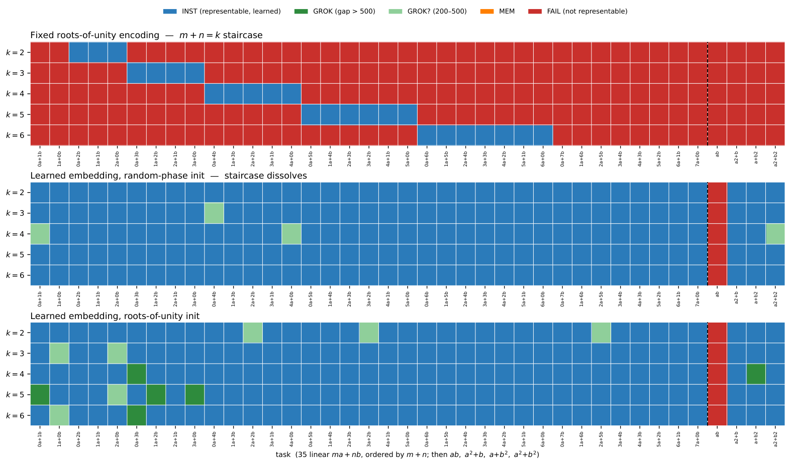
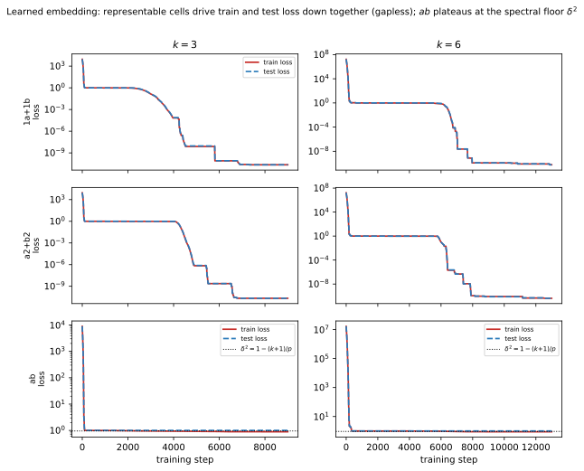

# Kam, Cadet, Bessafi, Cadet 2026 — Algebraic Representability as the Limiting Regime of Grokking: An Exactly Solvable Model with Holomorphic Activations

См. также: [глобальный индекс понятий](../../concepts/index.md).

**Chon-Fai Kam** (University Paris City & University of Reunion; Università degli Studi di Palermo), **Xavier Cadet** (Dartmouth College), **Miloud Bessafi** (University of Reunion), **Frederic Cadet** (University Paris City & University of Reunion; PEACCEL).

arXiv [2607.13749](https://arxiv.org/abs/2607.13749), июль 2026 (v1), 15 страниц, 5 рисунков, 4 таблицы. Всего цитирований по Semantic Scholar — 0, в картотеке — 0. Предмет — предельный режим связи ёмкости и гроккинга: двухслойная комплексная сеть с голоморфной активацией $\sigma(z)=z^{k}$ на кодировании корнями из единицы имеет выразимый класс, алгебраически запертый в $(k{+}1)$-мерном подпространстве характеров $(\mathbb{Z}_{p})^{2}$ при любой ширине. Доказан точный фурье-критерий представимости (линейно-фазовая цель $ma+nb$ представима ⟺ $m+n=k$), непредставимость нелинейно-фазовых целей через гауссовы суммы и нижняя граница обучающих потерь, не зависящая от ширины, — запрет на само запоминание. 584 из 585 прогонов совпадают с алгебраическим предсказанием (99.8%): исходы бинарны — мгновенный успех или полный провал, без MEM и GROK. Мост к обычным сетям — бутылочное горлышко в ReLU (FAIL → MEM → GROK с убывающим разрывом) и абляция кодирования: при обучаемых вложениях критерий расширяется до рангового барьера $\operatorname{rank}\leq k{+}1$, и лишь полноранговая задача $ab$ остаётся непредставимой.

Оригинал и производные файлы этой папки:

- [`original/2607.13749.algebraic-representability-as-the-limiting-regime-of-grokking-an-exactly-solvable-model-with-holomorphic-activations.md`](original/2607.13749.algebraic-representability-as-the-limiting-regime-of-grokking-an-exactly-solvable-model-with-holomorphic-activations.md) — конверсия оригинала (arXiv-HTML v1, сверена с PDF) в Markdown без правок содержания.
- [`2607.13749.algebraic-representability-as-the-limiting-regime-of-grokking-an-exactly-solvable-model-with-holomorphic-activations.claims.txt`](2607.13749.algebraic-representability-as-the-limiting-regime-of-grokking-an-exactly-solvable-model-with-holomorphic-activations.claims.txt) — пронумерованные утверждения статьи с пометками разбора.
- [`images/`](images/) — 5 рисунков.

Схема якорей и правила ссылок на карточку — в [README папки статей](../README.md).

## Затрагиваемые понятия

**[Гроккинг](../../concepts/grokking.md)** — предельный режим спектра ёмкости: до состязания двух временных шкал (скорости запоминания и обобщения по Song и Ye) должно выполняться предварительное условие — запоминание должно быть возможным; когда выразимый класс сжат до неподвижного алгебраического объекта, вопрос «когда сеть гроккнет» вырождается в «может ли она вообще представить цель», исходы бинарны (74 INST / 510 FAIL, ни одного MEM или GROK), а мост к обычным сетям — бутылочное горлышко в ReLU: $d\leq 2$ — FAIL, $d\in\{4,8\}$ — MEM, $d\geq 16$ — GROK с монотонно убывающим разрывом ([`p10-1`](#p10-1)). Разбор: отсутствие MEM объявлено открытием, но оно прямо следует из леммы 2 — 510 прогонов FAIL суть одно явление, посчитанное 510 раз, и матрица ошибок смешивает гарантированное теоремой с измеренным; единственное расхождение ($a+5b$ при $k=6$) снято сменой протокола для одной ячейки, но вошло в счёт 99.8% как ошибка — двойной учёт в пользу теории; мост построен на одной задаче, трёх семенах и бюджете, определяющем вердикт MEM.

**[Модульная арифметика](../../concepts/modular-arithmetic.md)** — кодирование корнями из единицы как естественная параметризация: $a\mapsto\omega^{a}$ превращает сложение mod $p$ в умножение комплексных чисел, и гармонический анализ на $(\mathbb{Z}_{p})^{2}$ делает выразимый класс полностью явным — $k+1$ характеров $\chi_{\ell,k-\ell}$ на диагонали $u+v\equiv k\pmod{p}$; вычитание $a-b$ даёт $(1,p-1)$ с суммой $\equiv 0$ и требует $k=p=97$ — практически непредставимо; ранговый барьер (предложение 1) не зависит от базиса: $\operatorname{rank}Y\leq k+1$ при любых обучаемых вложениях, и $\omega^{ab}$ — $\sqrt{p}$-кратная матрица ДПФ полного ранга — непредставима ни при каком кодировании ([`p5-11`](#p5-11)). Разбор: все опыты при единственном $p=97$ и $k\leq 6$, развёртки по $p$ нет, хотя все критерии от него зависят; предложение 1 — лишь необходимое условие, достаточность показана только для целей ранга 1 (промежуточные ранги $2..k{+}1$ не проверены); как комплексный выход декодируется в класс из $\mathbb{Z}_{p}$ при пороге 99%, описано лишь косвенно.

**[Фурье-признаки и цепи](../../concepts/fourier-features-circuits.md)** — архитектура как жёсткий полосовой фильтр в фурье-домене: пропускаются ровно $k+1$ частот множества $S_{k}$, и рост ширины не двигает и не расширяет полосу — лишь повышает амплитудное разрешение внутри каналов; нелинейно-фазовые цели непредставимы геометрически — их фурье-носитель есть прямая ($a^{2}+b$: линия $\{(u,1)\}$ через гауссову сумму) или вся плоскость ($ab$: $|\widehat{\omega^{ab}}(u,v)|=1/p$ всюду), и никакая одноточечная полоса не покрывает протяжённый носитель ([`p5-1`](#p5-1)). Разбор: ReLU-база на тех же задачах даёт зеркальную картину — она не проваливает ни одной задачи, а цели, дающие FAIL голоморфной сети, дают чистейший гроккинг с разрывом 3700–7500 шагов: та же арифметическая трудность в одном классе — жёсткий пол представимости, в другом — задержка соревнования динамик; догадка Doshi et al. о делении модульных многочленов на обучаемые и необучаемые имеет ту же форму, что теорема 1, и здесь доказана её непредставимая сторона (в голоморфной постановке).

**[Границы обобщения](../../concepts/generalization-bounds.md)** — редкая для корпуса нижняя граница на ОБУЧАЮЩИЕ потери: теорема 3 даёт $\min L\geq\delta^{2}-O(N^{-1/2})$ с вероятностью $1-O(1/N)$, где $\delta^{2}$ — внеполосная спектральная энергия цели, и граница не зависит от ширины — сеть с $H=10\,000$ ведёт себя как с $H=10$; для $ab$ доля энергии в полосе $(k+1)/p^{2}<0.1\%$, то есть потеря неотличима от потерь необученной сети ([`p6-11`](#p6-11)). Разбор: доказательство ссылается на разбор «в приложении», но приложения в статье нет (15 страниц, после раздела 6 сразу литература) — равномерная граница по $g\in\mathcal{F}_{k}$ и инъективность ограничения на выборку остаются наброском; обозначение $\delta^{2}$ перегружено — в (6) это внеполосная энергия при фиксированном кодировании, а в следствии 1 и подписи рис. 5 тем же символом назван ранговый остаток $1-(k+1)/p$; в §4.5 «38 из 39 на каждом семени» спорит с собственными числами 186/190 и 177/190 плюс шесть GROK-ячеек.

## Что показано, а что предположено

Замечания редактора карточки по итогам разбора утверждений (`…claims.txt`, 45 пунктов).

**Ценное — новая ось разбора и опрятный мост.** «Представимость против запоминания» выделена как отдельная ось, предшествующая всем соревновательным объяснениям гроккинга; фурье-критерий доказан в обе стороны с явными конструкциями (Вандермонд для достижимости); ранговый барьер даёт кодиро-независимую форму и точное предсказание для абляции с обучаемыми вложениями, которое сбывается (лестница $m+n=k$ рассыпается, $ab$ остаётся единственным провалом); бутылочное горлышко прослеживает FAIL → MEM → GROK с убывающим разрывом, связывая алгебраический предел со спектром ёмкости Song и Ye; служебность голоморфной архитектуры признана прямо.

**Приложение-фантом, перегруженные обозначения, пересчёт гарантированного.** Доказательство теоремы 3 отсылает к несуществующему приложению; $\delta^{2}$ обозначает две разные величины; три внутренних несогласия чисел (38/39 «на каждом семени» против 186/190; 7000/5000 текста против 7250/5250 таблицы); 510 FAIL — теоретическая гарантия, посчитанная как 510 подтверждений; пороги INST/GROK (<200 / >500 шагов) назначены вручную с промежуточной категорией «GROK?» на рисунке; всё при одном $p=97$.

**Как работу будут цитировать** («доказано, что гроккинг растворяется в представимости») — точнее: для одной двухслойной голоморфной архитектуры с активацией $z^{k}$ при $p=97$ доказан фурье-критерий представимости и нижняя граница потерь, а связь с обычными сетями показана одной эмпирической абляцией (бутылочное горлышко) на одной задаче.

---

# Текст статьи

## Алгебраическая представимость как предельный режим гроккинга: точно решаемая модель с голоморфными активациями

**Chon-Fai Kam** Благодарность: Corresponding author: kam.chonfai@gmail.com. Аффилиация: University Paris City & University of Reunion, Paris, France. Аффилиация: Dipartimento di Fisica e Chimica Emilio Segrè, Università degli Studi di Palermo, Palermo, Italy. **Xavier Cadet** Аффилиация: Thayer School of Engineering, Dartmouth College, Hanover, NH 03755, USA. **Miloud Bessafi** Аффилиация: EnergyLab, University of Reunion, Saint-Denis, France. **Frederic Cadet** Благодарность: frederic.cadet.run@gmail.com. Аффилиация: University Paris City & University of Reunion, Paris, France. Аффилиация: PEACCEL, AI for Biologics, Paris, France

## Аннотация

Нейронные сети, обученные на задачах модульной арифметики, являют гроккинг — отложенный переход от запоминания к обобщению, зависящий, как показано, от ёмкости модели: при слишком малой ёмкости сеть запоминает медленно или вовсе нет, при слишком большой — обобщает почти немедленно. Что происходит на крайнем конце этого спектра, когда выразимый класс функций архитектуры схлопывается в конечномерное алгебраическое многообразие? Мы изучаем этот вопрос на двухслойных сетях с голоморфной одночленной активацией $\sigma(z)=z^{k}$, обученных на модульных задачах, закодированных корнями из единицы. В этой постановке выход сети, независимо от скрытой ширины, заперт в $(k{+}1)$-мерном подпространстве характеров $(\mathbb{Z}_{p})^{2}$ — исчезающе малом, $O(k/p^{2})$, срезе полного пространства функций. Мы даём полную алгебраическую характеризацию этого подпространства: задача представима тогда и только тогда, когда её дискретный фурье-носитель лежит в ограниченном по степени множестве $S_{k}=\{(\ell,k-\ell):0\leq\ell\leq k\}$ из $k+1$ частот на диагонали $u+v\equiv k\pmod{p}$ — условие, для линейно-фазовых целей сводящееся к арифметическому критерию $m+n=k$. Этот критерий представимости — не просто ограничение на итоговое обобщение; это ограничение на само запоминание. Поскольку выходы сети алгебраически заперты, непредставимую цель нельзя подогнать даже на обучающей выборке, и мы доказываем положительную нижнюю границу обучающих потерь, не зависящую от скрытой ширины. По 585 экспериментальным прогонам алгебраическое предсказание совпадает с наблюдённым исходом с точностью $99.8\%$, без режима запоминания и без гроккинга: исходы чисто расщепляются на мгновенный успех и полный провал. Это бинарное поведение — предельный случай связи ёмкости и гроккинга, изучаемой в недавней литературе: когда выразимый класс сжимается до фиксированного алгебраического объекта, вопрос о том, когда сеть гроккнет, растворяется в вопросе, может ли она вообще представить цель. Абляция с бутылочным горлышком связывает этот алгебраический предел со стандартными сетями, прослеживая непрерывный путь от представленческого провала через запоминание без обобщения к гроккингу с сокращающимся разрывом по мере роста ёмкости.

## 1 Введение

В гроккинге есть нечто подлинно озадачивающее. Сеть, обученная на задаче модульной арифметики, запомнив обучающую выборку, будет долго сидеть тихо — её обучающая потеря близ нуля, тестовая точность близ случайной, — а затем, без предупреждения, обобщит. Ожидание может длиться тысячи градиентных шагов, порой на порядки дольше, чем заняло запоминание. Это не шум и не невезение; задержка систематична, воспроизводится по семенам и предсказуемо отзывается на изменения размера модели и регуляризации. Малые сети пропускают задержку целиком и обобщают немедленно — или проваливаются напрочь. Большие сети запоминают быстро и гроккают после более короткого ожидания. Ёмкость модели, оказывается, управляет не только тем, может ли сеть решить задачу, но и тем, когда, в ходе обучения, решение появится. Недавняя работа Song and Ye 2026 делает это точным: они показывают, что гроккинг возникает из пересечения двух измеримых временных шкал — скорости запоминания и скорости обобщения, обеих функций числа параметров. С ростом ёмкости шкала запоминания сжимается быстрее шкалы обобщения, и окно гроккинга **[p. 2]** сужается. Картина — непрерывная ручка: поверни в одну сторону — задержишь гроккинг; поверни достаточно далеко в другую — гроккинг исчезнет в немедленном обобщении.

Что эта картина принимает как данность — и что легко упустить — это предварительное условие, которое должно выполняться до начала двухшкального состязания. Запоминание должно быть возможным. Сеть должна уметь подогнать свои обучающие данные. Едва она умеет, начинается гонка: обгонит ли структурированное обобщающее решение, благоволимое weight decay, запомненное до конца обучения? Эта гонка и есть гроккинг. Но если сеть не может запомнить вовсе — если целевая функция просто невыразима в классе функций архитектуры — гонка не начинается. Нет запомненного решения, которое ждало бы; нет давления weight decay, которое могло бы его выбить; нет отложенного перехода, который можно было бы наблюдать. Вопрос о том, когда сеть гроккнет, заменяется предшествующим вопросом, может ли она вообще представить цель: представимость — предварительное структурное ограничение, а оптимизация лишь определяет, достигается ли доступное решение и как быстро. (Мы используем *точно решаемая*, в заглавии и всюду, в смысле, что выразимый класс функций допускает замкнутую характеризацию; сама динамика оптимизации аналитически не решена.)

Это не просто вырожденный краевой случай. Это режим, который литература о ёмкости не покрывает, потому что стандартные архитектуры — универсальные приближатели: при достаточной ширине они могут представить любую цель, так что запоминание всегда возможно в принципе, и ёмкость управляет лишь скоростью. Интересное ограничение в той постановке — никогда не представимость, а всегда оптимизационная динамика. Чтобы сделать представимость связывающим ограничением, нужна архитектура, чей выразимый класс не просто мал, но *алгебраически фиксирован* — класс, не растущий с шириной, имеющий точное математическое описание и проверяемый для любой цели без обучения сети. Такие архитектуры редки в литературе, и их обучающая динамика получила сравнительно мало внимания — отчасти потому, что они не похожи на практические нейронные сети. Но они предлагают то, чего универсальные приближатели не дают: постановку, в которой вопрос о том, что сеть может выразить, имеет чистый, проверяемый ответ, и связь между этим ответом и исходом обучения можно изучать без смешения с оптимизационной трудностью.

Архитектура, которую мы изучаем, — двухслойная комплекснозначная сеть [15] с голоморфной одночленной активацией $\sigma(z)=z^{k}$, обученная на задачах модульной арифметики через кодирование корнями из единицы, $(\omega^{a},\omega^{b})$ с $\omega=e^{2\pi i/p}$ и простым $p$. Выбор мотивирован разрешимостью: поскольку $\sigma$ — многочлен степени $k$, выход сети — многочлен степени $k$ от входов, и на кодировании корнями из единицы дискретная фурье-структура группы $(\mathbb{Z}_{p})^{2}$ делает выразимый класс полностью явным. Стандартное биномиальное разложение показывает, что при *любой* скрытой ширине $H$ выход сети — линейная комбинация ровно $k+1$ характеров $(\mathbb{Z}_{p})^{2}$, функций $(a,b)\mapsto\omega^{\ell a+(k-\ell)b}$ для $\ell=0,\dots,k$. Выразимый класс $\mathcal{F}_{k}$ — тем самым $(k{+}1)$-мерное подпространство $p^{2}$-мерного пространства функций на $(\mathbb{Z}_{p})^{2}$. Увеличение скрытой ширины $H$ ничего не делает для расширения этого подпространства; оно лишь вносит избыточность внутри него. Архитектура ни в каком смысле не универсальный приближатель — и не пытается им быть.

Центральный теоретический вклад этой статьи — полная алгебраическая характеризация того, какие модульные задачи лежат в $\mathcal{F}_{k}$. Подпространство $\mathcal{F}_{k}$ соответствует, в фурье-домене, $k+1$ характерам с частотной меткой $(\ell,k-\ell)$ для некоторого $0\leq\ell\leq k$ — конечному множеству $S_{k}$, сидящему на (но не заполняющему) диагонали $u+v\equiv k\pmod{p}$ частотной плоскости. Задача представима тогда и только тогда, когда её фурье-носитель содержится в $S_{k}$. Для линейно-фазовых целей $f(a,b)=ma+nb\bmod p$, составляющих ядро стандартной литературы гроккинга, критерий сводится к арифметическому условию $m+n=k$: данная цель либо лежит точно в $\mathcal{F}_{k}$ как одиночный характер, либо ортогональна всему подпространству, в зависимости от простой арифметической проверки. Середины нет. Для нелинейно-фазовых целей вроде $ab$ или $a^{2}+b^{2}$ фурье-носитель расползается по прямой или всей частотной плоскости — следствие квадратичных гауссовых сумм, — и никакая конечная степень $k$ не достаточна для их представления. Архитектура действует, в фурье-домене, как жёсткий полосовой фильтр, и полоса пропускания определяется целиком степенью $k$.

Эта алгебраическая структура имеет прямое механическое следствие для обучения. Когда цель не в $\mathcal{F}_{k}$, выходы сети заперты в подпространстве, не содержащем цель, и мы доказываем нижнюю границу обучающих потерь, строго положительную и не зависящую от скрытой ширины. Сеть не может подогнать свои обучающие данные — ни медленно, ни после более долгого обучения, ни с более широкой архитектурой. Граница идёт из спектрального расстояния между целью и $\mathcal{F}_{k}$, и для нелинейно-фазовых целей это расстояние близко к максимуму. Следствие для обучающей динамики резко: нет запоминания, нет гроккинга, нет намёка на постепенный прогресс. Обучающая точность остаётся на случайном уровне всё время, будто задачи не существует.

Экспериментальные находки соответственно чисты. По 585 обучающим прогонам, охватывающим пять степеней активации, тридцать девять модульных задач и три случайных семени, алгебраический критерий представимости предсказывает исход обучения с точностью $99.8\%$. Каждая непредставимая задача проваливается на уровне обучающей точности; каждая представимая выучивается почти мгновенно, без разрыва между обучающей и тестовой кривыми и без признака задержки, характеризующей гроккинг. Стандартная ReLU-сеть на тех же задачах рассказывает дополняющую историю: будучи универсальным приближателем, она запоминает каждую задачу без исключения, а на более трудных нелинейно-фазовых целях являет учебниковый **[p. 3]** гроккинг — обобщение отстаёт от запоминания на тысячи градиентных шагов. Цели, производящие полный провал для голоморфной сети, производят отложенный успех для ReLU. Различие не в задачах, а в выразимом классе.

Отношение к более широкой литературе гроккинга — отношение смежных режимов, а не соперничающих объяснений. Существующая работа, включая точную ёмкостную рамку Song and Ye 2026, изучает, что происходит, когда сеть хотя бы достаточно велика для запоминания: в том режиме ёмкость управляет скоростью запоминания, скоростью обобщения и получающимся гроккинговым разрывом. Голоморфная сеть сидит ниже того режима, в постановке, где выразимый класс слишком мал, чтобы вместить цель вовсе. Два анализа описывают разные части одного лежащего в основе спектра, и связь между ними не только концептуальна: абляция с бутылочным горлышком, о которой мы сообщаем в Разделе 4, прослеживает полный трёхрежимный путь — провал запоминания, запоминание без гроккинга и гроккинг с сокращающимся разрывом — по мере прогрессивного сжатия выразимого класса к алгебраическому пределу, который мы изучаем аналитически.

## 2 Постановка

Архитектура, которую мы изучаем, устроена так, чтобы сделать выразимый класс функций как можно прозрачнее. Это двухслойная комплекснозначная сеть, чей прямой проход вычисляет

$$
\hat{y}(x;\,W,v)\;=\;\sum_{j=1}^{H}v_{j}\,\bigl(W_{1j}\,x_{1}+W_{2j}\,x_{2}\bigr)^{k}, \tag{1}
$$

где $x=(x_{1},x_{2})\in\mathbb{C}^{2}$ — вход, $W\in\mathbb{C}^{2\times H}$ и $v\in\mathbb{C}^{H}$ — обучаемые веса, а $k$ — фиксированное положительное целое. Активация $\sigma(z)=z^{k}$ голоморфна, и всё отображение $\hat{y}$ — многочлен степени $k$ от входов. Ключевой структурный факт: едва степень активации фиксирована, выход сети — для *любого* выбора весов и *любой* скрытой ширины $H$ — многочлен той же степени. Расширение сети не поднимает степень; оно лишь допускает больше слагаемых в сумме, все степени $k$. Именно это делает выразимый класс алгебраически фиксированным, а не просто малым.

#### Задачи и кодирование.

Зафиксируем нечётное простое $p$ и пусть $\omega=e^{2\pi i/p}$ — примитивный корень степени $p$ из единицы. Мы рассматриваем задачи вида $f:\mathbb{Z}_{p}\times\mathbb{Z}_{p}\to\mathbb{Z}_{p}$. Кодирование корнями из единицы отображает каждое целое $a\in\mathbb{Z}_{p}$ в точку $\omega^{a}$ на единичной окружности в $\mathbb{C}$, так что вход для пары $(a,b)$ — это $x=(\omega^{a},\omega^{b})$, а целевой выход — $\omega^{f(a,b)}$. Это кодирование — не просто удобная параметризация; оно естественное. Фурье-анализ функций на $\mathbb{Z}_{p}\times\mathbb{Z}_{p}$ эквивалентен, под этим кодированием, анализу тригонометрических многочленов на произведении двух единичных окружностей, и групповая структура $\mathbb{Z}_{p}$ становится вращательной структурой окружности. В частности, отображение $a\mapsto\omega^{a}$ обращает групповую операцию сложения по модулю $p$ в умножение комплексных чисел — что и позволяет полиномиальной структуре сети чисто взаимодействовать с арифметической структурой задачи.

Обучение минимизирует среднеквадратичную ошибку между выходом сети и целью на случайно выбранной доле всех $p^{2}$ входных пар:

$$
L(W,v)\;=\;\frac{1}{|S|}\sum_{(a,b)\in S}\bigl|\hat{y}(\omega^{a},\omega^{b};\,W,v)-\omega^{f(a,b)}\bigr|^{2}, \tag{2}
$$

где $S\subseteq\mathbb{Z}_{p}\times\mathbb{Z}_{p}$ — обучающая выборка. Выход сети и цель оба лежат на единичной окружности в $\mathbb{C}$, так что потеря меряет квадрат хордового расстояния между ними. Мы говорим, что архитектура *представляет* задачу $f$, если существуют параметры $(W,v)$ такие, что $\hat{y}(\omega^{a},\omega^{b};\,W,v)=\omega^{f(a,b)}$ для каждой $(a,b)\in\mathbb{Z}_{p}\times\mathbb{Z}_{p}$, то есть если глобальный минимум популяционной потери (2) равен нулю.

#### Гармонический анализ на $\mathbb{Z}_{p}\times\mathbb{Z}_{p}$.

Группа $G=(\mathbb{Z}_{p})^{2}$ конечна и абелева, так что её неприводимые характеры — одномерные гомоморфизмы $\chi_{u,v}:G\to\mathbb{C}^{\times}$, индексированные $(u,v)\in(\mathbb{Z}_{p})^{2}$ и заданные

$$
\chi_{u,v}(a,b)\;=\;\omega^{ua+vb}. \tag{3}
$$

Снабжённые нормированным скалярным произведением $\langle f,g\rangle=|G|^{-1}\sum_{(a,b)\in G}f(a,b)\,\overline{g(a,b)}$, характеры образуют ортонормальный базис $\mathbb{C}^{G}$ по теореме Шура. Мы пишем $\hat{f}(u,v)=\langle f,\chi_{u,v}\rangle$ для фурье-коэффициентов $f$ и $\mathrm{supp}(\hat{f})=\{(u,v):\hat{f}(u,v)\neq 0\}$ для фурье-носителя. Квадрат нормы разлагается как $\|f\|^{2}=\sum_{u,v}|\hat{f}(u,v)|^{2}$, и проекция на любое подпространство, натянутое на характеры, даётся ортогональной проекцией в этом скалярном произведении.

**[p. 4]**

Всюду в статье мы предполагаем $k<p$. Это обеспечивает, что целые $0,1,\dots,k$ различны по модулю $p$, что в свою очередь обеспечивает, что $k+1$ характеров, появляющихся в выходе сети, — различные элементы ортонормального базиса, — условие, нужное для точности критерия представимости. Все эксперименты используют $p=97$ и $k\leq 6$, так что предположение выполняется с запасом.

## 3 Выразимый класс функций

Архитектура (1) — полиномиальное отображение степени $k$ из $\mathbb{C}^{2}$ в $\mathbb{C}$. Всё дальнейшее — по существу тщательная распаковка того, что это значит для функций на группе $G=(\mathbb{Z}_{p})^{2}$, закодированных корнями из единицы. Довод идёт тремя шагами: сначала мы раскрываем многочлен, чтобы определить базисные функции, натягивающие выразимый класс; затем показываем, что класс ровно $(k+1)$-мерен, и описываем его в фурье-терминах; наконец, характеризуем, какие модульные задачи лежат внутри класса, а какие нет, и выводим нижнюю границу обучающих потерь для непредставимых целей.

### 3.1 Раскрытие прямого прохода

Отправная точка — прямое применение биномиальной теоремы к скрытым единицам.

##### **Лемма 1**(Полиномиальное разложение)**.**

*Для всех $x=(x_{1},x_{2})\in\mathbb{C}^{2}$,*

$$
\hat{y}(x;\,W,v)\;=\;\sum_{l=0}^{k}c_{l}(W,v)\,x_{1}^{l}\,x_{2}^{k-l},\qquad c_{l}(W,v)\;=\;\binom{k}{l}\sum_{j=1}^{H}v_{j}\,W_{1j}^{l}\,W_{2j}^{k-l}. \tag{4}
$$

##### Доказательство.

Для каждой скрытой единицы $j$ биномиальная теорема даёт $(W_{1j}x_{1}+W_{2j}x_{2})^{k}=\sum_{l=0}^{k}\binom{k}{l}W_{1j}^{l}W_{2j}^{k-l}x_{1}^{l}x_{2}^{k-l}$. Суммирование по $j$ в (1) и перестановка двух конечных сумм даёт (4), с $c_{l}$, собирающим члены, не зависящие от одночленов $x_{1}^{l}x_{2}^{k-l}$. ∎

Разложение (4) показывает, что выход сети, при любых весах и любой скрытой ширине, — линейная комбинация ровно $k+1$ одночленов: $x_{1}^{k},x_{1}^{k-1}x_{2},\dots,x_{2}^{k}$. Коэффициенты $c_{l}(W,v)$ определяются весами, но сами одночлены фиксированы степенью. В этом смысл алгебраической фиксированности выразимого класса: никакой выбор $H$, $W$ или $v$ не может произвести одночлен степени, отличной от $k$, или функцию вне линейной оболочки этих $k+1$ членов.

Чего разложение ещё не говорит — как эти одночлены выглядят как функции на $G$ под кодированием корнями из единицы. Подстановка $x_{1}=\omega^{a}$ и $x_{2}=\omega^{b}$ даёт $x_{1}^{l}x_{2}^{k-l}=\omega^{la+(k-l)b}$, что есть характер $\chi_{l,\,k-l}$, вычисленный в $(a,b)$. Выход сети тем самым становится линейной комбинацией $k+1$ функций $\phi_{l}(a,b):=\chi_{l,\,k-l}(a,b)=\omega^{la+(k-l)b}$, и выразимый класс на $G$ — подпространство, которое они натягивают.

### 3.2 Выразимый класс как подпространство характеров

##### **Лемма 2**(Выразимый класс)**.**

*Определим $\phi_{l}(a,b)=\omega^{la+(k-l)b}$ для $l=0,\dots,k$, и пусть*

$$
\mathcal{F}_{k}:=\operatorname{span}_{\mathbb{C}}\{\phi_{0},\dots,\phi_{k}\}\subseteq\mathbb{C}^{G}. \tag{5}
$$

*Каждый выход сети $\hat{y}(\omega^{a},\omega^{b};\,W,v)$ лежит в $\mathcal{F}_{k}$, для любых $H$, $W$ и $v$. При предположении $k<p$ функции $\phi_{0},\dots,\phi_{k}$ — различные неприводимые характеры $G$, следовательно взаимно ортогональные относительно скалярного произведения на $\mathbb{C}^{G}$, следовательно линейно независимые, и $\dim\mathcal{F}_{k}=k+1$.*

##### Доказательство.

Первое утверждение следует из отождествления $x_{1}^{l}x_{2}^{k-l}=\phi_{l}$ под кодированием, дающего $\hat{y}(\omega^{a},\omega^{b};\,W,v)=\sum_{l}c_{l}(W,v)\phi_{l}(a,b)\in\mathcal{F}_{k}$.

Для второго утверждения заметим, что $\phi_{l}=\chi_{l,\,k-l}$, так что две функции $\phi_{l}$ и $\phi_{m}$ тождественны как характеры тогда и только тогда, когда $l\equiv m\pmod{p}$ и $k-l\equiv k-m\pmod{p}$, что оба сводится к $l\equiv m\pmod{p}$. Поскольку $0\leq l,m\leq k<p$, вычеты — свои же целые представители, так что $l\equiv m\pmod{p}$ вынуждает $l=m$. $k+1$ характеров потому различны, и по ортогональности Шура различные неприводимые характеры взаимно ортогональны. Ортогональные ненулевые векторы линейно независимы, так что $\dim\mathcal{F}_{k}=k+1$. ∎

**[p. 5]**

###### p5-1

Геометрическая картина такова. Полное пространство функций $\mathbb{C}^{G}$ имеет размерность $p^{2}$, с $p^{2}$ характерами $\chi_{u,v}$ как ортонормальным базисом. Подпространство $\mathcal{F}_{k}$ состоит из $k+1$ характеров с частотной меткой $(\ell,k-\ell)$ для некоторого $0\leq\ell\leq k$: конечного множества $S_{k}$ из $k+1$ точек, лежащих на диагонали $u+v\equiv k\pmod{p}$ частотной плоскости $(\mathbb{Z}_{p})^{2}$ — не всей диагонали, содержащей $p$ точек. Архитектура действует как полосовой фильтр в фурье-домене, пропуская ровно $k+1$ частот $S_{k}$ и блокируя всё прочее. Увеличение скрытой ширины $H$ не двигает и не расширяет полосу пропускания; оно лишь повышает амплитудное разрешение внутри $k+1$ пропускаемых каналов.

### 3.3 Каждая функция в $\mathcal{F}_{k}$ достижима

Предыдущая лемма устанавливает верхнюю границу выразимого класса: выходы сети заперты в $\mathcal{F}_{k}$. Обратное тоже верно, и по существенно тривиальным причинам, едва правильная конструкция определена.

##### **Лемма 3**(Сюръективность)**.**

*Для любой скрытой ширины $H\geq k+1$ коэффициентное отображение $(W,v)\mapsto(c_{0},\dots,c_{k})\in\mathbb{C}^{k+1}$, определённое (4), сюръективно. Следовательно, каждый элемент $\mathcal{F}_{k}$ есть выход некоторой сети.*

##### Доказательство.

Поскольку биномиальные коэффициенты $\binom{k}{l}$ ненулевые, достаточно показать, что перемасштабированные коэффициенты $\tilde{c}_{l}=c_{l}/\binom{k}{l}=\sum_{j}v_{j}W_{1j}^{l}W_{2j}^{k-l}$ можно выбирать свободно. Ограничимся первыми $k+1$ скрытыми единицами, положим $W_{2j}=1$ для $j=1,\dots,k+1$ и запишем $x_{j}:=W_{1j}$. Система $\sum_{j=1}^{k+1}v_{j}x_{j}^{l}=\tilde{c}_{l}$ для $l=0,\dots,k$ имеет матричную форму $Vv=\tilde{c}$, где $V_{l,j}=x_{j}^{l}$ — матрица Вандермонда $(k+1)\times(k+1)$. Выбор различных $x_{j}$ — например $x_{j}=j$ — даёт $\det V=\prod_{i<j}(x_{j}-x_{i})\neq 0$, так что система имеет единственное решение $v=V^{-1}\tilde{c}$. Это даёт явную конструкцию для любого целевого вектора коэффициентов, и вывод следует. ∎

Леммы 1–3 вместе говорят, что $\mathcal{F}_{k}$ — *в точности* выразимый класс: ни больше, ни меньше. Сеть прочерчивает весь $\mathcal{F}_{k}$ при варьировании весов, и ничто вне $\mathcal{F}_{k}$ никогда не производится. Это делает вопрос представимости точным: задача $f$ представима тогда и только тогда, когда $\omega^{f}\in\mathcal{F}_{k}$, что есть чисто фурье-аналитическое условие, не имеющее отношения к оптимизации или инициализации.

### 3.4 Какие задачи представимы

Теперь мы переводим условие $\omega^{f}\in\mathcal{F}_{k}$ в явные критерии для двух семейств задач, изучаемых в экспериментах.

##### **Теорема 1**(Линейно-фазовый критерий)**.**

*При предположении $k<p$ и с $H\geq k+1$ архитектура представляет задачу $f(a,b)=ma+nb\bmod p$ тогда и только тогда, когда существует $l\in\{0,1,\dots,k\}$ такое, что $m\equiv l\pmod{p}$ и $n\equiv k-l\pmod{p}$. Для неотрицательных целых $m,n$ с $m+n\leq k$ это сводится к арифметическому условию $m+n=k$.*

##### Доказательство.

Целевая функция — одиночный характер $\psi=\chi_{m,n}$.

Для направления *если*: если $(m\bmod p,n\bmod p)=(l,k-l)$ для некоторого $l\leq k$, то $\psi=\phi_{l}\in\mathcal{F}_{k}$, и Лемма 3 даёт веса, достигающие $c_{l}=1$, $c_{j}=0$ для $j\neq l$.

Для направления *только если*: пусть $\psi\in\mathcal{F}_{k}$, так что $\psi=\sum_{j=0}^{k}c_{j}\phi_{j}$. Беря скалярное произведение обеих сторон с $\psi$ и применяя ортогональность Шура, $1=\langle\psi,\psi\rangle=\sum_{j}c_{j}\langle\phi_{j},\psi\rangle$. Если $(m\bmod p,n\bmod p)\notin S_{k}$, то $\psi\neq\phi_{j}$ для каждого $j$, так что каждое скалярное произведение $\langle\phi_{j},\psi\rangle=0$ и правая сторона нулевая, давая $1=0$ — противоречие. Значит $(m\bmod p,n\bmod p)\in S_{k}$, где $S_{k}=\{(l,k-l)\bmod p:l=0,\dots,k\}$ — носитель $\mathcal{F}_{k}$ в частотной плоскости. Сведение к $m+n=k$ для малых неотрицательных целых следует, поскольку тогда вычеты совпадают с целыми. ∎

###### p5-11

Критерий точен в обе стороны и не имеет непрерывной градации: линейно-фазовая цель либо в $\mathcal{F}_{k}$ как одиночный характер, либо ортогональна всему подпространству. Задача вычитания $f(a,b)=a-b$, например, соответствует $(m,n)=(1,p-1)$ после приведения по модулю $p$; поскольку $1+(p-1)=p\equiv 0\pmod{p}$, представимость требует $k\equiv 0\pmod{p}$, то есть наименьшая пригодная степень — сам $k=p$. Для $p=97$ это численно непрактично, и задача фактически непредставима для любой разумной архитектуры этого типа.

Для нелинейно-фазовых задач ситуация драматичнее.

##### **Теорема 2**(Нелинейно-фазовые задачи)**.**

*При предположении $k<p$ ни одна из задач $f(a,b)\in\{ab,\;a^{2}+b,\;a+b^{2},\;a^{2}+b^{2}\}$ не представима ни при каком $k$.*

##### Доказательство.

По Лемме 2 представимость требует $\supp(\widehat{\omega^{f}})\subseteq S_{k}$. Мы вычисляем фурье-носитель каждой цели напрямую, используя тождество $\sum_{b\in\mathbb{Z}_{p}}\omega^{cb}=p\cdot[c\equiv 0]$ и факт, что для нечётного простого $p$ квадратичная гауссова сумма $g=\sum_{x\in\mathbb{Z}_{p}}\omega^{x^{2}}$ удовлетворяет $|g|=\sqrt{p}$.

**[p. 6]** Для $f=ab$: $\widehat{\omega^{ab}}(u,v)=\frac{1}{p^{2}}\sum_{a,b}\omega^{ab-ua-vb}=\frac{\omega^{-uv}}{p}$, что ненулевое для каждой $(u,v)$. Носитель — вся $(\mathbb{Z}_{p})^{2}$, имеющая $p^{2}$ элементов, тогда как $|S_{k}|=k+1\leq p$, так что вложение невозможно.

Для $f=a^{2}+b$: преобразование Фурье факторизуется в произведение гауссовой суммы по $a$ и геометрической суммы по $b$; последняя вынуждает $v=1$, а первая ненулевая для всех $u$. Носитель — прямая $\{(u,1):u\in\mathbb{Z}_{p}\}$, имеющая $p$ элементов. Эта прямая пересекает $S_{k}$ в единственной точке $(k-1,1)$, так что носитель не содержится в $S_{k}$ при $k<p$.

Случаи $f=a+b^{2}$ и $f=a^{2}+b^{2}$ следуют по симметрии и тем же гауссово-суммовым доводом, с носителями $\{(1,v)\}$ и $(\mathbb{Z}_{p})^{2}$ соответственно. ∎

Фурье-носительный довод делает препятствие геометрическим, а не алгебраическим: представимые цели — *одиночные точки* частотной плоскости, тогда как нелинейно-фазовые цели имеют *протяжённый* носитель — целую прямую или всю плоскость. Никакая полоса пропускания на одной линии не может схватить протяжённый носитель, и никакой выбор степени $k$ этого не разрешает, потому что дело в форме носителя, не в его размере.

### 3.5 Почему непредставимость блокирует запоминание

Теоремы представимости выше отвечают, может ли цель быть выражена в принципе. Более тонкий вопрос — что происходит при обучении, когда цель непредставима. Стандартная интуиция из переизбыточно параметризованных сетей подсказывает, что широкая сеть должна уметь запомнить любую конечную обучающую выборку, независимо от способности выразить полную целевую функцию. Эта интуиция здесь отказывает, и причину стоит сделать точной, потому что она объясняет самую отличительную черту экспериментальных результатов: полное отсутствие режима запоминания.

Ключ — что ширино-независимость $\mathcal{F}_{k}$ — не просто утверждение о классе функций в пределе бесконечных параметров; оно держится для каждого конечного $H$. Поскольку $\hat{y}(\omega^{a},\omega^{b};\,W,v)\in\mathcal{F}_{k}$ для всех $(W,v)$ по Лемме 2, минимальная обучающая потеря не меньше квадрата расстояния от целевых значений до ближайшего элемента $\mathcal{F}_{k}$, ограниченного на обучающую выборку. Когда глобальная целевая функция не в $\mathcal{F}_{k}$, это расстояние отделено от нуля членом, отражающим спектральную энергию цели вне полосы пропускания.

Чтобы сделать это точным, определим спектральный зазор

$$
\delta^{2}\;:=\;\|\,\omega^{f}-\mathrm{Proj}_{\mathcal{F}_{k}}\,\omega^{f}\,\|_{G}^{2}\;=\;\sum_{(u,v)\notin S_{k}}|\widehat{\omega^{f}}(u,v)|^{2}\;>\;0, \tag{6}
$$

где неравенство держится по теоремам выше всякий раз, когда $f$ непредставима. Следующий результат показывает, что $\delta^{2}$ распространяется на обучающую потерю.

##### **Теорема 3**(Нижняя граница обучающей потери)**.**

*Пусть $S\subseteq G$ — обучающая выборка, вытянутая равномерно случайно с $|S|=N$. С вероятностью $1-O(1/N)$ по вытяжке,*

$$
\min_{W,\,v}\;\frac{1}{N}\sum_{(a,b)\in S}\bigl|\hat{y}(\omega^{a},\omega^{b};\,W,v)-\omega^{f(a,b)}\bigr|^{2}\;\geq\;\delta^{2}-O\!\left(N^{-1/2}\right). \tag{7}
$$

*Граница не зависит от скрытой ширины $H$.*

##### Доказательство.

По Лемме 2 каждый выход сети в $\mathcal{F}_{k}$, так что эмпирический минимум не меньше $\min_{g\in\mathcal{F}_{k}}\frac{1}{N}\sum_{i\in S}|T_{i}-g(a_{i},b_{i})|^{2}$, где $T_{i}=\omega^{f(a_{i},b_{i})}$. Для любой фиксированной $g\in\mathcal{F}_{k}$ слагаемые $|T_{i}-g(a_{i},b_{i})|^{2}$ — ограниченные случайные величины, вытягиваемые без возвращения из $G$; по неравенству Хёфдинга–Серфлинга эмпирическое среднее концентрируется вокруг популяционного среднего $\|{\omega^{f}-g}\|_{G}^{2}$ со скоростью $O(N^{-1/2})$. Поскольку $\mathcal{F}_{k}$ $(k+1)$-мерно и отображение ограничения из $\mathcal{F}_{k}$ в функции на $S$ инъективно при $N\geq k+1$ с высокой вероятностью (доводом типа Шварца–Циппеля над $\mathbb{Z}_{p}$, детализированным в приложении), равномерная граница по $g\in\mathcal{F}_{k}$ стоит лишь размерностно-зависимую константу. Популяционный минимум равен $\delta^{2}$ по определению $\mathrm{Proj}_{\mathcal{F}_{k}}$, и результат следует. ∎

###### p6-11

Для нелинейно-фазовых задач, которые мы изучаем, спектральный зазор $\delta^{2}$ близок к максимуму. Цель $\omega^{ab}$ имеет $|\widehat{\omega^{ab}}(u,v)|=1/p$ для всех $(u,v)$, так что доля спектральной энергии в $S_{k}$ равна $(k+1)/p^{2}$; для $p=97$ и $k\leq 6$ это не больше $7/9409<0.1\%$. Обучающая потеря потому отделена от нуля отступом, неотличимым от максимальной потери необученной сети. Это и наблюдают эксперименты: для каждой непредставимой задачи обучающая точность остаётся на случайном уровне всё время, и кривые потерь плоски. Ширина сети нерелевантна, потому что граница Теоремы 3 не зависит от $H$: сеть с $H=10{,}000$ скрытых единиц ведёт себя тождественно сети с $H=10$.

**[p. 7]**

### 3.6 За пределы фиксированного кодирования: ранговый барьер

Теоремы 1 и 2 характеризуют представимость для конкретного кодирования корнями из единицы, при котором выразимый класс — ограниченное по степени множество $S_{k}$ из $k+1$ частот на диагонали $u+v\equiv k\pmod{p}$. Естественно спросить, сколько этой структуры выживает, когда самому кодированию позволено варьировать — в частности, является ли провал цели вроде $ab$ артефактом фиксированного базиса или внутренним свойством архитектуры. Следующее наблюдение изолирует часть препятствия, не зависящую от кодирования.

Пусть $e_{1},e_{2}:\mathbb{Z}_{p}\to\mathbb{C}$ — *произвольные* вложения, и запишем прямой проход как $\hat{y}(a,b)=\sum_{j=1}^{H}v_{j}\bigl(W_{1j}\,e_{1}(a)+W_{2j}\,e_{2}(b)\bigr)^{k}$. Собирая выходы в матрицу $Y\in\mathbb{C}^{p\times p}$ с $Y_{ab}=\hat{y}(a,b)$ и записывая $\omega^{f}$ для целевой матрицы $(\omega^{f(a,b)})_{a,b}$, имеем следующее.

##### **Предложение 1**(Свободный от кодирования ранговый барьер)**.**

*Для каждого выбора вложений $e_{1},e_{2}$, весов $W$ и $v$ выходная матрица удовлетворяет $\operatorname{rank}Y\leq k+1$. Следовательно, задача $f$ представима при некотором выборе $(e_{1},e_{2},W,v)$ лишь если $\operatorname{rank}(\omega^{f})\leq k+1$.*

##### Доказательство.

Биномиальное разложение Леммы 1 не использует кодирование и даёт $\hat{y}(a,b)=\sum_{l=0}^{k}c_{l}\,e_{1}(a)^{l}\,e_{2}(b)^{k-l}$ с $c_{l}=\binom{k}{l}\sum_{j}v_{j}W_{1j}^{l}W_{2j}^{k-l}$. Каждое слагаемое — внешнее произведение вектора-столбца $\bigl(e_{1}(a)^{l}\bigr)_{a\in\mathbb{Z}_{p}}$ с вектором-строкой $\bigl(e_{2}(b)^{k-l}\bigr)_{b\in\mathbb{Z}_{p}}$, следовательно матрица $p\times p$ ранга один. Сумма $k+1$ матриц ранга один имеет ранг не больше $k+1$, так что $\operatorname{rank}Y\leq k+1$. Если $Y=\omega^{f}$ для некоторых параметров, то $\operatorname{rank}(\omega^{f})\leq k+1$. ∎

Это условие строго слабее фиксированно-кодировочного критерия: фиксация $e_{1}(a)=e_{2}(a)=\omega^{a}$ вынуждает носитель на одиночный фурье-характер на прямой $u+v\equiv k$ (Теорема 1), тогда как обучаемое кодирование ограничивает лишь *ранг*. Зазор между двумя условиями — в точности множество целей, которые обучаемое вложение делает достижимыми, а фиксированный базис нет.

##### **Следствие 1**($ab$ — неустранимое препятствие)**.**

*Матрица $\omega^{ab}=(\omega^{ab})_{a,b}$ равна $\sqrt{p}$-кратной унитарной матрице ДПФ группы $\mathbb{Z}_{p}$; она потому имеет полный ранг $p$, со всеми сингулярными значениями, равными $\sqrt{p}$. При $k<p-1$ имеем $\operatorname{rank}(\omega^{ab})=p>k+1$, так что по Предложению 1 задача $ab$ *непредставима ни при каком кодировании*, и нормированный остаток лучшего выхода ранга $(k+1)$ равен $1-(k+1)/p$. В контрасте, каждая линейно-фазовая цель $\omega^{ma+nb}$ и каждая разделимая цель из $\{a^{2}+b,\;a+b^{2},\;a^{2}+b^{2}\}$ даёт матрицу ранга один и представима при подходящем обучаемом вложении для каждого $k\geq 2$.*

##### Доказательство.

Для $ab$ матрица $(\omega^{ab})_{a,b}$ — таблица характеров $\mathbb{Z}_{p}$, то есть матрица ДПФ, умноженная на $\sqrt{p}$; её сингулярные значения все $\sqrt{p}$, а ранг $p$. Остаток — хвост сингулярного спектра за верхними $k+1$ значениями, нормированный полной энергией: $(p-k-1)\,p/p^{2}=1-(k+1)/p$. Для направления достаточности цель ранга один факторизуется как $T_{ab}=g(a)h(b)$ с единично-модульными $g,h$; взяв $l=1$, $c_{1}=1$, $c_{l\neq 1}=0$, $e_{1}(a)=g(a)$ и $e_{2}(b)=h(b)^{1/(k-1)}$, получаем $e_{1}(a)^{1}e_{2}(b)^{k-1}=g(a)h(b)=T_{ab}$, где корень степени $(k-1)$ — чистая степень $\omega$, потому что $k-1$ обратимо по модулю $p$ для $2\leq k\leq 6<p$; вектор коэффициентов реализуется вандермондовой конструкцией Леммы 3. ∎

Предложение 1 переписывает спектральный зазор (6) в базисно-свободной форме: энергия $\omega^{f}$ вне фиксированной полосы $S_{k}$ заменяется, для обучаемого кодирования, хвостовой энергией за верхними $k+1$ сингулярными значениями $\omega^{f}$. Нижняя граница Теоремы 3 переносится с этой заменой, поскольку её единственный вход — что каждый выход сети лежит в семействе размерности — здесь ранга — не больше $k+1$. Предсказание точное: при обучаемом кодировании граница представимости сдвигается с прямой $m+n=k$ на единственное условие $\operatorname{rank}(\omega^{f})\leq k+1$, и $ab$ — единственная задача нашей сетки, остающаяся по неправильную сторону. Раздел 4.5 проверяет это предсказание напрямую.

## 4 Эксперименты

Теория Раздела 3 делает предсказания необычно резкие. Задача представима тогда и только тогда, когда выполняется конкретное арифметическое условие, а когда условие не выполняется, обучающая потеря ограничена снизу константой, не зависящей ни от какого гиперпараметра. Это значит, у экспериментов ясная работа: проверить, реализует ли градиентный спуск действительно эти предсказания, или есть нечто в оптимизационном ландшафте, вносящее промежуточное поведение, которого теория не учитывает. Ответ, по почти шести сотням обучающих прогонов, — что градиентный спуск послушен алгебре.

**[p. 8]**

### 4.1 Протокол

Мы используем $p=97$ всюду. Сетка задач состоит из тридцати девяти модульных функций на $(\mathbb{Z}_{97})^{2}$: тридцати пяти линейно-фазовых целей $ma+nb\bmod 97$ с $m,n\geq 0$ и $m+n\in\{1,\dots,7\}$, выбранных так, чтобы покрыть и представимые, и непредставимые случаи при каждой степени $k\in\{2,3,4,5,6\}$, вместе с четырьмя нелинейно-фазовыми целями $ab$, $a^{2}+b$, $a+b^{2}$ и $a^{2}+b^{2}$. Сеть имеет скрытую ширину $H=128$, веса инициализированы i.i.d. комплексной гауссианой, и обучается полным батчем с AdamW при скорости обучения $10^{-3}$ и weight decay $10^{-2}$ на $40\%$ из $97^{2}=9409$ входных пар. Каждая ячейка $(k,\text{task})$ пускается на трёх независимых семенах, давая $5\times 39\times 3=585$ прогонов всего.

Мы классифицируем каждый прогон как INST, если и обучающая, и тестовая точность превышают $99\%$ и разрыв между ними меньше 200 шагов; GROK, если обе превышают $99\%$, но разрыв больше 500 шагов; MEM, если обучающая превышает $99\%$, а тестовая нет; и FAIL, если обучающая точность никогда не превышает $99\%$. Категория FAIL в нашей постановке — не обычный смысл недообученной сети; она соответствует обучающей точности, остающейся на случайном уровне ($1/97\approx 1\%$) всё время, что есть сигнатура активной нижней границы обучающих потерь Теоремы 3.

### 4.2 Алгебраическое предсказание совпадает с исходом

###### p8-3

Рисунок 1 показывает исход по полной сетке. Картина — лестница, которую предсказывает Теорема 1: ячейка INST в точности на диагонали $m+n=k$, FAIL везде ещё в линейно-фазовой области и FAIL для всех нелинейно-фазовых целей при каждой степени. Из 585 прогонов 584 совпадают с алгебраическим предсказанием, давая долю согласия $99.8\%$. Матрица ошибок в Таблице 1 записывает единственное расхождение.

*Рисунок 1: Фазовая диаграмма голоморфной одночленной сети по степеням активации $k$ (строки) и 39 задачам (столбцы; линейные задачи слева от штриховой линии, упорядоченные по $m+n$, нелинейные справа). Синие ячейки достигают INST; красные — FAIL. INST-ячейки образуют лестницу $m+n=k$, предсказанную Теоремой 1; все нелинейные задачи проваливаются при каждой степени, как предсказано Теоремой 2. Обведённая ячейка ($k=6$, $a+5b$) — единственное оптимизационное исключение, которое разрешается в INST при более долгом обучении.* **[p. 8]**

*Таблица 1: Матрица ошибок по всем 585 прогонам. Единственная вне-диагональная запись — оптимизационный артефакт, обсуждаемый в тексте.* **[p. 8]**

|  | observed FAIL | observed INST |
|---|---|---|
| predicted FAIL | $510$ | $0$ |
| predicted INST | $1$ | $74$ |

Две черты этой таблицы заслуживают внимания. Первая — нуль в правом верхнем углу: ни один из 510 прогонов, предсказанных провальными, фактически не обобщает. Это следствие Теоремы 3, не только эмпирическое наблюдение; теория гарантирует, что обобщение невозможно, и эксперименты подтверждают, что оптимизатор не находит лазейку. **[p. 9]** Вторая черта — что вовсе отсутствует в таблице: нет исходов MEM и нет исходов GROK. Сеть никогда не запоминает непредставимую задачу. Каждый прогон попадает ровно в одну из двух крайних категорий, без промежуточного поведения любого рода.

Доля успеха INST варьирует по степеням образом, отражающим численную трудность оптимизации многочленов высокой степени, а не какой-либо провал представимости. Для $k\leq 5$ каждая представимая задача выучивается на $100\%$ семян. При $k=6$ доля падает до $95\%$ ($20/21$ семян), с единственным исключением — задачей $a+5b$ на одном семени. Перезапуск этой ячейки с удлинённым бюджетом 8000 шагов и обрезкой градиента сгоняет обучающую потерю к нулю на всех семенах, подтверждая, что задача представима и недобор был переходной оптимизационной проблемой. Активация $z^{k}$ имеет градиенты, масштабирующиеся как $kz^{k-1}$, так что высшие степени производят хуже обусловленные поверхности потерь и изредка требуют больше шагов для схождения к нулевопотерьному решению, существование которого теория гарантирует. Представимость остаётся связывающим ограничением; оптимизация — вторичный эффект.

*Таблица 2: Среди представимых ячеек — доля трёх семян, достигающих INST в быстром классификационном проходе.* **[p. 9]**

| Degree $k$ | 2 | 3 | 4 | 5 | 6 |
|---|---|---|---|---|---|
| INST rate | $9/9$ | $12/12$ | $15/15$ | $18/18$ | $20/21$ |

### 4.3 Механизм — выразимый класс, а не задача

Результаты выше устанавливают, что представимость определяет исход обучения для голоморфной сети. Сами по себе они не исключают возможность, что задачи просто легки или трудны образом, случайно коррелирующим с алгебраическим условием. ReLU-база это разрешает.

###### p9-3

Мы пускаем те же тридцать девять задач на стандартной двухслойной ReLU-сети с $2p$-мерными one-hot входами, скрытой шириной 256, кросс-энтропийной потерей, AdamW с weight decay 1.0 и 8000 обучающих шагов — тем же рецептом, что в литературе гроккинга [10, 11]. Контраст с голоморфными результатами полон. ReLU-сеть никогда не проваливается: она запоминает каждую задачу без исключения, включая нелинейно-фазовые цели, которые голоморфная сеть вовсе не может представить. На более трудных целях она являет учебниковый гроккинг, с тестовой точностью, отстающей от обучающей на тысячи шагов. На более лёгких линейно-фазовых целях она обобщает быстрее, с разрывом, сжимающимся по мере того, как арифметическая структура задачи становится легче для эксплуатации.

Рисунок 2 показывает распределение исходов. Голоморфная сеть занимает лишь две категории, FAIL и INST, без ничего между. ReLU-сеть занимает полный спектр: INST на простейших задачах, GROK на более трудных и континуум PART-исходов между, но никогда FAIL. Задачи, производящие FAIL для голоморфной сети — $ab$, $a^{2}+b$, $a+b^{2}$, $a^{2}+b^{2}$, — производят один из чистейших гроккингов для ReLU, с разрывами между 3700 и 7500 шагами.

Рисунок 3 делает тот же пункт через распределение разрывов обобщения. Среди голоморфных прогонов, которые успешны, разрыв нулевой по определению: сеть не может запоминать, так что нет задержки для измерения. Среди успешных ReLU-прогонов разрыв тянется от нуля до 7500 шагов, с гроккинговым кластером на верхнем конце, точно соответствующим задачам, недостижимым для голоморфной сети. Та же арифметическая трудность, что делает задачу алгебраически непредставимой в голоморфной постановке, делает её медленной для гроккинга в ReLU-постановке — но два исхода качественно различны. Один — жёсткий пол, наложенный выразимым классом; другой — задержка, наложенная соревнованием динамик запоминания и обобщения.

*Рисунок 2: Распределение исходов для голоморфной и ReLU-сетей. Голоморфная сеть занимает лишь две крайние категории; ReLU-сеть охватывает полный спектр и никогда не проваливается.* **[p. 10]**

*Рисунок 3: Разрывы обобщения среди успешных прогонов. Голоморфные прогоны беззазорны по построению; ReLU-прогоны охватывают континуум, с гроккинговым кластером на 3700–7500 шагах, соответствующим задачам, которые голоморфная сеть не может представить.* **[p. 10]**

### 4.4 Связь с более широким спектром ёмкости

Результаты пока описывают режим на одном краю спектра ёмкость–гроккинг: архитектуру, чей выразимый класс слишком мал для представления цели, так что запоминание никогда не происходит и гроккинг категорически невозможен. Недавняя работа Song and Ye 2026 изучает другой конец этого спектра, где сеть всегда достаточно велика для запоминания и ёмкость управляет лишь сроками. Естественный вопрос — соединены ли эти два края гладким переходом или разделены резкой границей.

Чтобы это разведать, мы обучаем ReLU-сеть с бутылочным горлышком — стандартную двухслойную архитектуру с линейным горлышком ширины $d$, вставленным после входного слоя, — на модульном сложении с тем же one-hot кодированием и weight decay, что ReLU-база. Горлышко стесняет ранг отображения признаков до не более $d$, что ограничивает выразимость сети управляемым и истолковываемым образом. Мы прочёсываем $d\in\{1,2,4,8,16,32,64,128\}$ по три семени каждое.

**[p. 10]**

###### p10-1

Результаты показывают чистую трёхрежимную структуру. Для $d\leq 2$ горлышко достаточно узко, что сеть не может подогнать обучающие данные, и обучающая точность остаётся на случайном уровне — та же сигнатура, что у голоморфной сети на непредставимых задачах. Для $d\in\{4,8\}$ сеть может запоминать, но не обобщает в обучающем бюджете 50000 шагов, производя исход MEM, отсутствующий в голоморфных экспериментах. Для $d\geq 16$ сеть гроккает, и разрыв обобщения монотонно убывает с ростом $d$: 15000 шагов при $d=16$, 7000 шагов при $d=32$ и около 5000 шагов при $d=64$ и $d=128$. Таблица 3 сводит эти находки.

*Таблица 3: Развёртка горлышка: исход и медианный разрыв обобщения при варьировании размерности горлышка $d$. Три семени на значение $d$.* **[p. 10]**

| $d$ | verdict | median gap |
|---|---|---|
| $1,2$ | FAIL (train stuck at chance) | — |
| $4,8$ | MEM (memorises, no grokking) | — |
| $16$ | GROK | 15000 |
| $32$ | GROK | 7250 |
| $64$ | GROK | 5500 |
| $128$ | GROK | 5250 |

Этот переход от FAIL через MEM к GROK с убывающим разрывом прочерчивает спектр, который теория и литература описывают с разных концов. Голоморфная сеть — алгебраический предел, где выразимый класс настолько мал, что режим FAIL — не вопрос недостаточного числа параметров, а структурная невозможность. Эксперименты с горлышком показывают, что режим FAIL возникает и в стандартных архитектурах, когда действенная ёмкость сжата ниже порога запоминания, и что гроккинговый разрыв растёт непрерывно по мере сжатия ёмкости к этому порогу. Рамка Song и Ye 2026 отвечает за GROK-часть этой картины; наш голоморфный анализ — за FAIL-часть; а эксперименты с горлышком соединяют обе.

### 4.5 Абляция кодирования: представимость без данного фурье-базиса

Фиксированное кодирование корнями из единицы вручает сети фурье-дружественное представление, и разумное опасение — что резкая лестница Рисунка 1 есть артефакт этого выбора, а не свойство архитектуры. Предложение 1 предсказывает, что должно произойти, если кодирование вместо этого *обучаемое*: представимость должна расшириться с прямой $m+n=k$ до рангового условия $\operatorname{rank}(\omega^{f})\leq k+1$, так что каждая линейно-фазовая и каждая разделимая цель становится достижимой при каждой степени, тогда как $ab$ — единственная полноранговая цель — остаётся невозможной. Мы проверяем это, заменяя фиксированные входы обучаемыми комплексными вложениями $e_{1},e_{2}:\mathbb{Z}_{p}\to\mathbb{C}$ (две комплексные таблицы по $p$ записей), оптимизируемыми совместно с $W,v$ под тем же рецептом AdamW; всё прочее в протоколе Раздела 4 неизменно. Мы рассматриваем две инициализации вложений — случайные единично-модульные фазы (LEARNED-RAND) и сами значения корней из единицы **[p. 11]** (LEARNED-ROOT) — и пускаем полную сетку $39\times 5\times 3$ для каждой.

###### p11-1

Исход совпадает с Предложением 1 в точности. При обеих инициализациях $38$ из $39$ задач выучиваются до INST при каждой степени и каждом семени — все $35$ линейно-фазовых целей и три разделимые цели $a^{2}+b$, $a+b^{2}$, $a^{2}+b^{2}$, — тогда как $ab$ проваливается при каждой степени и каждом семени, с потерей, пришпиленной к ранговому полу $(k+1)$ Следствия 1. Лестница $m+n=k$, определяющая черта фиксированно-кодировочной фазовой диаграммы, растворяется полностью: обучаемое вложение делает всю линейную область и все разделимые цели представимыми, оставляя одиночный провальный столбец на $ab$ (Рисунок 4). Две инициализации ведут себя почти тождественно, что само по себе информативно — граница задаётся представимостью, а не тем, насколько близко начальное вложение сидит к аналитическому фурье-базису.

*Рисунок 4: Фазовые диаграммы под тремя кодированиями, по степеням $k$ (строки) и $39$ задачам (столбцы, упорядоченным как на Рисунке 1). *Сверху*: фиксированное кодирование корнями из единицы воспроизводит лестницу $m+n=k$ (данные Рисунка 1). *В середине, снизу*: обучаемые вложения, инициализированные случайными фазами и корнями из единицы соответственно, схлопывают лестницу — каждая линейная и разделимая цель выучивается до INST при каждой степени, — оставляя одиночный провальный столбец на $ab$, единственной полноранговой цели, ровно как предсказывают Предложение 1 и Следствие 1.* **[p. 11]**

###### p11-2

Две черты динамики заслуживают подчёркивания, потому что они показывают, что расширение представимости *не* возвращает гроккинг широко. Во-первых, успешные ячейки в подавляющем большинстве INST, а не GROK: из $190$ решённых ячеек на инициализацию ($38$ задач $\times$ $5$ степеней) $186$ INST при инициализации случайными фазами и $177$ при инициализации корнями из единицы, при *отсутствии* исхода MEM где-либо в любой развёртке. Обучающая и тестовая точность пересекаются вместе — та же беззазорная сигнатура, что у фиксированной голоморфной сети: едва цель лежит в семействе ранга $(k+1)$, подгонка обучающей выборки вынуждает подгонку всей функции, так что нет запомненного решения, которое weight decay мог бы медленно выбивать. Малое меньшинство ячеек всё же являет короткий гроккингоподобный разрыв — шесть чистых GROK-ячеек и горстка пограничных случаев при инициализации корнями из единицы, и ни одной при случайных фазах, — но господствующий исход — одновременная посадка. Что обучаемое кодирование меняет — прежде всего *какие* цели представимы, а не беззазорный INST/FAIL характер исхода. Во-вторых, что действительно растёт — гладко с $k$ — это *задержка до появления посадки*. Сеть должна сначала открыть фазы вложений, совместимые с ранго-один структурой цели, — процесс набора, длина которого растёт со степенью активации: шаг, на котором $90\%$ представимых ячеек решены, поднимается с $\approx\!3800$ при $k=2$ до $\approx\!7900$ при $k=6$ (Таблица 4). Эта задержка — обучаемо-кодировочный двойник фазы набора представления, которую гроккинг выполняет в one-hot постановке; здесь она предшествует по большей части *одновременной* посадке train и test, а не отложенной. Рисунок 5 показывает это прямо для трёх показательных ячеек: для представимых целей $1a+1b$ и $a^{2}+b^{2}$ обучающая и тестовая потери падают вместе и впервые пересекают точность $99\%$ в пределах одного $10$-шагового интервала логирования (разрыв $\leq 10$ шагов), после **[p. 12]** задержки, растущей от $k=3$ к $k=6$, тогда как $ab$ никогда не покидает спектральный пол $\delta^{2}=1-(k+1)/p$ Следствия 1 при обеих степенях.

*Рисунок 5: Обучающая (красная) и тестовая (синяя штриховая) потери при обучаемом случайно-фазовом вложении, с разрешением $10$ шагов, для трёх показательных ячеек и двух степеней. Кривые показывают лучшую-на-данный-момент потерю, что убирает пост-сходимостное дрожание декодирования, не меняя траекторию. Для представимых целей $1a+1b$ и $a^{2}+b^{2}$ обучающая и тестовая потери спускаются вместе и достигают нуля по существу одновременно (они впервые превышают точность $99\%$ в пределах одного $10$-шагового интервала), после набирательной задержки, растущей от $k=3$ к $k=6$; разрыва запоминание-без-обобщения нет. Для $ab$, непредставимой при любой степени, потеря выходит на плато на спектральном полу $\delta^{2}=1-(k+1)/p$ Следствия 1 (точечная линия), и обучающая точность никогда не покидает случайный уровень.* **[p. 13]**

*Таблица 4: Абляция кодирования. Для каждой степени активации $k$: число задач (из $39$), достигающих INST при фиксированном кодировании корнями из единицы (лестница $m+n=k$ Рисунка 1), против обучаемого комплексного вложения, и обучающий шаг, на котором решены $90\%$ представимых ячеек при LEARNED-RAND (LEARNED-ROOT в пределах нескольких сотен шагов). Задача $ab$ проваливается при каждом кодировании и каждой степени.* **[p. 12]**

| $k$ | fixed (INST/39) | learned (INST/39) | step to $90\%$ solved |
|---|---|---|---|
| 2 | 3 | 38 | 3800 |
| 3 | 4 | 38 | 6100 |
| 4 | 5 | 38 | 7000 |
| 5 | 6 | 38 | 7200 |
| 6 | 7 | 38 | 7900 |

## 5 Связанные работы

Литература, наиболее прямо относящаяся к этой статье, делится на три потока: работы о гроккинге и его зависимости от ёмкости модели, работы о математической структуре модульной арифметики как обучающей задачи и работы о выразимости нейронных сетей шире.

#### Гроккинг и ёмкость.

Гроккинг введён Power et al. 2022, наблюдавшими, что сети, обученные на малых алгоритмических датасетах, сначала запоминают и много позже обобщают, с задержкой, чувствительной к weight decay и доле обучения. Nanda et al. 2023 использовали механистическую интерпретируемость для прослеживания внутреннего вычисления, возникающего на переходе, определив фурье-алгоритм, который сети открывают, обобщая на модульном сложении. Liu et al. 2022 предложили представленческо-обучательный отчёт, определив четыре фазы обучения — понимание, гроккинг, запоминание и замешательство, — задаваемые размером модели и weight decay; их работа также отметила, не развивая, что очень малые модели могут пропускать гроккинг и обобщать немедленно. Kumar et al. 2024 связали гроккинг с переходом от ленивой [6] к богатой обучающей динамике, показав, что гроккинговый переход совпадает с переменой действенного выравнивания между выученными признаками и целевой функцией.

Song and Ye 2026 дают самый прямой отчёт о том, как ёмкость модели формирует сроки гроккинга. Они разделяют гроккинговую задержку на шкалу запоминания и шкалу обобщения, обе измеримые функции числа параметров, и показывают, что гроккинг возникает близ масштаба, где эти шкалы пересекаются. Их анализ всюду предполагает, что сеть достаточно велика для запоминания обучающих данных; режим, где запоминание структурно невозможно, лежит вне их рамки. Наша работа сидит в том режиме. Эксперименты с горлышком Раздела 4 делают связь явной, прослеживая непрерывный переход от провала запоминания к запоминанию без гроккинга и к гроккингу с убывающим разрывом, соединяя тем самым наш алгебраический предел со спектром ёмкости, который характеризуют Song и Ye.

Rubin et al. 2023 моделируют гроккинг как фазовый переход первого рода в двухслойных сетях, используя статистическую механику для определения соревнующихся котловин, соответствующих запомненному и обобщённому решениям. Žunkovič and Ilievski 2024 изучают решаемые модели гроккинга и выводят замкнутые критические показатели и распределения времени гроккинга. Cullen et al. [1] дают сингулярно-обучательный отчёт того же явления, ранжируя соревнующиеся запоминающую и обобщающую котловины их локальным коэффициентом обучения. Эти анализы, как большинство в литературе гроккинга, работают в режиме универсального приближения, где сеть всегда может подогнать обучающие данные.

#### Модульная арифметика и аналитические решения.

Gromov 2023 вывел замкнутые весовые решения для двухслойных MLP на модульном сложении и показал, что обученные сети сходятся к качественно сходным решениям на гроккинговом переходе. Doshi et al. 2024 расширили это на модульное умножение и общие модульные многочлены и гипотезировали классификацию многочленов на обучаемые и необучаемые классы, имеющую ту же форму, что наша Теорема 1. Их гипотеза поддержана эмпирически, но не доказана, и они отмечают отсутствие доказательства как открытый вызов. Архитектуры различаются важным образом: Doshi et al. используют one-hot входы с вещественной степенной активацией, что есть универсальный приближатель на любом конечном входном множестве и потому всегда способно к запоминанию. **[p. 14]** В их постановке провал означает запоминание без обобщения; в нашей — что сеть не может подогнать даже обучающую выборку. Наша Теорема 3 доказывает непредставимую сторону классификации в закодированной корнями из единицы голоморфной постановке.

#### Выразимость нейронных сетей.

Результаты универсального приближения [2, 5] устанавливают, что достаточно широкие сети со стандартными активациями могут приблизить любую целевую функцию, но ничего не говорят о том, что фиксированная архитектура может выразить точно. Работы о разделении по глубине [14] и полиномиальных сетях [7] показывают, что конкретные архитектурные выборы производят жёсткие ограничения выразимости. Наш вклад — точно вычисленный выразимый класс для конкретной голоморфной архитектуры, сформулированный как фурье-доменное условие принадлежности и доказанный в обе стороны. Связь между этой алгебраической характеризацией и динамикой гроккинга, насколько нам известно, в прежней литературе выразимости отсутствует.

## 6 Обсуждение

Картина, вырастающая из этой работы, — режим, в котором вопрос, на который гроккинг обычно отвечает — когда сеть обобщит? — заменяется более первичным вопросом: может ли сеть представить цель вообще? Когда выразимый класс слишком мал, чтобы содержать цель, градиентный спуск не запоминает и не гроккает, а просто проваливается на уровне обучающей точности, и алгебраическая характеризация выразимого класса говорит нам точно, какие задачи падают по какую сторону этой границы.

Естественное опасение — имеют ли результаты, специфичные необычной архитектуре, какую-либо более широкую значимость. Мы считаем опасение законным, но не фатальным, по двум причинам. Голоморфная архитектура необычна именно потому, что мы выбрали её ради разрешимости выразимого класса: точная фурье-характеризация Раздела 3 зависит от полиномиальной структуры $\sigma(z)=z^{k}$ и была бы недоступна для родовой активации. Дизайн служит аналитическому контролю, а не заявке, что голоморфные сети практически интересны. И эксперименты с горлышком показывают, что трёхрежимная структура — провал запоминания, запоминание без гроккинга, гроккинг с убывающим разрывом — возникает в стандартной ReLU-сети под архитектурным сжатием, так что качественная картина не заперта в голоморфном случае.

Более существенное ограничение — охват. Теоретические результаты касаются конкретной двухслойной архитектуры на задачах модульной арифметики, и критерий представимости специфичен этой постановке. Фурье-подход опирается на групповую структуру $(\mathbb{Z}_{p})^{2}$, делающую анализ разрешимым, но ограничивающую прямое обобщение на задачи без этой структуры. Расширение рамки на более глубокие сети, другие активации или задачи с иной алгебраической симметрией потребовало бы новых инструментов или сдвига к более феноменологической трактовке.

Дальнейший пробел, стоящий явного именования, — роль кодирования. Подавая сети входы корнями из единицы напрямую, мы обходим вопрос, как сети приобретают фурье-представление через обучение — что и есть ровно то, чего гроккинг достигает в стандартной one-hot постановке, как наблюдают Nanda et al. Абляция кодирования Раздела 4.5 позволяет чисто разделить два вопроса. Когда вложение обучаемое, а не данное, представимость больше не привязана к фиксированному фурье-носителю $S_{k}$: она расширяется до свободного от кодирования рангового условия Предложения 1, и каждая линейная и разделимая цель становится достижимой, оставляя $ab$ единственным неустранимым препятствием. Что *не* меняется — беззазорный характер исхода: подавляющее большинство успешных задач обобщает в момент посадки, без разрыва запоминание-без-обобщения, — так что расширение выразимого класса двигает границу представимости, лишь изредка возвращая задержку запомни-затем-обобщи, определяющую гроккинг. Задержка, которую обучаемое кодирование действительно вносит, — задержка набора представления, растущая со степенью активации, предшествующая одновременной посадке train–test, а не отложенной. Полный динамический отчёт о том, как градиентный спуск находит эти фазы вложений — обучаемо-кодировочный аналог набора, который гроккинг выполняет из one-hot входов, — остаётся открытым, но абляция показывает, что сама граница выразимости — свойство архитектуры, не базиса, который ей вручен.

Эти ограничения — также направления. Самое непосредственное расширение — более глубокие голоморфные сети, где составленные слои степени $k$ производят более богатые взаимодействия и больший выразимый класс. Другое — изучить другие групповые структуры, спрашивая, обобщается ли картина полосового фильтра за $(\mathbb{Z}_{p})^{2}$. С теоретической стороны нижняя граница Теоремы 3 — оценка первого порядка; более резкие границы, учитывающие геометрию градиентного спуска или точнее характеризующие переход между режимами, дали бы более полную картину того, как возникает трёхрежимная структура.

**[p. 15]**

## References

- [1] Ben Cullen, Sergio Estan-Ruiz, Riya Danait, and Jiayi Li. A basin-selection perspective on grokking via singular learning theory. *arXiv preprint arXiv:2603.01192*, 2026.

- [2] George Cybenko. Approximation by superpositions of a sigmoidal function. *Mathematics of Control, Signals and Systems*, 2(4):303–314, 1989.

- [3] Darshil Doshi, Tianyu He, Aritra Das, and Andrey Gromov. Grokking modular polynomials. *arXiv preprint arXiv:2406.03495*, 2024.

- [4] Andrey Gromov. Grokking modular arithmetic. *arXiv preprint arXiv:2301.02679*, 2023.

- [5] Kurt Hornik. Approximation capabilities of multilayer feedforward networks. *Neural Networks*, 4(2):251–257, 1991.

- [6] Arthur Jacot, Franck Gabriel, and Clément Hongler. Neural tangent kernel: Convergence and generalization in neural networks. In *Advances in Neural Information Processing Systems (NeurIPS)*, 2018. arXiv:1806.07572.

- [7] Joe Kileel, Matthew Trager, and Joan Bruna. On the expressive power of deep polynomial neural networks. In *Advances in Neural Information Processing Systems (NeurIPS)*, volume 32, pages 10310–10319, 2019. arXiv:1905.12207.

- [8] Tanishq Kumar, Blake Bordelon, Samuel J. Gershman, and Cengiz Pehlevan. Grokking as the transition from lazy to rich training dynamics. In *International Conference on Learning Representations (ICLR)*, 2024. arXiv:2310.06110.

- [9] Ziming Liu, Ouail Kitouni, Niklas Nolte, Eric J. Michaud, Max Tegmark, and Mike Williams. Towards understanding grokking: An effective theory of representation learning. In *Advances in Neural Information Processing Systems (NeurIPS)*, volume 35, pages 34651–34663, 2022. arXiv:2205.10343.

- [10] Neel Nanda, Lawrence Chan, Tom Lieberum, Jess Smith, and Jacob Steinhardt. Progress measures for grokking via mechanistic interpretability. In *International Conference on Learning Representations (ICLR)*, 2023. arXiv:2301.05217.

- [11] Alethea Power, Yuri Burda, Harri Edwards, Igor Babuschkin, and Vedant Misra. Grokking: Generalization beyond overfitting on small algorithmic datasets. *arXiv preprint arXiv:2201.02177*, 2022.

- [12] Noa Rubin, Inbar Seroussi, and Zohar Ringel. Droplets of good representations: Grokking as a first order phase transition in two layer networks. *arXiv preprint arXiv:2310.03789*, 2023.

- [13] Yiding Song and Hanming Ye. Model capacity determines grokking through competing memorisation and generalisation speeds. *arXiv preprint arXiv:2605.09724*, 2026.

- [14] Matus Telgarsky. Benefits of depth in neural networks. In *29th Annual Conference on Learning Theory (COLT)*, volume 49 of *Proceedings of Machine Learning Research*, pages 1517–1539. PMLR, 2016. arXiv:1602.04485.

- [15] Chiheb Trabelsi, Olexa Bilaniuk, Ying Zhang, Dmitriy Serdyuk, Sandeep Subramanian, João Felipe Santos, Soroush Mehri, Negar Rostamzadeh, Yoshua Bengio, and Christopher J. Pal. Deep complex networks. In *International Conference on Learning Representations (ICLR)*, 2018. arXiv:1705.09792.

- [16] Bojan Žunkovič and Enej Ilievski. Grokking phase transitions in learning local rules with gradient descent. *Journal of Machine Learning Research*, 25(199):1–52, 2024. arXiv:2210.15435.
