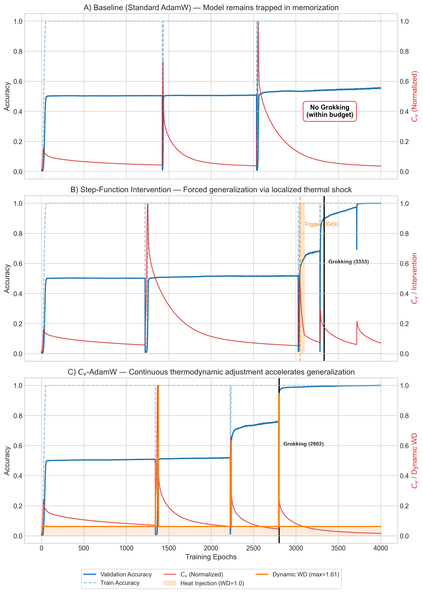
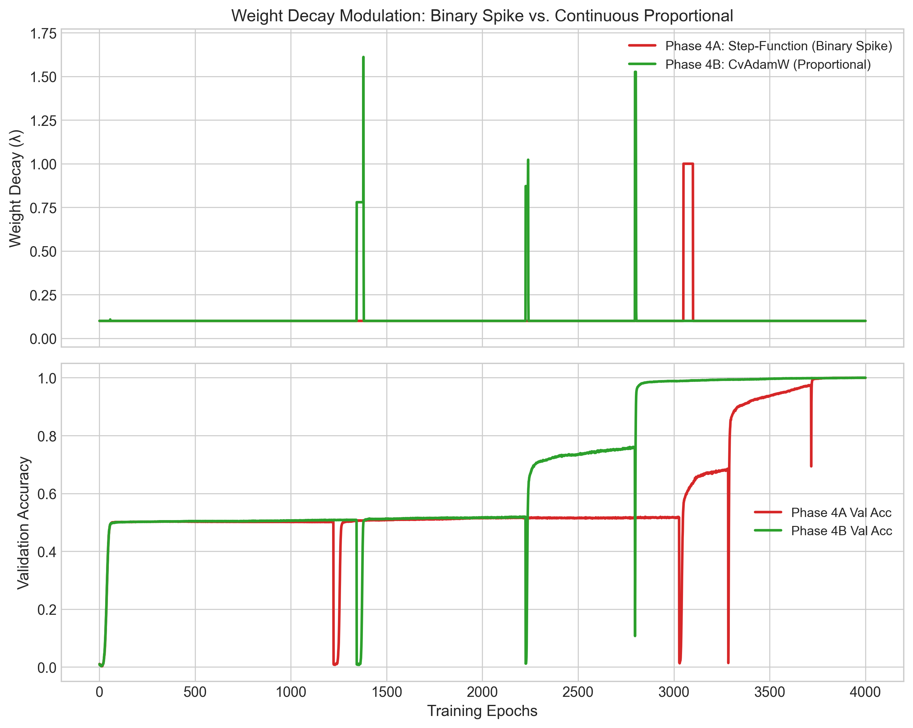
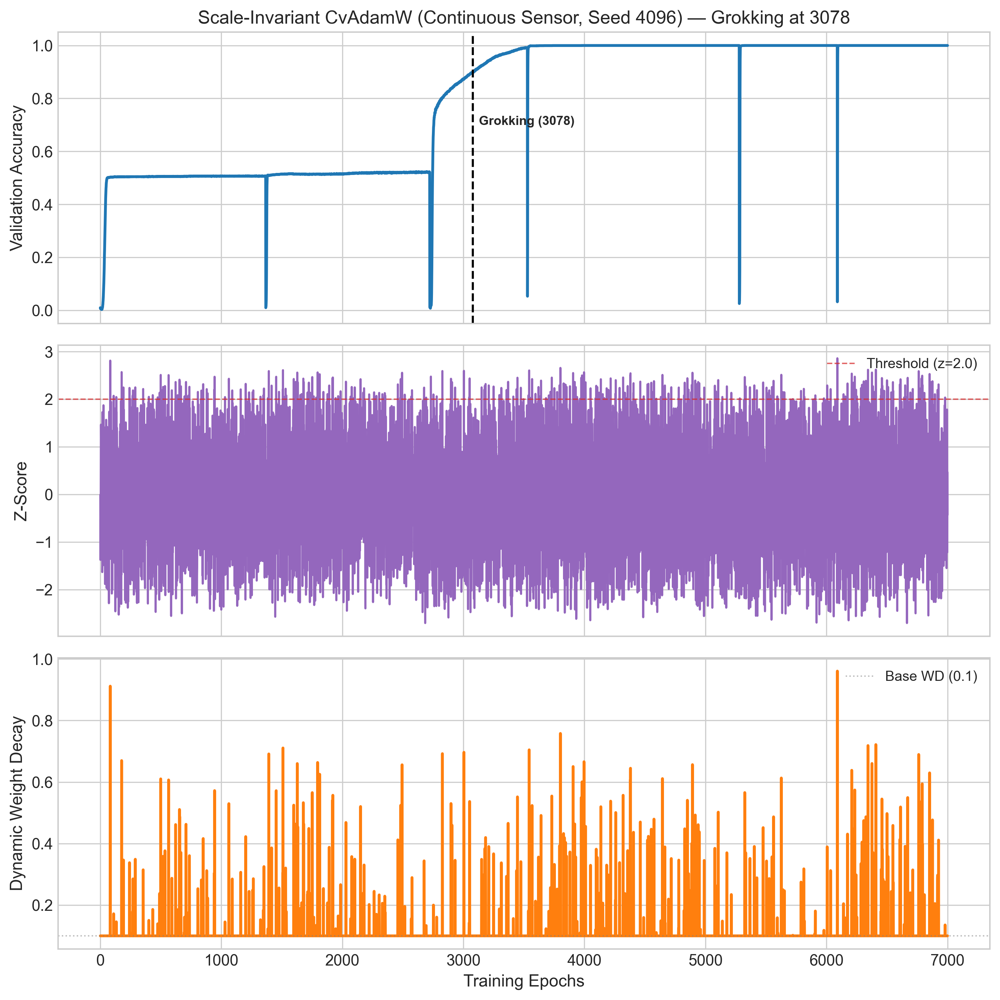

# Pandey 2026 — Thermodynamic Weight Decay: Exploring Grokking Acceleration via Attention Specific Heat

См. также: [глобальный индекс понятий](../../concepts/index.md).

**Chitraansh Pandey** (независимый исследователь; chitraanshpandey@gmail.com).

arXiv [2607.20552](https://arxiv.org/abs/2607.20552), июль 2026 (v1), 9 страниц, 4 составных рисунка (5 файлов), 2 таблицы. Всего цитирований по Semantic Scholar — 0, в картотеке — 0. Одноавторская работа: гроккинг взят как термодинамический фазовый переход (изоморфизм внимания и канонического ансамбля заимствован у Kim), «теплоёмкость» внимания $C_{v}=\mathrm{Var}(QK^{\top}/\sqrt{d_{k}})$ — как наблюдаемая, расходящаяся на переходе, а weight decay — как «подача тепла» ($T_{\mathrm{eff}}\propto\sqrt{d_{k}}/\lVert W\rVert^{2}$). Изделие — CvAdamW: AdamW с динамическим $\lambda_{t}$, растущим пропорционально сглаженному приросту $C_{v}$, за воротами памяти train_acc $\geq 0.99$; плюс масштабно-инвариантная z-версия. На $(a+b)\bmod 97$ пик $C_{v}$ предшествует гроккингу в 10/10 семенах (среднее опережение 2400 эпох), холодный старт сокращает задержку в среднем на 257 эпох (6.0%; Уилкоксон $p=0.049$, но $t$-тест и знаковый — нет); честно задокументированы три отказа детектора.

Оригинал и производные файлы этой папки:

- [`original/2607.20552.thermodynamic-weight-decay-exploring-grokking-acceleration-via-attention-specific-heat.md`](original/2607.20552.thermodynamic-weight-decay-exploring-grokking-acceleration-via-attention-specific-heat.md) — конверсия оригинала (arXiv-HTML v1, сверена с PDF) в Markdown без правок содержания.
- [`2607.20552.thermodynamic-weight-decay-exploring-grokking-acceleration-via-attention-specific-heat.claims.txt`](2607.20552.thermodynamic-weight-decay-exploring-grokking-acceleration-via-attention-specific-heat.claims.txt) — пронумерованные утверждения статьи с пометками разбора.
- [`images/`](images/) — 5 файлов рисунков.

Схема якорей и правила ссылок на карточку — в [README папки статей](../README.md).

## Затрагиваемые понятия

**[Гроккинг](../../concepts/grokking.md)** — управленческий замысел: если сеть сама объявляет о приближении границы фаз, поймать сигнал онлайн и подать ровно недостающую энергию; заглавная демонстрация — под бюджетом 4000 эпох базовая линия «никогда не гроккает», ступенчатое вмешательство гроккает на 3333, CvAdamW — на 2802, то есть вклад подан как «включение» генерализации, не только ускорение ([`p4-2`](#p4-2)). Разбор: «базовая линия никогда не гроккает» — свойство срезанного бюджета и выбранного семени, а не задачи: при 7000 эпохах база гроккает во всех 10 семенах, и три из них укладываются в 4000; парное исследование даёт скромные 6.0% при расходящихся тестах (Уилкоксон и бутстрэп значимы, $t$-тест, знаковый и классический интервал — нет), изложенных честно; ближайший конкурент по назначению — Grokfast с ускорением в разы — не сопоставлен, как и предвестники корпуса (2306.13253, 2606.12966, 2605.20441, 2605.08237).

**[Weight decay](../../concepts/weight-decay.md)** — распад весов как «исполнительный орган» термодинамики: из $T_{\mathrm{eff}}\propto\sqrt{d_{k}}/\lVert W\rVert^{2}$ выведено, что рост $\lambda$ уменьшает норму и «буквально нагревает» систему; CvAdamW модулирует только коэффициент регуляризации ($\lambda_{t}=\lambda_{\mathrm{base}}+\kappa\max(0,\mu_{t}-\tau)$ или z-версия с единственным порогом $2.0$), доводя его до 1.5–2.6 в $\kappa/\tau$-версии против 0.8–1.1 в масштабно-инвариантной — измеренный компромисс «сила против универсальности» ([`p7-2`](#p7-2)). Разбор: связка «weight decay нагревает» нигде не измерена — что рост $\lambda$ действительно поднимает $C_{v}$, не проверено, формула приведена без вывода; простейшее объяснение выигрыша в 6% — шумное расписание распада со средним выше базового, и контроля «просто больше weight decay» нет (сами авторы относят его в будущую работу); каждый всплеск $\lambda$ на рис. 3 сопровождается обвалом валидации почти до нуля и скачком вверх — механизм похож на встряску со сбросом, а не на подачу тепла, и статья этого не обсуждает.

**[Эффект рогатки / слингшот](../../concepts/slingshot.md)** — слингшот как причина отказа дискретных триггеров: при крупной перестройке цепей train_acc транзиентно проваливается ниже 0.99, ворота памяти закрываются ровно на пике $C_{v}$, и одноразовый триггер слепнет; непрерывный пропорциональный отклик успевает накопить импульс до закрытия ворот — «тепло подаётся, пока гора растёт, а не после» ([`p3-7`](#p3-7)). Разбор: это единственная цитата статьи, работающая по существу (slingshot 2206.04817), и содержательный вклад — принцип непрерывности как защита от временны́х ошибок, фатальных для одноразовых вмешательств; два других отказа (все триггеры на эпохе 16 от шума инициализации; срабатывание на эпохе 240 от батч-ряби) тоже честно задокументированы с устраняющими элементами (ворота памяти, EMA-амортизатор с окном 10 эпох).

**[Фазовый переход](../../concepts/phase-transition.md)** — $C_{v}$ как предвестник: на невозмущённой базовой траектории пик сглаженной теплоёмкости после памяти предшествует гроккингу в 10/10 семенах (среднее опережение 2400 эпох, медиана 2396), но момент пика не коррелирует с эпохой гроккинга (Пирсон $r=-0.099$, $p=0.79$) — сами авторы называют сигнал качественным, не количественным предвестником ([`p6-1`](#p6-1)). Разбор: опережение 2400 эпох при среднем гроккинге на 4313 — больше половины прогона, такой «предвестник» размечает всю полку, а не близость события; признаков расходимости (масштабирование с размером, критические показатели) не проверялось — есть лишь подъём и максимум; на левой панели рис. 4 z-оценка все 7000 эпох — сплошной шум, пересекающий порог сотни раз, без выделенной особенности у эпохи гроккинга — подпись «более резкая аномалия» рисунком не подтверждается; полка названа случайным уровнем, но держится на 0.50 при 97 классах (~0.01) — след коммутативности $(a+b)$ при парном разбиении; вся физика держится на одном препринте Kim, независимо не проверенном.

## Что показано, а что предположено

Замечания редактора карточки по итогам разбора утверждений (`…claims.txt`, 45 пунктов).

**Ценное — честность отчёта в жанре «наш оптимизатор лучше».** Три отказа детектора изложены как вклад (шум инициализации, микрорябь, ослепление слингшотом — каждый мотивирует элемент дизайна); расхождение статистических тестов подано прозрачно без отбора выгодного; парность по семенам соблюдена, разности по семенам опубликованы; ограничения (одна задача, нет сравнения с другими прогресс-мерами, малое $n$) названы прямо; принцип «непрерывный пропорциональный отклик устойчив к временны́м ошибкам» — переносимый урок.

**Физика заимствована и не проверена, контроль отсутствует, второй вариант хуже базы.** Изоморфизм и формула температуры взяты у одного препринта без независимой проверки; «нагрев» weight decay'ем не измерен; z-детектор на рисунке не детектирует ничего (шум с сотнями пересечений порога), и выигрыш неотличим от «шумного расписания распада со средним выше базового»; непрерывный датчик — второй из двух вариантов — в среднем хуже базовой линии (4333 против 4313), что подано как «холодный старт парадоксально сильнее»; результаты заявленной $\kappa/\tau$-серии на 5 семенах нигде не приведены; как считается $C_{v}$ (головы, слои, батч) — не сказано; «плавный» отклик на рис. 3 — три узких всплеска шириной со ступенчатый.

**Как работу будут цитировать** («теплоёмкость внимания предсказывает гроккинг и ускоряет его») — точнее: на одной задаче пик $C_{v}$ действительно предшествует гроккингу во всех 10 семенах, но с моментом гроккинга не связан; ускорение — 6% со значимостью лишь по части тестов; один из двух вариантов метода хуже базовой линии, а контроля «просто больше weight decay» нет.

---

# Текст статьи

## Термодинамический weight decay: разведка ускорения гроккинга через теплоёмкость внимания

Chitraansh Pandey

Независимый исследователь

chitraanshpandey@gmail.com

github.com/baymaxbyte/cbo_core

## Аннотация

Гроккинг — отложенная генерализация нейронных сетей долго после запоминания обучающих данных — тратит тысячи обучающих эпох и печально непредсказуем. Строя на недавнем результате, что трансформерное внимание формально изоморфно термодинамической системе, мы трактуем дисперсию логитов внимания как *теплоёмкость* $C_{v}$ и показываем, что её пик надёжно предшествует переходу генерализации. Мы вводим **CvAdamW** — вставной вариант AdamW, отслеживающий $C_{v}$ онлайн и впрыскивающий «тепловую энергию» динамическим масштабированием weight decay при обнаружении фазового перехода. Через строго итеративный процесс разработки мы определяем три режима отказа — шум инициализации, микрорябь мини-батчей и «ослепление слингшотом» — и разрешаем их воротами запоминания и экспоненциально-скользящим амортизатором. На модульной арифметике $(a+b\bmod 97)$ CvAdamW включает гроккинг на эпохе 2802 в бюджете 4000 эпох, где базовая линия не гроккает никогда. Мы далее предлагаем *масштабно-инвариантную* переформулировку через $z$-оценку, убирающую задаче-специфичные гиперпараметры, и оцениваем её на 10 парных семенах. Парный анализ показывает, что вариант с холодным стартом сокращает среднюю задержку гроккинга на 257 эпох ($6.0\%$; медиана $166$ эпох; Уилкоксон $p=0.049$, Коэна $d=0.68$, бутстрэп $95\%$ ДИ $[53,489]$), улучшая 8 из 10 семян; на этой одной задаче $C_{v}$ достигает пика до гроккинга во всех 10 семенах. Наши результаты указывают, что нейронные сети могут выставлять обнаружимые предвестники надвигающихся переходов генерализации, и что физически мотивированное, пропорциональное вмешательство может способствовать генерализации в фиксированном вычислительном бюджете. Код и данные публичны.

## 1 Введение

Современные переизбыточно параметризованные сети часто являют *гроккинг* [5]: обучающая точность насыщается за десятки эпох, тогда как валидационная остаётся на случайном уровне сотни или тысячи эпох, а затем резко прыгает к почти идеальной. Промежуточная полка вычислительно расточительна и, хуже того, её длительность трудно предсказать заранее. Практик не может легко сказать, вот-вот ли модель обобщит или застряла навсегда.

Недавняя теория предлагает поразительное переистолкование этого явления. Kim [1] доказывает, что механизм внимания формально изоморфен каноническому термодинамическому ансамблю: softmax — распределение Больцмана, минимизирующее свободную энергию Гельмгольца, масштабный множитель $1/\sqrt{d_{k}}$ — обратная температура, логиты внимания $QK^{\top}$ — уровни энергии, и — критически — *дисперсия* этих логитов ведёт себя как *теплоёмкость*. В статистической механике теплоёмкость расходится на фазовых переходах. Если гроккинг — фазовый переход, сеть должна объявить о нём всплеском этой наблюдаемой.

Мы принимаем это предсказание буквально и задаём управленчески-теоретический вопрос: *если сеть сигнализирует собственную границу фаз, можно ли обнаружить этот сигнал онлайн и подать ровно ту энергию, которая нужна для пересечения?* **[p. 2]** Физический исполнительный орган — weight decay. Поскольку действенная температура системы внимания масштабируется как $T_{\mathrm{eff}}\propto\sqrt{d_{k}}/\lVert W\rVert^{2}$, увеличение weight decay ужимает норму параметров и *нагревает* систему. Наш вклад — оптимизатор, замыкающий эту петлю.

#### Вклады.

- Мы показываем эмпирически, что на модульной арифметике теплоёмкость внимания $C_{v}=\mathrm{Var}(QK^{\top}/\sqrt{d_{k}})$ достигает пика до гроккинга в каждом проверенном семени (Раздел 6.1).
- Мы вводим **CvAdamW** — термодинамически-осведомлённый оптимизатор, масштабирующий weight decay пропорционально сглаженному импульсу $C_{v}$ (Раздел 3), и документируем три режима отказа с их исправлениями.
- Мы предлагаем *масштабно-инвариантную* формулировку через $z$-оценку, устраняющую задаче-специфичные пороги (Раздел 4).
- Мы даём парную статистическую оценку на 10 семенах — посемянные результаты, непараметрические тесты, размеры эффекта, бутстрэп-доверительные интервалы, статистику опережения и корреляционный анализ предвестника — вместо точечных оценок (Раздел 6.3).

## 2 Фон

### 2.1 Термодинамический изоморфизм внимания

Для одиночного запроса внимание вычисляет веса над $n$ ключами через

$$
p_{i}=\frac{\exp(z_{i}/\sqrt{d_{k}})}{\sum_{j=1}^{n}\exp(z_{j}/\sqrt{d_{k}})},\qquad z_{i}=(QK^{\top})_{i}. \tag{1}
$$

Это в точности распределение Больцмана $p_{i}=e^{-E_{i}/T}/Z$ с уровнями энергии $E_{i}=-z_{i}$, обратной температурой $\beta=1/\sqrt{d_{k}}$ и статистической суммой $Z=\sum_{j}e^{-E_{j}/T}$ [1]. Под этим отображением теплоёмкость канонического ансамбля, $C_{v}=\mathrm{Var}(E)/T^{2}$, соответствует дисперсии масштабированных логитов внимания. Вслед за Kim [1] мы отождествляем теплоёмкость «информационного газа» внимания с

$$
C_{v}\;=\;\mathrm{Var}\!\left(\frac{QK^{\top}}{\sqrt{d_{k}}}\right). \tag{2}
$$

Термодинамически $C_{v}$ меряет энергию, требуемую для изменения температуры системы, и расходится на фазовом переходе. Наша рабочая гипотеза — что гроккинг есть такой переход, так что $C_{v}$ должна всплескивать, когда модель перестраивает свои внутренние представления от запоминания к генерализации.

### 2.2 Гроккинг и weight decay

Гроккинг впервые охарактеризован на алгоритмических задачах Power et al. [5] и с тех пор связывался с нормой весов и регуляризацией [2, 4]. Распространённый взгляд: запоминание соответствует острому, высококривизненному минимуму, тогда как генерализация живёт в более плоской котловине; побег из первого требует неявного или явного давления на норму параметров. Weight decay [3] — стандартный инструмент. Термодинамическая картина делает это точным: при

$$
T_{\mathrm{eff}}\;\propto\;\frac{\sqrt{d_{k}}}{\lVert W\rVert^{2}}, \tag{3}
$$

увеличение weight decay снижает $\lVert W\rVert$ и потому поднимает $T_{\mathrm{eff}}$. Больше weight decay — буквально больше тепла.

## 3 Метод: CvAdamW

CvAdamW — вставная замена AdamW, вычисляющая *динамический* weight decay $\lambda_{t}$ каждую эпоху как функцию траектории $C_{v}$. Базовый оптимизатор неизменен; модулируется лишь коэффициент регуляризации.

**[p. 3]**

### 3.1 Пропорциональный впрыск тепла (формулировка $\kappa/\tau$)

Пусть $C_{v}(t)$ — теплоёмкость, измеренная на эпохе $t$. Мы отслеживаем сглаженный импульс её скорости экспоненциальным скользящим средним (EMA):

$$
\delta_{t} =C_{v}(t)-C_{v}(t-1), \tag{4}
$$

$$
\mu_{t} =\alpha\,\mu_{t-1}+(1-\alpha)\,\delta_{t}, \tag{5}
$$

$$
\lambda_{t} =\lambda_{\mathrm{base}}+\kappa\cdot\max\!\left(0,\;\mu_{t}-\tau\right). \tag{6}
$$

Здесь $\alpha=0.9$ даёт действенное окно $1/(1-\alpha)=10$ эпох, $\tau$ — шумовой пол, ниже которого колебания игнорируются, а $\kappa$ усиливает устойчивый положительный импульс в единицы weight decay. Когда $C_{v}$ плоска или падает, $\mu_{t}\leq\tau$ и оптимизатор возвращается к стандартному AdamW с $\lambda_{\mathrm{base}}=0.1$. По мере подъёма $C_{v}$ к переходу $\mu_{t}$ растёт, и $\lambda_{t}$ масштабируется пропорционально.

#### Ворота запоминания.

Ничто из вышеописанного не активируется, пока модель не запомнила, что навязано условием $\text{train\_acc}\geq 0.99$. Фазовый переход осмыслен лишь после того, как система достигла метастабильного (запомненного) состояния.

### 3.2 Три режима отказа

###### p3-4

CvAdamW не был получен с одного захода. Каждый элемент дизайна разрешает конкретный, наблюдённый отказ (полные логи в сопутствующем репозитории).

**(1) Шум инициализации.** Без всякого гейтинга все детекторы срабатывали на эпохе 16, принимая хаотичные узоры внимания случайной инициализации за фазовый переход. Впрыск тепла так рано работал *хуже* базы: нельзя вытолкнуть систему из минимума, в который она ещё не вошла. Ворота запоминания это разрешают.

**(2) Микрорябь мини-батчей.** С воротами, но без сглаживания, дискретный кинематический триггер сработал на эпохе 240 на одноэпоховом восходящем всплеске, вызванном шумом батч-выборки. Одноразовое вмешательство было потрачено впустую. EMA с $\alpha=0.9$ поглощает шум 1–2 эпох, пропуская устойчивый, $50$–$200$-эпоховый подъём настоящего перехода (Рисунок 1).

###### p3-7

**(3) Ослепление слингшотом.** Во время крупной структурной перестройки соревнующиеся цепи транзиентно ухудшают обучающую точность — эффект «рогатки» [7]. В одном прогоне большой всплеск $C_{v}$ совпал с падением train_acc ниже $0.99$, закрыв ворота ровно на пике и ослепив дискретный триггер. Непрерывный, пропорциональный оптимизатор это обходит: он уже накопил импульс до закрытия ворот, так что тепловая энергия подаётся, пока гора образуется, а не после того, как она прошла.

Эти отказы мотивируют центральный принцип дизайна — непрерывность. Пропорциональный отклик, следующий величине сигнала, устойчив к временны́м ошибкам, фатальным для одноразового триггера.

*Рисунок 1: Классический гроккинг на $(a+b)\bmod 97$. Обучающая точность насыщается за десятки эпох, тогда как валидационная остаётся на случайном уровне тысячи эпох (закрашено «потраченные вычисления»). Под срезанным бюджетом 4000 эпох базовая линия не гроккает никогда.* **[p. 4]**

## 4 Масштабно-инвариантная переформулировка

Формулировка $\kappa/\tau$ имеет две задаче-специфичные константы: $\tau$ — абсолютная величина, $\kappa$ — размерный переводной множитель. На задаче, где $C_{v}$ занимает другой диапазон, обе требуют перенастройки. Мы убираем их, трактуя скорость $v_{t}=C_{v}(t)-C_{v}(t-1)$ как случайную величину и обнаруживая статистические аномалии. Используя EMA-оценки её бегущих среднего и дисперсии,

$$
\mu_{t} =\beta_{z}\,\mu_{t-1}+(1-\beta_{z})\,v_{t}, \tag{7}
$$

$$
\sigma_{t}^{2} =\beta_{z}\,\sigma_{t-1}^{2}+(1-\beta_{z})\,(v_{t}-\mu_{t-1})(v_{t}-\mu_{t}), \tag{8}
$$

$$
Z_{t} =\frac{v_{t}-\mu_{t}}{\sqrt{\sigma_{t}^{2}}+\epsilon}, \tag{9}
$$

$$
\lambda_{t} =\lambda_{\mathrm{base}}+\max\!\left(0,\;Z_{t}-z_{\mathrm{thresh}}\right). \tag{10}
$$

Единственная свободная константа, $z_{\mathrm{thresh}}=2.0$, — универсальный $2\sigma$-порог аномалии.

#### Холодный старт против непрерывного датчика.

Ворота запоминания создают выбор, когда начинать накапливать статистики. Вариант *холодного старта* запускает $\mu,\sigma^{2}$ лишь после открытия ворот ($\text{train\_acc}\geq 0.99$), **[p. 4]** максимизируя чувствительность к первому послегейтовому сигналу. Вариант *непрерывного датчика* ведёт статистики с эпохи 1 (гейтя только исполнительный орган), давая тёплую базу. Как мы показываем, вариант холодного старта парадоксально сильнее: тёплая база разбавляет относительную аномалию подлинного перехода.

## 5 Экспериментальная постановка

Все эксперименты используют 2-слойный decoder-only трансформер ($d_{\mathrm{model}}=128$, 4 головы, $d_{k}=32$, позиционное кодирование RoPE [6], GELU) на модульном сложении $(a+b)\bmod 97$ — наборе из $97^{2}=9409$ примеров с разбиением обучение/валидация $50/50$. Базовый оптимизатор — AdamW [3] ($\text{lr}=3\times 10^{-4}$, $\lambda_{\mathrm{base}}=0.1$, размер батча 512). Мы сообщаем *эпоху гроккинга*, определённую как первая эпоха, на которой валидационная точность превышает $0.95$. Масштабно-инвариантное исследование использует 10 семян $\{42,123,256,512,1024,2048,3141,4096,7777,9999\}$ на 7000 эпох; исследование $\kappa/\tau$ — 5 семян на 10 000 эпох.

## 6 Результаты

### 6.1 Наблюдённая динамика предвестника Cv

###### p4-2

По каждой конфигурации, что мы пускали на этой задаче, $C_{v}$ являет выраженный пик, предшествующий переходу валидационной точности (квантифицировано в Разделе 6.3). Рисунок 2 противопоставляет три режима под бюджетом 4000 эпох. Базовая линия (A) показывает ясный пик $C_{v}$, но остаётся запертой на случайной точности: сигнал присутствует, но системе не хватает энергии пересечь. Ступенчатое вмешательство (B) впрыскивает фиксированный всплеск weight decay ($0.1\!\to\!1.0$) на обнаруженном пике (эпоха 3049) и гроккает 284 эпохами позже. CvAdamW (C) плавно масштабирует weight decay до пика $1.61$ и гроккает раньше всех, на эпохе 2802. Под этим бюджетом базовая линия не гроккает никогда, так что вклад CvAdamW — не просто ускорение, а *включение* генерализации.

*Рисунок 2: Главное сравнение под бюджетом 4000 эпох (одно семя). **(A)** Базовый AdamW: $C_{v}$ (красная) достигает пика, но валидационная точность (синяя) остаётся на случайном уровне. **(B)** Ступенчатая схема: бинарный всплеск weight decay на обнаруженном пике вынуждает гроккинг. **(C)** CvAdamW: непрерывное, пропорциональное масштабирование weight decay гроккает раньше всех.* **[p. 5]**

*Рисунок 3: Расписания weight decay и получающаяся валидационная точность. Ступенчатая схема (красная) применяет бинарный всплеск с фиксированным остыванием; CvAdamW (зелёная) применяет плавный, пропорциональный отклик, следующий импульсу $C_{v}$. Непрерывное расписание генерализует раньше.* **[p. 6]**

### 6.2 Непрерывное против дискретного вмешательства

Рисунок 3 накладывает два расписания weight decay. Ступенчатая схема хрупка: её одиночный всплеск должен лечь точно на пик и побеждается ослеплением слингшотом. Непрерывное расписание подаёт энергию на всём протяжении перехода и невосприимчиво к одноэпоховым закрытиям ворот, согласно с физической интуицией, что фазовые переходы — протяжённые, а не мгновенные события.

**[p. 5]**

### 6.3 Масштабно-инвариантное парное исследование

Мы оцениваем масштабно-инвариантный вариант холодного старта против базы на 10 парных семенах. Поскольку каждое семя пускается в обоих условиях, мы используем *парный* анализ. Пусть $d_{i}=\text{Baseline}_{i}-\text{ColdStart}_{i}$; положительные значения в пользу нашего метода. Таблица 1 даёт полные посемянные результаты (включая вариант непрерывного датчика), чтобы читатели могли осмотреть дисперсию, выбросы и прочность напрямую; Таблица 2 сводит парные статистики.

*Таблица 1: Посемянная эпоха гроккинга (первая эпоха с валидационной точностью $>0.95$) для базы и двух масштабно-инвариантных вариантов CvAdamW на 7000 эпох. Меньше — лучше.* **[p. 6]**

| Seed | Baseline | Cold-Start | Continuous |
|---|---|---|---|
| 42 | 5301 | 4934 | 5785 |
| 123 | 4971 | 5111 | 4665 |
| 256 | 4843 | 4707 | 4514 |
| 512 | 4218 | 4197 | 4179 |
| 1024 | 4535 | 4655 | 3604 |
| 2048 | 3714 | 2933 | 3969 |
| 3141 | 5078 | 4055 | 5063 |
| 4096 | 2962 | 2767 | 3078 |
| 7777 | 4127 | 3889 | 4925 |
| 9999 | 3381 | 3314 | 3550 |
| Mean | 4313 | 4056 | 4333 |
| Std | 776 | 829 | 817 |

*Таблица 2: Парное статистическое сравнение: базовый AdamW против масштабно-инвариантного холодно-стартового CvAdamW на 10 семенах (7000 эпох). Положительное улучшение означает меньше эпох до гроккинга. Все значения вычислены из выложенных посемянных данных.* **[p. 7]**

| Metric | Result |
|---|---|
| Mean baseline grokking epoch | 4313 |
| Mean cold-start grokking epoch | 4056 |
| Mean improvement | 257 epochs ($6.0\%\pm 8.4\%$) |
| Median improvement | 166 epochs ($4.3\%$) |
| Paired $t$-test (two-tailed) | $t(9)=2.15,\;p=0.060$ |
| Wilcoxon signed-rank (two-sided) | $W=8,\;p=0.049$ |
| rank-biserial $r$ | $0.71$ |
| Cliff’s $\delta$ | $0.22$ |
| Cohen’s $d$ (paired) | $0.68$ (medium) |
| Wins (cold-start better) | $8/10$ |
| Sign test (two-sided) | $p=0.109$ |
| Bootstrap $95\%$ CI ($10^{4}$ resamples) | $[53,\;489]$ epochs |
| Classical $95\%$ CI | $[-13,\;527]$ epochs |

###### p5-2

Вариант холодного старта улучшает 8 из 10 семян со средним сокращением 257 эпох ($6.0\%$) и медианой 166 эпох ($4.3\%$). Свидетельство наводяще, но смешанно при $n=10$: двусторонний знаково-ранговый тест Уилкоксона значим ($p=0.049$, ранг-бисериальная $r=0.71$) и бутстрэп-$95\%$ **[p. 6]** доверительный интервал среднего улучшения исключает нуль ($[53,489]$), тогда как двусторонний парный $t$-тест ($p=0.060$), знаковый тест ($p=0.109$) и классический доверительный интервал ($[-13,527]$) значимости не достигают. Размер эффекта средний (Коэна $d=0.68$; Клиффа $\delta=0.22$). Мы сообщаем расхождение тестов прозрачно, а не отбираем самый выгодный. Две регрессии (семена 123 и 1024) малы ($-140$ и $-120$ эпох) относительно крупнейших выигрышей (семена 2048 и 3141: $+781$ и $+1023$ эпох).

#### $C_{v}$ — предвестник

###### p6-1

Как предсказано Kim [1], $C_{v}$ действует как предвестник и заодно служит предпосылкой нашего метода. На невозмущённой базовой траектории мы находим, для каждого семени, эпоху пика EMA-сглаженной $C_{v}$ после запоминания (train_acc $\geq 0.99$) и сравниваем её с эпохой гроккинга. Согласно с Kim [1], мы наблюдаем, что $C_{v}$ достигает пика до гроккинга **[p. 7]** по всем семенам (10/10; среднее опережение $2400$ эпох, std $974$, медиана $2396$). Эта репликация и мотивирует использование $C_{v}$ как управляющего сигнала для адаптивного вмешательства.

Важно: хотя пик $C_{v}$ последовательно предшествует гроккингу, его момент не сильно коррелирует с итоговой эпохой гроккинга (Пирсон $r=-0.099$, $p=0.79$; Спирмен $r=0.055$, $p=0.88$). Это подсказывает, что $C_{v}$ действует как *качественный* сигнал-предвестник, а не *количественный* предсказатель оставшегося времени обучения — достаточный, чтобы запустить вмешательство, но не для прогноза, *когда* генерализация произойдёт, сам по себе.

*Рисунок 4: Масштабно-инвариантный CvAdamW на семени 4096. **Слева:** ворота холодного старта, гроккинг на эпохе 2767. **Справа:** непрерывный датчик, гроккинг на эпохе 3078. Каждая панель показывает валидационную точность, бегущую $z$-оценку и динамический weight decay. Вариант холодного старта производит более резкую аномалию и гроккает раньше.* **[p. 7]**

### 6.4 Компромисс силы и универсальности

###### p7-2

Масштабно-инвариантная формулировка достигает максимального динамического weight decay лишь $0.8$–$1.1$ против $1.5$–$2.6$ у версии $\kappa/\tau$. Поскольку $Z_{t}$ редко превышает $3.0$, добавочный weight decay ограничен близ $1.0$. Усиление $\kappa=5.0$ исходной формулировки подаёт более сильные тепловые удары и действеннее на этой глубокой границе фаз, но требует перенастройки на задачу. **[p. 8]** Рисунок 4 показывает варианты холодного старта и непрерывного датчика на общем семени: аномалия холодного старта резче, и он гроккает раньше, соответствуя статистике Таблицы 2.

## 7 Обсуждение

Наши эксперименты поддерживают три вывода. Во-первых, мы воспроизводим — на этой задаче — предсказание Kim [1], что $C_{v}$ достигает пика до границы фаз (10/10 семян), давая эмпирическую поддержку одному следствию термодинамического истолкования, а не полному изоморфизму. Эта репликация утверждает $C_{v}$ как пригодный управляющий сигнал; однако, поскольку момент его пика не коррелирует с эпохой гроккинга, мы трактуем его как качественный предвестник, способный *запустить* вмешательство, а не количественный прогнозист оставшегося времени. Во-вторых, эксплуатация сигнала требует осторожности — сырой $C_{v}$ слишком шумен для дискретных триггеров, запоминание должно завершиться до того, как вмешательство осмысленно, и непрерывный отклик существенен для выживания под динамикой слингшота. В-третьих, главная ценность метода — *надёжность*: когда гроккинг возможен, но медлен, CvAdamW предлагает скромное ускорение, но когда база не может грокнуть в вычислительном бюджете, CvAdamW это облегчает.

#### Отрицательные результаты и уроки дизайна.

Мы подчёркиваем режимы отказа как самостоятельный вклад. Три последовательные формулировки детектора провалились — первая срабатывала на шуме инициализации (все триггеры на эпохе 16), вторая на батч-наведённой одноэпоховой микроряби, а дискретные триггеры побеждались динамикой слингшота, закрывающей ворота запоминания ровно на пике $C_{v}$. Каждый отрицательный результат прямо мотивировал элемент дизайна (ворота запоминания, EMA-амортизатор и непрерывное пропорциональное масштабирование). Отчёт об этих отказах призван сберечь другим те же итерации и обосновать, почему финальный дизайн принимает такую форму.

#### Ограничения.

Мы флагуем несколько ограничений явно. *(1) Одна задача.* Все результаты — на модульной арифметике $(a+b)\bmod 97$ с малым 2-слойным трансформером, где гроккинг необычайно чист; мы не заявляем общности на другие задачи или архитектуры. *(2) Нет свидетельств на языковых и зрительных моделях.* Мы не проверяли GPT-подобные языковые модели или Vision Transformers, где эмерджентность более постепенна и предвестник может быть труднее обнаружим. *(3) Нет свидетельств уникального превосходства $C_{v}$.* Мы не сравнивали $C_{v}$ лоб-в-лоб с другими мерами прогресса (энтропия внимания, норма весов, норма градиента, производная потери); потому не можем заявить, что это лучший доступный сигнал — лишь что пригодный. *(4) Ограниченная статистическая мощность.* При $n=10$ семенах тесты расходятся на границе (Уилкоксон и бутстрэп значимы; $t$-тест и знаковый нет), и эпоха пика $C_{v}$ не предсказывает линейно эпоху гроккинга (Раздел 6.3). *(5) Переносимость порога.* Масштабно-инвариантный порог $z_{\mathrm{thresh}}=2.0$, хотя задаче-агностичен по построению, может всё же требовать адаптации на очень других задачах.

#### Будущая работа.

Самый важный следующий эксперимент — сравнение $C_{v}$ лоб-в-лоб с другими мерами прогресса (энтропией внимания, нормой весов, нормой градиента и производной обучающей потери), чтобы установить, уникально ли полезен $C_{v}$. Дальнейшие приоритеты — широта (другие модульные операции вроде $a\times b$ и $a-b\bmod p$ и другие модули $p\in\{53,67,113\}$), покомпонентные абляции и контроли расписаний weight decay, разделяющие «сигнал важен» и «больше weight decay помогает». Естественный алгоритмический шаг — гибрид, использующий $z$-оценочное обнаружение (универсальный триггер *когда* действовать) вместе с $\kappa$-усилением (сильный отклик *как сильно* толкать). За пределами weight decay тот же сигнал $C_{v}$ мог бы модулировать шум скорости обучения, обрезку градиента или dropout. Наконец, масштабирование к GPT-подобным языковым моделям и Vision Transformers проверит, остаётся ли предвестник действенным там, где гроккинг труднее наблюдать.

## 8 Заключение

Мы переописываем гроккинг как термодинамический фазовый переход, для которого теплоёмкость логитов внимания может действовать как обнаружимый предвестник. CvAdamW слушает этот сигнал и подаёт пропорциональную тепловую энергию через динамический weight decay, что на модульной арифметике включает генерализацию в фиксированном вычислительном бюджете, где база не гроккает никогда. Масштабно-инвариантный $z$-оценочный вариант убирает задаче-специфичную настройку и даёт скромное, статистически наводящее улучшение по семенам (значимое под тестом Уилкоксона и бутстрэп-интервалом, хотя не под всеми тестами при $n=10$). На этой задаче нейронные сети, по-видимому, выставляют предвестники надвигающейся генерализации; обобщается ли **[p. 9]** сигнал за модульную арифметику, и уникально ли он информативен среди мер прогресса, — открытые вопросы, к которым мы надеемся обратиться дальше.

## References

- [1] G. Kim Thermodynamic isomorphism of transformers: a lagrangian approach to attention dynamics. arXiv preprint arXiv:2602.08216. Cited by: §1, §2.1, §6.3, §7.

- [2] Z. Liu, E. J. Michaud, and M. Tegmark Omnigrok: grokking beyond algorithmic data. In International Conference on Learning Representations (ICLR), Cited by: §2.2.

- [3] I. Loshchilov and F. Hutter Decoupled weight decay regularization. In International Conference on Learning Representations (ICLR), Cited by: §2.2, §5.

- [4] N. Nanda, L. Chan, T. Lieberum, J. Smith, and J. Steinhardt Progress measures for grokking via mechanistic interpretability. In International Conference on Learning Representations (ICLR), Cited by: §2.2.

- [5] A. Power, Y. Burda, H. Edwards, I. Babuschkin, and V. Misra Grokking: generalization beyond overfitting on small algorithmic datasets. In ICLR MATH-AI Workshop, Cited by: §1, §2.2.

- [6] J. Su, Y. Lu, S. Pan, A. Murtadha, B. Wen, and Y. Liu RoFormer: enhanced transformer with rotary position embedding. arXiv preprint arXiv:2104.09864. Cited by: §5.

- [7] V. Thilak, E. Littwin, S. Zhai, O. Saremi, R. Paiss, and J. Susskind The slingshot mechanism: an empirical study of adaptive optimizers and the grokking phenomenon. arXiv preprint arXiv:2206.04817. Cited by: §3.2.

---

## Машиночитаемый блок
