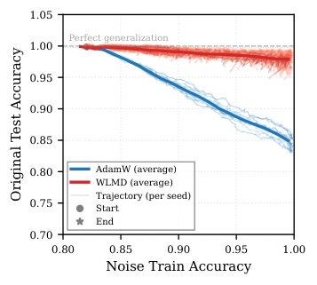
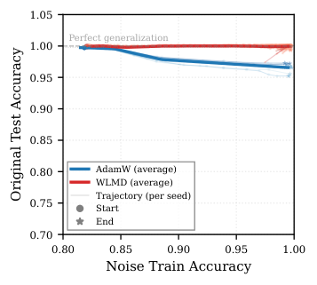

# Zhang, Chan, Shang, Zhang, Yang 2026 — The Grokked Illusion: True Equilibrium Mitigates Catastrophic Forgetting

См. также: [глобальный индекс понятий](../../concepts/index.md).

**Xiaotian Zhang**, **Lai Shun Chan**, **Yue Shang**, **Ge Zhang** (City University of Hong Kong; University of Pennsylvania), **Entao Yang** (Innovation Campus Delaware, Air Liquide).

arXiv [2607.29503](https://arxiv.org/abs/2607.29503), июль 2026 (v1), 9 страниц, 1 составной рисунок (4 файла), 1 таблица. Всего цитирований по Semantic Scholar — 0, в картотеке — 0. Предмет — переносится ли «преимущество высокой энтропии» с обобщаемости на устойчивость: две сети с одинаковой нормой весов ($\|w\|=30$, зона Златовласки) и одинаковой 100% тестовой точностью на $x+y\bmod 67$ — одна обучена AdamW, другая выбрана молекулярной динамикой Wang–Landau как максимально-энтропийное равновесие — доучиваются запоминать 500 новых шумных примеров при сохранении исходных данных в обучении. AdamW-сеть падает со 100% до ~75% тестовой точности на исходной задаче, равновесная держит ~95% («grokked illusion» — иллюзия грокнутости); разрыв монотонно сужается по мере структурного сближения шума с исходной задачей. Устройство преимущества объяснено эффективным рангом: у равновесной сети он много выше в матрицах внимания и MLP до и после впрыска ($W_{Q}$: 96.8 против 2.2), служа запасом представления.

Оригинал и производные файлы этой папки:

- [`original/2607.29503.the-grokked-illusion-true-equilibrium-mitigates-catastrophic-forgetting.md`](original/2607.29503.the-grokked-illusion-true-equilibrium-mitigates-catastrophic-forgetting.md) — конверсия оригинала (arXiv-HTML v1, сверена с PDF) в Markdown без правок содержания.
- [`2607.29503.the-grokked-illusion-true-equilibrium-mitigates-catastrophic-forgetting.claims.txt`](2607.29503.the-grokked-illusion-true-equilibrium-mitigates-catastrophic-forgetting.claims.txt) — пронумерованные утверждения статьи с пометками разбора.
- [`images/`](images/) — 4 файла рисунков.

Схема якорей и правила ссылок на карточку — в [README папки статей](../README.md).

## Затрагиваемые понятия

**[Катастрофическое забывание](../../concepts/catastrophic-forgetting.md)** — новая постановка опыта: сеть, уже освоившая задачу, обязана дополнительно **полностью** запомнить 500 новых шумных примеров (порог 99.8% обучающей точности на смеси), причём исходные обучающие данные остаются в обучении и подгоняются на 100%; при равном «объёме выученного» AdamW теряет четверть тестовой точности (100% → ~75% на случайном шуме), а равновесная сеть держит ~95%, и разрыв сужается по лестнице структурной близости ($x^{2}+y\bmod 37$: 84% против >98%; $x+y\bmod 37$: 97% против ~100%) ([`p3-10`](#p3-10)). Разбор: «катастрофическое забывание» здесь натянуто — рушится обобщение при сохранной подгонке обучающих данных, а не память об обучающей выборке (авторы это подчёркивают, но термин не меняют); не сказано, держится ли ограничение $\|w\|=30$ во время впрыска — если нет, сравниваются уже не состояния при равной норме; сама постановка (впрыск шума при сохранении исходных данных) — готовая проверка качества решения, независимая от способа его получения, и это ценнейшее в работе.

**[Эффективная теория и статистическая механика](../../concepts/effective-theory-statistical-mechanics.md)** — больцмановская энтропия состояния сети $S=\log V(\mathcal{L}_{\text{train}},\mathcal{A}_{\text{test}})$ как глобальная мера объёма в пространстве параметров: равновесные состояния выбираются молекулярной динамикой Wang–Landau ($1.2\times 10^{8}$ эпох сэмплирования до сходимости гистограммы) на гиперсфере $\|w\|=30$, и заявленное «преимущество высокой энтропии» распространяется с обобщаемости на устойчивость — большой объём бассейна позволяет параметрам сместиться сильно и всё же остаться в той же высокоэнтропийной области ([`p2-4`](#p2-4)). Разбор: связка «больший объём → смещение остаётся внутри → сохранение работы» объявлена гипотезой введения, и объём после впрыска не измеряется — вмешательства, проверяющего её, нет; затраты несопоставимы ($1.2\times 10^{8}$ эпох WLMD против 120 эпох AdamW), и вопрос «что даст обычное обучение при равных вычислительных затратах» не ставится; опорная работа о преимуществе высокой энтропии — того же коллектива, как и предшественник 2505.11411, так что ключевая опора остаётся самоцитированием.

**[Спектральный анализ](../../concepts/spectral-analysis-svd-esd-fve.md)** — эффективный ранг (экспонента энтропии нормированного спектра сингулярных чисел, Roy & Vetterli) как объяснение устойчивости: у равновесной сети он до впрыска много выше во всех четырёх матрицах внимания и обоих слоях MLP ($W_{Q}$ 96.8 против 2.2, $W_{K}$ 97.4 против 7.2, $W_{\text{in}}$ 116.1 против 48.1), после впрыска падает у обеих — причём **абсолютно сильнее** у равновесной, — но остаточный уровень всё равно выше, что и подано как «запас представления», поглощающий новые данные ([`p4-2`](#p4-2)). Разбор: исключения оговорены честно — у unembedding уровни до впрыска близки, а после у равновесной **ниже**, у вложений преимущества почти нет; связь ER с устойчивостью остаётся соотносительной (признано, вмешательства отнесены к будущей работе); линия корпуса противоположна по знаку — в 2310.05918 и 2604.13123 та же величина мерит продвижение к обобщению и благом считается её **падение**, здесь благом объявлен **высокий** уровень, и прямого спора в тексте нет.

**[Гроккинг](../../concepts/grokking.md)** — «иллюзия грокнутости»: решения с одинаковой насыщенной тестовой точностью на задаче, где гроккинг обычно наблюдается, различаются по хрупкости, и по тестовым метрикам это различие невидимо — совершенная генерализация не влечёт равной устойчивости ([`p2-2`](#p2-2)). Разбор: сам гроккинг как отложенная генерализация в работе не измеряется вовсе — нет ни одной кривой тестовой точности по эпохам до впрыска и ни одного признака задержки; понятие по ходу переопределено («solutions appear to grok (saturated test performance)») вопреки Power et al., на которых работа ссылается; сравниваемая AdamW-сеть получена под закреплённой нормой за 120 эпох, а по Omnigrok именно попадание в зону Златовласки снимает задержку — «грокнутость» этого состояния не показана, оно названо грокнутым по итоговой точности, и следствие Omnigrok не обсуждается ни разу.

## Что показано, а что предположено

Замечания редактора карточки по итогам разбора утверждений (`…claims.txt`, 45 пунктов).

**Ценное — постановка, различающая неразличимое по тесту.** Впрыск шума при сохранении исходных данных в обучении разводит два решения, тождественных по норме весов и тестовой точности, — готовая проверка «качества» решения, не зависящая от способа его получения; лестница структурной близости шума даёт монотонность, а не единичный контраст; косинусная близость параметров вскрывает противоход — равновесная сеть смещается в пространстве параметров сильнее ($W_{Q}$: 0.8383 против 0.9964), а забывает меньше; исключения по слоям (unembedding, вложения) не спрятаны.

**Приложения нет, сети по одной, числа расходятся.** Приложение обещано четырежды (полные спектры, результаты AdamW-standard и AdamW-full, оборудование, гиперпараметры), но в v1 отсутствует — две из четырёх заявленных постановок не показаны нигде; сравниваются по одной предобученной сети каждого вида (десять семян меняют только впрыск, разброса по обученным сетям и повторов сэмплирования нет); «примерно 95%» в аннотации против «approximately 98%» во введении для того же условия; «similar training loss» при $\ln\mathcal{L}\approx-1$ против $\approx-2$ (втрое); утверждение о косинусной близости («выше у AdamW») опровергается собственной таблицей в трёх группах параметров из девяти; арифметика словаря не сходится (индексы 68…104 — это 37 позиций при названных 38 символах).

**Как работу будут цитировать** («доказано, что грокнувшие модели хрупки») — точнее: на одном модульном сложении, при одной паре сетей и трёх видах шума показано, что состояние, выбранное по максимуму энтропии, теряет меньше тестовой точности, чем состояние AdamW при равной норме весов; раздел о следствиях для больших языковых моделей опирается на шесть ссылок про агентные эталоны при единственной проверенной модульной задаче, и авторская оговорка «remains to be tested at LLM scale» потеряется при цитировании первой.

---

# Текст статьи

## Иллюзия грокнутости: истинное равновесие смягчает катастрофическое забывание

Xiaotian Zhang$^{1}$, Lai Shun Chan$^{1}$, Yue Shang$^{1,2}$, Ge Zhang$^{1*}$, Entao Yang$^{3*}$

$^{1}$Department of Physics, City University of Hong Kong, Hong Kong, China
$^{2}$Department of Physics and Astronomy, University of Pennsylvania, Philadelphia, PA, USA
$^{3}$Innovation Campus Delaware, Air Liquide, Newark, DE, USA
gzhang37@cityu.edu.hk, entao.yang@airliquide.com

$^{*}$Автор для переписки.

## Аннотация

Хотя нейронные сети обычно оцениваются их обучающим и тестовым качеством, эти меры не выявляют, насколько устойчиво выученное представление. Недавние исследования показали, что решения, занимающие бо́льшие объёмы в пространстве параметров (в количественной мере больцмановской энтропии), часто являют превосходящую обобщаемость по сравнению с достигаемыми обычной оптимизацией, — явление, известное как *преимущество высокой энтропии*. Здесь мы спрашиваем, сохраняется ли это преимущество за пределами обобщения. Конкретно, мы исследуем устойчивость моделей — способность удерживать выученное знание, когда модель затем обучают приобрести новую информацию. Используя гроккинг в модульной арифметике как контролируемую постановку, мы конструируем эксперимент с впрыском шума, чтобы оценить различие устойчивости между трансформерами, обученными AdamW, и высокоэнтропийными моделями, выбранными молекулярной динамикой Wang–Landau с тождественным насыщенным качеством. Заставляя обе модели полностью запомнить новые данные со случайными метками, мы находим, что обученные AdamW модели страдают катастрофическим забыванием — тестовая точность на исходной задаче падает со 100% до менее 75%, — тогда как высокоэнтропийные модели удерживают примерно 95% тестовой точности. Мы называем эту скрытую хрупкость за видимым обобщением «иллюзией грокнутости». Через сингулярное разложение весов нейронной сети мы обнаруживаем, что высокоэнтропийные нейронные сети обладают значимо более высоким эффективным рангом в слоях внимания и MLP и до, и после впрыска шума, указывая, что более богатые представления признаков могут служить буфером против катастрофического забывания. Наши находки демонстрируют, что совершенное обобщение не влечёт равной устойчивости, предлагая новый взгляд на то, что делает обученную модель устойчивой к помехам.

## Введение

Качество обобщения давно служит ключевой мерой оценки моделей машинного обучения, отражая способность нейронных сетей (НС) выучивать знание и применять его к неизвестным данным. И всё же модель, обобщающая совершенно на тестовое множество, может оставаться хрупкой: обновления параметров, вызванные запоминанием новых входных данных, могут привести к катастрофическому обвалу ранее приобретённого знания. Этот разрыв между обобщением и устойчивостью наблюдался в широком спектре постановок — от состязательных примеров (Goodfellow, Shlens, and Szegedy 2015) до катастрофического забывания в непрерывном обучении (McCloskey and Cohen 1989), — и он поднимает основополагающий вопрос: какие свойства НС определяют не только её обобщаемость, но и её устойчивость к помехам?

Современные НС часто имеют большое число параметров, позволяющее им совершенно подгонять конечные обучающие данные и даже случайный шум (Zhang et al. 2017). Одно магистральное направление исследований пытается охарактеризовать состояния НС через геометрическую структуру пространства параметров. Классическая догадка в этом направлении — что более плоские минимумы ландшафта потерь соответствуют большей обобщаемости (Hochreiter and Schmidhuber 1997). Однако из-за высокой размерности ландшафта локальные меры плоскости, такие как максимальное собственное значение матрицы Гессе, обычно трудно вычислить, и они не могут выразить полную картину ландшафта потерь (Ghorbani, Krishnan, and Xiao 2019; Dinh et al. 2017). Хуже того, величины остроты, вычисленные из гессиана, можно произвольно перекроить простым перемасштабированием весов без влияния на качество обобщения НС (Dinh et al. 2017). Недавнее исследование ввело больцмановскую энтропию состояния НС как глобальную меру объёма в пространстве параметров, соответствующего данной обучающей потере и тестовому качеству (Yang et al. 2026b). Их работа выявляет преимущество высокой энтропии: высокоэнтропийные состояния, занимающие больший объём в пространстве параметров, являют превосходящую обобщаемость по сравнению с обычно обученными решениями. Это наблюдение естественно ведёт к гипотезе об устойчивости: если высокоэнтропийное решение обитает в большем бассейне пространства параметров, то при смещении его параметров внешними возмущениями получающееся состояние с большей вероятностью останется в той же высокоэнтропийной области, сохраняя тем самым выученную работоспособность. Иными словами, то же свойство, что даёт преимущество в обобщении, может давать и преимущество в устойчивости.

Чтобы проверить эту гипотезу, контролируя смешивающее действие самого качества обобщения, мы выбираем модульную арифметику (Power et al. 2022) как нашу экспериментальную постановку. В этой задаче и обычно обученные трансформерные модели, и равновесные состояния (состояния с наивысшей энтропией при данной обучающей потере) могут достигать тождественной совершенной тестовой точности (Zhang et al. 2026), позволяя изолировать действие энтропии на устойчивость. Мы конструируем эксперимент с впрыском шума, в котором НС, уже достигшая совершенного обобщения на исходной задаче, должна дополнительно запом**[p. 2]** нить новые шумные данные. Несмотря на продолжающуюся доступность исходных обучающих данных во время впрыска шума, обученные AdamW НС являют тяжёлое падение тестовой точности на исходной задаче со 100% до менее 75% в самом трудном условии. В резком контрасте равновесные НС, выбранные молекулярной динамикой Wang–Landau (WLMD), удерживают примерно 98% тестовой точности на исходной задаче после запоминания тех же шумных данных. Мы называем это явление «иллюзией грокнутости», где решения, кажущиеся грокнувшими (насыщенное тестовое качество) для одной задачи, могут являть разные уровни устойчивости. Через сингулярное разложение (SVD) весов НС мы находим, что равновесные НС обладают значимо более высоким эффективным рангом в слоях внимания и MLP и до, и после впрыска шума, указывая, что более богатые представления признаков служат буфером против катастрофического забывания.

Наши главные вклады трояки:

###### p2-2

1. Мы определяем «иллюзию грокнутости» — явление, при котором НС, достигающие совершенного обобщения обычным обучением, тем не менее страдают катастрофическим забыванием, столкнувшись с новыми шумными входами.
2. Мы демонстрируем преимущество высокой энтропии в устойчивости: высокоэнтропийные состояния удерживают прежнее знание значимо сильнее, чем обычно обученные НС.
3. Мы выявляем сингулярным анализом, что это преимущество устойчивости возникает из более высокого эффективного ранга, связывая статистическую физику пространства параметров с устойчивостью выученных представлений.

## Методология

### Протоколы обучения

Мы принимаем задачу модульной арифметики $(x+y\bmod 67)$ как наш первичный эталон, следуя постановке (Nanda et al. 2023; Zhang et al. 2026). Модель — однослойный трансформер с размером словаря $d_{\text{vocab}}=68$, размерностью вложения $d_{\text{model}}=128$, скрытой размерностью MLP $d_{\text{mlp}}=512$, $d_{\text{head}}=32$ и $4$ головами внимания, что составляет примерно $2.15\times 10^{5}$ параметров — тяжело переизбыточная параметризация относительно размера обучающей выборки в $2244$ примера (примерно половина из $67\times 67$ возможных входных пар).

###### p2-4

Чтобы получить высокоэнтропийное состояние НС, мы применяем метод молекулярной динамики Wang–Landau (WLMD) (Wang and Landau 2001), введённый в прежней работе (Yang et al. 2026b; Zhang et al. 2026). Алгоритм WLMD сэмплирует ландшафт больцмановской энтропии $S(\mathcal{L}_{\text{train}},\mathcal{A}_{\text{test}})=\log V(\mathcal{L}_{\text{train}},\mathcal{A}_{\text{test}})$, где $V$ обозначает объём в пространстве параметров, соответствующий данной обучающей потере $\mathcal{L}_{\text{train}}$ и тестовой точности $\mathcal{A}_{\text{test}}$. Мы ограничиваем сэмплирование конфигурациями с нормой весов $\|w\|=30$, следуя «зоне Златовласки», определённой в (Liu et al. 2022), и использовали метод «энтропийного сдвига» (Zhang et al. 2026), чтобы стеснить сэмплирование диапазоном $\ln(\mathcal{L}_{\text{train}})\in[-20,1]$, что обеспечивает правильную сходимость ландшафта энтропии в интересующем диапазоне низких обучающих потерь. Симуляция идёт $1.2\times 10^{8}$ эпох WLMD, пока не выполнен критерий плоскости гистограммы, указывающий на сходимость ландшафта энтропии. Со сошедшейся равновесной кривой мы выбираем состояние НС, достигающее тестовой точности $=100\%$ при $\ln(\mathcal{L}_{\text{train}})\approx-1$. Мы называем такие состояния *равновесными состояниями* (или высокоэнтропийными состояниями), то есть конфигурациями, максимизирующими энтропию при данной обучающей потере.

Для сравнения мы обучаем НС оптимизатором AdamW при том же ограничении нормы весов $\|w\|=30$. Норма весов навязывается после каждого обновления параметров линейным масштабированием вслед за (Liu, Michaud, and Tegmark 2023): после каждого обновления AdamW мы перемасштабируем все параметры на множитель такой, что получающаяся НС удовлетворяет $\|w\|=30$. Мы используем скорость обучения $1\times 10^{-2}$, weight decay $1.0$ и полнобатчевое обучение на $120$ эпох, производя НС с $\ln(\mathcal{L}_{\text{train}})\approx-2$ и тестовой точностью $100\%$. На протяжении этой статьи мы обозначаем эти два типа НС как *WLMD-равновесные* (WLMD) и *AdamW-goldilocks* (AdamW) соответственно. Обе обучены при тождественных ограничениях нормы весов и достигают совершенной тестовой точности, что позволяет изолировать действие энтропии на устойчивость, контролируя качество обобщения и масштаб весов.

Мы также исследовали устойчивость AdamW, обученного на полном наборе данных (включая тестовые примеры) при том же ограничении нормы весов ($\|w\|=30$), и стандартных обученных AdamW НС; результаты представлены в Приложении. Полные подробности вычислительной инфраструктуры, программных зависимостей и конфигураций гиперпараметров даны в Приложении.

### Протокол впрыска шума

В этой работе мы определяем *устойчивость* как способность НС удерживать ранее выученное знание, когда её параметры затем обновляются, чтобы вместить новую информацию. Мы измеряем устойчивость тестовой точностью НС на исходной задаче после того, как она полностью запомнила впрыснутые шумные данные (то есть достигла $>99.8\%$ обучающей точности на объединённом наборе). Чтобы оценить это свойство, контролируя смешивающее действие качества обобщения, мы конструируем эксперимент с впрыском шума, в котором НС, уже освоившая исходную задачу модульной арифметики, должна дополнительно запомнить новые шумные данные. Мы сначала расширяем размерность словаря обученной НС с $68$ до $136$ дублированием слоёв вложения и выходной проекции и случайной инициализацией вновь добавленных параметров. Исходные входные токены занимают индексы $0,\dots,67$, тогда как новые токены для шумных данных занимают индексы $68,\dots,104$ (соответствующие 37 различным числовым символам и одному символу операции). Оставшиеся индексы $105,\dots,135$ остаются неиспользованными как избыточные размерности словаря. Это расширение сохраняет существующую работоспособность НС на исходной задаче, снабжая её при этом ёмкостью для обработки новых входов.

Мы конструируем три типа шумных наборов данных, каждый содержащий $500$ обучающих примеров с метками, отображёнными в новые индексы токенов:

- **Случайный шум**: входы порождаются случайно;
- $\mathbf{x^{2}+y\bmod 37}$: входы следуют структурированному арифметическому правилу с модулем $37$, предлагая частичное структурное сходство с исходной задачей;
- $\mathbf{x+y\bmod 37}$: входы следуют тому же аддитивному правилу, что и исходная задача, но с другим модулем, представляя **[p. 3]** ближайшее структурное отношение среди трёх типов шума.

Эти три типа шума образуют спектр структурного сходства с исходной задачей, от полностью несвязанного до прогрессивно более согласованного, что позволяет нам исследовать, как природа нового знания влияет на удержание ранее выученных представлений.

Расширенная НС затем дообучается на смешанном обучающем множестве, включающем исходные $2244$ обучающих примера и $500$ шумных примеров. Мы используем оптимизатор AdamW со скоростью обучения $1\times 10^{-4}$, полнобатчевыми обновлениями и максимумом в $5000$ эпох. Обучение прекращается, когда модель достигает $>99.8\%$ обучающей точности на объединённом наборе, указывая, что НС полностью запомнила и исходные, и шумные данные. На практике этот критерий достигается в пределах $4500$ эпох во всех постановках. Мы отслеживаем тестовую точность НС на исходной задаче на протяжении этого дообучения. Важно, что обучающая точность на данных исходной задачи остаётся $100\%$ во время дообучения, подтверждая, что НС продолжает подгонять исходные обучающие данные. Тем не менее, как мы покажем, обученные AdamW НС всё равно являют значимое падение тестовой точности на исходной задаче, выявляя, что поддержание совершенной подгонки обучающих данных не гарантирует удержания обобщаемого знания.

### Сингулярное разложение и анализ эффективного ранга

Чтобы исследовать механистическую основу наблюдаемых различий устойчивости, мы выполняем сингулярное разложение (SVD) весовых матриц отдельных слоёв до и после впрыска шума. Для весовой матрицы $W\in\mathbb{R}^{m\times n}$ пусть её сингулярные значения будут $\sigma_{1}\geq\sigma_{2}\geq\dots\geq\sigma_{k}>0$, где $k=\min(m,n)$. Мы определяем нормированное распределение сингулярных значений как $\tilde{\sigma}_{i}=\sigma_{i}/\sum_{j=1}^{k}\sigma_{j}$. Вслед за (Roy and Vetterli 2007) *эффективный ранг* (ER) определяется как:

$$
\text{ER}(W)=\exp\left(-\sum_{i=1}^{k}\tilde{\sigma}_{i}\log\tilde{\sigma}_{i}\right),
$$

что количественно выражает число значимых сингулярных направлений и служит мерой представленческого богатства слоя. Более высокий ER указывает на более равномерный спектр сингулярных значений, подразумевая, что слой использует более широкий набор размерностей признаков.

Мы вычисляем эффективный ранг для всех весовых матриц НС и до, и после впрыска шума. Дополнительно мы визуализируем спектры сингулярных значений, откладывая отсортированный индекс сингулярного значения против соответствующего значения в двойном логарифмическом масштабе, что мы называем графиком *спектра сингулярных значений* (SVS). Эта визуализация даёт прямое сравнение формы распределения сингулярных значений между равновесными и AdamW-goldilocks НС.

Чтобы дополнить анализ эффективного ранга, мы также вычисляем косинусную близость сплющенных векторов параметров НС до и после впрыска шума, давая глобальную меру смещения параметров. Косинусная близость определяется как:

$$
\text{Cos}(\theta_{\text{before}},\theta_{\text{after}})=\frac{\theta_{\text{before}}\cdot\theta_{\text{after}}}{\|\theta_{\text{before}}\|\|\theta_{\text{after}}\|},
$$

где $\theta$ обозначает сплющенную конкатенацию всех обучаемых параметров. Все SVD-анализы проводятся на весовых матрицах без членов смещения, поскольку смещения вносят пренебрежимый вклад в общую представленческую ёмкость в этой архитектуре.

## Экспериментальные результаты

Мы проводим эксперименты с впрыском шума на четырёх типах состояний НС: равновесном состоянии, выбранном WLMD (обозначено WLMD-равновесная НС), AdamW со стеснённой нормой весов $\|w\|=30$ (обозначено AdamW-goldilocks НС), стандартном AdamW без ограничения нормы весов (обозначено AdamW-standard НС) и AdamW, обученном на полном наборе данных (обозначено AdamW-full НС). Наши главные результаты сосредоточены на сравнении WLMD-равновесной НС и AdamW-goldilocks НС, поскольку они достигают и совершенной тестовой точности, и сходной обучающей потери при тождественных ограничениях нормы весов, позволяя изолировать действие энтропии на устойчивость. Результаты для AdamW-standard и AdamW-full даны в приложении.

### Преимущество устойчивости WLMD-равновесных нейронных сетей

Мы оцениваем устойчивость выученного знания, измеряя тестовую точность на исходной задаче во время дообучения на смешанных наборах, содержащих и исходные обучающие данные, и новые шумные. Для каждого экспериментального условия мы пускаем впрыск шума с десятью разными случайными семенами в диапазоне [40,50).

*(a) Training dynamics*

*(b) Random noise*

*(c) $x^{2}+y\bmod 37$*

*(d) $x+y\bmod 37$*

*Рисунок 1: Динамика обучения и траектории устойчивости. (a) Обучающая точность на шуме против эпохи (логарифмическая шкала) для AdamW (синий) и WLMD (красный) при всех трёх типах шума, с закрашенными областями, обозначающими $\pm 1$ стандартное отклонение по 10 семенам. Сплошные/штриховые/штрихпунктирные линии соответствуют случайному, $x^{2}+y\bmod 37$ и $x+y\bmod 37$ соответственно. (b–d) Траектории (Обучающая точность на шуме, Тестовая точность на исходной задаче) во время дообучения для случайного, $x^{2}+y\bmod 37$ и $x+y\bmod 37$ шума соответственно, со средними траекториями, выделенными синим (AdamW) и красным (WLMD). Серая штриховая линия при $y=1.0$ отмечает совершенное обобщение на исходной задаче.* **[p. 4]**

###### p3-10

Рисунок 1 представляет динамику обучения для трёх типов шумных данных: случайного шума, $x^{2}+y\bmod 37$ и $x+y\bmod 37$. Рисунок 1(a) выявляет, что для всех трёх типов шума и WLMD-равновесные, и AdamW-goldilocks НС могут достичь $>99.8\%$ обучающей точности на смешанном наборе, подтверждая, что оба типа НС успешно запоминают впрыснутые шумные данные. WLMD-равновесные НС последовательно требуют больше эпох для запоминания шумных данных, чем AdamW-goldilocks НС, при всех типах шума, что подсказывает, что НС в равновесии менее чувствительны к впрыску шума и труднее приспосабливаются. Поведение этих НС на исходной задаче расходится резко. Рисунки 1(b)–1(d) показывают траектории (Обучающая точность на шуме, Тестовая точность на исходной задаче) для трёх типов шума. В условии случайного шума (Рис. 1(b)) траектории AdamW-goldilocks являют тяжёлое падение со $100\%$ до примерно $75\%$ тестовой точности на исходной задаче. Это явление, которое мы называем *иллюзией грокнутости*, выявляет, что для НС, обобщившей на задачах с гроккингом обычными методами обучения, одна лишь подгонка обучающих данных не гарантирует удержания её знания при внесении новой несвязанной информации. В резком контрасте WLMD-равновесная НС удерживает примерно $95\%$ тестовой точности на исходной задаче после полного запоминания случайного шума, демонстрируя существенное преимущество устойчивости.

Для структурированных типов шума (Рис. 1(c) и 1(d)) разрыв устойчивости сохраняется, но сужается по мере того, как шум становится структурно ближе к исходной задаче. Конкретно, для $x^{2}+y\bmod 37$ AdamW-goldilocks падает примерно до $84\%$ тестовой точности на исходной задаче, тогда как WLMD удерживает выше $98\%$. Для $x+y\bmod 37$, где лежащее в основе **[p. 4]** правило тождественно по форме исходной задаче, AdamW-goldilocks достигает примерно $97\%$, а WLMD удерживает около $100\%$. Эта монотонная тенденция указывает, что преимущество устойчивости WLMD-равновесных НС присутствует при разных типах нового знания и что нарушение прежнего знания обратно связано со структурной близостью между новой и исходной задачами.

### Сингулярный анализ и механистическое истолкование

Чтобы лучше понять лежащую в основе причину преимущества устойчивости, мы выполняем сингулярное разложение всех весовых матриц AdamW-goldilocks и WLMD-равновесных НС до и после впрыска шума, с условием случайного шума как первичным разбираемым случаем. Полные графики спектра сингулярных значений (SVS) для каждого типа шума и НС даны в Приложении. Таблица 1 сообщает эффективный ранг (ER) до и после впрыска шума, изменение ER и косинусную близость (Cos) между до- и послевпрысковыми весовыми матрицами для каждой из девяти групп параметров в обоих типах НС.

*Таблица 1: Эффективный ранг (ER) до и после впрыска шума, изменение ER ($\Delta$ER) и косинусная близость (Cos) для каждого слоя. Послевпрысковые величины сообщаются как среднее $\pm$ стандартное отклонение по 10 семенам; довпрысковый ER — из единственной предобученной контрольной точки.* **[p. 5]**

| Layer | AdamW-goldilocks | AdamW-goldilocks | AdamW-goldilocks | AdamW-goldilocks | WLMD-equilibrium | WLMD-equilibrium | WLMD-equilibrium | WLMD-equilibrium |
|---|---|---|---|---|---|---|---|---|
|  | ER${}_{\text{pre}}$ | ER${}_{\text{post}}$ | $\Delta$ER | Cos | ER${}_{\text{pre}}$ | ER${}_{\text{post}}$ | $\Delta$ER | Cos |
| Embedding | 63.8 | 55.3$\pm$0.4 | -8.5$\pm$0.4 | 0.9962$\pm$0.0005 | 68.7 | 64.7$\pm$0.8 | -4.0$\pm$0.8 | 0.9892$\pm$0.0018 |
| Pos. Embedding | 1.5 | 1.9$\pm$0.0 | +0.4$\pm$0.0 | 0.9946$\pm$0.0011 | 2.2 | 2.2$\pm$0.0 | -0.1$\pm$0.0 | 0.9997$\pm$0.0002 |
| $W_{Q}$ | 2.2 | 2.4$\pm$0.2 | +0.2$\pm$0.2 | 0.9964$\pm$0.0023 | 96.8 | 68.3$\pm$5.6 | -28.5$\pm$5.6 | 0.8383$\pm$0.0379 |
| $W_{K}$ | 7.2 | 6.9$\pm$0.1 | -0.3$\pm$0.1 | 0.9857$\pm$0.0034 | 97.4 | 86.7$\pm$2.0 | -10.7$\pm$2.0 | 0.9607$\pm$0.0109 |
| $W_{V}$ | 33.6 | 35.1$\pm$0.4 | +1.5$\pm$0.4 | 0.9778$\pm$0.0017 | 84.2 | 75.1$\pm$0.9 | -9.1$\pm$0.9 | 0.9721$\pm$0.0033 |
| $W_{O}$ | 36.2 | 29.3$\pm$0.1 | -6.9$\pm$0.1 | 0.9978$\pm$0.0002 | 83.5 | 61.4$\pm$0.6 | -22.1$\pm$0.6 | 0.9307$\pm$0.0039 |
| $W_{\text{in}}$ | 48.1 | 41.4$\pm$0.3 | -6.8$\pm$0.3 | 0.9960$\pm$0.0003 | 116.1 | 83.1$\pm$0.8 | -33.0$\pm$0.8 | 0.8566$\pm$0.0073 |
| $W_{\text{out}}$ | 33.7 | 44.6$\pm$0.5 | +10.9$\pm$0.5 | 0.9454$\pm$0.0015 | 116.6 | 100.4$\pm$0.4 | -16.2$\pm$0.4 | 0.9572$\pm$0.0015 |
| Unembedding | 70.7 | 62.0$\pm$0.6 | -8.7$\pm$0.6 | 0.9451$\pm$0.0077 | 73.3 | 58.5$\pm$3.9 | -14.7$\pm$3.9 | 0.9856$\pm$0.0082 |

###### p4-2

Анализ эффективного ранга выявляет картину, различающуюся по типам слоёв. Для четырёх проекционных матриц внимания ($W_{Q},W_{K},W_{V},W_{O}$) и двух слоёв MLP ($W_{\text{in}},W_{\text{out}}$) WLMD-равновесная НС являет значимо более высокий ER, чем AdamW-goldilocks НС, до впрыска шума. Это указывает, что высокоэнтропийное состояние использует существенно более широкий набор сингулярных направлений в этих ядровых слоях, отражая более богатое представление признаков выученной задачи.

###### p4-3

После впрыска шума обе НС испытывают снижение эффективного ранга по мере приспособления модели к новым шумным данным. Примечательно, что для параметров внимания и MLP абсолютное снижение ER больше у WLMD-равновесной НС, чем у AdamW-goldilocks НС. Несмотря на это большее снижение, послевпрысковый ER WLMD-равновесной НС остаётся существенно выше, чем у AdamW-goldilocks НС, во всех этих слоях. Для слоя unembedding обе НС являют сравнимый ER до **[p. 5]** впрыска шума, но после впрыска WLMD-равновесная НС показывает большее снижение, что приводит к послевпрысковому ER ниже, чем у AdamW-goldilocks. Эти наблюдения подсказывают, что высокоэнтропийные НС обладают избытком представленческой ёмкости в своих слоях внимания и MLP, служащим буфером: даже пожертвовав бо́льшим числом действенных размерностей признаков, чтобы вместить новую информацию, они всё равно удерживают достаточное богатство для сохранения знания исходной задачи.

###### p5-1

Косинусная близость между векторами параметров до и после впрыска шума выше для AdamW-goldilocks НС по сравнению с WLMD-равновесной НС, указывая, что WLMD-равновесная НС претерпевает существенно большее смещение параметров. Этот результат прямо согласуется с энтропийным взглядом: поскольку WLMD-равновесная НС соответствует высокоэнтропийной области значимо большего объёма в пространстве параметров, её параметрическая точка внутри этой области остаётся в том же высокоэнтропийном бассейне даже после значительного смещения, сохраняя тем самым её обобщаемость на исходной задаче. Напротив, AdamW-goldilocks НС соответствует много более узкой области и страдает катастрофическим забыванием, когда её параметры смещаются из низкоэнтропийного бассейна.

## Связанные работы

### Геометрия пространства параметров, обобщение и статистическая физика

Связь геометрической структуры пространства параметров и обобщения НС была центральной темой теории глубокого обучения. Гипотеза плоских минимумов (Hochreiter and Schmidhuber 1997) полагает, что более плоские минимумы ландшафта потерь соответствуют лучшему обобщению, вдохновив многочисленные теоретические и эмпирические исследования. Однако последующая работа выявила, что острые минимумы тоже могут хорошо обобщать (Dinh et al. 2017) и что меры плоскости, основанные на гессиане, можно произвольно подделать простым перемасштабированием параметров без влияния на качество обобщения.

Статистическая физика дала мощную линзу для понимания этих явлений. Chaudhari et al. ввели entropy-SGD, связав энергетический ландшафт физики с обобщением через локальную энтропийную цель, смещающую оптимизацию к широким долинам (Chaudhari et al. 2019). Bahri et al. дали всеобъемлющий обзор статистико-физических подходов к глубокому обучению, охватывающий темы от ландшафта потерь до динамики оптимизации (Bahri et al. 2020).

В этой традиции больцмановская энтропия состояний НС недавно введена как глобальная мера объёма в пространстве параметров, соответствующего данной обучающей потере и тестовому качеству (Yang et al. 2026b). Эта рамка ландшафта энтропии предлагает взгляд, дополняющий локальные меры плоскости, схватывая глобальную структуру пространства решений. Yang et al. установили преимущество высокой энтропии в обобщаемости: состояния НС, занимающие бо́льшие объёмы пространства параметров, являют превосходящее обобщение по сравнению с обычно обученными решениями — находка, подтверждённая на разнообразных задачах, включая арифметические рассуждения, табличные данные, распознавание изображений и языковое моделирование (Yang et al. 2026b). Последующая работа Zhang et al. далее исследовала это преимущество в конкретном контексте гроккинга на задачах модульной арифметики, оформив явление гроккинга как процесс вычислительной стеклянной релаксации и продемонстрировав, что преимущество высокой энтропии особенно значимо в этой постановке (Zhang et al. 2026). Настоящее исследование далее расширяет эту линию, сдвигая фокус с обобщения (измеряемого тестовыми мерами) на устойчивость (измеряемую удержанием знания при возмущениях пространства параметров).

### Эффективный ранг: меры, обобщение и устойчивость

Понятие эффективного ранга даёт вещественнозначное расширение ранга матрицы, количественно выражая число значимых сингулярных направлений в весовой матрице (Roy and Vetterli 2007). Для весовой матрицы с сингулярными значениями $\sigma_{1}\geq\sigma_{2}\geq\dots\geq\sigma_{k}>0$ эффективный ранг определяется как $\text{ER}(W)=\exp(-\sum_{i}\tilde{\sigma}_{i}\log\tilde{\sigma}_{i})$, где $\tilde{\sigma}_{i}=\sigma_{i}/\sum_{j}\sigma_{j}$. Эта мера широко принята как инструмент характеризации внутренней размерности выученных представлений в НС (Huh et al. 2021).

Линия работ определила то, что известно как *смещение к простоте низкого ранга* в глубоких НС (Huh et al. 2021). Huh et al. продемонстрировали, что более глубокие НС индуктивно смещены находить **[p. 6]** решения с вложениями более низкого эффективного ранга, и предположили, что это смещение существует, потому что объём функций, отображающихся во вложения низкого эффективного ранга, растёт с глубиной (Huh et al. 2021). На естественных данных эти низкоранговые решения часто и есть те, что хорошо обобщают. Это смещение наблюдалось и при инициализации, и после обучения, и оно стойко к гиперпараметрам и методам обучения (Huh et al. 2021).

Связь эффективного ранга и устойчивости, однако, более тонка и зависит от контекста. Langenberg et al. показали, что состязательное обучение склонно продвигать одновременно низкоранговую и разрежённую структуру весовых матриц, измеряемую эффективным рангом и эффективной разрежённостью (Langenberg et al. 2019). Более того, когда низкоранговая структура явно продвигается ядерно-нормовой регуляризацией, НС показывают существенно улучшенную состязательную устойчивость (Langenberg et al. 2019). Это указывает, что в контексте состязательного обучения низкий эффективный ранг связан с *более высокой состязательной устойчивостью*, которая меряет сопротивление моделей возмущениям пространства входов при фиксированных параметрах. Эта находка дополняет смещение к простоте низкого ранга, наблюдаемое при стандартном обучении. Однако лежащие в основе механизмы различаются: низкоранговые решения, достигаемые стандартным градиентным спуском, возникают из неявной регуляризации динамики оптимизации, тогда как низкоранговая структура, наводимая состязательным обучением или явной регуляризацией, есть следствие тщательно спроектированных целей, активно продвигающих сжатие.

Наша работа вносит отдельный взгляд: высокоэнтропийные НС, выбранные с ландшафта больцмановской энтропии, обладают более высоким эффективным рангом в слоях внимания и MLP, и этот высокий эффективный ранг связан с более сильной устойчивостью к впрыскам шума — дополняя существующую литературу, где устойчивость изучалась прежде всего в контексте низкоранговых структур.

### Катастрофическое забывание и устойчивость к возмущениям пространства параметров

Катастрофическое забывание — явление, при котором НС теряют ранее приобретённое знание при выучивании новой информации. Оно было центральным вызовом с момента раннего определения (McCloskey and Cohen 1989). Классические подходы к смягчению забывания включают упругое закрепление весов (EWC) (Kirkpatrick et al. 2017), штрафующее изменения параметров, важных для прежних задач, и синаптический интеллект (SI) (Zenke, Poole, and Ganguli 2017), накапливающий посинаптические меры важности во время обучения.

Недавняя работа начала исследовать связь геометрической структуры пространства параметров и катастрофического забывания. Brady Steele продемонстрировал, что забывание в низкоранговой адаптации (LoRA) управляется не просто рангом адаптера, а геометрическим отношением подпространств градиентов задач (Steele 2026). Эта находка подсказывает, что представленческая структура НС играет основополагающую роль в определении её подверженности забыванию. Наш эксперимент с впрыском шума следует этой линии исследования, изучая, как энтропия состояния НС влияет на её способность удерживать прежнее знание при выучивании новой информации.

## Выводы и обсуждение

### Выводы

В этой работе мы расширили преимущество высокой энтропии за пределы обобщения в область устойчивости. Используя эксперименты с впрыском шума на задачах модульной арифметики, мы продемонстрировали, что высокоэнтропийные НС, выбранные с ландшафта больцмановской энтропии, удерживают примерно 95% тестовой точности на исходной задаче после запоминания новых шумных данных, тогда как обученные AdamW НС страдают катастрофическим забыванием, падая примерно до 75% в тех же условиях. Мы называем эту скрытую хрупкость за видимым обобщением *иллюзией грокнутости*. Через сингулярное разложение весов НС мы выявили, что высокоэнтропийные НС обладают значимо более высоким эффективным рангом в слоях внимания и MLP и до, и после впрыска шума, указывая, что более богатые представления признаков служат буфером против возмущений пространства параметров. Эти находки устанавливают, что совершенное обобщение не влечёт равной устойчивости и что рамка статистической физики может дать принципиальную линзу для понимания и качества, и стойкости выученных представлений.

### Обсуждение

Согласно с интуицией, разрыв устойчивости между двумя типами НС сужается по мере того, как впрыснутый шум становится структурно ближе к исходной задаче, подсказывая, что степень представленческого перекрытия между старой и новой информацией опосредует величину забывания.

Наши находки также говорят к более широкой обсуждённой литературе об эффективном ранге. Тогда как прежняя работа показала, что низкоранговые структуры могут возникать либо из неявной регуляризации (стандартное обучение), либо из явного сжатия (состязательное обучение), мы наблюдаем третий режим: высокоэнтропийное сэмплирование даёт высокоранговые представления, внутренне устойчивые. Наблюдение, что высокоэнтропийные НС являют и более высокий ER, и более сильную устойчивость, подсказывает возможную связь между двумя. Высокий ER соответствует более равномерному спектру сингулярных значений, указывая, что информация распределена по более широкому набору размерностей признаков. Мы предполагаем, что это распределённое представление даёт форму избыточности, позволяющую НС поглощать новую информацию, удерживая достаточно размерностей для сохранения качества на исходной задаче, что согласуется с наблюдением, что WLMD-равновесные НС удерживают более высокий ER после впрыска шума несмотря на большее снижение. Концептуально это разделяет тот же дух с архитектурами смеси экспертов, где распределение вычисления по нескольким подпространствам параметров может снизить опору на любой единственный вычислительный путь (Shazeer et al. 2017; Li et al. 2025). В наших экспериментах представленческая избыточность не навязывается явно при обычном обучении: AdamW, даже с сильной регуляризацией вроде ограничения нормы весов, остаётся процедурой минимизации потерь, не смещающей к высокоэнтропийным областям. WLMD, напротив, явно смещает поиск к состояниям с бо́льшим объёмом пространства параметров при том же ограничении. Это различие целей объясняет, почему два типа НС, несмотря на тождественную норму весов и тестовую точность, занимают принципиально раз**[p. 7]** ные области пространства параметров и являют разительно разное поведение устойчивости.

### Следствия

Наши находки несут несколько следствий за пределами конкретной постановки модульной арифметики. Во-первых, преимущество устойчивости высокоэнтропийных состояний предлагает новый взгляд на катастрофическое забывание в непрерывном обучении. Наши результаты подсказывают, что энтропия состояния НС могла бы быть основополагающим свойством, связанным с её устойчивостью к забыванию. Это открывает возможность энтропийно-ведомых стратегий непрерывного обучения, где цель — не просто регуляризовать обновления, а активно помещать НС в высокоэнтропийные области, внутренне более устойчивые.

Во-вторых, наблюдаемая связь высокого эффективного ранга и устойчивости может осведомить и проектирование, и оценку больших языковых моделей (LLM). Нынешние эталоны LLM сталкиваются с проблемами насыщения и загрязнения, мотивируя сдвиг к более трудным и динамическим постановкам оценки, включая интерактивные агентные эталоны и задачи рассуждения с длинным горизонтом (Luo et al. 2025, 2026; Motwani et al. 2026; Zeng et al. 2026). Такие постановки выставляют ограничения LLM, не схватываемые статичной точностью на задачах: их качество может существенно деградировать с ростом длины контекста и горизонта задачи (Du et al. 2025), тогда как агенты, которым нужно непрерывно приобретать новое знание, остаются подвержены катастрофическому забыванию (Yang et al. 2026a). Эксперимент с впрыском шума, спроектированный нами здесь, даёт дополняющий принцип динамической оценки: вместо оценки того, что обученная модель может выполнить на фиксированном наборе задач, мы можем также мерить, остаются ли её установленные способности целыми при приспособлении к новым задачам и информации. Более того, эта способность прямо относима к пост-обучению и настройке LLM, где от модели требуется приобрести новые способности без деградации предобученных. Потому преимущество устойчивости высокой энтропии, наблюдаемое нами в контролируемой постановке модульной арифметики, мотивирует дальнейшее исследование того, может ли более широкая спектральная структура, связанная с состояниями высокого эффективного ранга, поддержать более устойчивое непрерывное приспособление в фундаментальных моделях, хотя эта гипотеза остаётся непроверенной в масштабе LLM.

Наконец, наши находки дают иной взгляд на связь эффективного ранга и устойчивости. Прежняя работа исследовала эту связь прежде всего в двух контекстах: стандартном обучении, где низкоранговые структуры возникают из неявной регуляризации, и состязательном обучении, где низкоранговые структуры активно продвигаются явным сжатием и дают устойчивость к возмущениям пространства входов (Langenberg et al. 2019). В контраст, мы определяем третий режим, в котором высокоэнтропийное сэмплирование производит весовые матрицы с существенно более широкими сингулярными спектрами, и эти состояния являют более сильное удержание при обучением наведённых обновлениях параметров. Это подсказывает, что связь ER и устойчивости не фиксирована и зависит от контекста. Её функциональные следствия могут зависеть от того, как формируется спектральная структура и как её доминирующие направления выравниваются с выученным вычислением. В изучаемых здесь высокоэнтропийных состояниях высокий ER может отражать более распределённое кодирование, менее уязвимое для последующей обучающей помехи.

### Будущие направления

Несколько направлений остаются для будущего исследования. Во-первых, хотя модульная арифметика предлагает идеальную контролируемую постановку для изоляции действия энтропии, расширение этих находок на более сложные задачи (такие как обработка естественного языка или классификация изображений) и на более глубокие или разнообразные архитектуры (особенно LLM) — естественный следующий шаг. Проверка того, сохраняется ли преимущество устойчивости высокой энтропии в разных ситуациях и как оно масштабируется с размером модели, укрепила бы общность наших выводов.

Во-вторых, хотя эффективный ранг даёт убедительное соотносительное свидетельство, связывающее высокую энтропию с устойчивостью, установление причинной связи между энтропией, эффективным рангом и устойчивостью заслуживает дальнейшего исследования. Вмешательства, прямо манипулирующие эффективным рангом во время обучения, или аналитические исследования геометрии ландшафта энтропии могли бы прояснить, является ли высокий эффективный ранг причиной или лишь коррелятом устойчивости.

В-третьих, внутренняя устойчивость высокоэнтропийных состояний подсказывает возможные алгоритмические разработки. Если высокоэнтропийные состояния внутренне более устойчивы, будущая работа могла бы спроектировать обучающие процедуры, явно смещающие оптимизацию к высокоэнтропийным областям с сохранением качества обобщения. Одна попытка — оптимизатор WanD, применяющий одномерный WLMD для поиска высокоэнтропийных решений, хотя он сталкивается с проблемой неустойчивости обучения (Zhang et al. 2026). Разработка таких энтропийно-ведомых методов обучения и их проверка на стандартных эталонах непрерывного обучения перевела бы наши основополагающие находки в практические методы снижения катастрофического забывания.

## Заявление об этике

Эта работа задействует только синтетические данные, порождённые модульно-арифметическими операциями, и не задействует человеческих субъектов, персональных данных или чувствительной информации. Все эксперименты проводились на стандартных эталонах и синтетических наборах данных, не поднимающих вопросов приватности, справедливости или безопасности. Эксперименты с впрыском шума в этом исследовании спроектированы для оценки устойчивости НС и не задействуют реальных приложений, способных причинить вред. Мы не предвидим прямых отрицательных общественных последствий этой работы, поскольку это основополагающее исследование свойств НС, а не развёрнутая система. Весь код и модели, использованные в этой статье, будут сделаны публично доступными по публикации для облегчения воспроизводимости. Большие языковые модели не использовались в написании или порождении этой рукописи сверх редактуры и шлифовки. Весь экспериментальный замысел, сбор данных, анализ и истолкование результатов выполнены целиком авторами-людьми. Авторы берут полную ответственность за содержание этой статьи.

## Благодарности

Авторы благодарят Национальный фонд естественных наук Китая за поддержку этого исследования (Грант 12405043, G.Z.). Мы также благодарим за вычислительные ресурсы, предоставленные Bridges-2 в Питтсбургском суперкомпьютерном центре и DeltaAI в Национальном центре суперкомпьютерных приложений через выделение ACCESS CIS230096 (E.Y.).

## **[p. 8]** References

- Bahri et al. (2020) Y. Bahri, J. Kadmon, J. Pennington, S. S. Schoenholz, J. Sohl-Dickstein, and S. Ganguli Statistical mechanics of deep learning. Annual review of condensed matter physics 11 (1), pp. 501–528. Cited by: Parameter-Space Geometry, Generalization, and Statistical Physics.

- Chaudhari et al. (2019) P. Chaudhari, A. Choromanska, S. Soatto, Y. LeCun, C. Baldassi, C. Borgs, J. Chayes, L. Sagun, and R. Zecchina Entropy-sgd: biasing gradient descent into wide valleys. Journal of Statistical Mechanics: Theory and Experiment 2019 (12), pp. 124018. Cited by: Parameter-Space Geometry, Generalization, and Statistical Physics.

- Dinh et al. (2017) L. Dinh, R. Pascanu, S. Bengio, and Y. Bengio Sharp minima can generalize for deep nets. In International Conference on Machine Learning, pp. 1019–1028. Cited by: Introduction, Parameter-Space Geometry, Generalization, and Statistical Physics.

- Du et al. (2025) Y. Du, M. Tian, S. Ronanki, S. Rongali, S. B. Bodapati, A. Galstyan, A. Wells, R. Schwartz, E. A. Huerta, and H. Peng Context length alone hurts LLM performance despite perfect retrieval. In Findings of the Association for Computational Linguistics: EMNLP 2025, pp. 23281–23298. Cited by: Implications.

- Ghorbani et al. (2019) B. Ghorbani, S. Krishnan, and Y. Xiao An investigation into neural net optimization via hessian eigenvalue density. In International Conference on Machine Learning, pp. 2232–2241. Cited by: Introduction.

- Goodfellow et al. (2015) I. J. Goodfellow, J. Shlens, and C. Szegedy Explaining and harnessing adversarial examples. In 3rd International Conference on Learning Representations (ICLR), San Diego, CA, USA. External Links: Link Cited by: Introduction.

- Hochreiter and Schmidhuber (1997) S. Hochreiter and J. Schmidhuber Flat minima. Neural computation 9 (1), pp. 1–42. Cited by: Introduction, Parameter-Space Geometry, Generalization, and Statistical Physics.

- Huh et al. (2021) M. Huh, H. Mobahi, R. Zhang, B. Cheung, P. Agrawal, and P. Isola The low-rank simplicity bias in deep networks. External Links: 2103.10427 Cited by: Effective Rank: Measures, Generalization, and Robustness, Effective Rank: Measures, Generalization, and Robustness.

- Kirkpatrick et al. (2017) J. Kirkpatrick, R. Pascanu, N. Rabinowitz, J. Veness, G. Desjardins, A. A. Rusu, K. Milan, J. Quan, T. Ramalho, A. Grabska-Barwinska, et al. Overcoming catastrophic forgetting in neural networks. Proceedings of the national academy of sciences 114 (13), pp. 3521–3526. Cited by: Catastrophic Forgetting and Robustness to Parameter-Space Perturbations.

- Langenberg et al. (2019) P. Langenberg, E. R. Balda, A. Behboodi, and R. Mathar On the effect of low-rank weights on adversarial robustness of neural networks. External Links: 1901.10371 Cited by: Effective Rank: Measures, Generalization, and Robustness, Implications.

- Li et al. (2025) H. Li, S. Lin, L. Duan, Y. Liang, and N. Shroff Theory on mixture-of-experts in continual learning. In The Thirteenth International Conference on Learning Representations (ICLR), Singapore. Note: Spotlight External Links: Link Cited by: Discussion.

- Liu et al. (2022) Z. Liu, O. Kitouni, N. Nolte, E. J. Michaud, M. Tegmark, and M. Williams Towards understanding grokking: an effective theory of representation learning. In Advances in Neural Information Processing Systems, Vol. 35, pp. 34876–34891. Cited by: Training Protocols.

- Liu et al. (2023) Z. Liu, E. J. Michaud, and M. Tegmark Omnigrok: grokking beyond algorithmic data. In The Eleventh International Conference on Learning Representations (ICLR), Cited by: Training Protocols.

- Luo et al. (2026) H. Luo, H. Zhang, X. Zhang, H. Wang, Z. Qin, W. Lu, G. Ma, H. He, Y. Xie, Q. Zhou, Z. Hu, H. Mi, Y. Wang, N. Tan, H. Chen, Y. Fung, C. Yuan, and L. Shen UltraHorizon: benchmarking agent capabilities in ultra long-horizon scenarios. In Proceedings of the 43rd International Conference on Machine Learning (ICML), External Links: Link Cited by: Implications.

- Luo et al. (2025) Z. Luo, Z. Shen, W. Yang, Z. Zhao, P. Jwalapuram, A. Saha, D. Sahoo, S. Savarese, C. Xiong, and J. Li Mcp-universe: benchmarking large language models with real-world model context protocol servers. External Links: 2508.14704 Cited by: Implications.

- McCloskey and Cohen (1989) M. McCloskey and N. J. Cohen Catastrophic interference in connectionist networks: the sequential learning problem. In Psychology of learning and motivation, Vol. 24, pp. 109–165. Cited by: Introduction, Catastrophic Forgetting and Robustness to Parameter-Space Perturbations.

- Motwani et al. (2026) S. Motwani, D. Nichols, C. London, P. Li, F. Pizzati, A. Blake, H. Hammoud, T. McDonald, A. Naik, A. Ivanova, V. Baskaran, I. Laptev, R. Glatt, T. Ben-Nun, P. Torr, A. P. Prabhu, B. Bartoldson, B. Kailkhura, and C. Schroeder de Witt LongCoT: benchmarking long-horizon chain-of-thought reasoning. In Proceedings of the 43rd International Conference on Machine Learning (ICML), Seoul, South Korea. External Links: Link Cited by: Implications.

- Nanda et al. (2023) N. Nanda, L. Chan, T. Lieberum, J. Smith, and J. Steinhardt Progress measures for grokking via mechanistic interpretability. In The Eleventh International Conference on Learning Representations (ICLR), External Links: Link Cited by: Training Protocols.

- Power et al. (2022) A. Power, Y. Burda, H. Edwards, I. Babuschkin, and V. Misra Grokking: generalization beyond overfitting on small algorithmic datasets. External Links: 2201.02177 Cited by: Introduction.

- Roy and Vetterli (2007) O. Roy and M. Vetterli The effective rank: a measure of effective dimensionality. In 2007 15th European signal processing conference, pp. 606–610. Cited by: Singular Value Decomposition and Effective Rank Analysis, Effective Rank: Measures, Generalization, and Robustness.

- Shazeer et al. (2017) N. Shazeer, A. Mirhoseini, K. Maziarz, A. Davis, Q. Le, G. Hinton, and J. Dean Outrageously large neural networks: the sparsely-gated mixture-of-experts layer. In International Conference on Learning Representations, Cited by: Discussion.

- Steele (2026) B. Steele Subspace geometry governs catastrophic forgetting in low-rank adaptation. External Links: 2603.02224 Cited by: Catastrophic Forgetting and Robustness to Parameter-Space Perturbations.

- Wang and Landau (2001) F. Wang and D. P. Landau Efficient, multiple-range random walk algorithm to calculate the density of states. Physical Review Letters 86, pp. 2050–2053. External Links: Document, Link Cited by: Training Protocols.

- Yang et al. (2026a) C. Yang, X. Yang, L. Wen, D. Fu, J. Mei, R. Wu, P. Cai, Y. Shen, N. Deng, J. Xu, B. Shi, Y. Qiao, and H. Li Learning on the job: an experience-driven self-evolving agent for long-horizon tasks. In The Fourteenth International Conference on Learning Representations (ICLR), External Links: Link Cited by: Implications.

- Yang et al. (2026b) E. Yang, X. Zhang, Y. Shang, and G. Zhang High-entropy advantage in neural networks’ generalizability. npj Artificial Intelligence 2 (1), pp. 44. Cited by: Introduction, Training Protocols, Parameter-Space Geometry, Generalization, and Statistical Physics.

- Zeng et al. (2026) Z. Zeng, J. Liu, S. Chen, T. He, Y. Liao, Y. Tian, J. Wang, Z. Wang, Y. Yang, L. Yin, M. Yin, Z. Zhenwei, T. Cai, X. Chen, Z. Chen, J. Chen, Y. Du, X. Gao, J. Guo, L. Hu, J. Jiao, X. Li, J. Liu, Nishuang, Z. Wen, G. Zhang, K. Zhang, X. Zhou, J. Blanchet, X. Qiu, M. Wang, and W. Huang FutureX: an advanced live benchmark for LLM agents in future prediction. In The Fourteenth International Conference on Learning Representations (ICLR), Singapore. External Links: Link Cited by: Implications.

- Zenke et al. (2017) F. Zenke, B. Poole, and S. Ganguli Continual learning through synaptic intelligence. In International conference on machine learning, pp. 3987–3995. Cited by: Catastrophic Forgetting and Robustness to Parameter-Space Perturbations.

- **[p. 9]** Zhang et al. (2017) C. Zhang, S. Bengio, M. Hardt, B. Recht, and O. Vinyals Understanding deep learning requires rethinking generalization. In 5th International Conference on Learning Representations (ICLR), Toulon, France. External Links: Link Cited by: Introduction.

- Zhang et al. (2026) X. Zhang, Y. Shang, E. Yang, and G. Zhang Is grokking a computational glass relaxation?. Advances in Neural Information Processing Systems 38, pp. 101465–101489. Cited by: Introduction, Training Protocols, Training Protocols, Parameter-Space Geometry, Generalization, and Statistical Physics, Future Directions.

---

## Машиночитаемый блок
