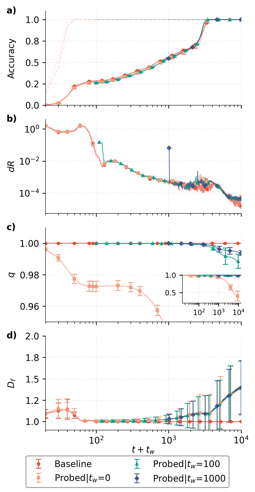
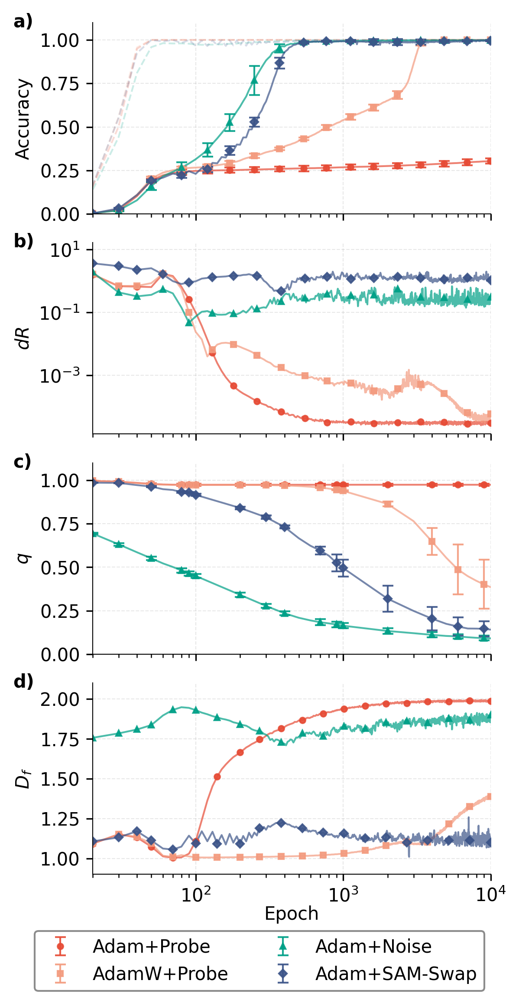

# Chan, Zhang, Shang, Zhang, Yang 2026 — Tunneling the Loss Landscape: Bypassing Memorization with Monte Carlo Parameter Swapping

См. также: [глобальный индекс понятий](../../concepts/index.md).

**Lai Shun Chan**, **Xiaotian Zhang**, **Yue Shang**, **Ge Zhang** (City University of Hong Kong; University of Pennsylvania), **Entao Yang** (Innovation Campus Delaware, Air Liquide).

arXiv [2608.01833](https://arxiv.org/abs/2608.01833), август 2026 (v1), 9 страниц, 2 рисунка, 1 алгоритм. Всего цитирований по Semantic Scholar — 0, в картотеке — 0. Предмет — прямая проверка стеклянной картины гроккинга на самой динамике обучения: тройка мер (подвижность параметров PM, межтраекторная корреляция реплик RC, фрактальная размерность траектории FD) показывает, что после достижения 99% на обучении подвижность обваливается на порядки, отклик на возмущение становится зависимым от предыстории (старение), а траектория схлопывается в почти баллистический канал $D_{f}\approx 1$ — то есть запоминание есть стеклоподобный кинетический арест. Отсюда вмешательство SAM-Swap: случайный обмен значений параметров внутри слоя по порогу FD, сокращающий срок гроккинга с $t\approx 3000$ до $t\approx 650$ эпох.

Оригинал и производные файлы этой папки:

- [`original/2608.01833.tunneling-the-loss-landscape-bypassing-memorization-with-monte-carlo-parameter-swapping.md`](original/2608.01833.tunneling-the-loss-landscape-bypassing-memorization-with-monte-carlo-parameter-swapping.md) — конверсия оригинала (arXiv-HTML v1) в Markdown без правок содержания.
- [`2608.01833.tunneling-the-loss-landscape-bypassing-memorization-with-monte-carlo-parameter-swapping.claims.txt`](2608.01833.tunneling-the-loss-landscape-bypassing-memorization-with-monte-carlo-parameter-swapping.claims.txt) — пронумерованные утверждения статьи с пометками разбора.
- [`images/`](images/) — 2 файла рисунков.

Схема якорей и правила ссылок на карточку — в [README папки статей](../README.md).

## Затрагиваемые понятия

**[Фаза меморизации](../../concepts/memorization-phase.md)** — плато получает динамический диагноз вместо описательного: ровно при достижении 99% обучающей точности фрактальная размерность траектории обваливается к $D_{f}\approx 1$, то есть путь в пространстве весов становится прямым, канальным, а подвижность падает с $\sim 1$ до $\sim 10^{-2}$ и далее к $\sim 10^{-4}$; одновременно корреляция реплик выходит на полку — сеть не просто движется медленно, но движется в узком коридоре и не имеет доступных развилок ([`p4-3`](#p4-3)). Разбор: наблюдение $D_{f}\to 1$ на самой поре запоминания — самое ценное в работе, но обе стекольные меры существуют только у «зондированной» сети (гауссов шум $\sigma=10^{-5}$ во все параметры), без него $RC\equiv 1$ и $D_{f}$ тривиально равна 1 — измеряется отклик на подмешанный шум, а не собственная динамика AdamW; полка RC лежит на $q\approx 0.97$, и вся главная панель занимает 0.96–1.00, так что «двухступенчатая релаксация» разыгрывается в пределах трёх процентов величины.

**[Эффективная теория и статистическая механика](../../concepts/effective-theory-statistical-mechanics.md)** — стеклянные меры перенесены в пространство параметров буквально: RC как пирсонова корреляция вытянутых в вектор весов слоя у реплик, отпочкованных от одного состояния в момент $t_{\rm w}$, и FD из степенной связи $\Delta R^{2}(\tau)\propto\Delta s(\tau)^{\alpha}$, $D_{f}=2/\alpha$; старение измерено прямо — у реплик при $t_{w}=10^{2},10^{3}$ первый спад подавлен, корреляция держится у единицы, то есть чем дольше система прожила, тем меньше отвечает на возмущение ([`p4-2`](#p4-2)). Разбор: «количественное согласие» со стеклянной динамикой, заявленное в аннотации, не подкреплено ни одной подгонкой к стекольному закону — нет ни времени релаксации $\tau_{\alpha}$, ни растянутой экспоненты, ни аррениусовской или VFT-зависимости, ни температуры, и согласие остаётся сходством формы кривых; старение измерено при постоянном абсолютном $\sigma=10^{-5}$ при растущей норме весов, то есть относительная сила возмущения падает сама собой, а разводящей проверки нет.

**[Роль шума градиента](../../concepts/gradient-noise.md)** — сопоставление четырёх постановок при нарочно детерминированной основе (полный батч, без dropout): опора Adam+зонд, AdamW+зонд, Adam с крупным гауссовым шумом ($\sigma=10^{-2}$) и Adam с обменом; все три возмущённые доходят до обобщения раньше опоры, и вывод обобщён так, что ускорение неизменно связано со случайным исследованием пространства параметров, «подобно диффузии в физике» ([`p5-5`](#p5-5)). Разбор: на рисунке 2a простой крупный гауссов шум обобщает раньше предлагаемого SAM-Swap, и в тексте это нигде не отмечено; сама опора (i) за 10000 эпох до обобщения вообще не доходит, так что формула «(ii), (iii) и (iv) обобщают раньше опоры» скрывает, что опора не обобщает никогда; weight decay попал в перечень «возмущений», хотя он не случаен, а заключительная связка «диффузия растит энтропию, энтропия связана с обобщением» остаётся рассуждением — ни энтропия, ни коэффициент диффузии здесь не измерены.

**[Гроккинг](../../concepts/grokking.md)** — задержка объявлена свойством не ландшафта, а траектории: обобщающие решения по опорной работе обильны и доступны, но оптимизация не может до них добраться, и потому срок обобщения зависит от того, какие области пространства параметров динамика способна посетить, а не от того, какие решения существуют ([`p7-3`](#p7-3)). Разбор: заглавие вводит преграду, сквозь которую надо «туннелировать», тогда как и опорная работа, и сам текст стоят на том, что макроскопических преград нет, а задержка чисто кинетическая — слова «tunneling» в теле статьи нет ни разу; гиперпараметры опорной кривой подобраны под кратчайший гроккинг, то есть AdamW-опора уже наилучшая из доступных, а не типичная; всё показано на одной задаче $(x^{2}+y)\bmod 67$ при одном однослойном трансформере.

**[Ускорение гроккинга](../../concepts/accelerated-grokking.md)** — ускорение достигается разрушением части выученного: обменное вмешательство существенно сокращает время гроккинга ([`p4-9`](#p4-9)). Это довод в пользу картины кинетического застоя — если бы задержка была накоплением полезного, порча состояния её бы удлиняла.

**[Время гроккинга](../../concepts/grokking-time.md)** — итог сообщён в эпохах: около $650$ против примерно $3000$ у AdamW ([`p4-9`](#p4-9)). Читать это сравнение стоит с поправкой на то, что опорная кривая подобрана под кратчайший гроккинг.
## Что показано, а что предположено

Замечания редактора карточки по итогам разбора утверждений (`…claims.txt`, 49 пунктов).

**Ценное — три меры, разводящие «медленно» и «заперто».** Формулировка рамки строга: низкая PM сама по себе ничего не значит (модель может ползти из-за расписания скорости обучения), высокая FD сама по себе ничего не значит (у не обобщающего Adam+зонд она самая высокая, к 2.0), низкая RC сама по себе ничего не значит (её можно обнулить сбросом весов, обобщения от этого не будет) — смысл имеет лишь сочетание, и оба контрпримера приведены авторами самими. Реплики как рабочий инструмент измерения зависимости обучения от предыстории и обмен, сохраняющий распределение значений внутри слоя, — переносимые приёмы.

**Сопоставление разнородно, приложения нет.** Обмен применён к Adam без weight decay, а сравнивается с AdamW; чисел $t\approx 650$ и $t\approx 3000$ без разброса по 20 прогонам, столбики ошибок на панелях подвижности и FD убраны «ради читаемости»; порог отката $L_{\text{cap}}$ взят равным потере на $t=0$, то есть заведомо огромен — отвергаться будет почти ничто; ни частоты вызова обмена, ни расписания в алгоритме нет, а на рисунке 2 FD у возмущённых прогонов держится у самого порога 1.1 до конца обучения, то есть «состояние-зависимый» запуск после срабатывания перестаёт быть избирательным. Дважды чтение отослано к «technical supplement», которого в подаче нет. Диапазон запаздываний объявлен $\tau=1,\ldots,[t/2]$ и тут же сказано, что каждое запаздывание целиком помещается в окно $T=20$: при $t\gg 40$ это несовместимо. В разделе о геометрии одновременно сказано, что поздний рост FD отражает наличие нескольких близких минимумов и что система сильно заперта в одной впадине «подобно западне в остром минимуме» — а «острый минимум» противоречит опорной работе, где обобщающие решения занимают наибольший объём.

**Незамеченное следствие собственного устройства.** Обмен внутри слоя сохраняет набор значений слоя в точности, а значит и его норму: ускорение обобщения без изменения нормы весов — готовая разводящая проверка для линии «норма задаёт срок» (2210.01117, 2606.13753, 2606.18465). Авторы этого не заметили и не измерили.

**Как работу будут цитировать** («доказано, что гроккинг есть стеклянная динамика»; «SAM-Swap ускоряет гроккинг впятеро») — точнее: на одной задаче при $p=67$, на однослойном трансформере, у сети, в которую обязательно подмешан шум, три меры ведут себя схоже со стекольными, а предложенный обмен обгоняет AdamW, но проигрывает простому крупному шуму.

---

# Текст статьи

## Туннелирование ландшафта потерь: обход запоминания обменом параметров методом Монте-Карло

Lai Shun Chan(1), Xiaotian Zhang(1), Yue Shang(1,2), Ge Zhang(1)\*, Entao Yang(3)\*. (1) Department of Physics, City University of Hong Kong, Hong Kong, China. (2) Department of Physics and Astronomy, University of Pennsylvania, Philadelphia, PA, USA. (3) Innovation Campus Delaware, Air Liquide, Newark, DE, USA. gzhang37@cityu.edu.hk, entao.yang@airliquide.com. \* Автор для переписки. Copyright (c) 2027, Association for the Advancement of Artificial Intelligence (www.aaai.org). All rights reserved.

## Аннотация

Гроккинг — поразительное явление в обучении нейронных сетей, где модель может пережить затяжной период чистого запоминания перед резким обобщением. Тогда как прежние работы пытались истолковать его через классические механизмы машинного обучения вроде нормы весов, недавнее исследование проводит аналогию из статистической физики, оформляя гроккинг как разновидность вычислительной стеклянной релаксации. Эта теория определяет начальное запоминание как следствие «быстрого охлаждения», при котором обучающая потеря снижается столь быстро, что образуется стеклянное состояние, за которым следует «медленная релаксация» к итоговому обобщению. Хотя такой взгляд даёт объединяющую рамку для представительных теорий гроккинга, он остаётся во многом теоретическим на макроскопическом уровне, без прямой опытной проверки на динамике обучения. Здесь мы вводим трёхсоставную рамку, прямо характеризующую динамику обучения через подвижность параметров (PM) и две представительные меры из стеклянной динамики: корреляцию реплик (RC) и фрактальную размерность (FD). Мы показываем, что стандартная оптимизация являет ясные признаки стеклянной динамики и внутренне запирает грокающую сеть в кинетически замороженном состоянии запоминания с обвалившейся подвижностью, сильной зависимостью от предыстории и канальными движениями. Это количественное согласие побуждает нас ввести State-Aware Monte Carlo Parameter Swapping (SAM-Swap) — оптимизационную надстройку, способную ускорить обобщение, вдохновлённую алгоритмом swap Monte Carlo, широко применяемым в стеклянной динамике. Сравнивая SAM-Swap, weight decay и гауссов шум градиента, мы находим, что ускоренное обобщение неизменно связано со случайным исследованием пространства параметров, подобно диффузии в физике.

## Введение

Современные переизбыточно параметризованные нейронные сети (НС) могут совершенно запомнить даже случайно размеченные конечные обучающие множества, и всё же они часто обобщают с удивительной точностью на невиданные тестовые данные (34). Объяснение этого кажущегося противоречия остаётся одной из самых основополагающих открытых задач ИИ (34; 3). Гроккинг служит примером этого парадокса: модели достигают почти совершенной обучающей точности, оставаясь на уровне случайного угадывания на тестовых данных (запоминание), а затем резко обобщают после затяжного обучения. Впервые наблюдённый на трансформерных моделях, обученных на алгоритмических наборах данных (28), гроккинг позднее был сообщён для широкого круга архитектур и областей, включая зрение, язык и задачи молекулярного обучения (21; 13). Отчётливое разделение временны́х масштабов запоминания и обобщения делает гроккинг полезным испытательным стендом для механистических теорий обобщения.

Существующие теории гроккинга можно широко разложить по уровню, на котором они описывают переход от запоминания к обобщению. Теории нормы весов и ландшафта описывают процесс макроскопически, связывая отложенное обобщение с эволюцией общей нормы параметров через различные режимы обучающей и тестовой потери, где тестовое качество благоприятно лишь внутри более узкой «зоны Златовласки» (21). Схемотехнические объяснения предлагают возможное микроскопическое уточнение этой картины, описывая состязание между быстро выучиваемыми, но параметрически неэкономными запоминающими вычислениями и медленно образуемыми, экономными по норме обобщающими схемами (25; 23; 32). Теории уровня представлений, напротив, подчёркивают отложенное выучивание признаков и постепенное выравнивание скрытых представлений с лежащей в основе структурой задачи (17; 20). Исследования, сосредоточенные на оптимизации, далее изучают динамику, движущую эти изменения, включая неустойчивость адаптивных оптимизаторов (31), медленно меняющиеся градиенты (18), эффективные скорости обучения (29) и шум (11).

Хотя эти объяснения освещают разные стороны гроккинга и не исключают друг друга, они сформулированы прежде всего в величинах, свойственных машинному обучению. Недавнее исследование ввело дополняющий взгляд, вдохновлённый физикой, и предложило истолковывать гроккинг как разновидность *вычислительной стеклянной релаксации*, медленно эволюционирующей к итоговому равновесному состоянию (35). Ключевой вопрос — происходит ли отложенное обобщение потому, что обобщающие решения внутренне редки или отделены от запоминающих труднодоступными областями пространства параметров. Понимая каждую конфигурацию параметров как возможное состояние статистико-механической системы, мы получаем обучающую потерю как её действенную энергию, а больцмановскую энтропию — как меру количества **[p. 2]** решений, существующих при разных уровнях обучающей потери и тестовой точности. Результаты показывают, что обобщающие состояния занимают много большее пространство решений, чем запоминающие, что также поддерживает *гипотезу объёма* (8; 27; 26). Более того, число доступных состояний не обваливается вдоль перехода между запоминанием и обобщением, тогда как обучающая потеря к тому же снижается монотонно (35).

В физических терминах это подсказывает отсутствие соответственно и макроскопических энтропийных, и энергетических преград, что делает гроккинг процессом, свободным от макроскопических термодинамических преград. Однако типичные обучающие траектории через AdamW долгое время остаются в низкоэнтропийном режиме с плохим обобщением, несмотря на то что переход к высокоэнтропийным обобщающим состояниям и доступен, и статистически предпочтителен. Это побуждает истолковывать гроккинг как вычислительную стеклянную релаксацию к равновесному состоянию с максимальной энтропией.

Тогда как анализ энтропии установил макроскопическую доступность обобщающих решений, он не характеризует динамику прямо, а просто относит гроккинг на счёт медленной подвижности параметров, вызванной слабыми градиентами после быстрого снижения потери. Здесь мы закрываем этот пробел трёхсоставной рамкой, соединяющей подвижность параметров (PM) с двумя представительными мерами из стеклянной динамики: корреляцией реплик (RC) (4; 24) и фрактальной размерностью траектории (FD) (9). PM количественно выражает величину пошагового движения параметров во время обучения. RC меряет межтраекторное сходство между независимо эволюционирующими репликами, отпочкованными от одного и того же начального состояния. FD характеризует внутритраекторную динамику, указывая, остаются ли оптимизационные пути настойчивыми и канальными или становятся извилистыми. Тем самым три составляющие спрашивают соответственно i) меняется ли сеть, ii) может ли одно и то же состояние развиться в разные пути и iii) насколько извилист каждый путь.

С этой рамкой мы находим, что для модели, оптимизируемой AdamW, PM обваливается, как только сеть достигает запоминания, несмотря на плохое тестовое качество. RC являет ясную двухступенчатую релаксацию, совпадающую с периодом запоминания, и прогрессивно более медленную декорреляцию при больших временах ожидания, выявляя сильную зависимость от предыстории и старение, что является представительным признаком стеклянной динамики (15; 16; 19). Между тем FD спадает примерно до ${1}$ после запоминания, подсказывая, что замедленное движение параметров становится настойчивым и канальным. Всё вместе это даёт ясный динамический диагноз гроккинга, поддерживающий истолкование гроккинга как стеклоподобного кинетического ареста в пространстве параметров.

Чтобы далее проверить нашу теорию кинетического ареста, мы спросили: если гроккинг подражает стеклянной динамике, могут ли вмешательства, применяемые в исследованиях стеклянных систем, тоже сократить задержку обобщения? Это побуждает разработку State-Aware Monte Carlo Parameter Swapping (SAM-Swap), вдохновлённого методом swap Monte Carlo, широко применяемым для ускорения уравновешивания в стеклообразующих системах переключением тождеств частиц (12; 5). Следуя тому же замыслу, SAM-Swap рассматривает каждый параметр НС как «частицу» и случайно обменивает их значения внутри каждого слоя.

На первый взгляд такие обмены могли бы показаться разрушающими выученные признаки и препятствующими выучиванию представлений, поскольку обученные параметры обычно предполагаются кодирующими упорядоченное вычисление (2). Однако, что удивительно, SAM-Swap существенно сокращает задержку обобщения. Разбор через нашу трёхсоставную рамку далее показывает, что SAM-Swap способен восстановить PM, снизить RC и увеличить FD, указывая на переход от замороженной динамики к ускоренной релаксации к равновесию. Мы также сравниваем это устроенное вмешательство с крупноамплитудным аддитивным гауссовым шумом и находим, что он способен произвести схожее ускорение, показывая, как разные виды нарушения меняют динамический маршрут к обобщению.

В этой работе мы расширяем складывающуюся связь между гроккингом и стеклянной динамикой до прямой характеризации динамики обучения. Наши главные вклады таковы:

- **Трёхсоставная рамка для динамики гроккинга:** Мы ввели единую рамку, соединяющую подвижность параметров (PM), корреляцию реплик (RC) и фрактальную размерность траектории (FD) для характеризации динамики обучения. Наши опыты подсказывают, что долгое запоминание обусловлено обвалившейся подвижностью, зависимостью от предыстории и канальными траекториями, что даёт прямое динамическое свидетельство в пользу истолкования гроккинга как стеклоподобного кинетического ареста.
- **Состояние-зависимое вмешательство на основе обмена:** Вдохновившись методом уравновешивания swap Monte Carlo из физики стёкол, мы предлагаем возмущение на основе обмена, запускаемое по низкой FD. Мы находим, что оно способно существенно сократить время гроккинга, указывая на противоречащие интуиции выгоды нарушения.
- **Сравнение стратегий возмущения:** Мы систематически сравниваем несколько способов возмущения, показывая, как они меняют динамику обучения и тем самым влияют на время гроккинга с микроскопического уровня.

Вместе наши результаты поддерживают взгляд на гроккинг как на сдвиг между динамически различными режимами обучения и подсказывают, что наблюдаемые величины, основанные на устойчивости (RC) и геометрии (FD), могут осведомлять целенаправленные вмешательства для ускорения обобщения.

## Методы

Здесь мы следуем ранее описанной постановке из исходной работы по стеклянной теории и ставим опыты на однослойном трансформере на арифметической задаче $(x^{2}+y)\bmod 67$ (35). Результаты усредняются по 20 независимым прогонам, каждый обучается 10 000 эпох ($t$). Все модели используют один и тот же обучающий набор данных, причём 30% доступных примеров отложено для оценки тестовой точности. Для удобства изложения мы определяем начало обобщения как точку, где тестовая точность впервые достигает 99%. Если не сказано иное, все упоминания времени гроккинга соответствуют периоду после того, как обучающая точность достигает 99%, и до того, как тестовая точность достигает 99%.

### Функции корреляции реплик

Чтобы количественно выразить сходство между независимо эволюционирующими обучающими траекториями, мы определяем функцию корреляции реплик (RC) на основе пирсоновой корреляции между параметрами модели. Мы сначала обучаем модель до времени ожидания $t_{\rm w}$, после **[p. 3]** чего независимые обучающие процессы (реплики) отпочковываются и эволюционируют раздельно под возмущениями. Корреляция пар реплик меряется в каждый $t$.

Пусть $\mathbf{S}_{l}^{a}(t)$ обозначает вытянутый в вектор параметрический вектор слоя $l$ для реплики $a$ в момент обучения $t$. Мы определяем функцию корреляции реплик как

$$
q_{l}^{ab}(t,t_{\rm w})=\mathrm{corr}\big(\mathbf{S}_{l}^{a}(t+t_{\rm w}),\mathbf{S}_{l}^{b}(t+t_{\rm w})\big), \tag{1}
$$

где $\mathrm{corr}(\cdot,\cdot)$ обозначает коэффициент пирсоновой корреляции, вычисленный по всем параметрам слоя $l$. Это обеспечивает, что корреляция отражает масштабно-инвариантное выравнивание между конфигурациями параметров. Здесь $a,b=1,2,\ldots$ нумеруют разные реплики. Сообщаемая корреляция усредняется по всем парам реплик, слоям и независимым прогонам. Высокая корреляция указывает, что близкие траектории остаются устойчивыми под возмущениями, тогда как снижение корреляции сигнализирует, что возмущения могут вести к расходящейся эволюции.

### Фрактальная размерность обучающей траектории

Чтобы охарактеризовать геометрическую структуру динамики обучения нейронной сети, мы оцениваем фрактальную размерность (FD) траектории параметров в пространстве весов. Пусть $\mathbf{R}_{t}$ обозначает вытянутый в вектор набор всех параметров модели на шаге обучения $t$. Мы определяем одношаговое приращение как

$$
\Delta\mathbf{R}_{t}=\mathbf{R}_{t+1}-\mathbf{R}_{t},
$$

а накопленную длину дуги траектории до момента $t$ как

$$
s_{t}=\sum_{t^{\prime}\leq t}\|\Delta\mathbf{R}_{t^{\prime}}\|_{2}.
$$

Для данного запаздывания $\tau$ мы определяем зависящие от запаздывания величины

$$
\Delta s(t,\tau)=s_{t+\tau}-s_{t},\qquad\Delta R^{2}(t,\tau)=\|\mathbf{R}_{t+\tau}-\mathbf{R}_{t}\|_{2}^{2}.
$$

Мы берём $\tau$ в диапазоне $\tau=1,....[t/2]$, обеспечивая, что каждое запаздывание целиком помещается внутрь фрактального окна размера $(T)$. Чтобы снизить чувствительность к нестационарности и большим колебаниям в обновлениях параметров, мы сводим эти величины медианой, получая $\Delta s(\tau)$ и $\Delta R^{2}(\tau)$. Затем мы предполагаем масштабное соотношение вида

$$
\Delta R^{2}(\tau)\propto\Delta s(\tau)^{\alpha},
$$

и оцениваем показатель $\alpha$ линейной регрессией в двойном логарифмическом масштабе на выбранном диапазоне $\tau$, получая зависящий от времени показатель $\alpha(t)$ и соответствующую FD

$$
D_{f}(t)=\frac{2}{\alpha(t)}.
$$

Фрактальная размерность количественно выражает связь между накопленной длиной пути и чистым смещением траектории. Значения $D_{f}\approx 1$ указывают, что траектория эволюционирует относительно прямо, баллистически, где смещение растёт пропорционально длине пути. Напротив, бо́льшие значения $D_{f}$ соответствуют всё более непрямому или извилистому движению, где траектория покрывает большую длину пути относительно своего чистого смещения.

В наших опытах $D_{f}$ оценивается внутри скользящего окна $T=20$ эпох, чтобы схватить местные изменения геометрии траектории. Мы выбираем это значение опытным путём, чтобы окно было достаточно коротким для разрешения динамических черт, возникающих на масштабе $10^{2}$ эпох (начало запоминания), и всё же достаточно длинным для подавления избыточных колебаний в оценке FD.

### Смещение за фрактальное окно

Чтобы количественно выразить подвижность параметров (PM) внутри обучающего окна, мы меряем *полное смещение* $(dR)$ весов каждого слоя. Для данного окна это смещение определяется как евклидово расстояние между параметрическим вектором в конце окна и параметрическим вектором в его начале:

$$
dR=\frac{1}{|l|}\sum_{l}\left\|\mathbf{R}_{t+T}-\mathbf{R}_{t}\right\|_{2},
$$

Эта мера схватывает чистое изменение в пространстве параметров за промежуток окна оценки FD, а не накопленную длину пути. Для анализа на уровне сети значения смещения усредняются по всем обучаемым слоям.

### Малый аддитивный гауссов шум как зонд

Мы используем полнопакетный Adam или AdamW без dropout, чтобы устранить внутренние источники случайности, так что уровень шума в системе управляется явно. Реплики, отпочкованные от одного и того же состояния, остаются тождественными с $RC=1$, а FD тривиально равна $1$ в отсутствие возмущений. Поверх этой детерминированной основы мы впрыскиваем гауссов шум с нулевым средним во все параметры с $\sigma=10^{-5}$. Значение выбрано из контрольных опытов, где впрыск шума не показывает изменения макроскопического качества обучения, но при этом делает возможной осмысленную оценку RC и FD. Модели, подвергнутые этому протоколу, помечены как зондированные.

## Наблюдение

### Подвижность параметров и медленная релаксация

Как показано на рисунке 1b, PM являет ясный переход от выучивания к запоминанию: $dR$ падает на порядки, от $\sim 1$ до $\sim 10^{-2}$ между $t\approx 0-10^{2}$, и продолжает снижаться к $\sim 10^{-4}$ к концу обучения. Это прогрессирующее застывание объясняет медленную динамику выучивания, причём подвижность становится исчезающе малой около $t\approx 10^{4}$. Такое поведение соответствует медленной релаксации в стеклянных системах, где динамика прогрессивно замерзает и побег из замороженного состояния становится всё труднее. Кривые PM для разных времён ожидания в основном перекрываются, кроме начальной точки, отражающей большее первое обновление из-за неотслеживаемых стохастических действий, тогда как последующие обновления остаются устойчивыми.

### Двухступенчатая релаксация корреляции реплик

Как показано на рисунке 1c, RC являет характерное двухстадийное поведение для модели с $t_{w}=0$. Во время начальной фазы обучения RC начинает декоррелировать немедленно, как и ожидается, поскольку реплики инициализируются разными случайными возмущениями и потому следуют различным оптимизационным путям. По мере продвижения обучения и расхождения тестовой точности с обучающей (рисунок 1a), знаменующего начало **[p. 4]** гроккинга, RC оседает на полку. Эта полка подсказывает, что траектория заключена внутри ограниченной области пространства параметров и остаётся детерминированной к малым возмущениям. В более поздние времена, совпадая с началом обобщения, RC заметно снижается для возмущённой модели, отражая сниженное межтраекторное сходство. Это указывает, что малые возмущения действенно разделили траектории реплик, подсказывая, что в этот момент оптимизационного пути в близости доступны иные решения. Вместе эти наблюдения подсказывают, что во время фазы запоминания оптимизационная траектория остаётся стеснённой, реплики заключены в малой области пространства параметров и сходятся лишь к нескольким схожим решениям, тогда как при обобщении возмущения разделяют реплики и выявляют близлежащие альтернативы, делая возможным более широкое исследование пространства параметров.

### Поведение старения в динамике обучения

Признак стеклянной динамики наблюдается в зависимости корреляции реплик от времени ожидания $t_{w}$, как показано на рисунке 1c. Для реплик, отпочкованных рано ($t_{w}=0$), корреляция являет двухступенчатый спад, состоящий из начального падения, за которым следует полка и последующая релаксация, как мы описали выше. Напротив, для бо́льших времён ожидания (например, $t_{w}=10^{2},10^{3}$) начальный спад сильно подавлен, и корреляция остаётся близкой к $q\approx 1$ в течение продолжительного периода, являя лишь незначительное снижение в более поздние времена.

###### p4-2

Эта зависимость от $t_{w}$ указывает, что система являет стеклоподобное поведение старения: отклик на возмущения зависит от того, сколько система уже проэволюционировала. В частности, траектории, эволюционировавшие дольше, становятся всё более устойчивыми к возмущениям и не являют быстрой релаксации. Сосуществование двухступенчатой релаксации при $t_{w}=0$ и старения даёт убедительное свидетельство стеклоподобной динамики, где система входит в медленный, зависящий от предыстории режим со стеснённым исследованием (19). Внутри нашей рамки это поведение подсказывает возникновение заключённой, устойчивой к возмущениям фазы во время гроккинга, которая в конце концов дестабилизируется, когда система вновь обретает динамическую гибкость и возобновляет исследование пространства параметров.

### Динамический переход в геометрии траектории

###### p4-3

Как показано на рисунке 1d, эволюция FD являет ясное соответствие разным стадиям обучения. Изначально $D_{f}$ умеренно колеблется выше 1, отражая нетривиальное исследование пространства параметров по мере подгонки моделью обучающих данных, согласно с относительно высокой PM. Как только обучающая точность достигает 99%, $D_{f}$ обваливается к 1, указывая, что оптимизационная траектория становится действенно низкоразмерной и баллистикоподобной. Даже под возмущениями модели не дано отклониться далеко от узких, канальных путей, что отражает сильную заключённость динамики. Это истолкование далее поддержано временны́м совпадением полки RC и обвала $D_{f}$, согласным с ограничением на конечный набор направлений в пространстве параметров и подавленной PM.

После затяжного периода $D_{f}=1$ мы наблюдаем постепенный рост FD, знаменующий расширение исследуемого пространства параметров. Этот рост происходит на схожем временно́м масштабе, что и наблюдаемое снижение RC. К этому времени модель уже обобщила; это поведение тогда отражает наличие нескольких близлежащих минимумов. Возмущения наводят диффузию в близости решений, тогда как система остаётся сильно заключённой в одной впадине с низкой PM, подобно западне в остром минимуме.

Совместная эволюция PM, RC и FD поддерживает двухстадийную динамическую картину: начальная релаксация, за которой следует заключённый, устойчивый к возмущениям режим, и последующий рост чувствительности, где возмущения могут наводить более исследовательскую динамику. Это поддерживает взгляд, что гроккинг соответствует фазе, в которой обучающая траектория внутренне низкоразмерна, с устойчивой и медленной динамикой.

*Рисунок 1: **Сравнение по временам ожидания**. Все данные — от AdamW со скоростью обучения $10^{-2}$ и weight decay $10^{-1}$, оптимизированных под кратчайшее время гроккинга. Опора использует AdamW; зондированная модель добавляет малый гауссов шум для проверки чувствительности траектории. Ось x выровнена по $t+t_{w}$. (a) Тестовая точность (сплошные линии показывают тестовую точность; полупрозрачная линия показывает обучающую точность). (b) Подвижность параметров, столбики ошибок опущены, чтобы разгрузить график и дать более ясный вид снижения $\Delta R$. Заметные колебания наблюдаются в диапазоне от $0$ до $10^{2}$. (c) RC, усреднённая по слоям, с врезкой, показывающей полный диапазон декорреляции реплик. (d) FD пути, усреднённая по слоям. Изредка регрессия даёт оценки FD чуть ниже 1. Это возникает из колебаний, вносимых добавленным шумом, которые возмущают наклон в лог-лог подгонке. Как таковые, значения ниже 1 суть артефакты неустойчивости оценки, а не свидетельство сублинейных траекторий.* **[p. 5]**

### State-Aware Monte Carlo Parameter Swapping (SAM-Swap)

Чтобы далее проверить наше истолкование гроккинга как стеклоподобного динамического явления, мы вводим вмешательство, замысленное нарушить обучающую траекторию. Наша основная гипотеза такова: нарушение стеснённых траекторий облегчает исследование и ускоряет обобщение, подобно настоящим стеклянным системам (4). Опытным путём начало гроккинга совпадает с падением FD к 1, указывающим на низкоразмерную динамику. Мы используем порог по $D_{f}$ как признак входа в стеснённый режим, выбранный опытным путём как $d_{f.\text{glass}}=1.1$, чтобы совпасть с наблюдаемым началом замороженной динамики. Наши опыты указывают, что точное значение порога не критично, пока $d_{f}>1$; умеренные подстройки дают сравнимое поведение, тогда как крайние настройки (например, $d_{f.\text{glass}}\approx 1.01$) производят схожие общие тенденции, но ведут к сильно колеблющейся PM.

Когда порог FD достигнут, мы применяем возмущение на основе обмена, случайно обменивая пары параметров внутри одного и того же слоя. (12; 5) Количество обмениваемых параметров зависит от доли обмена $r$. Мы находим, что $r=10^{-2}$ даёт наиболее устойчивое обучение и самое быстрое обобщение, тогда как меньшие доли восстанавливают опорный гроккинг, а бо́льшие склонны наводить избыточные колебания. За подробностями опыта касательно стеклянного предела и доли обмена просим обратиться к техническому приложению. Такая операция обмена сохраняет общее распределение параметров, перераспределяя при этом конфигурацию в пространстве параметров. Чтобы предотвратить разрушительные обновления, мы налагаем потолок потери $L_{\text{cap}}$, равный начальной обучающей потере, отвергая возмущения, ведущие к значимо большой ошибке. Этот предохранитель улучшает устойчивость, не меняя общей динамики.

Мы выбираем FD как запуск для обменных вмешательств, поскольку альтернативы менее практичны: RC требует нескольких реплик, так что её отслеживание было бы вычислительно дорого, а величина PM сильно зависит от оптимизатора, инициализации и гиперпараметров. Напротив, FD естественно ограничена между 1 и 2, что делает прямым назначение порога вблизи перехода режимов и даёт более устойчивый, переносимый критерий запуска обменов.

###### p4-9

Как показано на рисунке 2a, обменное вмешательство существенно сокращает время гроккинга, причём модели обобщают примерно на $t\approx 650$ эпохе против $t\approx 3000$ эпох для модели AdamW. Этот результат поддерживает взгляд, что режим гроккинга соответствует динамически устойчивой фазе, **[p. 5]** в которой обучающая траектория стеснена и сопротивляется возмущениям. Обменное вмешательство, напротив, нарушает эту устойчивость, позволяя оптимизационному процессу следовать иным траекториям, достигающим обобщения действеннее. В более широком смысле эти результаты показывают, что срок обобщения зависит не только от строения ландшафта потерь, но и от конкретной траектории, взятой при оптимизации, и от того, как на неё влияют возмущения.

**Алгоритм 1** Состояние-зависимое обменное возмущение с запуском по фрактальной размерности

**Требуется:** Параметры модели $\theta$, обучающие данные $\mathcal{D}$, доля обмена $r$, стеклянный порог $df_{\text{glass}}$
1: Сохранить обучающую потерю при $t=0$: $L_{\text{cap}}$
2: **для** каждого трансформерного слоя $\ell$ **выполнять**
3: Вычислить фрактальную размерность $df_{\ell}$
4: **если** $df_{\ell}<df_{\text{glass}}$ **то**
5: Сохранить резервную копию $\theta_{\text{backup}}\leftarrow\theta$
6: Выбрать $2\cdot\lfloor rN_{\ell}\rfloor$ случайных индексов $\{i_{k}\}$ в слое $\ell$
7: **для** $k=1$ до $\lfloor rN_{\ell}\rfloor$ **выполнять**
8: Обменять $\mathbf{v}_{\ell}[i_{2k-1}]$ и $\mathbf{v}_{\ell}[i_{2k}]$
9: **конец** **цикла**
10: Вычислить новую обучающую потерю $L_{\text{new}}$
11: **если** $L_{\text{cap}}<L_{\text{new}}$ **то**
12: $\theta\leftarrow\theta_{\text{backup}}$ {отвергнуть}
13: **конец** **условия**
14: **конец** **условия**
15: **конец** **цикла**
16: **вернуть** обновлённые $\theta$

### Сравнение способов возмущения

Недавние исследования показывают, что стохастические возмущения могут сильно влиять на динамику гроккинга, часто ускоряя или даже устраняя отложенное обобщение (1; 11). Чтобы исследовать, как возмущения влияют на динамику гроккинга, мы рассматриваем четыре обучающие постановки: (i) Adam с зондом, (ii) AdamW с зондом, (iii) Adam с крупным гауссовым шумом и (iv) Adam с SAM-Swap, введённым в предыдущем разделе.

Важно различать возмущения, используемые для измерения, и используемые как вмешательства. Зондирование означает малый гауссов шум, описанный в разделе «Методы». Как настоящее вмешательство мы вместо этого используем более крупный шум, прилагаемый тем же способом, но с $\sigma=10^{-2}$, нарочно меняющий оптимизационную динамику, чтобы способствовать побегу из стеснённого режима низкой FD. Предлагаемый способ обмена служит схожей цели, но наводит устроенные нелокальные перестановки параметров, а не аддитивные стохастические колебания.

###### p5-5

Как показано на рисунке 2a, обучающие постановки (ii), (iii) и (iv) все достигают обобщения раньше опорной постановки (i), хотя и с разной действенностью. Эти результаты подсказывают, что возмущения, какого бы вида они ни были, могут существенно менять срок отложенного обобщения.

*Рисунок 2: **Сравнение по способам возмущения**: Все модели используют скорость обучения $10^{-2}$, тогда как AdamW дополнительно применяет weight decay $10^{-1}$. Обе модели зондируются слабым гауссовым зондом ($\sigma=10^{-5}$), тогда как Adam+Noise применяет аддитивные гауссовы возмущения с $\sigma=10^{-2}$, а Adam+Swap использует предлагаемый SAM-Swap. Все гиперпараметры выбраны так, чтобы минимизировать время гроккинга. (a) Тестовая точность (сплошные линии показывают тестовую точность; полупрозрачная линия показывает обучающую точность) b) Подвижность параметров (c) Корреляция реплик от $t_{w}=0$. (d) Фрактальная размерность пути. Для панелей (b) и (d) столбики ошибок опущены на графиках во избежание чрезмерного зрительного загромождения. Постановки Adam+Noise и Adam+Swap внутренне подвержены большим колебаниям из-за добавленных возмущений; эта изменчивость признаётся здесь, и мы вместо этого представляем усреднённую тенденцию.* **[p. 6]**

### Трёхсоставная рамка

Сводя вместе свидетельства от PM, RC и FD, мы можем теперь изложить трёхсоставную рамку для **[p. 6]** понимания динамики гроккинга. Внутри этой рамки затяжная стадия запоминания при гроккинге выступает как стеклоподобный кинетический арест в пространстве параметров: сеть удерживается от обобщения по мере того, как её динамика становится медленной, зависящей от предыстории и геометрически стеснённой. Хотя обобщающие решения в принципе обильны и доступны (35), оптимизационному процессу трудно исследовать иные конфигурации параметров. Этот стеклоподобный арест можно систематически охарактеризовать через три составляющие: подвижность, зависимость от предыстории и геометрию траектории.

Подвижность, меряемая PM, количественно выражает величину изменений параметров во время обучения. Прежняя работа (35) показывает, что в грокающих системах обучающая потеря снижается слишком быстро, градиенты сжимаются, а параметры застаиваются. Наши опыты также подтверждают этот довод, поскольку параметры становятся почти неподвижными после запоминания, хотя тестовое качество остаётся плохим, как показано на рисунке 2b. Однако одна лишь низкая подвижность не обязательно налагает задержку обобщения, точно так же как само по себе замедление динамики не устанавливает стеклянных явлений в (10; 4). Модель могла бы двигаться медленно просто из-за каких-то конкретных настроек оптимизации, например из-за спадающей скорости обучения.

Зависимость от предыстории, зондируемая RC, — ключевая черта стеклянных систем в физике (4; 24). Тогда как наша опорная динамика показывает ясную двухступенчатую релаксацию, более медленная декорреляция между репликами, созданными после долгих времён ожидания, далее поддерживает аналогию между гроккингом и стеклянной релаксацией. Это подражает стеклянному старению: чем дольше арест, тем труднее становится побег к иной траектории. Иными словами, высокая RC подсказывает, что даже когда близлежащим копиям модели дана возможность эволюционировать независимо, они продолжают следовать крайне схожим траекториям. У оптимизатора тем самым ограничен доступ к иным маршрутам в пространстве параметров. Когда высокая RC совпадает с низкой подвижностью, это указывает, что медленная динамика есть не просто малые обновления, но может проистекать из ограниченности иных путей, доступных оптимизатору, как показано на рисунке 2c. Тем не менее одно лишь снижение RC не гарантирует ускоренного обобщения. В крайнем примере RC можно попросту снизить до нуля сбросом всех параметров после запоминания, что разрушает все выученные представления и не может ускорить обобщение.

Геометрия траектории, меряемая FD, сравнивает чистое смещение с длиной пути. Во время гроккинга FD спадает до 1 после запоминания, указывая на прямые, канальные пути. Это подсказывает, что оптимизация следует крайне стеснённому движению: хотя модель могла бы накапливать малые обновления, эти обновления не могут свободно исследовать пространство параметров. Это далее объясняет, почему одна лишь низкая подвижность недостаточна, поскольку две модели могли бы пройти схожее полное расстояние, причём одна следовала бы тому же узкому направлению, а другая случайно исследовала бы много иных направлений, прежде чем достичь того же уровня обобщения. Вдобавок одной FD недостаточно, как показывает опыт Adam+зонд на рисунке 2d. Без учёта PM или RC высокая FD лишь указывает на диффузионное движение, но не говорит, остаётся ли исследование местным.

**[p. 7]**

Подытоживая, эти три наблюдаемые величины характеризуют дополняющие друг друга уровни оптимизационной динамики. PM — местная, внутритраекторная величина, меряющая величину текущего движения параметров. FD также оценивается внутри отдельных траекторий, но характеризует их геометрию на большем масштабе, отличая настойчивое канальное движение от более извилистого исследования. RC, напротив, есть межтраекторная величина, сравнивающая ансамбль независимо возмущённых траекторий, исходящих из одного и того же состояния сети, и меряющая, способна ли система получить доступ к различным будущим эволюциям. Их сочетание отличает общее медленное движение от состояния, где обновление параметров одновременно подавлено, геометрически канализовано и ограничено в доступе к иным решениям. Лишь взятые вместе три составляющие дают полную картину: низкая PM может выявить, что система на деле не удаляется от своего исходного решения, несмотря на видимое движение, тогда как высокая RC указывает, что реплики остаются скоррелированными, подразумевая, что не исследуется никаких иных направлений; высокая FD сама по себе просто отражает, что траектория извилиста, но без PM и RC она не может различить, соответствует ли такое движение подлинной диффузии по минимумам или лишь местному блужданию, — где RC даёт ответ, есть ли иные минимумы, к которым можно диффундировать. Потому PM, RC и FD совместно отличают истинную диффузию и исследование близлежащих решений от движения, геометрически сложного, но динамически заключённого.

Наша рамка также объясняет, почему гроккинг можно ускорить устроенными возмущениями вроде SAM-Swap. Ускорение гроккинга через случайное исследование подобно диффузии в физике, о чём свидетельствуют возросшая подвижность, спадающая RC и высокая FD, что позволяет системе бежать из кинетического ареста и тем самым сокращает задержку обобщения. Это также согласно с прежней работой через физическую линзу: диффузия вызывает рост энтропии, а энтропия положительно связана с обобщением в разнообразных нейронных сетях (35; 33).

## Заключение и будущие направления

###### p7-3

В целом наши находки подсказывают, что срок обобщения формируется не только тем, какие решения существуют в ландшафте потерь, но и тем, к каким областям пространства параметров может получить доступ динамика обучения. Этот взгляд переоформляет возмущения из общих источников шума в возможные механизмы управления для изменения траекторий обучения нейросетей. Совместно измеряя подвижность (PM), устойчивость (RC) и геометрию (FD), мы дали практическую рамку для изучения того, когда оптимизация становится динамически стеснённой и когда она становится способной к исследовательскому поиску и в конечном счёте к достижению обобщающих решений.

Наши опыты сосредоточены на гроккинге в модульной арифметике и применяют местный оценщик FD, основанный на закреплённом временно́м окне. Будущей работе поэтому следует заняться и методологическими, и опытными расширениями. С методологической стороны нужны более устойчивые многомасштабные оценщики, чтобы определить, сохраняется ли наблюдаемый низкоразмерный режим на разных временны́х масштабах и размерах окна. С опытной стороны остаётся неясным, переносятся ли возмущения, запускаемые по FD, за пределы модульной арифметики на другие задачи с гроккингом, переизбыточно параметризованные постановки запоминания или реалистичные модели зрения и языка.

В более широком смысле динамические наблюдаемые величины вроде FD, RC или даже кривизны (14; 7; 30) и устойчивости представлений (6; 22) могут сделать возможными состояние-зависимые приспосабливающиеся обучающие вмешательства, отвечающие на эволюционирующую оптимизационную траекторию, а не прилагающие возмущения единообразно на протяжении всего обучения.

## Ограничение

Наше главное ограничение — временно́й масштаб оценки FD. Мы вычисляем FD со скользящим окном в 20 эпох, поскольку более длинные окна (мы проверяли до 500 эпох) затемняют раннюю динамику; 20 эпох лучше всего схватывали динамику около $10^{1}-10^{2}$ эпох. Более длинные окна сглаживают переходные явления и прячут обвал в низкоразмерные режимы. Результаты этой проверки представлены в техническом приложении. Как следствие, сообщаемую FD следует истолковывать как местную диагностику, а не как полную многомасштабную характеризацию.

Другая слабость нынешнего устройства FD — опора на закреплённое временно́е окно для описания того, что по существу многомасштабно. Это означает, что динамика с временами настойчивости короче или длиннее выбранного окна либо усредняется, либо упускается.

Расширение этого анализа на бо́льшие временны́е окна или на несколько окон одновременно представляет и вычислительные, и методологические сложности. Вычисление FD на длинных временны́х масштабах по многим репликам, настройкам возмущения и обучающим прогонам дорого. Естественным обходным путём была бы оценка FD по представительной выборке траектории. Однако мы нашли опытным путём, что получающиеся оценки FD чувствительны и к диапазону выборки, и к её плотности, поскольку метод опирается на лог-лог регрессию по статистикам смещения и длины пути. Следовательно, разный выбор выбранных запаздываний или отрезков траектории может вести к заметно разным оценкам показателей. Эта чувствительность подсказывает, что, хотя FD и ценный зонд геометрии обучения, её нынешняя постановка остаётся зависящей от окна и требует многомасштабного уточнения, прежде чем сможет служить устойчивым порядковым параметром.

## Заявление об этике

Эта работа — методологическое исследование динамики обучения на управляемых алгоритмических задачах, нацеленное на понимание запоминания, отложенного обобщения и чувствительности к возмущениям. Главный риск лежит в истолковании моделей, обученных при возмущающей динамике: они могут достигать тестовой точности, схожей с обычными, и всё же отличаться представлением, устойчивостью или калиброванностью. В этой статье модели обучаются лишь ради минимизации времени гроккинга для изучения динамики. Другой риск — интерпретируемость: FD и RC суть косвенные диагностики динамики. Они не суть гарантии устойчивости, надёжности, справедливости или безопасности. Их переоценка может ввести выводы в заблуждение, особенно в более крупных или реалистичных системах.

**[p. 8]**

## Благодарности

Авторы благодарят Национальный фонд естественных наук Китая за поддержку этого исследования (Грант 12405043, G.Z.). Мы также благодарим за вычислительные ресурсы, предоставленные Bridges-2 в Питтсбургском суперкомпьютерном центре и DeltaAI в Национальном центре суперкомпьютерных приложений через выделение ACCESS CIS230096 (E.Y.).

## References

- [1] T. Agrawal and M. Kumar (2025) Grokking in neural networks: a review. SN Computer Science 6 (3), pp. 4182. Cited by: Comparing perturbation methods.

- [2] S. K. Ainsworth, J. Hayase, and S. Srinivasa (2022) Git re-basin: merging models modulo permutation symmetries. External Links: 2209.04836 Cited by: Introduction.

- [3] M. Belkin, D. Hsu, S. Ma, and S. Mandal (2019) Reconciling modern machine-learning practice and the classical bias–variance trade-off. Proceedings of the National Academy of Sciences 116 (32), pp. 15849–15854. External Links: Document Cited by: Introduction.

- [4] L. Berthier and G. Biroli (2011) Theoretical perspective on the glass transition and amorphous materials. Reviews of Modern Physics 83 (2), pp. 587–645. External Links: Document Cited by: Introduction, State-Aware Monte Carlo Parameter Swapping (SAM-Swap), The three component framework, The three component framework.

- [5] L. Berthier, J. Coslovich, A. Ninarello, and M. Ozawa (2016) Efficient equilibration of hard spheres up to the jamming density and beyond with swap monte carlo. Physical Review Letters 116 (23), pp. 238002. External Links: Document Cited by: Introduction, State-Aware Monte Carlo Parameter Swapping (SAM-Swap).

- [6] A. Bietti and J. Mairal (2019) Group invariance, stability to deformations, and complexity of deep convolutional representations. Journal of Machine Learning Research 20 (25), pp. 1–49. External Links: Link Cited by: Conclusion and Future Directions.

- [7] P. Chaudhari, A. Choromanska, S. Soatto, Y. LeCun, C. Baldassi, C. Borgs, J. Chayes, L. Sagun, and R. Zecchina (2017) Entropy-sgd: biasing gradient descent into wide valleys. In Proceedings of the International Conference on Learning Representations (ICLR), External Links: Link Cited by: Conclusion and Future Directions.

- [8] P. Chiang, R. Ni, D. Y. Miller, A. Bansal, J. Geiping, M. Goldblum, and T. Goldstein (2023) Loss landscapes are all you need: neural network generalization can be explained without the implicit bias of gradient descent. In International Conference on Learning Representations (ICLR), Cited by: Introduction.

- [9] G. Datseris, I. Kottlarz, A. P. Braun, and U. Parlitz (2023) Estimating fractal dimensions: a comparative review and open source implementations. Chaos: An Interdisciplinary Journal of Nonlinear Science 33 (10), pp. 103123. External Links: Document Cited by: Introduction.

- [10] J. C. Dyre (2006) The glass transition and elastic models of glass-forming liquids. Reviews of Modern Physics 78 (3), pp. 953–972. External Links: Document Cited by: The three component framework.

- [11] I. T. Ersoy and K. Wiesner (2026) Noise-driven escape from metastable phases explains grokking in deep neural networks. External Links: 2606.17120 Cited by: Introduction, Comparing perturbation methods.

- [12] T. S. Grigera and G. Parisi (2001) Fast monte carlo algorithm for supercooled soft spheres. Physical Review E 63 (1), pp. 011101. External Links: Document Cited by: Introduction, State-Aware Monte Carlo Parameter Swapping (SAM-Swap).

- [13] A. I. Humayun, R. Balestriero, and R. Baraniuk (2024) Deep networks always grok and here is why. In Proceedings of the 41st International Conference on Machine Learning, Proceedings of Machine Learning Research, Vol. 235, pp. 20722–20745. Cited by: Introduction.

- [14] N. S. Keskar, D. Mudigere, J. Nocedal, M. Smelyanskiy, and P. T. P. Tang (2017) On large-batch training for deep learning: generalization gap and sharp minima. In Proceedings of the International Conference on Learning Representations (ICLR), External Links: Link Cited by: Conclusion and Future Directions.

- [15] W. Kob and H. C. Andersen (1995) Testing mode-coupling theory for a supercooled binary lennard-jones mixture. ii. intermediate scattering function and dynamic susceptibility. Physical Review E 52 (4), pp. 4134. Cited by: Introduction.

- [16] W. Kob and J. Barrat (1997) Aging effects in a lennard-jones glass. Physical review letters 78 (24), pp. 4581. Cited by: Introduction.

- [17] T. Kumar, B. Bordelon, S. J. Gershman, and C. Pehlevan (2023) Grokking as the transition from lazy to rich training dynamics. External Links: 2310.06110, Document Cited by: Introduction.

- [18] J. Lee, B. G. Kang, K. Kim, and K. M. Lee (2024) Grokfast: accelerated grokking by amplifying slow gradients. External Links: 2405.20233 Cited by: Introduction.

- [19] B. Li, D. Pan, T. Qu, and Y. Jin (2026) Universal activated aging and weak ergodicity breaking in spin and structural glasses. Science Advances 12 (7), pp. eaec4416. External Links: Document Cited by: Introduction, Aging Behavior in Training Dynamics.

- [20] Z. Liu, O. Kitouni, N. S. Nolte, E. Michaud, M. Tegmark, and M. Williams (2022) Towards understanding grokking: an effective theory of representation learning. Advances in Neural Information Processing Systems 35, pp. 34651–34663. Cited by: Introduction.

- [21] Z. Liu, E. Michaud, and M. Tegmark (2023) Omnigrok: grokking beyond algorithmic data. In Proceedings of the International Conference on Learning Representations, Cited by: Introduction, Introduction.

- [22] J. Mairal (2016) End-to-end kernel learning with supervised convolutional kernel networks. In Advances in Neural Information Processing Systems 29 (NeurIPS), pp. 1395–1403. External Links: Link Cited by: Conclusion and Future Directions.

- [23] W. Merrill, N. Tsilivis, and A. Shukla (2023) A tale of two circuits: grokking as competition of sparse and dense subnetworks. External Links: 2303.11873 Cited by: Introduction.

- [24] M. Mézard and G. Parisi (2012) Glasses and replicas. In Structural Glasses and Supercooled Liquids: Theory, Experiment, and Applications, P. G. Wolynes and V. Lubchenko (Eds.), pp. 151–191. External Links: Document Cited by: Introduction, The three component framework.

- [25] N. Nanda, L. Chan, T. Lieberum, J. Smith, and J. Steinhardt (2023) Progress measures for grokking via mechanistic interpretability. In Proceedings of the International Conference on Learning Representations, External Links: Link Cited by: Introduction.

- [26] A. Pakman, L. Kreimer, and Y. Berchenko (2026) Revisiting the volume hypothesis. External Links: 2606.31282 Cited by: Introduction.

- [27] A. Peleg and M. Hein (2024) Bias of stochastic gradient descent or the architecture: disentangling the effects of overparameterization of neural networks. In International Conference on Machine Learning, pp. 40154–40184. Cited by: Introduction.

- [28] A. Power, Y. Burda, H. Edwards, I. Babuschkin, and V. Misra (2022) Grokking: generalization beyond overfitting on small algorithmic datasets. External Links: 2201.02177 Cited by: Introduction.

- [29] L. Prieto, M. Barsbey, P. Mediano, and T. Birdal (2025) Grokking at the edge of numerical stability. In International Conference on Learning Representations, Cited by: Introduction.

- **[p. 9]** [30] L. Sagun, U. Evci, V. U. Guney, Y. Dauphin, and L. Bottou (2017) Empirical analysis of the hessian of over-parametrized neural networks. In Proceedings of the ICML Workshop on Principled Approaches to Deep Learning, External Links: Link Cited by: Conclusion and Future Directions.

- [31] V. Thilak, E. Littwin, S. Zhai, O. Saremi, R. Paiss, and J. M. Susskind (2022) The slingshot mechanism: an empirical study of adaptive optimizers and the grokking phenomenon. In NeurIPS 2022 Workshops: Human Interpretability of Machine Learning Systems (HITY), External Links: Link Cited by: Introduction.

- [32] V. Varma, R. Shah, Z. Kenton, J. Kramár, and R. Kumar (2023) Explaining grokking through circuit efficiency. External Links: 2309.02390, Document Cited by: Introduction.

- [33] E. Yang, X. Zhang, Y. Shang, and G. Zhang (2026) High-entropy advantage in neural networks’ generalizability. npj Artificial Intelligence 2 (1), pp. 44. Cited by: The three component framework.

- [34] C. Zhang, S. Bengio, M. Hardt, B. Recht, and O. Vinyals (2016) Understanding deep learning requires rethinking generalization. External Links: 1611.03530 Cited by: Introduction.

- [35] X. Zhang, Y. Shang, E. Yang, and G. Zhang (2025) Is grokking a computational glass relaxation?. In Advances in Neural Information Processing Systems, Vol. 38. Cited by: Introduction, Methods, The three component framework, The three component framework, The three component framework.
