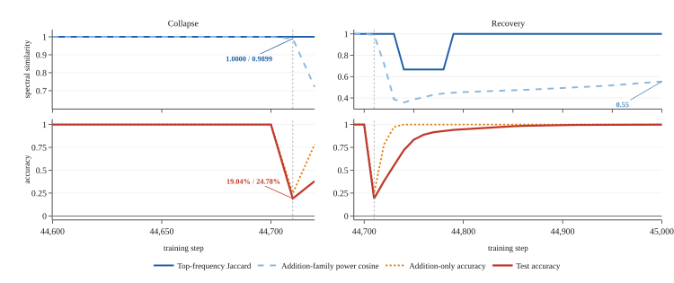
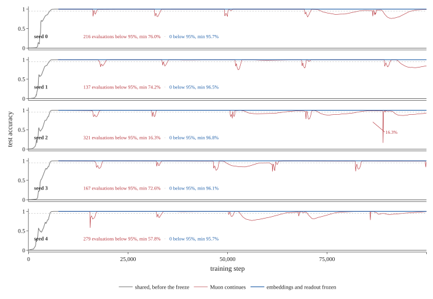
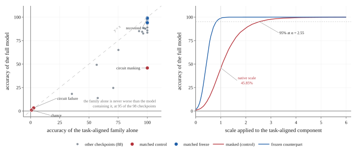

# Janati, El Maghraoui, Kanavalau, Belfatmi 2026 — Post-Grokking Collapse at the Representation–Readout Interface in Muon-Trained Transformers

См. также: [глобальный индекс понятий](../../concepts/index.md).

**Ali Janati** (Data Science Institute, Columbia University), **Kaoutar El Maghraoui** (Department of Computer Science, Columbia University), **Andrei Kanavalau** (Stanford University), **Anass Belfatmi** (CentraleSupélec).

arXiv [2608.07436](https://arxiv.org/abs/2608.07436), август 2026 (v1), 34 страницы, 6 рисунков, 20 таблиц. Всего цитирований по Semantic Scholar — 0, в картотеке — 0. Предмет — что происходит с гроккнувшей схемой после гроккинга при раздельной маршрутизации оптимизаторов (Muon на скрытых матрицах, AdamW на вложениях и выходной голове): все девять настроек Muon в развёртке достигают устойчивых $95\%$ и все затем теряют обобщение, у AdamW то же случается на четырёх из семи гроккающих настроек, а различие между оптимизаторами — в тяжести на два порядка, не в наличии сбоя. Устройство сбоя привязано к границе представления и считывания, которую потеря опознаёт только совместно (через произведение $W_{U}h$); заморозка вложений и головы после образования схемы снимает обвал начисто на пяти прогонах и $451{,}400$ пост-гроккинговых шагах. Отдельный результат — слепота стандартных мер прогресса: в тот самый промежуток, где точность падает со $100\%$ до $19.04\%$, набор ведущих частот внутри задачного семейства не меняется (индекс Жаккара $1.0000$), а распределение мощности сохраняет косинус $0.9899$.

Оригинал и производные файлы этой папки:

- [`original/2608.07436.post-grokking-collapse-at-the-representation-readout-interface-in-muon-trained-transformers.md`](original/2608.07436.post-grokking-collapse-at-the-representation-readout-interface-in-muon-trained-transformers.md) — конверсия оригинала (arXiv-HTML v1) в Markdown без правок содержания.
- [`2608.07436.post-grokking-collapse-at-the-representation-readout-interface-in-muon-trained-transformers.claims.txt`](2608.07436.post-grokking-collapse-at-the-representation-readout-interface-in-muon-trained-transformers.claims.txt) — пронумерованные утверждения статьи с пометками разбора.
- [`images/`](images/) — 6 файлов рисунков.

Схема якорей и правила ссылок на карточку — в [README папки статей](../README.md).

## Затрагиваемые понятия

**[Меры прогресса](../../concepts/progress-measures.md)** — предсказание, сделанное до измерения и подтверждённое: набор ведущих частот внутри семейства инвариантен к любой обратимой смене базиса, распределение мощности по ним инвариантно к ортогональной, а меры самой функции не инвариантны ни к той, ни к другой — и в промежутке между двумя соседними замерами, где точность на обучении падает со $100\%$ до $21.12\%$, а на отложенной до $19.04\%$, носитель не меняется вовсе (индекс Жаккара $1.0000$), мощность сдвигается на один процент (косинус $0.9899$), а средний зазор изолированной схемы уходит с $+18.14$ на $-46.85$ ([`p26-3`](#p26-3)). Разбор: спектральная проверка сообщает о целой схеме ровно в тот шаг, когда модель перестала считать задачу, — и это самый переносимый результат работы; меры применены не абы к чему, а ровно к тем модам, что несут алгоритм, то есть проверка поставлена в самой строгой форме.

**[Гроккинг](../../concepts/grokking.md)** — «схема есть, но заслонена» как самостоятельное состояние: модель, содержащая схему, дающую в отрыве ровно $100\%$, отвечает неверно, потому что задачная часть зазора ($+5.72$) перекрывается почти равным по величине встречным вкладом остатка ($-6.43$); перемасштабирование одной задачной части без дообучения и без касания считывания поднимает модель с $45.85\%$ до $99.91\%$, а само состояние встречается дважды — до гроккинга, когда доля семейства составляет процент представления, и после обвала, когда она упала с $84\%$ до $20\%$ ([`p25-2`](#p25-2)). Разбор: отсюда прочтение гроккинга как заслонения, разрешающегося вверх, — фаза уборки Nanda et al. выражена ростом той же доли мощности с $1.05\%$ до $70.62\%$ при достаточности семейства с шага $3{,}000$; но заявка опирается на одну траекторию AdamW, и «два перехода суть одно измерение, пущенное в разные стороны» — истолкование, а не отдельный опыт.

**[Оптимизаторы](../../concepts/optimizer-adam-adamw-sgd.md)** — раздельная маршрутизация разрезает то, что потеря опознаёт только совместно: итерация Ньютона—Шульца нормирует вход до ортогонализации и возвращает сингулярные числа около единицы, чем бы они ни были порождены, так что у скрытой группы упругость применяемого шага по норме градиента равна $-0.026$ против $+1.51$ и $+1.47$ у вложений и считывания, и за $691$ шаг тихого окна стороны расходятся со множителем $8.0$ на параметр; то же правило обновления задаёт и разброс представления — $326.09$ действенных сопряжённых пар против AdamW-овских $4.95$ ([`p11-4`](#p11-4)). Разбор: приписывание сбоя одному Muon работа сама и сносит — четыре из семи гроккающих настроек AdamW тоже теряют обобщение, и тяжесть там растёт монотонно со скоростью обучения; отсечение нормировки и ортогонализации сделано разом и без сопоставления по скорости обучения (её пришлось поднять с $0.03$ до $0.3$–$1.0$), а сама заморозка снимает неустойчивость, не сближая разброс с AdamW-овским, — значит разброс по спектру и неустойчивость суть разные вещи.

**[Фурье-признаки и схемы](../../concepts/fourier-features-circuits.md)** — точное разбиение $p^{2}$ мод на шесть попарно непересекающихся семейств делает отсечение семейства и достаточность его дополнения одним измерением (сходятся на $1.71\%$ с теми же пределами, что и служит проверкой фильтров), и на сорока трёх решённых точках, охватывающих пять семян и три режима оптимизации, семейство $(k,k)$ в отрыве даёт ровно $100.00\%$ везде, а вычитание, $a$-only, $b$-only и постоянная мода — ровно $0.88\%$, уровень случая; базис внутри семейства точен: перенос пар на другие диагональные частоты при сохранённой мощности даёт $2.64\%$, случайная фаза на пару — $0.19\%$, ниже уровня случая ([`p19-3`](#p19-3)). Разбор: предсказание проверено обменом задачи — на $(a-b)\bmod 113$ при том же начальном состоянии роли меняются в точности, так что семейство выбирает задача, а не разбор; две ветви из побитово одного состояния приходят к разным базисам одного алгоритма (косинус матриц считывания $-0.028$), и схема не переносится без своего считывания.

**[Антигроккинг](../../concepts/anti-grokking.md)** — работа цитирует Prakash & Martin и прямо от них отделяется: при антигроккинге обучающая точность держится идеальной, а тестовая падает, тогда как здесь обе падают в одном промежутке ($100\%\to 21.12\%$ и $100\%\to 19.04\%$), и механизм, действующий на одно обобщение, оставил бы обучающую выборку решённой ([`p3-1`](#p3-1)). Разбор: совпадает другое и более важное — обе работы утверждают, что поздний обвал ускользает от существующих мер прогресса, но лечат это по-разному: там предлагают спектральную статистику по весам, здесь показывают, что спектр представления как раз слеп; ближайшая по предмету 2602.02859 не цитируется вовсе.

## Что показано, а что предположено

Замечания редактора карточки по итогам разбора утверждений (`…claims.txt`, 45 пунктов, 13 из них помечены как предсказанные до опыта и подтверждённые).

**Ценное — вмешательства, а не корреляции.** Ветвление из побитово одинакового состояния делает причинные утверждения проверяемыми: заморозка любой из двух групп подавляет сбой, внутри вспомогательной группы движение требуется именно от матрицы считывания (заморозка вложений задерживает обвал на $50$–$200$ шагов, заморозка считывания снимает его вовсе), а скрытые матрицы вместе со считыванием сбой воспроизводят. Различение «схема есть, но заслонена» и «схемы нет» проверено перемасштабированием без дообучения. Точное разбиение мод даёт самопроверку фильтров. Вторая операция даёт семейство, о котором доказано, что оно не считает первую задачу, — и разброс получает пол для отсчёта, переставая быть произвольной шкалой. Готовый рецепт устойчивости (закрепить вложения и голову после образования схемы) полезен независимо от того, верно ли объяснение через смену базиса.

**Ускорение измерено в шагах, а не в секундах.** Шаг Muon стоит в $1.75$–$1.80$ раза дороже шага AdamW, но пересчёт в затраченное время дан только для глубин $2$ и $4$. На глубине $1$, где преимущество в шагах равно $1.52$, тот же пересчёт даёт Muon примерно на $15\%$ **медленнее** AdamW по времени; в работе это нигде не сказано. Преимущество на глубине $4$ ($>5.70$) — оценка снизу с цензурой справа по бюджету, и в секундах она даёт $>3.37$.

**Что остаётся истолкованием.** Измерена функциональная несовместимость (каждая ветвь читает своё представление на $100\%$ и чужое на уровне случая), а не подобранное преобразование базиса: подгонку $R$ и проверку через выправленное считывание авторы прямо относят к дальнейшей работе. Отсечение нормировки и ортогонализации смешано с подъёмом скорости обучения. Множитель $8.0$ — среднее по величине, мгновенное отношение внутри того же окна падает с $16.2$ до $3.3$. Прогоны идут на Apple MPS во float32, где воспроизведение не побитовое: две попытки одной настройки на глубине $4$ дают устойчивое обобщение на $52{,}600$ и $101{,}300$ шагах; сопоставленные ветви, подстановка чужого считывания и послойный разбор остаются односеменными — признано прямо.

**Как работу будут цитировать** («Muon делает гроккинг неустойчивым»; «заморозка вложений и головы лечит неустойчивость») — точнее: пост-гроккинговый обвал есть и у AdamW, у Muon он всеобщ по развёртке, а различие в тяжести на два порядка; и лечение полно на глубинах $1$ и $2$, а на глубине $4$ частично — $175$ из $1{,}738$ замеров всё же ниже $95\%$, хотя провалы ниже $90\%$ сокращены в двадцать раз.

---

# Текст статьи

## Пост-гроккинговый обвал на границе представления и считывания в трансформерах, обученных Muon

Ali Janati Affiliation: [1em] Data Science Institute, Columbia University, New York, NY, USA Kaoutar El Maghraoui Affiliation: Department of Computer Science, Columbia University, New York, NY, USA Andrei Kanavalau Affiliation: Stanford University, Stanford, CA, USA Anass Belfatmi Affiliation: CentraleSupélec, Gif-sur-Yvette, France

## Аннотация

При стандартном разделении, отдающем Muon скрытые весовые матрицы и оставляющем вложения и выходную голову AdamW, Muon достигает порога гроккинга на модульном сложении за меньшее число шагов. Решения, до которых он доходит, не держатся. Каждая настройка в девятиточечной развёртке на $(a+b)\bmod 113$ гроккает, и каждая затем теряет обобщение. AdamW не исключение: по пяти семенам выбранная опора AdamW падает ниже порога на четырёх из них, доходя до $27.59\%$. Неустойчивость держится на двух модулях, двух ширинах, двух долях обучения и на модульном вычитании, и растёт с глубиной.

Сбой возникает на границе между представлением и считыванием, которую остаточный поток оставляет опознаваемой лишь совместно, с точностью до обратимого отображения, не выбираемого потерей. Как только обучающая выборка решена, градиент падает до порядка $10^{-6}$, и два оптимизатора отвечают на это по-разному: упругость применяемой величины шага по величине градиента равна $-0.03$ для группы Muon против $+1.5$ для групп AdamW, и стороны расходятся с $8.0$-кратной скоростью на параметр. При ветвлении из побитово одинаковых состояний заморозка любой из групп предотвращает сбой. Удержанные постоянными до конца обучения, вложения и считывание убирают его на пяти прогонах и $451{,}400$ пост-гроккинговых шагах, а также на пяти парных семенах, где незамороженная ветвь даёт от $137$ до $321$ подпорогового замера, а замороженная — ни одного. Отсечение нормировки и ортогонализации Muon заменой не служит: при поднятой скорости обучения, чтобы отсечённый оптимизатор вообще учился, оно обваливает представление с $326$ действенных сопряжённых пар до $4$, не показывает повторяющихся обвалов и кончает необратимым сбоем.

Фильтрация представления к тому Фурье-семейству, что считает задачу, разделяет два сбоя. На сорока трёх контрольных точках, охватывающих пять семян и три режима, это семейство достигает ровно $100\%$ в отрыве в каждой из них. При *отказе схемы* оно больше не решает задачу. При *заслонении схемы* оно по-прежнему решает её совершенно, тогда как полная модель доходит до $45.85\%$: семейство даёт положительный зазор на каждом примере, включая все те, где модель отвечает неверно, и его перевешивает встречный остаток почти равной величины. Перемасштабирование одного семейства возвращает модель к $99.9\%$, и в разбираемой здесь траектории гроккинг есть то же самое состояние, разрешающееся вверх. Семейство выбирает задача, обменивая $(k,k)$ на $(k,-k)$ при вычитании. Через резкий обвал Фурье-носитель, который отслеживают стандартные меры прогресса, не меняется, а распределение мощности по нему сохраняет косинусную близость $0.9899$.

*Рисунок 1: Отказ гроккнувшей схемы, при десятишаговом разрешении замеров. Верхний ряд: спектральные меры семейства сложения относительно дообвального состояния на шаге $44{,}700$. Нижний ряд: точность модели и точность модели, ограниченной семейством сложения. За единственный отмеченный промежуток тестовая точность падает со $100\%$ до $19.04\%$, а точность только по сложению — до $24.78\%$, тогда как внутри семейства сложения набор ведущих частот не меняется, с индексом Жаккара $1.0000$, а распределение мощности по ним имеет косинусную близость $0.9899$. Меры прогресса, основанные на носителе и на мощности, сообщают о целой схеме на том шаге, где модель перестаёт считать задачу. Затем модель возвращается к $99.90\%$ за $300$ шагов при распределении мощности, доходящем лишь до $0.55$, пересобрав решение задачи на другом наборе частот. Семейство сложения — это непостоянные моды $(k,k)$ двумерного преобразования Фурье конечного остатка по решётке операндов.* **[p. 2]**

## 1 Введение

Гроккинг — наступление обобщения много позже насыщения обучающей точности — стандартный испытательный стенд для механистических отчётов об обучении [9]. Модульное сложение — его канонический пример. Трансформеры, обученные на нём, считают суммы в базисе Фурье, представляя операнды углами и складывая их по разрежённому набору частот [8]. Средства, которыми был установлен этот отчёт и которые опознают ведущие частоты и меряют **[p. 2]** долю несомой ими представленческой мощности, стали стандартным способом проверить, есть ли схема.

Muon [6] ортогонализует буфер момента перед приложением и применяется только к скрытым весовым матрицам, тогда как вложения и выходная голова отданы AdamW [7]. При такой маршрутизации он достигает порога гроккинга на модульной арифметике быстрее, чем один AdamW [14, 17]. Мы воспроизводим этот результат на модульном сложении. То, что следует за ним, от настройки не зависит: сообщаемая нами неустойчивость держится на двух модулях, двух ширинах, двух долях обучения, двух операциях и глубинах $1$, $2$ и $4$.

Известно, что решения, до которых доходит Muon, отличаются от AdamW-овских по устройству. Обученные Muon скрытые состояния несут более высокий эффективный ранг [12], а правило обновления даёт более изотропный сингулярный спектр, чем у Adam [16]. Оба результата спектральны, измерены на весовых матрицах и скрытых состояниях. На задаче, чей алгоритм известен, это различие можно измерить иначе, функционально, в том базисе, в котором модель считает, и прочесть его против числа частот, нужных алгоритму. Мы так и делаем и отсекаем путь нормированной ортогонализации Muon: разброс по непостоянному спектру обваливается с $326$ действенных сопряжённых пар до $4$, тогда как семейство, через которое модель считает, не меняется. Само ускорение служит прибором: оно ставит гроккнувшую схему за несколько тысяч шагов, что позволяет наблюдать пост-гроккинговую пору многократно внутри отдельных прогонов, ветвить сопоставленные траектории из побитово одинаковых состояний параметров и вмешиваться в схему по цене, которая на временно́м масштабе AdamW была бы запретительной.

Пост-гроккинговая пора неустойчива. Каждая настройка в нашей развёртке Muon обобщает и затем теряет обобщение, в худших случаях падая ниже $1\%$ тестовой точности и восстанавливаясь, и так повторно, на протяжении сотен тысяч шагов. Развёртка скорости обучения выходной головы впятеро и её затухания весов от нуля до $0.5$ меняет сроки и тяжесть этих событий, но не устраняет ни одного. **[p. 3]** AdamW не исключение. Четыре из семи настроек AdamW, гроккающих в нашей развёртке, тоже теряют обобщение впоследствии, и тяжесть растёт монотонно со скоростью обучения — от нуля подпороговых замеров при $10^{-3}$ до $918$ при $10^{-2}$. Два оптимизатора различает то, что у AdamW сбой обусловлен продавливанием величины шага, тогда как у Muon он держится при каждой испытанной настройке. Сравнимые сбои сообщались как цикличная неустойчивость у адаптивных оптимизаторов [13], как сбой плавающей точки в softmax [11], как следствие сдвига действенности схем под затуханием весов [15] и как антигроккинговая пора, в которой тестовая точность обваливается при сохранной совершенной обучающей [10]. 10 дополнительно сообщают, что этот поздний обвал ускользает от существующих мер прогресса, и предлагают весовую спектральную статистику, его обнаруживающую.

###### p3-1

Изучаемый нами сбой не такого рода. Обучающая точность падает вместе с тестовой, со $100\%$ до $21.12\%$ в том же промежутке между замерами, а обучающая потеря растёт с $1.53\times 10^{-7}$ до $57.5$. Механизм, действующий на одно обобщение, оставил бы обучающую выборку решённой. Этот не оставляет, что указывает на границу между представлением и считыванием, а не на что-либо из двух по отдельности. Мы раскладываем обвал и опознаём, какая составляющая выученной схемы меняется, когда функция отказывает.

Наш отчёт исходит из известного свойства архитектуры. Остаточный поток не имеет выделенного базиса: его можно повернуть, соответственно повернув матрицы, читающие из него и пишущие в него, не меняя того, что модель считает [4]. Логиты зависят от конечного остаточного представления $h$ и матрицы обратного вложения $W_{U}$ только через произведение $W_{U}h$, так что для любого обратимого $R$ пара $(Rh,\,W_{U}R^{-1})$ осуществляет ту же функцию. Скрытое представление и считывание опознаваемы лишь совместно, и потеря не даёт никакого давления в пользу какого-либо конкретного $R$.

В поток пишут токенные и позиционные вложения и выходные проекции внимания и MLP, а читают из него проекции запроса—ключа—значения, входная проекция MLP и обратное вложение. Смена базиса преобразует каждого писателя слева и каждого читателя справа, так что базис закрепляется всеми ими совместно, а не одними $h$ и $W_{U}$. Раздельная маршрутизация оптимизаторов режет поперёк этого устройства. Muon держит скрытые матрицы, которые и пишут, и читают; AdamW держит двух писателей, токенные и позиционные вложения, и одного читателя, обратное вложение. Обученная модель занимает одну произвольную точку в семействе равносильных базисов, достигнутую соприспособлением двух групп параметров по ходу обучения.

Два оптимизатора отвечают по-разному на исчезающий градиент. За $691$ шаг, предшествующий разбираемому нами обвалу, обучающая потеря стоит на $1.5\times 10^{-7}$, а нормы градиента на скрытой и вспомогательной группах порядка $10^{-6}$ и $10^{-5}$. Регрессия градиентно-обусловленного применяемого обновления каждой группы на её норму градиента в логарифмах по всему окну даёт упругость $-0.026$ для скрытой группы против $+1.51$ и $+1.47$ для вложений и считывания, с $R^{2}$ от $0.84$ до $0.98$. Итерация Ньютона—Шульца нормирует свой вход перед ортогонализацией и возвращает матрицу с сингулярными числами около единицы, чем бы она ни была порождена; у AdamW такого свойства нет на окне, где величина градиента плывёт, потому что его первый и второй моменты следят за горизонтами в десять и тысячу шагов, и отношение между ними растёт, а не сокращается. Две группы расходятся: накопленное смещение за окно доходит до $0.073$ на параметр в среднеквадратичном на скрытой группе против $0.0091$ на вспомогательной, множитель $8.0$. На более длинных сопоставленных ветвях расхождение становится функциональным: каждая сторона в итоге умеет расшифровывать своё представление и не умеет чужое. Получающийся сбой мы называем рассогласованием скрытого представления и считывания. 1 опознают тот же сбой как наибольшую составляющую катастрофического забывания, где представленческая геометрия выживает, а считывание перестаёт ей соответствовать. Там рассогласование порождается обучением на новых задачах. Здесь нет ни сдвига распределения, ни новой задачи. Обучающая выборка решена и остаётся решённой на всём окне, в котором две стороны расходятся, и обе точности затем отказывают вместе. Сбой переживает всякую настройку скорости обучения выходной головы и затухания весов. Изменение величины шага вдоль направления, не стеснённого потерей, самого направления не убирает.

Отчёт предсказывает, какие измерения зарегистрируют сбой, а какие нет. Фурье-носитель инвариантен к любой обратимой смене базиса, потому что $R\hat{h}$ обращается в нуль только там, где обращается $\hat{h}$. Распределение мощности по этим частотам инвариантно, когда $R$ ортогонально. Меры, оценивающие саму функцию, не инвариантны ни к тому, ни к другому. Все три подтверждаются на обвале: тестовая точность падает со $100\%$ до $19.04\%$, а **[p. 4]** точность, ограниченная семейством сложения, — до $24.78\%$, тогда как внутри этого семейства набор ведущих частот тождествен дообвальному состоянию с индексом Жаккара $1.0000$, а его распределение мощности имеет косинусную близость $0.9899$. Рисунок 1 показывает этот промежуток.

Семейство не есть допущение разбора. Будучи обучена на $(a-b)\bmod 113$ при той же настройке и том же начальном состоянии, модель считает через моды $(k,-k)$ на $100\%$ в отрыве, тогда как $(k,k)$ падает до уровня случая, в точности переворачивая результат для сложения. Семейство выбирает задача.

Две группы к тому же теряют друг друга. При ветвлении двух траекторий из побитово одинакового состояния параметров и продолжении их хода каждая ветвь в итоге умеет расшифровывать своё представление сложения на $100\%$, а чужое на уровне случая, в обе стороны, и две матрицы обратного вложения доходят до косинусной близости $-0.028$. Два считывания, бывшие одной и той же матрицей, становятся почти ортогональными, оставаясь каждое верным для того представления, рядом с которым выросло.

#### Вклады.

###### p4-3

- **Muon гроккает быстрее, и пост-гроккинговая неустойчивость свойственна не только ему.** Каждая из девяти настроек Muon гроккает против семи из одиннадцати развёрнутых настроек AdamW, при средних сроках $13{,}011$ и $30{,}486$ шагов, и преимущество держится по модулю, доле обучения, ширине и глубине. По пяти семенам оно равно $1.54$ по медиане и держится на четырёх из них, причём шаг гроккинга Muon укладывается в сто шагов против семи тысяч семисот у AdamW. Шаг Muon стоит в $1.75$–$1.80$ раза дороже шага AdamW, так что преимущество на глубине $2$ равно $2.22$ в шагах и $1.28$ в затраченном времени. Ни одна из девяти настроек Muon не строго устойчива, и счёт подпороговых замеров не связан монотонно ни с одним из скрытых гиперпараметров. Четыре из семи гроккающих настроек AdamW тоже обваливаются, причём тяжесть растёт монотонно со скоростью обучения — от нуля при $10^{-3}$ до $918$ при $10^{-2}$. По пяти семенам ни одна из выбранных настроек не строго устойчива: Muon даёт от $137$ до $321$ подпорогового замера на всех пяти, а опора AdamW — один или два на четырёх из пяти, доходя до $27.59\%$. Оптимизаторы различаются тяжестью на два порядка, а не тем, случается ли сбой. С глубиной условие исчезает: настройка AdamW, устойчивая на глубине $1$, даёт $556$ подпороговых замеров на глубине $2$ и никогда не удерживает обобщение на глубине $4$.
- **Сбой локализован на границе представления и считывания, и её закрепление предотвращает обвал.** За $691$ шаг до обвала обучающая потеря держится на $1.5\times 10^{-7}$, а нормы градиента имеют порядок $10^{-6}$ и $10^{-5}$, тогда как упругость применяемой величины шага по величине градиента равна $-0.03$ для группы Muon против $+1.5$ для групп AdamW, и стороны расходятся с $8.0$-кратной скоростью на параметр. При ветвлении из побитово одинаковых состояний заморозка любой из групп подавляет сбой; внутри вспомогательной группы обратное вложение есть та составляющая, чьего движения он требует, а скрытые матрицы вместе с обратным вложением его воспроизводят. Удаление пути нормированной ортогонализации устойчивой замены не даёт: шесть отсечённых прогонов обобщают, ни один не опускается ниже порога, и все шесть кончают неконечной потерей, тогда как Muon доходит до минимума $29.49\%$ и восстанавливается до $96.48\%$. Удержание вложений и считывания постоянными после образования схемы не оставляет ни одного пост-гроккингового замера ниже $95\%$ на пяти прогонах, $451{,}400$ шагах и $4{,}519$ замерах, а также на пяти парных семенах основного условия, где незамороженная ветвь даёт от $137$ до $321$ и доходит до минимумов в $16.27\%$. Это единственная настройка в этом исследовании без единого подпорогового замера ни на одном семени.
- **Семейство выбирает задача, и его базис точен и не разделяется.** На сорока трёх решённых контрольных точках, охватывающих пять семян и три режима оптимизации, проекция на Фурье-семейство $(k,k)$ даёт ровно $100.00\%$ в каждой из них, а его отсечение оставляет $1.71\%$, тогда как вычитание, $a$-only, $b$-only и постоянная мода дают ровно $0.88\%$ в отрыве повсюду. На $(a-b)\bmod 113$ при сопоставленных начальном состоянии, настройке и пути кода два семейства меняются ролями достаточности в точности: $(k,-k)$ даёт $100\%$ в каждой решённой точке, а $(k,k)$ даёт $0.88\%$. **[p. 5]** Перенос семейства на другие диагональные частоты при сопоставленной мощности даёт $2.64\%$; рандомизация фазы на каждую сопряжённую пару даёт $0.19\%$, ниже уровня случая в $0.88\%$, а на каждый канал — $0.78\%$. Две ветви, расходящиеся из побитово одинакового состояния, расшифровывают каждая своё представление на $100\%$, а чужое на уровне случая, причём матрицы считывания доходят до косинусной близости $-0.028$.
- **Правило обновления задаёт, насколько широко разлито представление, и отсечение его пути нормированной ортогонализации уличает этот путь.** При сопоставленных начальном состоянии и настройке представление Muon занимает $326.09$ действенных сопряжённых пар непостоянного спектра на сложении и $211.46$ на вычитании против AdamW-овских $4.95$ и $2.54$, оставляя задачно-выравненному семейству $28.0\%$ и $27.7\%$ непостоянной мощности против AdamW-овских $91.0\%$ и $95.4\%$. Каждая операция даёт семейство, о котором доказуемо, что оно ничего не считает в задаче другой, и это даёт разбросу пол для отсчёта: AdamW кладёт туда от $0.0\%$ до $0.3\%$ мощности, а Muon — от $2.5\%$ до $17.7\%$. Отсечение нормировки и ортогонализации вместе обваливает счёт до $4.11$, ниже AdamW-овского, оставляя семейство нетронутым при $100\%$ достаточности.
- **Фильтрация разделяет два вида обвала, и гроккинг есть один из них, пущенный вспять.** Проекция на семейство сложения отличает *отказ схемы*, где изолированное семейство больше не решает задачу и даёт $2.65\%$, а затем уровень случая, от *заслонения схемы*, где оно по-прежнему даёт $100\%$, тогда как полная модель доходит до $45.85\%$. Заслонение есть состязание по амплитуде. Зазор через обратное вложение раскладывается точно: семейство даёт $+5.72$ и перевешивается встречным остатком в $-6.43$, тогда как в замороженной ветви $+19.28$ подавляет $-7.67$. Семейство даёт положительный зазор на каждом примере в обеих ветвях, включая каждый, где заслонённая модель отвечает неверно, и на этих примерах его зазор выше, а не ниже. Перемасштабирование одного семейства, без всякого дообучения, поднимает заслонённую модель с $45.85\%$ до $99.9\%$. Одна сопоставленная траектория проходит через отказ, полное восстановление и заслонение. Гроккинг есть заслонение, разрешающееся вверх, фаза уборки 8 на той же величине: семейство решает задачу в отрыве с шага $3{,}000$, тогда как его доля растёт с $1.05\%$ до $70.62\%$. На шаге обвала носитель не меняется при Жаккаре $1.0000$, а мощность сдвигается на один процент.
- **Построение и выравнивание разделены по глубине.** Специфичная для Фурье чувствительность впервые появляется на MLP в десяти из одиннадцати решённых контрольных точек и ни на одной записи внимания, тогда как прямая расшифровка послеблочного остатка обратным вложением впервые достигает $95\%$ в последнем блоке во всех $41$ обобщающей контрольной точке, никогда не превышая $17.97\%$ раньше. В зрелых контрольных точках Muon MLP предпоследнего блока пишет код, а последний блок делает его читаемым. Добавление глубины вводит вычислительные ступени, чьи остаточные состояния ещё не выравнены прямо с обратным вложением.

Код доступен по адресу https://github.com/Na00s/muon-grokking.

## 2 Постановка

### 2.1 Задача и данные

Мы обучаем на модульной арифметике с $p=113$, на $(a+b)\bmod p$ повсюду и на $(a-b)\bmod p$ там, где сказано. Каждый пример есть последовательность токенов $[a,\,b,\,{=}]$, где третья позиция держит выделенный токен равенства, так что словарь содержит $p+1=114$ токенов, а выходной слой имеет $p=113$ классов. Упорядоченная полная решётка пар операндов содержит $p^{2}=12{,}769$ примеров. Если не сказано иное, мы отводим закреплённые случайные $30\%$ решётки на обучение, что даёт $3{,}830$ обучающих пар и $8{,}939$ отложенных, и обучаем полным батчем с перекрёстной энтропией. Разбиение порождается один раз из семени прогона и разделяется всеми сопоставленными сравнениями.

**[p. 6]**

Прогоны загружают сохранённое начальное состояние с диска, а не инициализируются заново при запуске. Мы оцениваем на обучающем и отложенном множествах каждые $100$ шагов и пишем контрольную точку каждую $1{,}000$ шагов. Прогоны глубины $1$ и глубины $2$ длятся $100{,}000$ шагов, а глубины $4$ — $300{,}000$.

### 2.2 Архитектура

Модель — трансформер только с декодером, с $d_{\text{model}}=128$, четырьмя головами внимания размера $32$, шириной MLP $512$, активацией ReLU и длиной последовательности $3$. Внимание причинное, а логиты читаются с конечной позиции. Каждая проекция бессмещённая, и модель не содержит слоёв нормировки, так что остаточный поток есть простая сумма вложения, записей внимания и записей MLP. Отсутствие нормировки существенно для разбора в разделе 1: LayerNorm — единственная операция обычного трансформера, выделяющая систему координат в остаточном потоке, и без неё поток в точности инвариантен к обратимой смене базиса, поглощаемой окружающими матрицами. Четыре матрицы пишут в поток — токенное вложение, позиционное вложение, выходная проекция внимания и выходная проекция MLP, — и три читают из него: сплавленная проекция QKV, входная проекция MLP и обратное вложение. Обратимое $R$, приложенное к потоку, поглощается преобразованием каждого писателя слева и каждого читателя справа. Нормировка ограничила бы, а не устранила эту свободу. Среднеквадратичная нормировка без обучаемого усиления коммутирует с ортогональным $R$, поскольку $\|Rx\|=\|x\|$, оставляя симметрию $O(d)$, которая при этой ширине $8{,}128$-мерна; обучаемое покоординатное усиление сужает её далее до тех преобразований, что усиление поглощает. Сохранение распределения мощности через обвал, с косинусом $0.9899$, согласно с почти ортогональной сменой представления и, стало быть, с такой, что лежит внутри подгруппы, сохраняемой нормировкой.

Каждый блок содержит четыре двумерные весовые матрицы: сплавленную проекцию QKV ($384\times 128$), выходную проекцию внимания ($128\times 128$), входную проекцию MLP ($512\times 128$) и выходную проекцию MLP ($128\times 512$). Блок, стало быть, держит $196{,}608$ параметров. Вместе с токенным вложением, позиционным вложением и обратным вложением модель глубины $1$ имеет $226{,}048$ параметров всего.

Глубина меняется приписыванием блоков при вложенной инициализации: вложения, блок $0$ и обратное вложение общие для всех глубин, а дополнительные блоки приписываются так, что более глубокие модели начинают со строгого надмножества начального состояния более мелкой модели. Модель глубины $2$ имеет $8$ скрытых матриц и $422{,}656$ параметров, а модель глубины $4$ — $16$ скрытых матриц и $815{,}872$ параметров.

### 2.3 Маршрутизация оптимизаторов

Параметры разбиты на три группы, перечисленные в таблице 1. Скрытая группа держит четыре двумерные матрицы каждого блока и есть единственная группа, которую Muon вообще получает; наша реализация отвергает любой параметр, не являющийся матрицей. Вспомогательная группа держит токенное и позиционное вложения. Там, где различие между вспомогательной группой и группой считывания несущественно, мы называем их вместе нескрытыми параметрами. Обратное вложение держится отдельной группой, чтобы выходной голове можно было задать отдельные скорость обучения и затухание весов и чтобы её можно было заморозить независимо во вмешательствах, сообщаемых ниже. Опора AdamW использует ту же архитектуру, данные и инициализацию и помещает каждый параметр под единый экземпляр AdamW.

*Таблица 1: Группы параметров и назначенный каждой оптимизатор. Опора AdamW помещает все параметры под один экземпляр AdamW с единой скоростью обучения и единым затуханием весов.* **[p. 7]**

| Group | Parameters | Optimizer |
|---|---|---|
| Hidden | QKV, attention output, MLP input, MLP output, per block | Muon |
| Auxiliary | Token embedding, position embedding | AdamW |
| Readout | Unembedding | AdamW |

Muon держит экспоненциальное скользящее среднее градиента с коэффициентом $\beta=0.95$, образует обновление в духе Нестерова $(1-\beta)g_{t}+\beta m_{t}$, нормирует его по норме Фробениуса и применяет пять квинтических итераций Ньютона—Шульца с коэффициентами $(3.4445,\,-4.7750,\,2.0315)$, чтобы приблизить ортогональный множитель $UV^{\top}$ сингулярного разложения обновления. Матрицы, где строк больше, чем столбцов, транспонируются перед итерацией и транспонируются обратно после. Результат масштабируется на $\sqrt{\max(1,\,\text{rows}/\text{cols})}$, затухание весов применяется в развязанной форме, и масштабированное обновление вычитается. Итерация выполняется во float32.

Таблица 2 даёт настройки, используемые повсюду. Опора AdamW выбрана из одиннадцати настроек единой глобальной скорости обучения и затухания весов. Настройка Muon выбрана из **[p. 7]** девяти настроек скрытой группы, тогда как настройки вспомогательной группы и считывания взяты из отдельных развёрток раздела 3, меняющих эти группы впятеро по скорости обучения и от нуля до $0.5$ по затуханию весов.

*Таблица 2: Выбранные настройки. Stable Muon и Muon — одна и та же настройка вплоть до заморозки; их траектории различаются лишь недетерминизмом бэкенда, о котором сообщает раздел 5.* **[p. 7]**

| Configuration | Group | Optimizer | Settings |
|---|---|---|---|
| AdamW baseline | All parameters | AdamW | $\text{lr}=10^{-3}$, $\text{wd}=3.0$ |
| Muon | Hidden | Muon | $\text{lr}=0.03$, $\text{wd}=0.1$, $\beta=0.95$, $\text{NS}=5$ |
| Auxiliary | AdamW | $\text{lr}=10^{-3}$, $\text{wd}=1.0$ |  |
| Readout | AdamW | $\text{lr}=2.5\times 10^{-4}$, $\text{wd}=1.0$ |  |
| Stable Muon | Muon, with auxiliary and readout groups frozen after circuit formation |  |  |

Все группы AdamW используют $\beta_{1}=0.9$ и $\beta_{2}=0.999$. Прогоны выполняются на Apple MPS во float32. Повторное проигрывание сохранённой траектории на этом бэкенде не побитово детерминировано: два прогона настройки Muon глубины $4$ достигают устойчивого обобщения на $52{,}600$ и $101{,}300$ шагах. Сравнения скорости используют первый; второй описателен и ограничивает разброс от прогона к прогону. Механистические сопоставленные ветви строятся ветвлением из единого состояния в памяти внутри одного процесса, а не повторным прогоном с сохранённой контрольной точки, так что они начинают с нулевого различия параметров по построению. Сравнение Muon и Stable Muon по пяти семенам вместо этого использует детерминированное проигрывание, причём обе ветви проверены на тождественность в каждом занесённом замере до заморозки.

### 2.4 Рабочие определения

Поскольку предметом изучения служит пост-гроккинговая пора, сроки и устойчивость нуждаются в определениях, переживающих траекторию, пересекающую порог более одного раза. Мы используем определения из таблицы 3 повсюду.

*Таблица 3: Рабочие определения. Замеры происходят каждые $100$ шагов, так что устойчивый признак требует удержания порога на окне в $500$ шагов.* **[p. 8]**

| Term | Definition |
|---|---|
| Sustained $99.9\%$ train | First evaluation followed by five evaluations at or above $99.9\%$ train accuracy |
| Sustained $95\%$ test | First evaluation followed by five evaluations at or above $95\%$ test accuracy |
| Memorization plateau | Sustained-$95$ test step minus sustained-$99.9$ train step |
| Strictly stable | No post-grokking evaluation below $95\%$ test accuracy |

Оба признака строги. Устойчивые $95\%$ — более строгий признак гроккинга, чем первое пересечение, и именно по нему делаются все сравнения скорости, так что настройке, коснувшейся порога и отпавшей, гроккинг не засчитывается. Строгая устойчивость столь же требовательна: единственный замер в $94\%$ где угодно в оставшихся сотнях тысяч шагов дисквалифицирует прогон. Поэтому мы сообщаем счёт и глубину подпороговых замеров рядом с двоичной пометкой повсюду, чтобы прогон, отпавший по одному замеру, отличался от отпавшего по девятистам.

### 2.5 Повторение по семенам

Обучающие развёртки и причинные опыты с сопоставленными ветвями идут на одном семени. Выбранные настройки дополнительно обучаются на пяти семенах, с $0$ по $4$, каждое по $100{,}000$ шагов при тех же настройках без перенастройки, и получающиеся контрольные точки проводятся через разборы семейств, частот, фаз, разрежённости и **[p. 8]** спектрального разброса. Семя меняет инициализацию и разбиение на обучение и тест вместе, так что это пять выборок задачного примера, а не пять инициализаций на закреплённых данных.

Эти прогоны выполняются на CPU, где реализация побитово детерминирована. На ускорительном бэкенде она не такова, и разброс по семенам, смешанный с недетерминизмом бэкенда, сделал бы размах неистолковываемым. Два прогона на одном семени, стало быть, суть одна и та же траектория, пока не сработает заморозка, что делает ветви Muon и Stable Muon парными без разветвления процесса: по всем пяти семенам они согласуются с наибольшим абсолютным различием, равным нулю, по тестовой точности и обучающей потере на семидесяти четырёх — семидесяти пяти замерах, предшествующих заморозке.

## 3 Скорость и наступление неустойчивости

### 3.1 Развёртки и выбор опоры

Мы развернули AdamW по одиннадцати настройкам, охватывающим четыре скорости обучения и три затухания весов, а Muon — по девяти настройкам скрытой группы, удерживая настройки вспомогательной группы и считывания закреплёнными. Каждый прогон в обеих развёртках использовал ту же архитектуру, то же разбиение данных и тот же шаговый бюджет в $100{,}000$. Таблицы 4 и 5 дают результаты.

*Таблица 4: Развёртка AdamW. Семь из одиннадцати удержанных настроек достигают устойчивых $95\%$ тестовой точности. Пост-гроккинговые замеры ниже $95\%$ растут монотонно со скоростью обучения.* **[p. 8]**

| LR | WD | Sustained $95\%$ | Min after grokking | Evals $<95\%$ | Strictly stable |
|---|---|---|---|---|---|
| $3\times 10^{-4}$ | $0.1$ | no grok |  |  |  |
| $3\times 10^{-4}$ | $1.0$ | no grok |  |  |  |
| $3\times 10^{-4}$ | $3.0$ | $25{,}500$ | $95.67\%$ | $0$ | yes |
| $10^{-3}$ | $0.1$ | no grok |  |  |  |
| $10^{-3}$ | $1.0$ | $52{,}500$ | $96.49\%$ | $0$ | yes |
| $10^{-3}$ | $3.0$ | $8{,}200$ | $95.01\%$ | $0$ | yes |
| $3\times 10^{-3}$ | $0.1$ | $49{,}500$ | $13.26\%$ | $2$ | no |
| $3\times 10^{-3}$ | $1.0$ | $8{,}500$ | $53.72\%$ | $4$ | no |
| $10^{-2}$ | $0.1$ | $62{,}900$ | $0.54\%$ | $258$ | no |
| $10^{-2}$ | $1.0$ | $6{,}300$ | $0.41\%$ | $918$ | no |
| $10^{-2}$ | $3.0$ | no grok |  |  |  |

*Таблица 5: Развёртка Muon по скрытой группе. Все девять настроек достигают устойчивых $95\%$ тестовой точности, и ни одна не строго устойчива. Счёт подпороговых замеров не связан монотонно ни с одним из гиперпараметров.* **[p. 9]**

| LR | WD | Sustained $95\%$ | Min after grokking | Evals $<95\%$ | Strictly stable |
|---|---|---|---|---|---|
| $0.03$ | $0.1$ | $5{,}400$ | $69.40\%$ | $56$ | no |
| $0.01$ | $0.1$ | $6{,}000$ | $53.24\%$ | $107$ | no |
| $0.03$ | $0.3$ | $7{,}200$ | $75.63\%$ | $2$ | no |
| $0.01$ | $0.3$ | $8{,}500$ | $76.60\%$ | $145$ | no |
| $0.03$ | $0.03$ | $9{,}000$ | $0.78\%$ | $592$ | no |
| $0.003$ | $0.1$ | $14{,}400$ | $90.07\%$ | $5$ | no |
| $0.003$ | $0.03$ | $19{,}000$ | $21.24\%$ | $130$ | no |
| $0.01$ | $0.03$ | $19{,}500$ | $0.83\%$ | $473$ | no |
| $0.003$ | $0.3$ | $28{,}100$ | $78.59\%$ | $265$ | no |

Выбор опоры нуждается в оговорке до сравнения, потому что быстрейшая настройка AdamW непригодна. При $\text{lr}=10^{-2}$, $\text{wd}=1.0$ AdamW достигает устойчивых $95\%$ за $6{,}300$ шагов, быстрее любой другой настройки AdamW, а затем проводит $918$ замеров ниже этого порога и кончает на $36.82\%$, что по семенам оказывается лучшим из пяти исходов, а не типичным. Поэтому мы берём за опору быстрейшую настройку, которая и гроккает, и остаётся строго устойчивой в этой развёртке, $\text{lr}=10^{-3}$, $\text{wd}=3.0$ на $8{,}200$ шагах. **[p. 9]** Повторение по семенам ниже возвращается к этой настройке, где строгая устойчивость не держится. Для Muon ни одна настройка не строго устойчива, так что выбранная настройка есть попросту быстрейшая, $\text{lr}=0.03$, $\text{wd}=0.1$ на $5{,}400$ шагах.

### 3.2 Скорость

Оба оптимизатора подгоняют обучающую выборку почти сразу. Устойчивая $99.9\%$ обучающая точность наступает между шагом $200$ и шагом $1{,}400$ в каждой гроккающей настройке при любом оптимизаторе, так что различие между ними целиком лежит в задержке от запоминания к обобщению, а не в скорости подгонки. Усреднённая по удачным настройкам, эта задержка равна $30{,}100$ шагам для AdamW и $12{,}478$ для Muon.

На основном условии Muon достигает устойчивого обобщения за $5{,}400$ шагов против $8{,}200$ у опоры AdamW, множитель $1.52$ на этом семени. Разрыв между развёртками в целом больше: удачные настройки AdamW дают в среднем $30{,}486$ шагов, а настройки Muon — $13{,}011$, множитель $2.34$. Это среднее посчитано по одним удачам AdamW: четыре из его одиннадцати настроек никогда не обобщают в пределах бюджета и исключены, тогда как все девять настроек Muon включены, так что множитель $2.34$ есть осторожная оценка. Это счёт шагов; раздел 9 сообщает затраченное время на тех глубинах, где оно записывалось.

По пяти семенам Muon достигает устойчивого обобщения между $5{,}300$ и $5{,}400$ шагами, а выбранная опора AdamW — между $4{,}000$ и $11{,}700$, при медианах $5{,}400$ и $8{,}300$. Медианное преимущество равно $1.54$, и Muon быстрее на четырёх из пяти семян. Двигается именно разброс AdamW: его самое медленное семя занимает почти втрое больше самого быстрого, тогда как пять семян Muon укладываются в сто шагов.

Основное условие — самый узкий разрыв, который мы меряем. Таблица 6 меняет модуль, долю обучения и ширину модели, удерживая всё остальное закреплённым. Muon гроккает во всех трёх вариантах, а AdamW в двух, и там, где удаются оба, отношения равны $4.92$ и $4.79$, а не $1.52$.

*Таблица 6: Управляемое изменение модуля, доли обучения и ширины. Stable Muon и Muon делят настройку вплоть до заморозки, так что различия в их шаге гроккинга меряют разброс от прогона к прогону на этом бэкенде, а не действие вмешательства.* **[p. 10]**

| Variant | Regime | Sustained $95\%$ | Min post-grokking | Outcome |
|---|---|---|---|---|
| $p=97$, train $30\%$, width $128$ | AdamW | $31{,}000$ | $95.52\%$ | stable |
| Muon | $6{,}300$ | $15.49\%$ | unstable |  |
| Stable Muon | $6{,}300$ | $95.05\%$ | stable |  |
| $p=113$, train $20\%$, width $128$ | AdamW | no grok |  |  |
| Muon | $15{,}100$ | $49.25\%$ | unstable |  |
| Stable Muon | $14{,}500$ | $95.16\%$ | stable |  |
| $p=113$, train $30\%$, width $64$ | AdamW | $84{,}800$ | $96.38\%$ | stable |
| Muon | $17{,}700$ | $53.23\%$ | unstable |  |
| Stable Muon | $16{,}500$ | $95.67\%$ | stable |  |

### 3.3 Неустойчивость

Ни одна настройка Muon не строго устойчива. Каждая из девяти достигает устойчивых $95\%$, и каждая затем падает ниже, при счёте подпороговых замеров от $2$ до $592$ и пост-гроккинговых минимумах вплоть до $0.78\%$. Счёт не связан монотонно ни со скрытой скоростью обучения, ни со скрытым затуханием весов: две настройки с наименьшим числом сбоев используют $\text{wd}=0.3$ и $\text{wd}=0.1$, а две с наибольшим — $\text{wd}=0.03$ и $\text{wd}=0.03$, тогда как быстрейшая и медленнейшая настройки дают $56$ и $265$ соответственно. **[p. 10]** Каждая точка решётки неустойчива.

AdamW ведёт себя иначе. Четыре из его семи гроккающих настроек тоже неустойчивы, так что пост-гроккинговый обвал не есть свойство Muon, но у AdamW тяжесть следует за скоростью обучения. При $3\times 10^{-4}$ и $10^{-3}$ ни одна гроккающая настройка не падает ниже порога на этом семени. При $3\times 10^{-3}$ неустойчивость появляется в мягкой форме, два и четыре подпороговых замера. При $10^{-2}$ она становится тяжёлой, $258$ и $918$, и по семенам эта настройка обычно не обобщает вовсе. Внутри одного оптимизатора продавливание к более быстрому гроккингу порождает ровно ту неустойчивость, которую мы затем изучаем.

Muon занимает эту пору при каждой удержанной нами настройке, при канонических пяти итерациях Ньютона—Шульца, которые 17 определяет как устойчивый к скорости обучения выбор на более коротких горизонтах. Итерация Ньютона—Шульца нормирует свой вход перед ортогонализацией, так что величина скрытого шага задаётся скоростью обучения и формой матрицы, а не породившим его градиентом. Раздел 4 меряет этот шаг и отсекает нормировку и ортогонализацию совместно, при поднятой скорости обучения. В отсечённых прогонах обновление несёт величину буфера момента, повторяющегося обвала не происходит за время их записанной жизни, и каждый прогон кончает неконечной потерей.

Неустойчивость не ограничена одной операцией. Будучи обучен на $(a-b)\bmod 113$ с теми же настройками, прогон Muon даёт $18$ пост-гроккинговых замеров ниже $95\%$ с минимумом $1.52\%$, а прогон AdamW — ни одного, воспроизводя несимметрию сопоставленной пары на сложении при глубине $1$ с $194$ и ни одного.

Две дальнейшие развёртки подтверждают, что сбой не есть побочный след оптимизации выходной головы. Изменение скорости обучения считывания по $10^{-4}$, $2.5\times 10^{-4}$ и $5\times 10^{-4}$ меняет сроки и глубину обвала, с пост-гроккинговыми минимумами $37.13\%$, $79.40\%$ и $3.81\%$, и оставляет каждую настройку неустойчивой. Изменение затухания весов считывания по $0$, $0.1$ и $0.5$ даёт минимумы $33.34\%$, $0.79\%$ и $1.12\%$ и снова оставляет каждую настройку неустойчивой. Случай нулевого затухания весов здесь важен. Затухание и вправду тянет считывание: раздел 4 находит, что его затухательная составляющая превосходит градиентную на $14.9\%$ шагов перед обвалом. Удаление затухания тем не менее оставляет обвал на месте, так что то, что тянет считывание, — не то, что порождает сбой.

Всё вышеизложенное измерено на одном семени. Повторение выбранных настроек на пяти показывает, что ни один оптимизатор не строго устойчив ни при одной. Muon даёт от $137$ до $321$ подпорогового замера на всех пяти, с минимумами от $16.27\%$ до $76.05\%$, и гроккает на всех пяти между $5{,}300$ и $5{,}400$ шагами. Опора AdamW даёт один или два на четырёх из пяти, с минимумом $27.59\%$, и гроккает между $4{,}000$ и $11{,}700$. Строгая устойчивость при настройке AdamW есть свойство одного семени, а не настройки. Два оптимизатора разделяет тяжесть, на два порядка по счёту замеров, а не то, случается ли сбой.

При $\text{lr}=10^{-2}$ повторение суровее одиночной развёртки. **[p. 11]** Три из пяти семян вообще не достигают устойчивых $95\%$, два достигших дают $805$ и $956$ подпороговых замеров, и каждое из пяти кончает в пределах десятой доли пункта от уровня случая. Одиночная цифра $36.82\%$ при этой настройке есть самый благоприятный исход из пяти, а не типичный.

## 4 Локализация обвала

Сбои раздела 3 резки, повторяющиеся и воспроизводимы из сохранённого состояния. Этот раздел использует эту воспроизводимость. Мы ветвим сопоставленные траектории из единого состояния параметров в памяти и меняем, каким параметрам позволено двигаться, что вычленяет то, чего сбой требует, без всякой примеси от переинициализации или от недетерминизма проигрывания.

Ветви идут от настройки Muon при скрытой скорости обучения $0.01$ и затухании весов $0.1$, с нескрытыми параметрами в единой группе AdamW при $10^{-3}$, которую мы в этом разделе называем вспомогательной группой; покомпонентные ветви ниже разделяют внутри неё токенное вложение, позиционное вложение и обратное вложение.

### 4.1 Градиент исчезает, а скрытый шаг — нет

Задолго до обвала модель решила обучающую выборку, и потеря ушла в численный нуль. Таблица 7 и рисунок 2 следуют за $691$ шагом, предшествующим одному такому событию.

*Таблица 7: Диагностика через тихое окно и через обвал. Обучающая потеря и обе нормы градиента численно пренебрежимы вплоть до сбоя. Столбец обновления Muon — это ортогонализованный шаг до затухания весов, постоянный с точностью до трёх процентов; чистое смещение после затухания меньше и растёт вдоль окна, и о нём сообщается в тексте.* **[p. 11]**

| Step | Train loss | Hidden grad. norm | Non-hidden grad. norm | Muon update norm |
|---|---|---|---|---|
| $44{,}100$ | $1.77\times 10^{-7}$ | $2.33\times 10^{-7}$ | $1.95\times 10^{-5}$ | $0.1498$ |
| $44{,}300$ | $1.55\times 10^{-7}$ | $2.73\times 10^{-7}$ | $2.20\times 10^{-5}$ | $0.1494$ |
| $44{,}500$ | $1.50\times 10^{-7}$ | $4.06\times 10^{-7}$ | $2.67\times 10^{-5}$ | $0.1481$ |
| $44{,}700$ | $1.53\times 10^{-7}$ | $8.64\times 10^{-7}$ | $3.52\times 10^{-5}$ | $0.1455$ |
| $44{,}710$ | $57.50$ | $25.26$ | $836.10$ | $0.1429$ |
| $44{,}720$ | $6.58$ | $5.09$ | $92.55$ | $0.1655$ |

###### p11-4

Потеря оставляет базис недоопределённым, и вблизи насыщения порождаемый ею градиент достаточно мал, чтобы два оптимизатора отвечали на него по-разному. Мы сообщаем отклик как упругость: наклон лог-лог регрессии градиентно-обусловленного применяемого обновления группы на её норму градиента, подогнанной по всем $691$ шагам окна. Она равна нулю для обновления, чья величина не следует за градиентом, и единице для обновления, пропорционального ему. Упругость скрытой группы равна $-0.026$ при $R^{2}=0.84$ против $+1.51$ на вложениях при $R^{2}=0.98$ и $+1.47$ на считывании при $R^{2}=0.95$. За то же окно норма скрытого градиента растёт в $3.92$ раза, тогда как его градиентно-обусловленный шаг меняется в $0.97$ раза; нескрытый градиент растёт в $2.60$ раза, тогда как шаги вложений и считывания растут в $2.65$ и $2.84$ раза. Итерация Ньютона—Шульца нормирует свой вход перед ортогонализацией и возвращает сингулярные числа около единицы, чем бы они ни были порождены. У AdamW здесь нет равносильного свойства: его масштабная инвариантность держится для постоянного перемасштабирования градиента, а не для величины, плывущей на протяжении сотен шагов, поскольку первый момент следит за десятишаговым горизонтом, второй — за тысячешаговым, и отношение между ними растёт.

Ортогонализованный шаг — не то, на что скрытые матрицы на самом деле сдвигаются. Затухание весов противостоит ему почти в точности: на шаге $44{,}100$ градиентно-обусловленная составляющая равна $0.1499$, а затухательная — $0.1475$, **[p. 12]** отношение $0.984$, что оставляет чистое смещение $0.0462$. Движение скрытой группы через тихое окно есть малый остаток двух больших встречных слагаемых, и этот остаток растёт на $64\%$, с $0.0462$ до $0.0759$, тогда как сам ортогонализованный шаг стоит на месте. Считывание тянется затуханием, а не потерей, на $14.9\%$ шагов тихого окна, причём его затухательная составляющая превосходит градиентную с отношением $1.006$ на шаге $44{,}100$ и падает до $0.405$ к $44{,}700$.

Две группы поэтому расходятся. За это окно скрытая группа накапливает $0.073$ смещения на параметр в среднеквадратичном против $0.0091$ у вспомогательной группы, множитель $8.0$. Расхождение не есть закреплённое отношение скоростей обучения. Мгновенное отношение на параметр падает с $16.2$ на шаге $44{,}100$ до $3.3$ на $44{,}700$, по мере того как вспомогательная группа ускоряется, а скрытая нет, — пятикратный размах, который постоянное отношение породить не может.

Приближение измеримо заранее. За то же окно обучающая потеря падает на пятую часть, с $1.88\times 10^{-7}$ до $1.53\times 10^{-7}$, тогда как обе нормы градиента растут в приведённые выше разы. Потеря сообщает об устойчивом улучшении, пока две стороны растаскивают.

Сам сбой занимает единственный промежуток между замерами. Обучающая потеря растёт в $3.8\times 10^{8}$ раз, норма градиента считывания растёт с $3.52\times 10^{-5}$ до $836.10$, и обе точности падают вместе — обучающая со $100\%$ до $21.12\%$, а тестовая со $100\%$ до $19.04\%$. Ортогонализованный шаг Muon за этот промежуток равен $0.1429$, ниже предшествовавших ему $0.1455$; его наибольшее значение по ветви, $0.2011$, приходится на шаг $44{,}910$, уже после события. Ничто в ортогонализованном шаге не выделено в тот миг, когда модель ломается. То, что обучающая точность падает вместе с тестовой, помещает этот сбой вне отчётов, где обобщение ухудшается при сохранно решённой обучающей выборке, и есть то, что предсказывает считывание, более не способное расшифровать собственное представление.

*Рисунок 2: $691$ шаг перед обвалом, на каждом шаге. Сверху: обучающая потеря падает, тогда как обе нормы градиента растут. В середине: градиентно-обусловленный применяемый шаг каждой группы параметров, с лог-лог упругостью по её собственной норме градиента. Шаг Muon не следует за градиентом; две группы AdamW следуют за ним более чем пропорционально. Снизу: на скрытой группе градиентно-обусловленный шаг и затухание весов противостоят друг другу с точностью до двух процентов, так что чистое смещение есть малый остаток, и этот остаток растёт на $64\%$ вдоль окна, тогда как порождающий его шаг стоит на месте.* **[p. 13]**

### 4.2 Каких параметров сбой требует

Таблица 8 сообщает о ветвях из общего состояния на шаге $44{,}000$, каждая из которых пущена до шага $46{,}000$ с закреплённым иным подмножеством параметров.

*Таблица 8: Сопоставленные ветви из единого состояния на шаге $44{,}000$, каждая пущена до шага $46{,}000$. Обвал записывается, когда обучающая точность падает ниже $90\%$. Заморозка любой из управляемых оптимизатором сторон границы предотвращает его; внутри вспомогательной группы это делает только обратное вложение.* **[p. 12]**

| Branch | First train collapse | Min test | Final test | Max aux. grad. norm |
|---|---|---|---|---|
| *Group branches* |  |  |  |  |
| Control | $44{,}700$ | $16.77\%$ | $100.00\%$ | $913.07$ |
| Freeze hidden | none | $99.07\%$ | $99.08\%$ | $2.79\times 10^{-5}$ |
| Freeze auxiliary | none | $100.00\%$ | $100.00\%$ | $0$ |
| *Auxiliary component branches* |  |  |  |  |
| Control | $44{,}710$ | $43.57\%$ | $99.93\%$ | $329.29$ |
| Freeze token embedding | $44{,}910$ | $34.74\%$ | $99.90\%$ | $3278.60$ |
| Freeze position embedding | $44{,}760$ | $37.78\%$ | $99.92\%$ | $323.76$ |
| Freeze unembedding | none | $100.00\%$ | $100.00\%$ | $4.94\times 10^{-6}$ |
| Hidden and unembedding only | $45{,}290$ | $40.80\%$ | $100.00\%$ | $348.00$ |

Каждая ветвь идёт $2{,}000$ шагов, за которые управляющая отказывает после $710$. Заморозка любой из групп подавляет сбой на всём окне. Заморозка токенного вложения откладывает его на $200$ шагов, а заморозка позиционного — на $50$, и ни та, ни другая его не предотвращает, причём ветвь с замороженным токенным вложением даёт наибольшую нескрытую норму градиента среди всех ветвей, $3278.60$. Заморозка обратного вложения предотвращает его начисто, и нескрытая норма градиента никогда не превосходит $4.94\times 10^{-6}$, так что потеря ни в какой точке **[p. 13]** ветви не становится осведомляющей. Заморозка токенного и позиционного вложений при свободных скрытых матрицах и обратном вложении воспроизводит сбой на шаге $45{,}290$, что показывает: две группы, названные механизмом, вместе достаточны.

Заморозка вспомогательной группы не мешает скрытым матрицам двигаться. Muon продолжает прилагать обновления в $0.146$, и скрытое смещение доходит до $45.87$ к шагу $46{,}000$ против $23.52$ на шаге $44{,}700$, тогда как обучающая потеря держится на $1.5\times 10^{-7}$, а тестовая точность на $100\%$. Блуждание стеснено, а не остановлено.

Обе заморозки работают, и работают с противоположных концов одного и того же механизма. Как только обучающая выборка решена, потеря стесняет пару лишь через произведение $W_{U}h$ и не стесняет ни одну из сторон по отдельности. Общий для них градиент не выбирает члена этого семейства и даёт лишь слабый возвращающий сигнал вблизи насыщения, а отвечают они на него по-разному. Шаг AdamW следует за градиентом, а шаг Muon нет, так что скрытые матрицы продолжают проходить нестеснённое направление со скоростью, которой считывание не соответствует. Каждая заморозка убирает одну из двух составляющих. Закрепление считывания оставляет способными удовлетворять потере лишь те представления, которые оно может расшифровать, так что всякий уход поднимает потерю и порождает противодействующий градиент. Закрепление скрытых матриц не оставляет ничего, что проходило бы нестеснённое направление. При обеих свободных всякая согласованно преобразованная пара удовлетворяет потере одинаково, и ничто не противостоит расхождению. Сбой требует их конъюнкции. Необходимое условие привязано к границе между двумя группами, а не к какой-либо из них, почему любая заморозка его и подавляет и ни одна группа в отдельности не ответственна. Эти ветви меряют функциональную несовместимость, а не подобранную смену базиса: две стороны перестают расшифровывать друг друга, оставаясь каждая верной для собственного представления.

**[p. 14]**

Эти ветви устанавливают, чего сбой требует на коротком окне. Что удержание нескрытых параметров закреплёнными к тому же предотвращает повторение до конца обучения, есть отдельное утверждение, подкреплённое в разделе 5 пятью прогонами, доведёнными до конца.

### 4.3 Неустойчивость есть тот сбой, который переживают

Ветви выше локализуют сбой среди параметров. Отсечение пути нормированной ортогонализации Muon уличает правило обновления и показывает, какова альтернатива. Отсечение убирает нормировку по Фробениусу и итерацию Ньютона—Шульца вместе, оставляя буфер момента, масштабирование по форме и затухание весов на месте, так что обновление несёт величину и направление самого буфера. Оно не вычленяет две операции друг из друга и не сопоставлено по скорости обучения: без нормировки шаг растёт вместе с градиентом, и скорость приходится поднять до $0.3$ или $1.0$ с выбранных $0.03$, чтобы модель вообще училась.

То, что оно производит, устойчивым оптимизатором не является. Таблица 9 сообщает о шести отсечённых прогонах, достигающих устойчивого обобщения, охватывающих две скорости обучения, два бэкенда и одинарную и двойную точность. Ни один не даёт пост-гроккингового замера ниже $95\%$, и все шесть кончают неконечной потерей.

*Таблица 9: Отсечённые прогоны, достигающие устойчивого обобщения. Минимум — наименьшая тестовая точность от шага устойчивых $95$ до последнего записанного замера. Конечный — шаг, на котором потеря становится неконечной.* **[p. 14]**

| Learning rate | Backend | Precision | Grokked | Minimum | Terminal |
|---|---|---|---|---|---|
| $0.3$ | MPS | float32 | $3{,}100$ | $97.28\%$ | $23{,}514$ |
| $0.3$ | CPU | float32 | $3{,}100$ | $97.52\%$ | $24{,}485$ |
| $0.3$ | CPU | float64 | $3{,}100$ | $97.06\%$ | $22{,}889$ |
| $1.0$ | MPS | float32 | $6{,}800$ | $97.11\%$ | $23{,}800$ |
| $1.0$ | CPU | float64 | $7{,}700$ | $95.96\%$ | $29{,}831$ |
| $1.0$ | CPU | float32 | $6{,}500$ | $95.60\%$ | $38{,}955$ |

Конечный сбой не специфичен для одинарной точности: он случается во float64 на шагах $22{,}889$ и $29{,}831$, а конечные шаги охватывают от $22{,}889$ до $38{,}955$, а не сгущаются. Не есть он и порог по норме весов. Скрытая норма самого долгого прогона плоская на его последнем отрезке, $5.5617$ на шаге $30{,}000$ против $5.5631$ на $38{,}900$, и он отказывает при норме ниже, чем у трёх прогонов, отказавших раньше. Что траектории и вправду показывают, так это норму, сцеженную затуханием весов, с $11.35$ на шаге $5{,}000$ до величины между $6.2$ и $6.5$ к шагу $22{,}000$ при каждой настройке при данной скорости обучения, что оставляет модель прогрессивно более хрупкой, не задавая точки, в которой она обязана отказать.

Muon доходит до минимума $29.49\%$ на сопоставленном прогоне и восстанавливается до $96.48\%$. Его первый подпороговый замер приходится на шаг $17{,}300$, и он даёт тринадцать к шагу $22{,}889$, самому раннему отсечённому сбою, так что отсечённые прогоны охватывают окно, в котором Muon колеблется, и ни один из них не колеблется. Ни в одном отсечённом прогоне повторяющегося обвала до его конечного сбоя не происходит. Два сбоя различны по роду: сбой Muon есть тот, из которого модель возвращается.

## 5 Предотвращение обвала

Раздел 4 показал, что сбой требует, чтобы обе стороны границы представления и считывания продолжали двигаться, и что закрепление любой из сторон подавляет его на коротком окне. Этот раздел закрепляет управляемые AdamW входные и выходные координаты до конца обучения.

**[p. 15]**

### 5.1 Вмешательство

Мы удерживаем токенное вложение, позиционное вложение и обратное вложение постоянными с шага, следующего за образованием схемы, тогда как скрытые матрицы продолжают получать обновления Muon до конца прогона. Получающуюся настройку мы называем Stable Muon. В четырёх из пяти шаг заморозки задаётся сам собой: расписание запускается, как только тестовая точность достигает $95\%$ на пяти последовательных замерах, и вступает в силу через $2{,}000$ шагов после первого замера в этой череде. Прогон основного условия использует закреплённый шаг $8{,}000$. По всем пяти заморозка приходится между $2{,}100$ и $2{,}200$ шагами после устойчивого обобщения.

Stable Muon и Muon — одна и та же настройка вплоть до заморозки, так что любое различие в том, когда они достигают порога, меряет разброс от прогона к прогону, а не действие вмешательства.

### 5.2 Долгосрочное предотвращение

###### p15-3

Таблица 10 сообщает о пяти прогонах до $100{,}000$ шагов с закреплёнными нескрытыми параметрами. На $451{,}400$ пост-гроккинговых шагах и $4{,}519$ замерах ни один не падает ниже $95\%$ тестовой точности.

*Таблица 10: Stable Muon на пяти прогонах, охватывающих четыре настройки; основное условие появляется дважды, при закреплённом шаге заморозки и при самозапуске. Минимум — наименьшая тестовая точность на любом замере от шага устойчивых $95$ и далее, и в каждом прогоне это значение на самом этом шаге.* **[p. 15]**

| Run | Grokked | Frozen | Post-grokking steps | Minimum | Evals $<95\%$ |
|---|---|---|---|---|---|
| Main condition | $5{,}900$ | $8{,}100$ | $94{,}100$ | $95.34\%$ | $0$ |
| Selected Stable Muon | $5{,}400$ | $7{,}500$ | $94{,}600$ | $95.74\%$ | $0$ |
| $p=97$ | $6{,}300$ | $8{,}400$ | $93{,}700$ | $95.05\%$ | $0$ |
| Training fraction $20\%$ | $14{,}500$ | $16{,}600$ | $85{,}500$ | $95.16\%$ | $0$ |
| Width $64$ | $16{,}500$ | $18{,}600$ | $83{,}500$ | $95.67\%$ | $0$ |
| Total |  |  | $451{,}400$ |  | $0$ |

Минимумы несут больше сведений, чем нулевые счета. Они лежат от $95.05\%$ до $95.67\%$, и в каждом прогоне это значение есть точность на том замере, который первым удовлетворил устойчивому признаку. Пересёкши порог, ни один из этих прогонов к нему более не возвращался. Против обычных настроек Muon раздела 3, доходящих до минимумов $0.78\%$ и $0.83\%$ и проводящих до $592$ замеров ниже порога, вмешательство не уменьшает глубину вылазок; оно их убирает.

За вмешательство не платят скоростью. Гроккинг не меняется по построению, поскольку заморозка прилагается лишь после пересечения порога, а цена шага после этого падает. Внутри отдельного прогона глубины $2$ медианный шаг стоит $57.87$ миллисекунды до заморозки и $54.72$ после, а на глубине $4$ цифры равны $111.39$ и $107.75$, поскольку замороженные параметры перестают получать обновления. Дозаморозочные темпы соответствуют обычным муоновским $57.81$ и $110.87$, что подтверждает в затраченном времени то, что настройка гарантирует по построению.

Прогоны Stable Muon из таблицы 6 были проиграны независимо и достигают устойчивого обобщения на $6{,}300$ шагах при $p=97$ против $6{,}300$ у Muon, на $14{,}500$ при доле обучения $20\%$ против $15{,}100$ и на $16{,}500$ при ширине $64$ против $17{,}700$. Эти различия ограничивают разброс от прогона к прогону одной настройки на этом бэкенде и не несут сведений о вмешательстве.

### 5.3 По семенам

Пять прогонов выше меняют задачу и архитектуру на одном семени. Рисунок 3 меняет семя на основном условии, причём две ветви парны: каждый прогон Muon и его замороженный двойник суть одна и та же траектория до заморозки, согласующаяся с наибольшим абсолютным различием, равным нулю, на предшествующих ей замерах.

###### fig-3

*Рисунок 3: Вмешательство на пяти семенах. Каждая траектория общая до заморозки, затем продолжается дважды: раз под обычным Muon и раз с удержанными постоянными вложениями и обратным вложением. Две ветви тождественны до заморозки с наибольшим абсолютным различием, равным нулю, на каждом занесённом замере. После неё незамороженная ветвь падает ниже порога от $137$ до $321$ раза на семя и доходит до минимумов в $16.27\%$, тогда как замороженная ветвь никогда не падает ниже $95.67\%$ ни на одном из пяти. Парное различие в счёте подпороговых замеров идёт от $-321$ до $-137$, а парное различие в минимуме — от $+19.62$ до $+80.55$ пункта. Вертикальная ось охватывает полный диапазон точности, так что глубина каждой вылазки показана, а не срезана.* **[p. 16]**

**[p. 16]**

Заморозка убирает каждый подпороговый замер на каждом семени. Незамороженная ветвь даёт от $137$ до $321$ и доходит до минимумов в $16.27\%$; замороженная не даёт ни одного и никогда не падает ниже $95.67\%$. Против опоры AdamW раздела 3, дающей один или два на четырёх из пяти семян с минимумом $27.59\%$, замороженная настройка есть единственная в этом исследовании без единого подпорогового замера ни на одном семени. Вмешательство не восстанавливает опору; оно производит устойчивость, которой ни один оптимизатор не достигает без посторонней помощи.

### 5.4 Группа, а не составляющая

Раздел 4 определил обратное вложение как ту вспомогательную составляющую, чьего движения сбой требует. Заморозить его одно — не то же самое вмешательство. Удержание постоянным одного обратного вложения с шага $8{,}000$ при свободных токенном и позиционном вложениях оставляет прогон неустойчивым: наименьшая пост-гроккинговая точность равна $83.13\%$, и восемнадцать из $936$ замеров падают ниже $95\%$. Заморозка вложений и обратного вложения вместе на том же шаге при той же настройке не даёт ни одного.

Два измерения спрашивают о противоположных сторонах одного и того же базиса. **[p. 17]** Обратное вложение читает поток, и его закрепление убирает читателя, чьего движения обвал требует. Токенное и позиционное вложения пишут в поток, и оставление их свободными оставляет базис параметризованным составляющими, которые продолжают двигаться. Необходимость на двух тысячах шагов определяет читателя; предотвращение на девяноста тысячах требует и писателей.

## 6 Фурье-разложение и набор вмешательств

Каждый разбор в этой статье работает над единственным предметом: внутренним состоянием модели, взятым как функция пары операндов и разложенным на двумерные моды Фурье. Этот раздел определяет разложение, построенное на нём разбиение на семейства и применяемые повсюду вмешательства.

### 6.1 Разложение

Для выбранной точки прямого прохода мы прогоняем модель на всех $p^{2}$ парах операндов и собираем получающиеся состояния в тензор $X\in\mathbb{R}^{p\times p\times d}$, где $X[a,b,:]$ есть состояние, порождённое входом $[a,\,b,\,{=}]$, а $d$ — ширина этого состояния. Приложение ортонормированного двумерного дискретного преобразования Фурье по двум осям операндов даёт

$$
\widehat{X}[k,l,:]\;=\;\frac{1}{p}\sum_{a=0}^{p-1}\sum_{b=0}^{p-1}X[a,b,:]\,e^{-2\pi i(ka+lb)/p}\;\in\;\mathbb{C}^{d},
$$

а мощность, несомая модой $(k,l)$, есть $\|\widehat{X}[k,l,:]\|^{2}$, просуммированная по каналам. Поскольку $X$ вещественно, $\widehat{X}[k,l]=\overline{\widehat{X}[-k,-l]}$, так что моды идут сопряжёнными парами, и всякий фильтр, который должен вернуть вещественное состояние, обязан удерживать или убирать обоих членов пары вместе. Преобразования вычисляются в одинарной точности на CPU, поскольку преобразования простой длины не поддерживаются детерминированно на ускорительном бэкенде, использованном для обучения.

Разложение прилагается без изменений к любому запасённому состоянию: остатку после вложения, остатку после каждой записи внимания или MLP, самой активации MLP и конечному остатку, который читает обратное вложение. Ничто в нём не зависит от истолковываемости отдельных каналов, так что состояния из разных слоёв, разных глубин и разных обучающих траекторий все описываются в одних координатах без предварительного решения задачи о соответствии нейронов между ними.

### 6.2 Семейства мод

$p^{2}$ мод разбиваются на шесть семейств, приведённых в таблице 11. Разбиение точно: семейства попарно непересекающиеся, а их объединение есть полная решётка. Для $p=113$ это даёт по $112$ мод семействам сложения, вычитания, $a$-only и $b$-only, одну — постоянной моде и оставшиеся $12{,}320$ — семейству общего взаимодействия. Семейства сложения и вычитания не пересекаются, потому что $p$ нечётно: общая мода потребовала бы $k\equiv-k$, откуда $2k\equiv 0\pmod{p}$, что для нечётного простого $p$ вынуждает $k=0$, а $k=0$ не принадлежит ни одному из них.

*Таблица 11: Шесть семейств мод. Семейства попарно непересекающиеся и исчерпывают решётку $p\times p$, так что всякое утверждение об одном семействе и его дополнении есть точный учёт всего представления.* **[p. 18]**

| Family | Modes | Count at $p=113$ |
|---|---|---|
| Addition | $(k,k)$, $k\neq 0$ | $112$ |
| Subtraction | $(k,-k)$, $k\neq 0$ | $112$ |
| $a$-only | $(k,0)$, $k\neq 0$ | $112$ |
| $b$-only | $(0,l)$, $l\neq 0$ | $112$ |
| Constant | $(0,0)$ | $1$ |
| Generic interaction | all remaining $(k,l)$ | $12{,}320$ |
| Total |  | $12{,}769$ |

Семейство сложения — то, которого требует Фурье-алгоритм для $(a+b)\bmod p$, поскольку мода $(k,k)$ даёт слагаемое в $ka+kb=k(a+b)$ и потому зависит от операндов только через их сумму. При сопряжённой симметрии её $112$ мод образуют $56$ сопряжённых пар, и мы всюду нумеруем семейство парами, а не отдельными модами. Семейство вычитания стоит к $(a-b)\bmod p$ в том же отношении, в каком семейство сложения стоит к $(a+b)\bmod p$, и раздел 7 показывает, что модель, обученная на вычитании, считает через него.

Действуют два соглашения. Доли мощности, приписываемые семейству сложения, нормируются на всю непостоянную мощность, так что постоянная мода не входит ни в числитель, ни в знаменатель. Фильтры, удерживающие семейство сложения, удерживают полную диагональ, включая постоянную моду, поскольку обратное вложение бессмещённо, а постоянная составляющая $h$ даёт закреплённый сдвиг каждому логиту, который отфильтрованная пересборка иначе отбросила бы.

**[p. 18]**

Исчерпывающесть влечёт следствие, которым мы пользуемся неоднократно. Убрать семейство сложения и удержать семейство сложения суть дополнительные операции на одном и том же разбиении, так что измерение точности после отсечения сложения есть то же самое измерение, что и измерение точности после удержания всего остального. Оба сообщаются раздельно повсюду и сходятся в точности, что проверяет, что фильтры реализованы, как задумано.

### 6.3 Фильтрация

Для данного набора мод $S$ фильтрация к $S$ означает обнуление каждого коэффициента вне $S$ в $\widehat{X}$, обращение преобразования, подстановку результата обратно в ту точку, где состояние было запасено, и завершение вычисления. Когда запасённое состояние есть конечный остаток, завершение вычисления означает приложение обратного вложения. Когда это промежуточное состояние, оно означает прогон оставшихся блоков и затем обратного вложения, так что измерение спрашивает, что делает остаток сети, получая только ту часть представления, которую несёт $S$. Все параметры в обоих случаях остаются нетронутыми.

Отсюда два прочтения. *Достаточность* $S$ есть точность, получаемая при фильтрации состояния к $S$, и отвечает на вопрос, несёт ли $S$ достаточно для решения задачи. *Необходимость* есть точность, получаемая при обнулении $S$ и удержании всего остального, и отвечает на вопрос, можно ли решить задачу без него. Семейство, и достаточное в отрыве, и необходимое для остатка, есть то, которым модель считает.

### 6.4 Вмешательства

Достаточность и необходимость устанавливают, какое семейство важно, но ничего не говорят о том, важны ли конкретные моды внутри него, важны ли их относительные фазы и читаемо ли представление вне породившей его модели. Таблица 12 перечисляет вмешательства, применяемые для их разделения.

*Таблица 12: Вмешательства, применяемые к запасённому состоянию. Каждое задумано удерживать одно свойство представления закреплённым, разрушая другое, так что падение точности приписывается разрушенному свойству.* **[p. 19]**

| Intervention | Preserved | Destroyed |
|---|---|---|
| Family sufficiency | Modes in one family | All other families |
| Family ablation | All other families | Modes in one family |
| Equal-power relocation | Total power, family membership | Which frequencies carry it |
| Random native subset | Family membership, power scale | Which of the used frequencies survive |
| Pair-global phase scramble | Support and power exactly | Relative phase across pairs |
| Channelwise phase scramble | Support and power exactly | Relative phase across channels |
| Cross-readout substitution | Both representations intact | Pairing of state with its own readout |

Перенос при равной мощности передвигает представление на иной набор частот внутри того же семейства, удерживая полную мощность семейства закреплённой, что отделяет утверждение, что модель использует семейство сложения, от более сильного утверждения, что она использует определённый базис внутри него. Векторы коэффициентов переносятся целиком, вместе с их сопряжёнными, под случайным беспорядком целевых пар, так что мощность сохраняется в точности и ни одна пара не остаётся там, где была. Случайные собственные подмножества удерживают случайно выбранное подмножество тех частот, которые модель на деле использует, при сопоставленной мощности набора, что отличает код, разлитый по многим частотам, от сосредоточенного в немногих. Два скремблинга фазы умножают коэффициенты на случайные множители единичного модуля — либо один множитель на сопряжённую пару, приложенный по всем каналам, либо независимый множитель на канал; оба оставляют спектр мощности численно неизменным и разрушают только комплексное устройство. Подстановка чужого считывания расшифровывает конечный остаток одной модели обратным вложением другой, оставляя оба предмета в остальном нетронутыми и проверяя лишь то, требуется ли соответствие между ними.

**[p. 19]**

Мы сообщаем наряду с этим порог разрежённости: наименьшее число сопряжённых пар, взятых в убывающем порядке мощности, чьё удержание в одиночку достигает $95\%$ точности, вместе с той долей мощности семейства, которую эти пары несут.

## 7 Выученный алгоритм

Разделы 4 и 5 локализовали сбой в пространстве параметров, не спрашивая, что модель считает. Этот раздел прилагает разложение раздела 6, чтобы установить алгоритм, занимаемый им базис и то, как оптимизатор задаёт ширину этого базиса.

### 7.1 Одно семейство считает задачу

###### p19-3

Таблица 13 прилагает вмешательства достаточности и отсечения из раздела 6 к каждому из шести семейств мод на сорока трёх контрольных точках, где модель обобщила, охватывающих пять семян и три режима оптимизации. Одно семейство сложения достигает ровно $100.00\%$ в каждой из них, без разброса по семени, оптимизатору или шагу обучения. Его удаление оставляет $1.71\%$ в среднем и никогда не более $4.24\%$. Удаление любого другого семейства оставляет не менее $95.79\%$. Вычитание, $a$-only, $b$-only и постоянная мода дают ровно $0.88\%$ в отрыве в каждой контрольной точке, уровень случая. Моды общего взаимодействия дают в среднем $3.28\%$ и доходят до $14.21\%$ в худшем случае, что выше случая и много ниже задачи.

*Таблица 13: Вмешательства по семействам на сорока трёх решённых контрольных точках, охватывающих пять семян и режимы Muon, Stable Muon и AdamW. Достаточность удерживает только названное семейство; отсечение убирает его и удерживает остальные. Уровень случая равен $0.88\%$.* **[p. 19]**

| Family | Sufficiency | Range | Ablation | Range |
|---|---|---|---|---|
| Addition | $100.00\%$ | $[100.00,\,100.00]$ | $1.71\%$ | $[0.67,\,4.24]$ |
| Subtraction | $0.88\%$ | $[0.88,\,0.88]$ | $99.61\%$ | $[95.79,\,100.00]$ |
| $a$-only | $0.88\%$ | $[0.88,\,0.88]$ | $99.85\%$ | $[97.76,\,100.00]$ |
| $b$-only | $0.88\%$ | $[0.88,\,0.88]$ | $99.85\%$ | $[97.72,\,100.00]$ |
| Constant | $0.88\%$ | $[0.88,\,0.88]$ |  |  |
| Generic interaction | $3.28\%$ | $[0.78,\,14.21]$ | $99.99\%$ | $[99.78,\,100.00]$ |

Поскольку семейства разбивают решётку, отсечение сложения и достаточность всего остального суть одно и то же измерение, и они согласуются на $1.71\%$ с тождественными пределами. Представление содержит один механизм для модульного сложения, и его дополнение задачу считать не может. **[p. 20]** Неспособность считать её не то же самое, что безразличие к ней: раздел 8 раскладывает зазор через обратное вложение и находит, что дополнение вносит отрицательный вклад в верный класс более чем на девяти десятых примеров. То же семейство и те же вмешательства действуют при обоих оптимизаторах, распространяя на выбор оптимизатора ту инвариантность, о которой 3 сообщают по архитектурам и семенам для групповой композиции.

Ни одно из этих свойств не порождается гроккингом, что 8 установили для этой задачи: обобщающая схема образуется задолго до скачка тестовой точности, а скачок происходит в фазе уборки, где затухание весов убирает запоминающие составляющие и сеть становится разрежённее в базисе Фурье. Наши измерения согласуются с этим и уточняют учёт. Разбор траектории ниже следует за прогоном AdamW при скорости обучения $10^{-3}$ и затухании весов $1.0$, достигающим устойчивого обобщения на $37{,}000$ шагах при тысячешаговом разрешении этого разбора, а не на $8{,}200$ у развёрнутой опоры, и потому разрешающим до-гроккинговую пору на более длинном окне. Прогон развёртки при той же настройке достигает его на $52{,}500$; это два отдельных прогона одной настройки на бэкенде раздела 2, и разрыв есть разброс от прогона к прогону, описанный там. Отслеживая его при тысячешаговом разрешении: семейство сложения достаточно на $95.14\%$ на шаге $3{,}000$, когда модель набирает $0.30\%$, а семейство держит $1.05\%$ непостоянной мощности, и его дополнение оставляет $0.01\%$. На шаге $20{,}000$ цифры равны $97.00\%$, $0.29\%$, $1.66\%$ и $0.02\%$. Дополнение не считает задачу ни в какой точке обучения, оставляя $0.68\%$ на шаге $100{,}000$.

Две величины меняются. Код сосредотачивается внутри семейства: пять сильнейших сопряжённых пар дают $4.91\%$ на шаге $3{,}000$, $19.48\%$ на шаге $20{,}000$, $70.73\%$ на шаге $30{,}000$ и $100\%$ на шаге $37{,}000$. И доля непостоянной мощности семейства растёт за тот же промежуток с $1.05\%$ до $70.62\%$, доходя до $90.51\%$ к шагу $100{,}000$. Обобщение приходит вместе с сосредоточением и долей. Какой алгоритм содержит представление, решено задолго до того и до другого.

*Рисунок 4: Двадцать сопряжённых пар наибольшей мощности конечного остатка в сошедшейся контрольной точке, размещённые на решётке мод и размеченные по величине их доли непостоянной мощности. Серые линии отмечают семейство сложения вдоль $l=k$ и семейство вычитания вдоль $l=-k$. AdamW кладёт $80.1\%$ непостоянной мощности на единственную пару того семейства, которое выбирает задача, и $77.7\%$ на вычитании; сильнейшая пара Muon несёт $7.9\%$, тогда как остальное разлито по семейству и по модам вне него; отсечение нормированного пути возвращает сильнейшей паре $58.9\%$. Между панелями сложения и вычитания занятая линия переходит с одной диагонали на другую.* **[p. 20]**

### 7.2 Семейство выбирает задача

Ничто в разборе не выделяет семейство сложения. Это одно из шести семейств, разбивающих решётку мод, и проверяемое утверждение гласит, что то семейство, которое соответствует задаче, и есть то, через которое модель считает. Модульное вычитание проверяет это прямо: для $(a-b)\bmod p$ семейство вычитания $(k,-k)$ должно взять ту роль, что $(k,k)$ держит для сложения, а $(k,k)$ должно стать бездейственным.

Рисунок 4 показывает действие на решётке мод. Мы обучили выбранные настройки Muon и AdamW на $(a-b)\bmod 113$ при глубине $1$, без перенастройки, и провели контрольные точки через тот же набор вмешательств. **[p. 21]** Управляющий прогон на сложении при глубине $1$ был обучен рядом с ними из того же начального состояния и через тот же путь кода, так что сравнение сопоставлено по инициализации, настройке, глубине и разбору. Таблица 14 даёт результат.

*Таблица 14: Достаточность и отсечение семейств на двух операциях. Столбцы сложения при глубинах $2$ и $4$ суть контрольные точки таблицы 13; столбцы глубины $1$ сопоставлены прогонам на вычитании по инициализации, настройке и пути кода. Случай равен $1/113=0.885\%$.* **[p. 21]**

|  | Addition, depths $2$ and $4$ | Addition, depth $1$ | Subtraction, depth $1$ |
|---|---|---|---|
| $(k,k)$ sufficiency | $100.00\%$ | $100.00\%$ | $0.88\%$ |
| $(k,-k)$ sufficiency | $0.88\%$ | $0.88\%$ | $100.00\%$ |
| $(k,k)$ ablation | $1.34\%$ | $1.51\%$ | $99.68\%$ |
| $(k,-k)$ ablation | $98.26\%$ | $97.51\%$ | $2.54\%$ |
| $a$-only sufficiency | $0.88\%$ | $0.88\%$ | $0.88\%$ |
| $b$-only sufficiency | $0.88\%$ | $0.88\%$ | $0.88\%$ |
| Constant sufficiency | $0.88\%$ | $0.88\%$ | $0.88\%$ |
| Generic sufficiency | $1.38\%$ | $1.59\%$ | $2.38\%$ |
| Solved checkpoints | $11$ | $6$ | $4$ |

Два семейства меняются ролями достаточности в точности и показывают соответственный узор необходимости. На вычитании $(k,-k)$ достигает $100.00\%$ в каждой из четырёх решённых контрольных точек по отдельности, охватывающих оба оптимизатора и как раннюю точку на шаге $9{,}000$, так и сошедшуюся на $100{,}000$, а $(k,k)$ сидит на $0.88\%$, уровне случая до знака. Отсечение $(k,-k)$ оставляет $2.54\%$; эту цифру несёт самая ранняя контрольная точка, при опоре $96.5\%$ и $7.29\%$, тогда как остальные три дают $0.81\%$, $0.87\%$ и $1.20\%$. Ни одно невыбранное семейство не достаточно ни при одной операции; их изолированные точности сидят на уровне случая или подле него.

Неустойчивость переносится вместе с алгоритмом. На вычитании прогон Muon даёт $18$ пост-гроккинговых замеров ниже $95\%$ против ни одного у прогона AdamW, что соответствует сопоставленной паре на сложении с $194$ и ни одним.

Семейство, считающее задачу, стало быть, выбирается задачей, а не разбором. Ниже мы говорим о *задачно-выравненном семействе*, разумея $(k,k)$ для сложения и $(k,-k)$ для вычитания. Что это семейство содержит — предмет остатка этого раздела.

### 7.3 Базис точен

Опознание семейства не опознаёт кода. Три вмешательства удерживают семейство закреплённым и меняют то, что внутри него, и все они приложены к полному семейству, чтобы быть сравнимыми. Они сообщаются на моделях сложения, где набор вмешательств написан против $(k,k)$.

Перенос каждой сопряжённой пары на иную диагональную частоту под случайным беспорядком, с переносом целых векторов коэффициентов так, что мощность сохраняется в точности, даёт $2.64\%$ в среднем по повторению на семенах, в пределах от $0.88\%$ до $15.04\%$ на $430$ повторах. Модель не использует произвольного базиса внутри семейства сложения; она опирается на определённые частоты.

Рандомизация фазы каждой сопряжённой пары одним углом, приложенным по всем каналам, даёт $0.19\%$ в среднем. Это ниже уровня случая в $0.88\%$: согласованный поворот фазы оставляет модель систематически ошибающейся, а не неосведомлённой, что и производит алгоритм, считывающий ответ с суммы углов, когда углы сдвинуты. Рандомизация фазы независимо по каналу даёт $0.78\%$, вчетверо выше, разрушая код, а не смещая его.

Код к тому же разрежён, и насколько разрежён, зависит от оптимизатора. Взятое в убывающем порядке мощности, повторение по семенам даёт медиану в три сопряжённые пары для достижения $95\%$ в контрольных точках AdamW, с **[p. 22]** размахом от двух до четырёх на четырнадцати из них, против медианы в четырнадцать для Muon с размахом от трёх до семнадцати и одиннадцати для Stable Muon с размахом от восьми до девятнадцати. Тот же порядок держится в развёртке по глубине, где AdamW нужны две или три, а Muon — от трёх до пятнадцати.

### 7.4 Прогоны не делят базис

Что прогоны этой задачи могут прийти к разным алгоритмам, установлено: 18 показывают, что изменения гиперпараметров и инициализации производят качественно различные схемы из одной и той же обучающей выборки. Расхождение здесь иного рода и не нуждается ни в том, ни в другом. Оба прогона осуществляют один и тот же алгоритм на одном и том же семействе; различается базис, в котором они его осуществляют. При ветвлении двух траекторий из побитово одинакового состояния параметров и продолжении обеих каждая в итоге умеет расшифровывать своё представление сложения на $100\%$, а чужое на $0.88\%$, в обе стороны, и две матрицы обратного вложения доходят до косинусной близости $-0.028$. Два считывания, бывшие одной и той же матрицей, становятся почти ортогональными, оставаясь каждое верным для того представления, рядом с которым развилось.

### 7.5 Оптимизаторы разлагают алгоритм по-разному

Оба оптимизатора приходят к одному и тому же алгоритму. Они не одинаково распределяют несущее его представление. Таблица 15 сообщает две величины на сопоставленных прогонах глубины $1$, где инициализация, настройка и путь кода тождественны. Первая — обратное отношение участия по всем непостоянным сопряжённым парам, коих при $p=113$ насчитывается $6{,}384$; оно равно единице, когда вся мощность сидит на одной паре, и $N$, когда мощность разлита поровну по $N$, и оно меряет разброс всего представления, а не одного задачно-выравненного семейства. Вторая — доля непостоянной мощности, которую держит задачно-выравненное семейство.

*Таблица 15: Спектральный разброс в решённых контрольных точках сопоставленных прогонов глубины $1$. Действенные пары — обратное отношение участия по всем $6{,}384$ непостоянным сопряжённым парам, сообщаемое как среднее с размахом. Мощность семейства — доля непостоянной мощности задачно-выравненного семейства, то есть $(k,k)$ для сложения и $(k,-k)$ для вычитания, а мощность первой пятёрки — доля, несомая пятью сильнейшими парами спектра. Последняя строка отсекает нормировку и ортогонализацию вместе.* **[p. 22]**

| Operation | Optimizer | Effective pairs | Family power | Top-five power |
|---|---|---|---|---|
| Addition | AdamW | $4.95$ $[3.68,\,10.20]$ | $91.0\%$ | $93.7\%$ |
| Addition | Muon | $326.09$ $[96.91,\,578.90]$ | $28.0\%$ | $13.1\%$ |
| Subtraction | AdamW | $2.54$ $[2.45,\,2.72]$ | $95.4\%$ | $96.5\%$ |
| Subtraction | Muon | $211.46$ $[33.25,\,377.24]$ | $27.7\%$ | $16.0\%$ |
| Addition | Muon, path ablated | $4.11$ $[2.04,\,6.05]$ | $66.5\%$ | $94.0\%$ |

При обеих операциях AdamW сосредотачивает представление на двух-пяти действенных парах из $6{,}384$, чьи пять сильнейших несут свыше девяноста процентов непостоянной мощности, и кладёт почти всю эту мощность в семейство, которое считает задачу. Muon разливает её на два порядка большему числу пар, оставляет менее пятой части мощности в пяти сильнейших и оставляет задачно-выравненному семейству от четверти до половины, а не девять десятых.

Противопоставление повторяется по семенам. В пятисеменном исследовании AdamW занимает $4.40$ действенной пары в среднем по тридцати решённым контрольным точкам, в пределах от $2.57$ до $10.29$, тогда как Muon занимает $385.85$ по двадцати пяти, в пределах от $203.03$ до $555.98$, а Stable Muon — $343.96$ по тридцати шести. Заморозка границы считывания не сосредотачивает представление; она оставляет разброс там, куда его поставил Muon, и всё равно убирает неустойчивость.

**[p. 23]**

Тот же порядок держится внутри семейства, где доступно лишь $56$ сопряжённых пар. Измеренное по ним одним в наборе на общность из раздела 3, решение AdamW занимает $1.99$ действенной пары при $p=97$ и $2.59$ при ширине $64$, тогда как решение Muon занимает $47.41$, $21.33$ и $55.34$ в трёх вариантах. AdamW сосредотачивает мощность задачного семейства примерно на двух из пятидесяти шести доступных пар; Muon распределяет её по большинству из них. Это меряет, как разлита мощность внутри семейства, а не сколько частот требует вычисление, — на что отвечает отдельный вопрос о наименьшем достаточном подмножестве из раздела 7.3.

Что Muon производит менее сосредоточенные представления, чем AdamW, известно. 17 сообщает, что ортогонализующие оптимизаторы приходят к Фурье-распределённому решению там, где AdamW приходит к разрежённо-фурьевой схеме. 12 сообщают о более высоком эффективном ранге у обученных Muon скрытых состояний и доказывают, что спектральная нормировка убирает сингулярную несбалансированность, которую покоординатная нормировка оставляет на месте, а 16 сообщают о более изотропном сингулярном спектре при правиле обновления Muon. Те измерения спектральны, взяты на весовых матрицах и скрытых состояниях. Измерение здесь — в базисе, в котором модель считает, что позволяет прочесть разброс против семейства, несущего алгоритм: те же прогоны, что разливают мощность на два порядка большей части спектра, оставляют задачно-выравненному семейству треть её, а не девять десятых.

Наличие двух операций затачивает это ещё сильнее, потому что каждая даёт семейство, доказуемо не способное решить задачу другой в отрыве. AdamW кладёт от $0.0\%$ до $0.3\%$ непостоянной мощности в бездейственное семейство при обеих операциях. Muon кладёт туда от $2.5\%$ до $8.4\%$ на сложении и от $5.9\%$ до $17.7\%$ на вычитании, в семейство, чья достаточность в тех же контрольных точках есть уровень случая. Раздел 8 показывает, что не задачно-выравненный остаток не бездейственен в полном представлении: взятый вместе, он несёт отрицательный зазор на верном классе.

###### p23-4

Разброс происходит от правила обновления. Отсечение нормировки и ортогонализации вместе, при поднятой скорости обучения, чтобы отсечённый оптимизатор вообще учился, обваливает разброс с $326.09$ действенной пары до $4.11$, ниже AdamW-овских $4.95$, а мощность, несомая единственной сильнейшей парой, растёт с $0.040$ до $0.566$ против AdamW-овских $0.397$. Нормированная ортогонализация приблизительно уравнивает сингулярные числа обновления вместо сохранения несбалансированности, которую несёт градиент, и её удаление сосредотачивает представление в восемьдесят раз.

Чего отсечение не меняет, так это того, какое семейство занимает код. По решённым контрольным точкам отсечённых прогонов проекция на $(k,k)$ даёт $100\%$ в каждой, отсечение его оставляет $1.18\%$, и каждое другое семейство сидит на уровне случая. Семейство выбирает задача, а правило обновления задаёт, насколько широко мощность разлита по спектру; эти две вещи разделимы.

## 8 Что меняется, когда схема перестаёт работать

Раздел 7 установил, что семейство сложения считает задачу в отрыве в каждой решённой контрольной точке, что горсти сопряжённых пар достаточно и что точное тождество частот, фаза и совместимость со считыванием требуются каждое. Этот раздел следит за тем, что происходит с этим семейством, когда модель перестаёт работать.

### 8.1 Что меряет фильтр

Вмешательство раздела 6 разделяет два вопроса. Фильтрация конечного остатка к семейству сложения и расшифровка спрашивают, считает ли ещё семейство задачу. Сравнение этой точности с неотфильтрованной моделью спрашивает, пропускает ли её остаток сети. Семейство, совершенно решающее задачу в отрыве, тогда как полная модель на уровне случая, верно, но заслонено на своей собственной амплитуде, и два сбоя ниже различаются ровно этим сравнением. По $98$ контрольным точкам всех наших исследований семейство в отрыве не менее точно, чем содержащая его модель, в $95$, а три исключения превосходят её менее чем на пункт. Фильтрация к задачно-выравненному семейству не стоит точности; она её возвращает.

Мы сообщаем наряду с этим долю непостоянной мощности семейства и число тех из двадцати сопряжённых пар наибольшей мощности, **[p. 24]** что принадлежат семейству. Обе величины описательны: они движутся вместе со сбоями, не определяя их, поскольку вмешательства раздела 7 меняют функцию, удерживая мощность и носитель закреплёнными. Что доля собой подменяет, определено ниже.

Таблица 16 следит за всеми тремя величинами вдоль двух ветвей из побитово одинакового состояния на шаге $126{,}200$, одна из которых продолжается при обычной оптимизации, а другая с закреплёнными нескрытыми параметрами.

*Таблица 16: Семейство сложения вдоль сопоставленных ветвей. Пары считают, сколько из двадцати сопряжённых пар наибольшей мощности на конечном остатке принадлежат семейству; доля есть доля непостоянной мощности семейства; «только сложение» есть точность при фильтрации представления к семейству.* **[p. 24]**

| Step | Branch | Pairs | Share | Addition-only | Full |
|---|---|---|---|---|---|
| $126{,}200$ | control | $11$ | $83.95\%$ | $100.00\%$ | $94.07\%$ |
| $126{,}200$ | freeze | $11$ | $83.95\%$ | $100.00\%$ | $94.07\%$ |
| $160{,}000$ | control | $1$ | $11.88\%$ | $2.65\%$ | $3.29\%$ |
| $160{,}000$ | freeze | $12$ | $89.33\%$ | $100.00\%$ | $98.97\%$ |
| $180{,}000$ | control | $0$ | $0.32\%$ | $0.88\%$ | $0.97\%$ |
| $180{,}000$ | freeze | $12$ | $88.32\%$ | $100.00\%$ | $97.95\%$ |
| $230{,}000$ | control | $4$ | $67.69\%$ | $100.00\%$ | $98.41\%$ |
| $230{,}000$ | freeze | $12$ | $90.78\%$ | $100.00\%$ | $99.47\%$ |
| $300{,}000$ | control | $3$ | $20.38\%$ | $100.00\%$ | $45.85\%$ |
| $300{,}000$ | freeze | $12$ | $90.69\%$ | $100.00\%$ | $98.89\%$ |

Замороженная ветвь держит все три величины $174{,}000$ шагов: одиннадцать или двенадцать пар, долю между $85\%$ и $91\%$ и полную точность, никогда не ниже $97.95\%$. Управляющая теряет все три и восстанавливает все три.

*Рисунок 5: Слева: каждая контрольная точка размещена по точности задачно-выравненного семейства в отрыве против точности содержащей его модели, по $98$ контрольным точкам всех исследований. Отказ схемы сидит в начале координат, где не работает ни то, ни другое; заслонение схемы сидит внизу справа, где семейство решает задачу, а модель нет. В $95$ из $98$ одно семейство не менее точно, чем полная модель, а три исключения превосходят её менее чем на пункт. Справа: перемасштабирование задачно-выравненной составляющей заслонённой контрольной точки на $\alpha$, при нетронутых остатке представления и считывании.* **[p. 24]**

**[p. 25]**

### 8.2 Два сбоя

Рисунок 5 размещает каждую контрольную точку по этим двум точностям. На шагах $160{,}000$ и $180{,}000$ фильтрация к семейству сложения даёт $2.65\%$, а затем $0.88\%$, уровень случая. Семейство больше не считает задачу, и проекция на него модель не возвращает, потому что сама спроецированная составляющая её больше не осуществляет. Семейство к тому времени почти целиком выпало из двадцати пар наибольшей мощности, держа одну, а затем ни одной из них, при $11.88\%$, а затем $0.32\%$ непостоянной мощности. Мы называем это отказом схемы.

###### p25-2

На шаге $300{,}000$ фильтрация к семейству даёт $100\%$. Код цел, и изолированная схема решает задачу. Полная модель доходит до $45.85\%$, а семейство держит $20.38\%$ непостоянной мощности против $90.69\%$ у замороженной ветви. Мы называем это заслонением схемы. Схема верна, а представление, в котором она сидит, её подавляет.

Перемасштабирование устанавливает, что между этими двумя стоит относительная амплитуда, а доля мощности семейства служит ей описательной подменой. Разложение конечного остатка на задачно-выравненную составляющую и остаток, пересборка как $\alpha\,h_{\text{family}}+h_{\text{remainder}}$ и прогон $\alpha$ монотонно поднимают точность заслонённой модели: $45.85\%$ на её собственном масштабе, $88.52\%$ при $\alpha=2$, $95.00\%$ при $\alpha=2.55$ и $99.91\%$ при $\alpha=6$. Ничто не дообучается, и считывание не тронуто. Пересечение при $\alpha=2.55$ случается при доле $0.6247$, ниже собственных $0.9069$ замороженной ветви.

Восстановление на шаге $230{,}000$ возвращает и то и другое, четыре из верхних пар и долю $67.69\%$, и модель возвращается к $98.41\%$. Затем она снова теряет долю к шагу $300{,}000$, тогда как изолированное семейство по-прежнему даёт $100\%$. Одна траектория проходит через отказ схемы, полное восстановление и заслонение схемы.

### 8.3 Заслонение есть состязание по амплитуде

Поскольку обратное вложение бессмещённо и линейно, зазор на верном классе раскладывается точно на вклад задачно-выравненной составляющей и вклад остатка. Соперничающий класс закрепляется единожды на пример как второй по величине под полной моделью, и зазор каждой составляющей есть логит верного класса минус логит того же самого соперника, так что два вклада складываются в полный зазор по линейности. Таблица 17 даёт оба в сопоставленных контрольных точках.

*Таблица 17: Разложение зазора верного класса через обратное вложение на шаге $300{,}000$, против соперничающего класса, закреплённого на пример как второй по величине под полной моделью. Последний столбец — доля примеров, на которых составляющая в одиночку даёт положительный зазор.* **[p. 25]**

| Branch | Component | Mean | On correct | On wrong | Fraction $>0$ |
|---|---|---|---|---|---|
| Control | full | $-0.71$ | $2.15$ | $-3.13$ | $0.4585$ |
| Control | task-aligned | $+5.72$ | $5.30$ | $6.08$ | $1.0000$ |
| Control | remainder | $-6.43$ | $-3.15$ | $-9.21$ | $0.0475$ |
| Freeze | full | $+11.61$ | $11.76$ | $-1.67$ | $0.9889$ |
| Freeze | task-aligned | $+19.28$ | $19.30$ | $17.18$ | $1.0000$ |
| Freeze | remainder | $-7.67$ | $-7.54$ | $-18.86$ | $0.0622$ |

Задачно-выравненная составляющая даёт положительный зазор на каждом примере в обеих ветвях, включая каждый пример, на который заслонённая модель отвечает неверно. В этой контрольной точке она не ухудшена, не частична и не отсутствует в ошибках модели. Остаток тоже не нейтрален: он даёт отрицательный зазор в обеих ветвях, на $95\%$ и $94\%$ примеров соответственно. В замороженной ветви задачно-выравненное слагаемое в $+19.28$ подавляет противодействие в $-7.67$, и модель отвечает верно. В управляющей задачно-выравненное слагаемое в $+5.72$ перевешивается противодействием в $-6.43$ почти равной величины, и чистый зазор отрицателен.

Там, где управляющая ошибается, схема не слабее. Её задачно-выравненный зазор на этих примерах равен $+6.08$, **[p. 26]** выше, чем $+5.30$, который она даёт на примерах, отвечаемых верно, тогда как противодействие идёт $-9.21$ против $-3.15$. Сбои там, где силён остаток, а не там, где слаба схема.

Вот что представленческая доля подменяет собою. Действующая величина есть отношение между задачно-выравненным зазором и противодействием, и перемасштабирование на $\alpha$ двигает первый, не двигая второго, почему $\alpha\approx 2.5$ и хватает: оно возвращает амплитуду, нужную, чтобы выиграть состязание, которое составляющая проигрывала, не меняя того, что составляющая кодирует.

### 8.4 Что сообщают стандартные меры

Меры прогресса, унаследованные от механистических отчётов о гроккинге, суть набор действующих частот и распределение мощности по ним. Мы вычисляем обе внутри семейства сложения, что есть самая тесная форма проверки: меры прилагаются ровно к тем модам, что несут алгоритм. При смене базиса набор в точности инвариантен, поскольку $R\hat{h}$ обращается в нуль только там, где обращается $\hat{h}$, а распределение мощности инвариантно, когда $R$ ортогонально. Меры самой функции не инвариантны ни к тому, ни к другому.

###### p26-3

Обвал при глубине $1$, проигранный при десятишаговом разрешении, разделяет все три. Между двумя последовательными замерами обучающая точность падает со $100\%$ до $21.12\%$, а тестовая со $100\%$ до $19.04\%$, тогда как средний зазор на изолированной схеме сложения переходит с $+18.14$ на $-46.85$. За тот же промежуток, внутри семейства сложения, набор ведущих частот тождествен дообвальному состоянию с индексом Жаккара $1.0000$, а распределение мощности по ним имеет косинусную близость $0.9899$. Точность, ограниченная семейством сложения, падает до $24.78\%$.

Статистика по носителю не регистрирует ничего, статистика по мощности сдвигается на один процент, а мера функции регистрирует сбой в полном объёме. Спектральная проверка этой модели на этом шаге сообщает о целой схеме.

Смещение за этот промежуток одностороннее. Относительно дообвального состояния обратное вложение уходит на $1.285$ своей нормы, а скрытое представление на $0.392$, отношение $3.28$ там, где то же отношение держалось около $0.55$ на предшествующем окне. Подстановка дообвального считывания в обвалившееся представление возвращает $26.31\%$, а подстановка дообвального представления под обвалившееся считывание — $5.74\%$.

### 8.5 Гроккинг есть заслонение наоборот

Что гроккинг убирает то, что хоронит имеющуюся схему, есть фаза уборки 8. В разбираемой здесь траектории уборка есть заслонение, разрешающееся вверх, при уже решающем задачу в отрыве семействе, а обвал-заслонение есть та же величина, идущая вниз. Два перехода суть одно измерение, пущенное в противоположные стороны. Ни одно из направлений не требует затухания весов на считывании: развёртка раздела 3 включает настройку с нулевым затуханием считывания, обваливающуюся, как и остальные, что соответствует условию, при котором 10 наблюдают поздний обвал.

Вдоль траектории AdamW из раздела 7 семейство достаточно с шага $3{,}000$ и далее, а доля растёт с $1.05\%$ на шаге $3{,}000$ до $1.66\%$ на $20{,}000$, $11.08\%$ на $30{,}000$, $33.20\%$ на $35{,}000$ и $70.62\%$ на $37{,}000$. Тестовая точность на этих шагах равна $0.30\%$, $0.29\%$, $2.08\%$, $15.97\%$ и $100\%$. Точность следует за долей, а не за алгоритмом, который решён на всём протяжении.

### 8.6 Восстановление приходит на новый базис

Модель, потерявшая схему и восстановившаяся, не возвращается к тому коду, который у неё был. При проигрывании обвала глубины $1$ и его восстановления полная точность возвращается к $99.90\%$ за $300$ шагов, тогда как косинусная близость распределения мощности семейства сложения к дообвальному состоянию падает до $0.36$ и доходит лишь до $0.55$. **[p. 27]** Дообвальное представление не расшифровываемо под восстановленным считыванием ни в какой момент, держась между $4.2\%$ и $5.7\%$ на всём протяжении, тогда как восстановленное представление расшифровываемо под дообвальным считыванием на $90.73\%$.

Сопоставленные ветви показывают то же расхождение в самих частотах. Их пять сильнейших мод тождественны в точке ветвления и не делят ни одной к шагу $160{,}000$, $180{,}000$ или $230{,}000$, а к шагу $300{,}000$ делят одну из пяти. Две траектории, начавшиеся как одни и те же параметры, кончают тем, что используют разные частоты для вычисления одной и той же функции.

### 8.7 Составляющие схемы не переносятся без своего считывания

Подстановка составляющей сложения замороженной ветви в управляющую на шаге $300{,}000$ и расшифровка считыванием замороженной ветви дают $99.99\%$. Та же составляющая под собственным считыванием управляющей даёт $5.05\%$. Подстановка полного конечного представления замороженной ветви даёт $97.61\%$ под её собственным считыванием и $4.46\%$ под управляющим. Подстановка одной несложенческой составляющей замороженной ветви в управляющую, при оставленных на месте коде сложения и считывании управляющей, даёт $36.79\%$, ниже тех $45.85\%$, которых управляющая достигает без изменений.

Работающая схема, пересаженная в одиночку, не работает. Она работает, когда перенесена вместе с тем считыванием, что развилось подле неё, и это та самая граница, вдоль которой идёт сбой.

## 9 Глубина

Развёртки, вмешательства и разбор схемы до сих пор сообщались при глубине $1$, кроме сопоставленных ветвей раздела 8, идущих при глубине $4$. Этот раздел меняет глубину прямо, приписывая блоки при вложенной инициализации так, что более глубокие модели начинают со строгого надмножества начального состояния более мелкой модели.

### 9.1 Преимущество растёт, а неустойчивость перестаёт быть односторонней

Muon достигает устойчивого обобщения за $2{,}300$ шага при глубине $2$ против $5{,}100$ у опоры AdamW и за $52{,}600$ шагов при глубине $4$, где та же опора доходит до пика в $96.69\%$, кончает на $1.64\%$ и никогда не удерживает порог в пределах $300{,}000$ шагов. Множитель растёт с $1.52$ при глубине $1$ до $2.22$ при глубине $2$ и превосходит $5.70$ при глубине $4$, где опора AdamW цензурирована справа бюджетом в $300{,}000$ шагов.

Шаги не суть секунды. Итерация Ньютона—Шульца выполняется на каждой скрытой матрице на каждом шаге, и шаг Muon стоит в $1.75$ раза дороже шага AdamW при глубине $2$, $57.81$ против $33.06$ миллисекунды, и в $1.80$ раза при глубине $4$, $110.87$ против $61.68$. Эти темпы суть медианы по промежуткам между замерами и устойчивы внутри прогонов лучше чем до процента. Затраченное время меряется от начала обучения и включает общее расписание замеров и контрольных точек. Таблица 18 даёт сравнение в обеих единицах. Преимущество при глубине $2$ падает с $2.22$ в шагах до $1.28$ в затраченном времени, $133$ секунды против $170$. При глубине $4$ Muon достигает устойчивого обобщения за $5{,}856$ секунд, а опора AdamW не достигает его за $19{,}768$, так что преимущество там превосходит $3.37$, а не $5.70$. Заморозка нескрытых параметров снижает цену шага, о чём сообщает раздел 5.

*Таблица 18: Время до устойчивого обобщения, в шагах оптимизатора и в затраченных секундах на одном устройстве. Цена шага — медиана по промежуткам между замерами. Опора AdamW при глубине $4$ цензурирована справа шаговым бюджетом.* **[p. 28]**

| Depth | Optimizer | ms/step | Steps to grok | Seconds to grok | Advantage |
|---|---|---|---|---|---|
| $2$ | AdamW | $33.06$ | $5{,}100$ | $170$ |  |
| Muon | $57.81$ | $2{,}300$ | $133$ | $2.22\times$ steps, $1.28\times$ time |  |
| $4$ | AdamW | $61.68$ | $>300{,}000$ | $>19{,}768$ |  |
| Muon | $110.87$ | $52{,}600$ | $5{,}856$ | $>5.70\times$ steps, $>3.37\times$ time |  |

Неустойчивость растёт быстрее. При глубине $1$ выбранная настройка AdamW строго устойчива, а каждая настройка Muon нет. При глубине $2$ та же настройка AdamW даёт $556$ пост-гроккинговых замеров ниже $95\%$ против $145$ у Muon, с минимумом $1.73\%$ и итоговой точностью $45.65\%$. При глубине $4$ её неудача удержать обобщение и её обвал суть одно событие. Условие, разделяющее два оптимизатора при глубине $1$, — большая величина шага, — исчезает, как только модель достаточно глубока.

### 9.2 Вмешательство слабеет

Удержание вложений и считывания закреплёнными после образования схемы чисто при глубине $2$: ни один пост-гроккинговый замер не падает ниже $95\%$ на $97{,}700$ дальнейших шагах. При глубине $4$ оно частично. Сопоставленная по точному состоянию ветвь на шаге $126{,}200$, где две ветви различаются нулём параметров, поднимает среднюю послеветвевую точность с $48.07\%$ до **[p. 28]** $97.50\%$ и итоговую точность с $36.88\%$ до $98.87\%$ и сокращает замеры ниже $90\%$ с $1{,}353$ до $66$. Краткие провалы остаются: $175$ из $1{,}738$ замеров падают ниже $95\%$ против ни одного в пяти более мелких настройках.

Закрепление нескрытых входных и выходных координат устраняет повторение при глубинах $1$ и $2$ и сокращает замеры ниже $90\%$ в двадцать раз при глубине $4$.

### 9.3 Специфичная для Фурье привязанность впервые появляется на MLP

Вмешательства раздела 6 прилагаются к любому запасённому состоянию, что локализует, где в сети существует Фурье-код. Приложение их ступень за ступенью разделяет два свойства, которые не совпадают.

Таблица 19 следит за зрелой контрольной точкой глубины $4$. Обнуление записи внимания блока $2$ или блока $3$ стоит модели всего, оставляя $0.94\%$ и $0.44\%$. Эти составляющие требуются. Перенос семейства сложения на другие диагональные частоты на тех же ступенях или рандомизация его фазы не стоят ничего: точность остаётся на $99.3\%$. Эти записи вычислительно необходимы и ещё не несут частотно- и фазово-специфичного кода, на который нацелены вмешательства.

*Таблица 19: Вмешательства уровня ступеней при глубине $4$, шаг $53{,}000$, опора $99.30\%$. Перенос передвигает семейство сложения на другие диагональные частоты при сопоставленной мощности; скремблинг фазы рандомизирует фазу каждой сопряжённой пары; обнуление убирает составляющую целиком.* **[p. 28]**

| Stage | Kind | Relocation | Phase | Zeroed |
|---|---|---|---|---|
| Block 1 attention write | write | $99.30\%$ | $99.30\%$ | $86.31\%$ |
| Block 2 attention write | write | $99.33\%$ | $99.29\%$ | $0.94\%$ |
| Block 3 attention write | write | $99.29\%$ | $99.30\%$ | $0.44\%$ |
| Block 3 MLP activation | activation | $1.66\%$ | $0.00\%$ | $1.19\%$ |
| Block 3 MLP write | write | $0.95\%$ | $0.00\%$ | $1.19\%$ |
| Block 4 attention write | write | $3.58\%$ | $0.00\%$ | $58.44\%$ |

Чувствительность появляется резко, и появляется она на MLP. Каждая ступень вплоть до записи внимания блока $3$ включительно безразлична к тому, где внутри семейства сложения сидит код, и к его фазе. На активации MLP блока $3$ перенос даёт $1.66\%$, а скремблинг фазы даёт $0.00\%$, и каждая последующая ступень на уровне случая или ниже. Контрольная точка глубины $2$ ведёт себя так же, с переходом на активации MLP блока $1$: $99.95\%$ на каждой более ранней ступени, затем $2.01\%$ под переносом и $0.00\%$ под скремблингом фазы.

По одиннадцати решённым контрольным точкам развёртки по глубине первая ступень, на которой попарно-глобальный скремблинг фазы стоит более половины точности, есть активация MLP или запись MLP в десяти из одиннадцати, и ни в одной контрольной точке это не запись внимания. Исключение — контрольная точка AdamW глубины $2$, где первая ступень ниже половины есть послевнимательный остаток последнего блока при $45.92\%$, непосредственно выше по потоку от MLP этого блока. **[p. 29]** Какой блок несёт переход, также меняется.

Отсюда два вывода. Составляющая может быть необходимой вычислению, не неся кода, считающего задачу, почему одно отсечение схему локализовать не может. И вмешательства, опознающие Фурье-алгоритм в разделе 7, опознают его в определённом месте: на выходе MLP и в остаточном потоке ниже него по течению.

*Рисунок 6: Контрольная точка Muon глубины $4$. Слева: точность после вмешательства на каждой ступени в прямом порядке. Перенос задачно-выравненного семейства на другие частоты и скремблинг его фазы оставляют модель выше $99\%$ на каждой ступени вплоть до записи внимания блока $3$ и разрушают её на активации MLP блока $3$; до обрыва оба совпадают. Обнуление ступени разрушает точность повсюду, так что более ранние ступени вычислительно необходимы, не неся частотно- и фазово-специфичного кода. Справа: расшифровка послеблочного остатка прямо обратным вложением, для самого состояния и для одной его задачно-выравненной части. Ни то, ни другое не читаемо до последнего блока, а задачно-выравненная часть — более читаемая из двух везде, где обе частичны.* **[p. 29]**

### 9.4 Выравнивание со считыванием есть свойство последнего блока

Глубина меняет то, по какой части сети разлита схема. Она не меняет того, где представление становится читаемым.

Расшифровка послеблочного остатка прямо обратным вложением, с пропуском каждого оставшегося блока, даёт таблицу 20 и правую панель рисунка 6. По $41$ контрольной точке, в которых модель обобщает, последний блок достигает от $95.07\%$ до $100\%$. Ни один более ранний блок не достигает $95\%$ ни в одной контрольной точке. По $77$ непоследним измерениям наибольшее значение равно $17.97\%$, а по всем $84$ контрольным точкам, включая те, где модель отказала, наибольшее равно $18.11\%$.

*Таблица 20: Точность прямого считывания по послеблочному остатку, с расшифровкой обратным вложением и пропуском оставшихся блоков. Значения суть размахи по контрольным точкам, в которых модель обобщает.* **[p. 30]**

| Depth | Regime | Earlier blocks | Final block |
|---|---|---|---|
| $2$ | AdamW | $0.7$–$1.1\%$ | $100.00\%$ |
| $2$ | Muon | $0.8$–$5.1\%$ | $95.8$–$100.00\%$ |
| $2$ | Stable Muon | $1.3$–$5.2\%$ | $96.4$–$99.4\%$ |
| $4$ | Muon | $0.8$–$18.0\%$ | $95.1$–$99.3\%$ |
| $4$ | Stable Muon | $0.7$–$18.1\%$ | $95.2$–$98.7\%$ |

Фильтрация к семейству поднимает эту точность на каждой частично выравненной ступени. По семнадцати остаточным состояниям, где полное состояние расшифровывается выше уровня случая и ниже $95\%$, фильтрация к семейству сложения поднимает точность в шестнадцати, в среднем на $4.88$ пункта: на остатке блока $3$ при глубине $4$ она даёт $20.35\%$ против $13.11\%$ у полного состояния, а на послевнимательном состоянии блока $4$ — $51.33\%$ против $44.80\%$, тогда как дополнение остаётся на уровне случая на всём протяжении. Состязание раздела 8 видно вдоль прямого прохода, а не только поперёк обучения: семейство читаемо раньше, чем содержащее его состояние.

При глубине $4$ предпоследний блок достигает от $5\%$ до $18\%$ и следует за последним блоком: когда модель здорова на шаге $53{,}000$, они читаются как $13.1\%$ и $99.3\%$, а когда она обвалилась на шаге $100{,}000$, они читаются как $0.9\%$ и $25.5\%$. Частичное выравнивание накапливается в блоке перед считыванием и завершается лишь в блоке, смежном с ним.

**[p. 30]**

В зрелых контрольных точках Muon на обеих глубинах построение и выравнивание происходят в разных блоках: MLP предпоследнего блока пишет Фурье-код, а последний блок делает его читаемым обратному вложению. Там, где переход приходится на последний блок, как в контрольной точке AdamW глубины $2$ и в некоторых контрольных точках Stable Muon, эти два совпадают.

Там, где расходятся две ветви, лежит тот же блок. При сравнении управляющей и замороженной ветвей сопоставленной пары глубины $4$ в каждой контрольной точке после их общего состояния спектральный косинус между ними держится выше $0.98$ в первом блоке во всех девятнадцати и выше $0.59$ во втором и третьем, тогда как в четвёртом он падает до величины между $0.03$ и $0.44$ в четырнадцати из них. Ветви продолжают считать одно и то же три блока и расстаются в том, что питает считывание.

Это относится к механизму раздела 4. Сбой есть расхождение между представлением, которое видит считывание, и самим считыванием, а представление, которое видит считывание, собирается в последнем блоке независимо от того, сколько блоков ему предшествует. Добавление глубины добавляет вычислительные ступени, чьи остаточные состояния не выравнены прямо с обратным вложением, и не распределяет выравнивание по ним. Группа параметров, чьего движения обвал требует, одна и та же на всякой глубине, и граница представления и считывания не растёт вместе с моделью.

## 10 Связанные работы

#### Гроккинг на модульной арифметике.

9 ввели явление. 8 обратной разработкой восстановили Фурье-алгоритм на этой задаче и определили три фазы, установив, что обобщающая схема образуется до скачка тестовой точности и что скачок происходит в фазе уборки, где убираются запоминающие составляющие. 18 показали, что гиперпараметры и инициализация выбирают качественно различные алгоритмы из одной и той же обучающей выборки, а 3 установили универсальность по архитектурам и семенам для групповой композиции. Раздел 7 воспроизводит опознание алгоритма при обоих оптимизаторах и находит то же семейство, то же требование точного тождества частот и фазы и разные базисы. Раздел 8 выражает уборку как рост доли представленческой мощности семейства — той самой величины, чьё падение производит заслонение схемы, — и раскладывает эту долю на зазор, вносимый семейством, против зазора, вносимого остатком представления.

#### Сбой после гроккинга.

13 сообщают о цикличной неустойчивости при адаптивных оптимизаторах. 15 описывают разгроккинг при сокращении обучающей выборки. 11 определяют обвал softmax и наивное направление минимизации потери, снижающее потерю масштабированием логитов без изменения предсказаний. 10 сообщают об антигроккинговой поре, в которой тестовая точность возвращается к уровню случая, тогда как обучающая остаётся совершенной, и замечают, что она ускользает от существующих мер прогресса. Изучаемый здесь сбой тоже ускользает от этих мер, но это не та пора: обучающая точность падает вместе с тестовой, со $100\%$ до $21.12\%$ в том же промежутке между замерами. Он к тому же стоит в поучительном отношении к наивному направлению минимизации **[p. 31]** потери. Оба суть направления, по которым модель продолжает двигаться после решения обучающей выборки. То снижает потерю, не меняя предсказаний. Здешнее недоопределено, а не спускается: согласованная перепараметризация остаточного потока оставляет логиты и потерю нетронутыми, так что ничто не тянет две стороны обратно к согласию, когда раздельная оптимизация двигает их с разной скоростью, и $W_{U}h$ меняется лишь тогда, когда их движение перестаёт быть взаимно совместимым.

#### Muon.

6 ввели оптимизатор, а 7 развернули его в большом масштабе при используемой здесь раздельной маршрутизации. 14 и 17 сообщают о более быстром гроккинге на модульной арифметике, а 17 вычленяет ортогонализацию, а не спектральное масштабирование, как причину, сообщает, что ортогонализующие оптимизаторы приходят к Фурье-распределённому решению там, где AdamW приходит к разрежённо-фурьевой схеме, и находит, что сокращение числа итераций Ньютона—Шульца с пяти до одной покупает скорость ценой решения, склонного к преходящему обвалу, заключая, что пять итераций суть устойчивый к скорости обучения выбор. Две из этих находок встречаются с нашими. Разброс, который мы меряем в разделе 7, есть то же явление, выраженное количественно против порога достаточности и против того семейства, которое выбирает задача, а не описанное. И изучаемый нами обвал случается при канонических пяти итерациях, на горизонтах в $100{,}000$ шагов и далее, где выбор, устойчивый на более коротких, таковым не является. 12 показывают, что обученные Muon скрытые состояния несут более высокий эффективный ранг, и доказывают, что спектральная нормировка убирает сингулярную несбалансированность, которую покоординатная нормировка оставляет на месте, а 16 сообщают о более изотропном сингулярном спектре при правиле обновления Muon. Те измерения спектральны и соотносительны. Раздел 7 меряет то же различие в базисе, в котором модель считает, и отсекает путь нормированной ортогонализации, что уличает этот путь.

#### Расхождение представления и считывания до гроккинга.

2 раскладывают обучение на выучивание представлений в кодировщике и калибровку считывания в конечном классификаторе и показывают, что относительная скорость этих двух управляет гроккингом и поэпохным двойным спуском, причём считывание смещено к обучающей выборке до наступления. 5 локализуют саму задержку в считывании на кодировщик-декодерных арифметических моделях: линейный зонд читает структуру с кодировщика на $99.7\%$, тогда как точность по последовательности около $38\%$, пересадка обученного кодировщика ускоряет гроккинг в $2.75$ раза, а пересадка обученного декодера вредит, и заморозка сошедшегося кодировщика при переобучении декодера убирает плато.

Оба отчёта касаются подхода к обобщению. Раздел 8 находит то же расхождение там, при задачно-выравненном семействе, решающем задачу в отрыве с шага $3{,}000$, тогда как модель сидит на уровне случая, и затем находит его снова на другой стороне: после того как модель обобщила, при продолженном обучении на неизменной задаче, две стороны расходятся, и модель теряет схему, которую всё ещё содержит. Вмешательства идут и в противоположном направлении. Заморозка представления со стороны кодировщика убирает их плато; заморозка считывания подавляет наш сбой на сопоставленном окне, а долгосрочное предотвращение требует закрепления вложений и считывания вместе.

#### Представление и считывание.

4 утверждают, что остаточный поток не несёт выделенного базиса и может быть повёрнут при соответственно преобразованных матрицах, читающих из него и пишущих в него. 1 определяют рассогласование между представлением и его считыванием как наибольшую составляющую потери точности в непрерывном обучении, где его производит обучение на новых задачах и где представленческая геометрия выживает, а считывание перестаёт ей соответствовать. Здесь нет ни сдвига распределения, ни новой задачи. Обучающая выборка решена и остаётся решённой на всём окне, в котором две стороны расходятся, при продолженной оптимизации потери, ушедшей в плоскость, и обе точности затем отказывают вместе.

**[p. 32]**

## 11 Заключение и дальнейшая работа

Семейство, через которое модель считает, выбирается задачей. Будучи обучен на $(a-b)\bmod 113$ при настройке, выбранной для сложения, трансформер решает её через моды $(k,-k)$ на $100\%$ в отрыве, тогда как $(k,k)$ падает до уровня случая, в точности переворачивая результат для сложения. Предсказание уровня семейства переживает обмен операции.

Трансформер может держать схему, совершенно решающую задачу, и отвечать неверно. Мы находим это состояние дважды: до гроккинга, когда схема занимает процент представления, и после обвала, когда её доля упала с $84\%$ до $20\%$. Между ними модель работает. Схема не непригодна ни в одном из этих состояний. Её перевешивают: прочитанная через обратное вложение, она даёт положительный зазор на каждом примере, включая каждый, где модель отвечает неверно, а остаток представления даёт отрицательный зазор почти равной величины. Перемасштабирование одной схемы, без изменения чего-либо ещё, возвращает модель к $99.9\%$.

Обвал движим тем, что представление и считывание опознаваемы лишь совместно, а оптимизируются раздельно. Вблизи насыщения потеря не выбирает единственного члена этого равносильного семейства и даёт лишь слабый возвращающий сигнал, а две стороны движутся с разной скоростью, расходясь в $8.0$ раза на параметр, при упругости применяемой величины шага по величине градиента $-0.03$ для группы Muon против $+1.5$ для групп AdamW. Заморозка любой из сторон предотвращает сбой, а удержание управляемых AdamW входных и выходных координат закреплёнными после образования схемы предотвращает его в пяти прогонах на $451{,}400$ пост-гроккинговых шагах и на всех пяти парных семенах основного условия, где незамороженная ветвь даёт от $137$ до $321$ подпорогового замера, а замороженная не даёт ни одного ни на одном. Это единственное условие, устойчивое на всех пяти; опора AdamW достигает этого на одном. Отсечение нормировки и ортогонализации альтернативой не является: оно обваливает спектральный разброс в восемьдесят раз, оставляя нетронутым семейство, через которое модель считает, и ни один отсечённый прогон не показывает повторяющегося обвала прежде, чем окончательно отказать.

Измерения, опознающие гроккнувшую схему, этого не видят. На шаге, где функция умирает, набор действующих частот внутри семейства, считающего задачу, не меняется, а их распределение мощности сохраняет косинусную близость $0.9899$ с дообвальным состоянием. Схема может присутствовать и быть верной и всё же быть заслонённой внутри полного представления, а средства, устанавливающие первые два, о третьем не говорят ничего.

Два последующих измерения проверили бы более определённые предсказания этого отчёта. Подгонка преобразования между здоровым представлением и обвалившимся и приложение его к здоровому считыванию прямо проверяют, есть ли дрейф смена базиса, поскольку выравненное считывание должно вернуть обвалившееся представление. А вариант, удерживающий ортогонализацию, но позволяющий шагу расти вместе с градиентом, разделяет две операции, которые отсечение убирает вместе, предсказывая разброс, остающийся высоким, при обвале, которого не происходит.

Повторение по семенам решает главные результаты об устойчивости и повторяет находки о задачном семействе, частотах, фазе, разрежённости и спектральном разбросе на пяти семенах. Сопоставленный обвал, сравнение с чужим считыванием и послойный причинный разбор остаются односеменными исследованиями. Отчёт делает три дальнейших предсказания. Удаление скрытого затухания весов должно утроить чистое движение, которое сейчас есть остаток ортогонализованного шага против почти равного затухательного слагаемого, и приблизить обвал. Декодер, подогнанный с нуля на представлении в состоянии отказа схемы, должен вернуть задачу, если сведения уцелели и лишь считывание потеряло к ним доступ. И симметрия остаточного базиса, точная над $\mathrm{GL}(d)$ здесь и суженная до $O(d)$ при среднеквадратичной нормировке, делает нормированную архитектуру прямой проверкой того, как далеко достаёт этот отчёт. Распространение проверок частот, фазы и чужого считывания на вычитание проверило бы базис, а не одно семейство.

## References

- D. Anthes, S. Thorat, P. König, and T. C. **[p. 33]** Kietzmann (2023) Diagnosing catastrophe: large parts of accuracy loss in continual learning can be accounted for by readout misalignment. In Conference on Cognitive Computational Neuroscience, pp. 748–751. External Links: Link Cited by: §1, §10.

- C. Chou, O. Uzdelewicz, N. Chiu, Y. Yang, and S. Chung (2026) Two speeds of learning: a representation-readout decomposition of grokking and double descent. arXiv preprint arXiv:2605.27078. Cited by: §10.

- B. Chughtai, L. Chan, and N. Nanda (2023) A toy model of universality: reverse engineering how networks learn group operations. In International Conference on Machine Learning (ICML), External Links: Link Cited by: §10, §7.1.

- N. Elhage, N. Nanda, C. Olsson, T. Henighan, N. Joseph, B. Mann, A. Askell, Y. Bai, A. Chen, T. Conerly, N. DasSarma, D. Drain, D. Ganguli, Z. Hatfield-Dodds, D. Hernandez, A. Jones, J. Kernion, L. Lovitt, K. Ndousse, D. Amodei, T. Brown, J. Clark, J. Kaplan, S. McCandlish, and C. Olah (2021) A mathematical framework for transformer circuits. Transformer Circuits Thread. External Links: Link Cited by: §1, §10.

- L. Gomezjurado Gonzalez (2026) The long delay to arithmetic generalization: when learned representations outrun behavior. arXiv preprint arXiv:2604.13082. Cited by: §10.

- K. Jordan, Y. Jin, V. Boza, J. You, F. Cesista, L. Newhouse, and J. Bernstein (2024) Muon: an optimizer for hidden layers in neural networks. Note: https://github.com/KellerJordan/Muon Cited by: §1, §10.

- J. Liu et al. (2025) Muon is scalable for LLM training. arXiv preprint arXiv:2502.16982. External Links: Link Cited by: §1, §10.

- N. Nanda, L. Chan, T. Lieberum, J. Smith, and J. Steinhardt (2023) Progress measures for grokking via mechanistic interpretability. In International Conference on Learning Representations (ICLR), External Links: Link Cited by: 5th item, §1, §10, §7.1, §8.5.

- A. Power, Y. Burda, H. Edwards, I. Babuschkin, and V. Misra (2022) Grokking: generalization beyond overfitting on small algorithmic datasets. arXiv preprint arXiv:2201.02177. External Links: Link Cited by: §1, §10.

- H. K. Prakash and C. H. Martin (2025) Grokking and generalization collapse: insights from HTSR theory. In HiLD Workshop at the International Conference on Machine Learning (ICML), External Links: Link Cited by: §1, §10, §8.5.

- L. Prieto, M. Barsbey, P. A. M. Mediano, and T. Birdal (2025) Grokking at the edge of numerical stability. In International Conference on Learning Representations (ICLR), External Links: Link Cited by: §1, §10.

- T. Ruan, F. Zhang, S. Wang, and S. Zhang (2026) Muon learns more robust and transferable features than adam. arXiv preprint arXiv:2606.09658. External Links: Link Cited by: §1, §10, §7.5.

- V. Thilak, E. Littwin, S. Zhai, O. Saremi, R. Paiss, and J. **[p. 34]** Susskind (2022) The slingshot mechanism: an empirical study of adaptive optimizers and the grokking phenomenon. arXiv preprint arXiv:2206.04817. External Links: Link Cited by: §1, §10.

- A. Tveit, B. Remseth, and A. Skogvold (2025) Muon optimizer accelerates grokking. arXiv preprint arXiv:2504.16041. External Links: Link Cited by: §1, §10.

- V. Varma, R. Shah, Z. Kenton, J. Kramár, and R. Kumar (2023) Explaining grokking through circuit efficiency. arXiv preprint arXiv:2309.02390. External Links: Link Cited by: §1, §10.

- S. Wang, F. Zhang, J. Li, C. Du, C. Du, T. Pang, Z. Yang, M. Hong, and V. Y. F. Tan (2025) Muon outperforms adam in tail-end associative memory learning. arXiv preprint arXiv:2509.26030. External Links: Link Cited by: §1, §10, §7.5.

- Y. Wang (2026) The active ingredient in muon’s grokking. arXiv preprint arXiv:2607.20512. External Links: Link Cited by: §1, §10, §3.3, §7.5.

- Z. Zhong, Z. Liu, M. Tegmark, and J. Andreas (2023) The clock and the pizza: two stories in mechanistic explanation of neural networks. In Advances in Neural Information Processing Systems (NeurIPS), External Links: Link Cited by: §10, §7.4.
